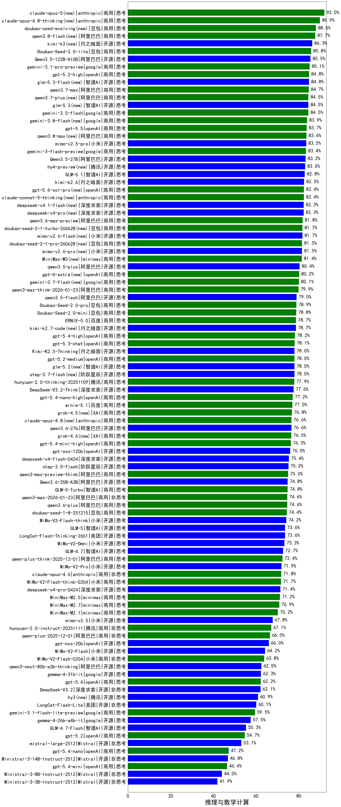

|类别|机构|大模型|【推理与数学计算】准确率|平均耗时|平均消耗token|花费/千次（元）|排名（准确率）|
|---|---|-----|-------------------|-------|-----------|-----------|-----------|
|商用|anthropic|claude-opus-5(new)|92.0%|22s|2340|313.5|1|
|商用|anthropic|claude-opus-4.8-thinking(new)|89.9%|32s|3208|465.5|2|
|商用|豆包|doubao-seed-evolving(new)|88.0%|365s|16044|464.3|3|
|商用|阿里巴巴|qwen3.8-flash(new)|87.7%|102s|7842|19.8|4|
|开源|月之暗面|kimi-k3(new)|86.3%|94s|3191|271.1|5|
|商用|豆包|Doubao-Seed-2.0-lite|85.8%|388s|3477|10.4|6|
|开源|阿里巴巴|Qwen3.5-122B-A10B|85.5%|433s|9568|57.5|7|
|商用|google|gemini-3.1-pro-preview|85.1%|75s|5575|427.5|8|
|商用|openAI|gpt-5.2-high|84.8%|95s|2663|177.2|9|
|开源|智谱AI|glm-5.3-flash(new)|84.8%|196s|8729|23.3|10|
|商用|阿里巴巴|qwen3.7-max|84.7%|99s|6172|206.1|11|
|商用|阿里巴巴|qwen3.7-plus(new)|84.5%|127s|7502|56.0|12|
|开源|智谱AI|glm-5.3(new)|84.5%|130s|6862|181.1|13|
|商用|google|gemini-3.5-flash|84.5%|21s|4981|278.7|14|
|商用|google|gemini-3.8-flash(new)|83.9%|20s|3315|145.9|15|
|商用|openAI|gpt-5.5|83.7%|26s|1776|279.2|16|
|商用|阿里巴巴|qwen3.8-max(new)|83.6%|119s|6193|206.0|17|
|开源|小米|mimo-v2.5-pro|83.5%|107s|6907|132.4|18|
|商用|google|gemini-3-flash-preview|83.4%|74s|5598|107.4|19|
|开源|阿里巴巴|Qwen3.5-27B|83.2%|313s|9899|44.7|20|
|开源|智谱AI|GLM-5.1|82.8%|177s|5902|131.8|21|
|开源|月之暗面|kimi-k2.6|82.5%|324s|8103|208.1|22|
|商用|openAI|gpt-5.6-sol-pro(new)|82.4%|34s|7809|652.6|23|
|商用|anthropic|claude-sonnet-5-thinking(new)|82.4%|26s|3060|175.8|24|
|开源|深度求索|deepseek-v4-pro(new)|82.3%|190s|7350|187.6|25|
|商用|阿里巴巴|qwen3.6-max-preview|81.8%|128s|5188|250.1|26|
|商用|豆包|doubao-seed-2-1-turbo-260628(new)|81.7%|278s|14128|203.4|27|
|商用|豆包|doubao-seed-2-1-pro-260628(new)|81.5%|363s|16253|470.6|28|
|商用|minimax|MiniMax-M3(new)|81.4%|197s|4572|68.2|29|
|开源|阿里巴巴|qwen3.5-plus|80.4%|96s|8878|39.9|30|
|商用|openAI|gpt-6-astra(new)|80.2%|19s|/|180.1|31|
|商用|google|gemini-3.7-flash(new)|80.1%|19s|2507|51.8|32|
|商用|阿里巴巴|qwen3-max-think-2026-01-23|79.9%|301s|7072|65.8|33|
|开源|阿里巴巴|qwen3.5-flash|79.0%|411s|8987|16.8|34|
|商用|豆包|Doubao-Seed-2.0-pro|78.9%|450s|2834|36.3|35|
|商用|豆包|Doubao-Seed-2.0-mini|78.8%|363s|7044|12.8|36|
|商用|百度|ERNIE-5.0|78.7%|365s|7975|179.6|37|
|开源|月之暗面|kimi-k2.7-code(new)|78.7%|89s|3187|75.3|38|
|商用|openAI|gpt-5.4-high|78.2%|39s|2560|222.0|39|
|商用|openAI|gpt-5.3-chat|78.1%|27s|1427|93.9|40|
|开源|月之暗面|Kimi-K2.5-Thinking|78.0%|423s|7428|147.1|41|
|商用|openAI|gpt-5.2-medium|78.0%|82s|1934|145.7|42|
|开源|智谱AI|glm-5.2(new)|78.0%|132s|6113|160.1|43|
|开源|阶跃星辰|step-3.7-flash(new)|78.0%|93s|11548|90.0|44|
|商用|腾讯|hunyuan-2.0-thinking-20251109|77.9%|55s|5822|21.7|45|
|开源|深度求索|DeepSeek-V3.2-Think|77.6%|185s|5371|15.6|46|
|商用|openAI|gpt-5.4-nano-high|77.2%|156s|4462|31.2|47|
|商用|百度|ernie-5.1|77.0%|80s|3804|59.1|48|
|商用|XAI|grok-4.5(new)|76.8%|127s|5972|230.3|49|
|商用|anthropic|claude-opus-4.8(new)|76.6%|13s|1440|156.1|50|
|开源|阿里巴巴|qwen3.6-27b|76.6%|135s|9861|167.5|51|
|商用|XAI|grok-4.6(new)|76.5%|115s|5907|227.6|52|
|商用|openAI|gpt-5.4-mini-high|76.3%|97s|5611|162.7|53|
|开源|openAI|gpt-oss-120b|76.0%|75s|1955|5.0|54|
|开源|深度求索|deepseek-v4-flash-0424|75.4%|95s|6257|12.0|55|
|开源|阶跃星辰|step-3.5-flash|75.2%|56s|9065|18.3|56|
|商用|阿里巴巴|qwen3-max-preview-think|75.0%|220s|6784|150.9|57|
|开源|阿里巴巴|Qwen3.6-35B-A3B|74.8%|90s|9010|91.3|58|
|商用|智谱AI|GLM-5-Turbo|74.8%|76s|5682|115.7|59|
|商用|阿里巴巴|qwen3-max-2026-01-23|74.6%|127s|2431|19.4|60|
|商用|阿里巴巴|qwen3.6-plus|74.6%|127s|8194|91.7|61|
|商用|豆包|doubao-seed-1-8-251215|74.4%|51s|2317|13.4|62|
|开源|小米|MiMo-V2-Flash-think|74.2%|117s|7952|0.0|63|
|开源|智谱AI|GLM-5|73.6%|187s|6104|102.3|64|
|开源|美团|LongCat-Flash-Thinking-2601|73.6%|214s|8663|0.0|65|
|开源|小米|MiMo-V2-Omni|73.3%|327s|6062|74.8|66|
|开源|智谱AI|GLM-4.7|72.7%|155s|6829|89.6|67|
|商用|阿里巴巴|qwen-plus-think-2025-12-01|72.4%|122s|5248|37.2|68|
|开源|小米|MiMo-V2-Pro|71.9%|263s|6327|120.3|69|
|商用|anthropic|claude-opus-4.6|71.8%|14s|1154|112.2|70|
|商用|小米|MiMo-V2-Flash-think-0204|71.7%|703s|8014|15.9|71|
|开源|深度求索|deepseek-v4-pro-0424|71.4%|125s|5354|122.0|72|
|商用|minimax|MiniMax-M2.5|71.2%|99s|6957|55.0|73|
|商用|minimax|MiniMax-M2.7|70.9%|173s|8757|70.1|74|
|商用|minimax|MiniMax-M2.1|70.2%|150s|6768|53.4|75|
|开源|小米|mimo-v2.5|67.8%|63s|6469|80.5|76|
|商用|腾讯|hunyuan-2.0-instruct-20251111|67.1%|17s|1904|3.0|77|
|商用|阿里巴巴|qwen-plus-2025-12-01|66.5%|56s|2863|4.9|78|
|开源|openAI|gpt-oss-20b|66.0%|223s|3253|3.3|79|
|开源|小米|MiMo-V2-Flash|64.2%|116s|3065|0.0|80|
|商用|小米|MiMo-V2-Flash-0204|63.8%|262s|1818|2.9|81|
|开源|阿里巴巴|qwen3-next-80b-a3b-thinking|62.5%|169s|6383|23.6|82|
|开源|google|gemma-4-31b-it|62.3%|106s|1134|1.9|83|
|商用|openAI|gpt-5.4|62.2%|8s|1019|60.1|84|
|开源|深度求索|DeepSeek-V3.2|62.1%|102s|1873|5.1|85|
|开源|腾讯|hy3(new)|60.9%|64s|1416|4.1|86|
|开源|美团|LongCat-Flash-Lite|60.1%|161s|2727|0.0|87|
|商用|google|gemini-3.1-flash-lite-preview|59.5%|9s|1026|4.9|88|
|开源|google|gemma-4-26b-a4b-it|57.5%|44s|1274|2.3|89|
|开源|智谱AI|GLM-4.7-Flash|55.3%|1448s|8928|0.0|90|
|商用|openAI|gpt-5.2|54.7%|8s|856|38.5|91|
|开源|Mistral|mistral-large-2512|53.1%|18s|1524|11.4|92|
|商用|openAI|gpt-5.4-nano|47.2%|51s|784|2.9|93|
|开源|Mistral|Ministral-3-14B-Instruct-2512|46.8%|28s|3094|4.4|94|
|商用|openAI|gpt-5.4-mini|46.4%|33s|719|8.6|95|
|开源|Mistral|Ministral-3-8B-Instruct-2512|44.0%|21s|2969|3.2|96|
|开源|Mistral|Ministral-3-3B-Instruct-2512|41.9%|25s|4082|2.9|97|

