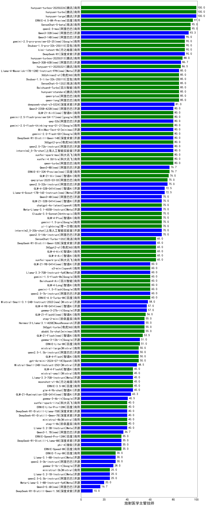

|类别|机构|大模型|【放射医学主管技师】准确率|平均耗时|平均消耗token|花费/千次（元）|排名（准确率）|
|---|---|-----|-------------------|-------|-----------|-----------|-----------|
|开源|腾讯|hunyuan-large|100.0%|8s|891|6.0|1|
|开源|百度|ERNIE-4.5-300B-A47B|100.0%|21s|279|1.8|2|
|商用|阿里巴巴|qwen-plus-think-2025-04-28|100.0%|210s|2034|15.8|3|
|商用|豆包|doubao-seed-1-6-thinking-250715(new)|100.0%|40s|1641|12.7|4|
|商用|百度|ERNIE-X1-Turbo-32K|95.0%|97s|1915|7.5|5|
|开源|meta|Llama-4-Maverick-17B-128E-Instruct-FP8|95.0%|7s|496|2.0|6|
|商用|阿里巴巴|qwen2.5-max|95.0%|16s|418|3.5|7|
|商用|豆包|doubao-seed-1-6-250615|95.0%|33s|512|3.4|8|
|商用|月之暗面|kimi-latest-8k|90.0%|16s|483|5.8|9|
|开源|阿里巴巴|Qwen3-32B|90.0%|20s|573|2.1|10|
|开源|深度求索|DeepSeek-R1-0528|90.0%|261s|2205|34.6|11|
|商用|百度|ERNIE-4.5-Turbo-32K|90.0%|22s|543|1.6|12|
|开源|深度求索|deepseek-chat-v3-0324|90.0%|21s|372|2.6|13|
|开源|阿里巴巴|Qwen3-14B|90.0%|27s|951|1.8|14|
|商用|豆包|Doubao-1.5-pro-32k-250115|90.0%|11s|321|0.6|15|
|开源|minimax|MiniMax-M1|85.0%|138s|2317|17.4|16|
|商用|商汤|SenseChat-5-1202|85.0%|/|/|/|17|
|商用|阿里巴巴|qwen-long-2025-01-25|85.0%|177s|325|0.6|18|
|商用|腾讯|hunyuan-standard|85.0%|/|/|/|19|
|商用|百川智能|Baichuan4-Turbo|85.0%|/|/|/|20|
|商用|奇虎360|360zhinao2-o1|85.0%|/|/|/|21|
|商用|智谱AI|GLM-Z1-AirX|85.0%|29s|1637|8.7|22|
|开源|阿里巴巴|Qwen3-235B-A22B|85.0%|136s|1854|18.0|23|
|商用|豆包|Doubao-1.5-lite-32k-250115|85.0%|3s|185|0.1|24|
|商用|腾讯|hunyuan-turbos-20250604|85.0%|37s|436|0.8|25|
|开源|阿里巴巴|Qwen3-30B-A3B|85.0%|20s|678|1.8|26|
|商用|openAI|gpt-4.1|80.0%|11s|243|11.0|27|
|商用|豆包|doubao-seed-1-6-flash-250615|80.0%|4s|275|0.3|28|
|商用|科大讯飞|xunfei-4.0Ultra|80.0%|2s|107|7.5|29|
|开源|腾讯|Hunyuan-A13B-Instruct|80.0%|33s|1027|3.9|30|
|开源|深度求索|DeepSeek-R1-Distill-Qwen-14B|80.0%|/|/|/|31|
|开源|智谱AI|GLM-Z1-32B-0414|80.0%|109s|2267|8.9|32|
|开源|阿里巴巴|qwq-32b|80.0%|46s|2455|14.5|33|
|商用|智谱AI|GLM-4-Plus|80.0%|11s|270|1.4|34|
|开源|阿里巴巴|qwen2.5-72b-instruct|80.0%|7s|220|2.1|35|
|商用|奇虎360|360gpt2-pro|80.0%|11s|247|1.0|36|
|商用|科大讯飞|xunfei-spark-max|80.0%|3s|117|3.5|37|
|开源|minimax|MiniMax-Text-01|80.0%|11s|884|7.1|38|
|商用|google|gemini-2.5-pro|80.0%|22s|1947|137.3|39|
|开源|阿里巴巴|qwen3-235b-a22b-thinking-2507(new)|80.0%|55s|2358|46.0|40|
|商用|豆包|doubao-seed-1-6-flash-thinking-250615|80.0%|7s|580|0.7|41|
|商用|XAI|grok-4-0709|80.0%|223s|1887|199.6|42|
|开源|月之暗面|kimi-k2-0711-preview(new)|80.0%|33s|577|8.5|43|
|商用|XAI|grok-3-mini|80.0%|139s|1010|3.6|44|
|开源|上海人工智能实验室|internlm2_5-7b-chat|80.0%|/|/|/|45|
|开源|阿里巴巴|Qwen3-14B-nothink|80.0%|10s|514|0.9|46|
|开源|阿里巴巴|Qwen3-30B-A3B-Thinking-2507(new)|80.0%|72s|2569|7.1|47|
|商用|腾讯|hunyuan-turbos-20250716(new)|80.0%|30s|1333|2.6|48|
|商用|阿里巴巴|qwen-plus-2025-07-14(new)|80.0%|15s|481|0.9|49|
|开源|阿里巴巴|Qwen3-32B-nothink|80.0%|27s|548|2.0|50|
|商用|智谱AI|GLM-4-AirX|76.7%|4s|294|2.7|51|
|商用|阿里巴巴|qwq-plus-2025-03-05|75.0%|57s|2264|8.9|52|
|开源|阿里巴巴|Qwen3-4B|75.0%|22s|1207|3.4|53|
|开源|阿里巴巴|qwen2.5-32b-instruct|75.0%|5s|206|1.0|54|
|商用|openAI|chatgpt-4o-latest|70.0%|/|/|/|55|
|商用|智谱AI|GLM-Z1-Air|70.0%|46s|1611|0.8|56|
|开源|阿里巴巴|qwen2.5-14b-instruct|70.0%|9s|287|0.7|57|
|商用|anthropic|claude-4-sonnet|70.0%|44s|448|41.1|58|
|开源|百度|ERNIE-4.5-21B-A3B|70.0%|3s|307|0.0|59|
|开源|阿里巴巴|Qwen3-235B-A22B-nothink|70.0%|17s|405|3.6|60|
|商用|anthropic|claude-4-sonnet-thinking|70.0%|43s|1029|104.2|61|
|商用|零一万物|yi-lightning|70.0%|/|/|/|62|
|开源|智谱AI|GLM-4-32B-0414|70.0%|12s|362|0.7|63|
|商用|openAI|gpt-4.1-mini|70.0%|7s|275|2.6|64|
|开源|深度求索|DeepSeek-R1-0528-Qwen3-8B|65.0%|245s|1553|0.0|65|
|开源|Mistral|Mistral-Small-3.1-24B-Instruct-2503|65.0%|/|/|/|66|
|商用|google|gemini-2.5-flash|65.0%|9s|1614|28.3|67|
|商用|奇虎360|360gpt2-o1|65.0%|27s|406|18.0|68|
|商用|科大讯飞|xunfei-spark-pro|65.0%|/|/|/|69|
|商用|阶跃星辰|step-r1-v-mini|65.0%|41s|2292|17.9|70|
|开源|深度求索|DeepSeek-R1-Distill-Qwen-32B|65.0%|33s|873|1.1|71|
|商用|智谱AI|GLM-4-Long|63.3%|17s|357|0.4|72|
|开源|阶跃星辰|step-3(new)|60.0%|122s|2429|9.5|73|
|开源|openAI|gpt-oss-120b(new)|60.0%|197s|603|1.6|74|
|商用|openAI|gpt-5-mini-2025-08-07(new)|60.0%|109s|881|11.8|75|
|商用|阿里巴巴|qwen-flash-think-2025-07-28(new)|60.0%|56s|3162|4.7|76|
|商用|openAI|gpt-5-nano-2025-08-07(new)|60.0%|20s|1819|5.1|77|
|商用|智谱AI|GLM-4.5-Flash(new)|60.0%|47s|2483|0.0|78|
|商用|科大讯飞|xunfei-spark-x1-0725(new)|60.0%|/|795|9.5|79|
|开源|openAI|gpt-oss-20b(new)|60.0%|5s|843|0.9|80|
|商用|腾讯|hunyuan-t1-20250711(new)|60.0%|43s|2468|9.6|81|
|商用|阿里巴巴|qwen-turbo-think-2025-04-28|60.0%|222s|2542|7.5|82|
|商用|openAI|o4-mini|60.0%|35s|1112|33.8|83|
|商用|google|gemini-2.5-flash-lite-preview-06-17|60.0%|3s|722|2.0|84|
|商用|阿里巴巴|qwen-turbo-2025-07-15(new)|60.0%|8s|355|0.2|85|
|开源|meta|Llama-4-Scout-17B-16E-Instruct|60.0%|7s|562|1.1|86|
|商用|智谱AI|GLM-Z1-Flash|60.0%|23s|2610|0.0|87|
|开源|阿里巴巴|Qwen3-30B-A3B-nothink|60.0%|11s|424|1.0|88|
|开源|智谱AI|GLM-4.5-nothink|60.0%|21s|688|8.9|89|
|开源|智谱AI|GLM-4.5(new)|60.0%|113s|3040|41.9|90|
|开源|阿里巴巴|Qwen3-30B-A3B-Instruct-2507(new)|60.0%|7s|694|1.9|91|
|商用|百川智能|Baichuan4-Air|60.0%|/|/|/|92|
|开源|阿里巴巴|qwen2.5-7b-instruct|60.0%|4s|246|0.2|93|
|开源|阿里巴巴|qwen3-235b-a22b-instruct-2507(new)|60.0%|17s|656|4.9|94|
|开源|华为|pangu-pro-moe|60.0%|86s|1517|5.8|95|
|开源|Google|gemma-3-27b-it|57.0%|/|/|/|96|
|商用|奇虎360|360gpt-turbo|55.0%|/|/|/|97|
|开源|智谱AI|GLM-4-9B-0414|55.0%|12s|426|0.0|98|
|商用|阶跃星辰|step-2-mini|55.0%|4s|325|0.6|99|
|开源|阿里巴巴|Qwen3-8B|55.0%|176s|4229|0.0|100|
|商用|百度|ERNIE-Lite-8K|51.0%|/|/|/|101|
|开源|Google|gemma-3-12b-it|51.0%|/|/|/|102|
|商用|智谱AI|GLM-Z1-FlashX|50.0%|30s|1459|0.2|103|
|商用|OpenAI|gpt-4o-mini|50.0%|/|/|/|104|
|商用|Mistral|mistral-large|50.0%|/|/|/|105|
|开源|阿里巴巴|qwen2.5-1.5b-instruct|50.0%|2s|141|0.0|106|
|开源|智谱AI|GLM-Z1-Rumination-32B-0414|50.0%|34s|1471|4.3|107|
|商用|智谱AI|GLM-4-FlashX|45.0%|8s|321|0.0|108|
|商用|百度|ERNIE-3.5-8K|45.0%|24s|337|0.6|109|
|开源|智谱AI|GLM-Z1-9B-0414|45.0%|166s|3266|0.0|110|
|商用|Mistral|mistral-small|45.0%|/|/|/|111|
|开源|阿里巴巴|Qwen3-1.7B|45.0%|21s|2475|7.3|112|
|开源|Google|gemma-3-4b-it|40.5%|/|/|/|113|
|商用|阿里巴巴|qwen-flash-2025-07-28(new)|40.0%|4s|550|0.7|114|
|商用|openAI|gpt-5-2025-08-07(new)|40.0%|14s|339|20.1|115|
|商用|Mistral|ministral-8b|40.0%|/|/|/|116|
|商用|科大讯飞|xunfei-spark-lite|40.0%|/|/|/|117|
|开源|腾讯|Hunyuan-A13B-Instruct-nothink(new)|40.0%|15s|378|1.3|118|
|商用|智谱AI|GLM-4.5-Flash-nothink|40.0%|19s|892|0.0|119|
|开源|阿里巴巴|Qwen3-8B-nothink|40.0%|26s|629|0.0|120|
|开源|智谱AI|GLM-4.5-Air(new)|40.0%|93s|4356|25.8|121|
|开源|阿里巴巴|Qwen3-4B-nothink|40.0%|24s|550|1.5|122|
|开源|阿里巴巴|Qwen3-1.7B-nothink|40.0%|8s|427|1.1|123|
|商用|百度|ERNIE-Speed-8K|35.0%|/|/|/|124|
|开源|微软|phi-4|35.0%|/|/|/|125|
|开源|百度|ERNIE-4.5-0.3B|30.0%|59s|355|0.0|126|
|开源|阿里巴巴|qwen2.5-3b-instruct|30.0%|6s|252|0.2|127|
|商用|百度|ERNIE-Tiny-8K|30.0%|/|/|/|128|
|商用|Mistral|ministral-3b|25.0%|/|/|/|129|
|开源|阿里巴巴|qwen2.5-0.5b-instruct|25.0%|4s|254|0.0|130|
|开源|阿里巴巴|Qwen3-0.6B|20.0%|18s|1469|4.2|131|
|开源|阿里巴巴|Qwen3-0.6B-nothink|20.0%|5s|224|0.5|132|
|开源|智谱AI|GLM-4.5-Air-nothink|20.0%|12s|947|5.3|133|

