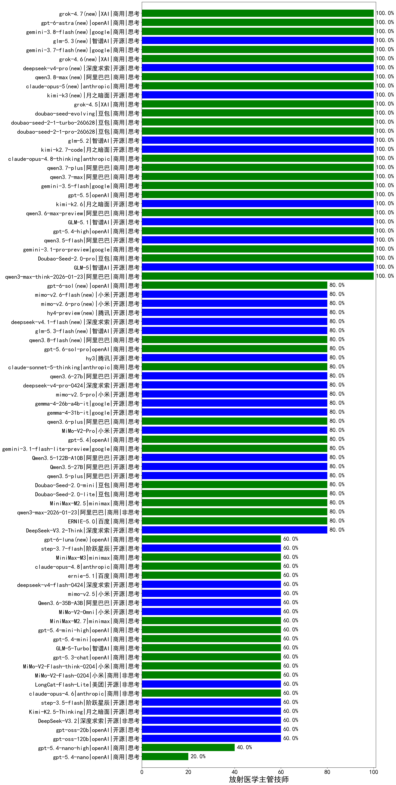

|类别|机构|大模型|【放射医学主管技师】准确率|平均耗时|平均消耗token|花费/千次（元）|排名（准确率）|
|---|---|-----|-------------------|-------|-----------|-----------|-----------|
|开源|月之暗面|kimi-k2.6|100.0%|192s|4620|123.5|1|
|商用|openAI|gpt-5.4-high|100.0%|21s|1152|114.3|2|
|商用|阿里巴巴|qwen3.6-max-preview|100.0%|50s|1782|93.3|3|
|商用|openAI|gpt-5.5|100.0%|11s|636|108.9|4|
|商用|google|gemini-3.5-flash|100.0%|10s|1924|117.9|5|
|商用|阿里巴巴|qwen3.7-max|100.0%|19s|985|33.9|6|
|商用|阿里巴巴|qwen3.7-plus|100.0%|46s|2409|18.9|7|
|商用|anthropic|claude-opus-4.8-thinking|100.0%|13s|751|119.0|8|
|开源|月之暗面|kimi-k2.7-code|100.0%|89s|2995|79.6|9|
|开源|智谱AI|glm-5.2|100.0%|61s|2403|65.9|10|
|商用|豆包|doubao-seed-2-1-pro-260628|100.0%|307s|14485|432.2|11|
|商用|豆包|doubao-seed-2-1-turbo-260628|100.0%|188s|9588|142.6|12|
|商用|豆包|doubao-seed-evolving|100.0%|435s|15886|474.2|13|
|商用|XAI|grok-4.5|100.0%|154s|3061|121.2|14|
|开源|月之暗面|kimi-k3(new)|100.0%|35s|644|53.3|15|
|商用|anthropic|claude-opus-5(new)|100.0%|13s|677|106.0|16|
|商用|阿里巴巴|qwen3.8-max(new)|100.0%|40s|1514|52.0|17|
|开源|深度求索|deepseek-v4-pro(new)|100.0%|86s|2330|60.4|18|
|商用|XAI|grok-4.6(new)|100.0%|53s|2892|114.1|19|
|商用|google|gemini-3.7-flash(new)|100.0%|6s|659|16.0|20|
|开源|智谱AI|glm-5.3(new)|100.0%|64s|2095|57.3|21|
|商用|google|gemini-3.8-flash(new)|100.0%|12s|737|36.1|22|
|商用|openAI|gpt-6-astra(new)|100.0%|14s|241|63.1|23|
|开源|智谱AI|GLM-5.1|100.0%|208s|1619|37.8|24|
|商用|XAI|grok-4.7(new)|100.0%|240s|14986|593.0|25|
|商用|google|gemini-3.1-pro-preview|100.0%|31s|1346|110.2|26|
|开源|智谱AI|GLM-5|100.0%|62s|2227|39.2|27|
|商用|豆包|Doubao-Seed-2.0-pro|100.0%|215s|1025|15.1|28|
|开源|阿里巴巴|qwen3.5-flash|100.0%|411s|4353|8.6|29|
|商用|阿里巴巴|qwen3-max-think-2026-01-23|100.0%|142s|3926|38.8|30|
|商用|openAI|gpt-5.4|80.0%|6s|286|23.4|31|
|开源|深度求索|deepseek-v4-pro-0424|80.0%|81s|829|19.2|32|
|开源|阿里巴巴|Qwen3.5-27B|80.0%|349s|3119|14.7|33|
|开源|阿里巴巴|qwen3.6-27b|80.0%|29s|1844|32.2|34|
|商用|阿里巴巴|qwen3-max-2026-01-23|80.0%|116s|497|4.5|35|
|开源|阿里巴巴|qwen3.5-plus|80.0%|40s|3120|14.7|36|
|开源|小米|mimo-v2.5-pro|80.0%|49s|1813|33.8|37|
|商用|豆包|Doubao-Seed-2.0-mini|80.0%|294s|4505|8.8|38|
|商用|豆包|Doubao-Seed-2.0-lite|80.0%|216s|1051|3.5|39|
|商用|openAI|gpt-5.6-sol-pro|80.0%|20s|3538|306.8|40|
|商用|anthropic|claude-sonnet-5-thinking|80.0%|13s|810|51.7|41|
|商用|minimax|MiniMax-M2.5|80.0%|27s|1255|10.0|42|
|商用|百度|ERNIE-5.0|80.0%|208s|2874|68.0|43|
|商用|阿里巴巴|qwen3.8-flash(new)|80.0%|25s|1105|2.8|44|
|开源|智谱AI|glm-5.3-flash(new)|80.0%|42s|1805|4.9|45|
|商用|openAI|gpt-6-sol(new)|80.0%|115s|194|9.3|46|
|开源|小米|mimo-v2.6-flash(new)|80.0%|49s|1704|3.3|47|
|开源|小米|mimo-v2.6-pro(new)|80.0%|708s|1241|7.3|48|
|开源|腾讯|hy4-preview(new)|80.0%|43s|2687|47.5|49|
|开源|深度求索|deepseek-v4.1-flash(new)|80.0%|8s|476|3.3|50|
|开源|小米|MiMo-V2-Pro|80.0%|499s|1732|32.1|51|
|商用|阿里巴巴|qwen3.6-plus|80.0%|20s|1366|15.7|52|
|开源|google|gemma-4-31b-it|80.0%|26s|538|1.4|53|
|开源|google|gemma-4-26b-a4b-it|80.0%|71s|613|1.6|54|
|商用|google|gemini-3.1-flash-lite-preview|80.0%|34s|389|3.5|55|
|开源|深度求索|DeepSeek-V3.2-Think|80.0%|165s|2129|6.3|56|
|开源|阿里巴巴|Qwen3.5-122B-A10B|80.0%|213s|2931|18.4|57|
|开源|腾讯|hy3|80.0%|59s|252|0.8|58|
|开源|深度求索|DeepSeek-V3.2|60.0%|41s|538|1.6|59|
|开源|月之暗面|Kimi-K2.5-Thinking|60.0%|405s|1972|40.4|60|
|开源|阶跃星辰|step-3.5-flash|60.0%|61s|2518|5.2|61|
|商用|anthropic|claude-opus-4.6|60.0%|22s|577|88.4|62|
|商用|openAI|gpt-6-luna(new)|60.0%|102s|441|1.3|63|
|开源|阶跃星辰|step-3.7-flash|60.0%|44s|3504|27.9|64|
|开源|美团|LongCat-Flash-Lite|60.0%|88s|894|0.0|65|
|商用|小米|MiMo-V2-Flash-0204|60.0%|472s|636|1.2|66|
|商用|智谱AI|GLM-5-Turbo|60.0%|83s|2068|44.5|67|
|商用|openAI|gpt-5.4-mini|60.0%|18s|244|5.7|68|
|商用|openAI|gpt-5.4-mini-high|60.0%|134s|1251|37.4|69|
|商用|minimax|MiniMax-M2.7|60.0%|48s|1952|15.8|70|
|开源|小米|MiMo-V2-Omni|60.0%|138s|1114|12.2|71|
|开源|阿里巴巴|Qwen3.6-35B-A3B|60.0%|100s|1685|17.6|72|
|开源|openAI|gpt-oss-20b|60.0%|5s|843|0.9|73|
|开源|小米|mimo-v2.5|60.0%|20s|1207|13.5|74|
|开源|深度求索|deepseek-v4-flash-0424|60.0%|27s|1406|2.8|75|
|商用|百度|ernie-5.1|60.0%|31s|1180|20.4|76|
|商用|anthropic|claude-opus-4.8|60.0%|9s|509|76.6|77|
|商用|minimax|MiniMax-M3|60.0%|25s|693|8.8|78|
|商用|openAI|gpt-5.3-chat|60.0%|5s|394|32.1|79|
|商用|小米|MiMo-V2-Flash-think-0204|60.0%|1113s|1910|3.9|80|
|开源|openAI|gpt-oss-120b|60.0%|197s|603|1.6|81|
|商用|openAI|gpt-5.4-nano-high|40.0%|16s|698|5.5|82|
|商用|openAI|gpt-5.4-nano|20.0%|13s|286|1.9|83|

