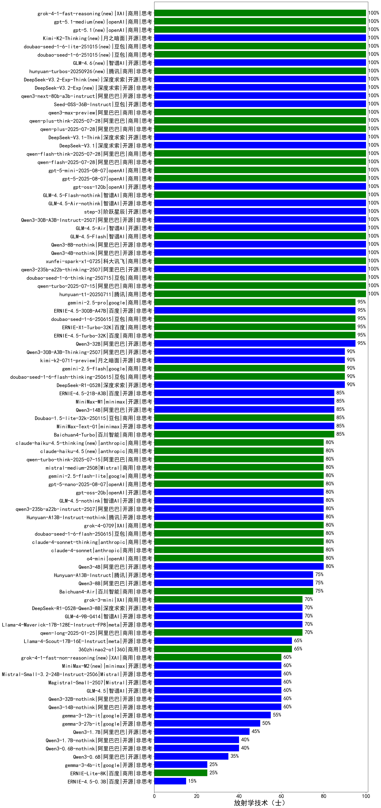

| 类别 | 大模型                         | 放射学技术（士） | 排名 |
|-----|------------------------------|---------|----|
|商用|hunyuan-turbo|100.0%|1|
|商用|ERNIE-X1-Turbo-32K(new)|93.3%|2|
|开源|hunyuan-large|92.2%|3|
|商用|hunyuan-turbos-20250313|91.0%|4|
|商用|doubao-seed-1-6-thinking-250615(new)|90.0%|5|
|开源|Qwen3-235B-A22B|90.0%|6|
|商用|ERNIE-4.5-Turbo-32K(new)|90.0%|7|
|商用|doubao-seed-1-6-250615(new)|90.0%|8|
|商用|gemini-2.5-flash-preview-05-20(new)|90.0%|9|
|商用|Doubao-1.5-thinking-pro|90.0%|10|
|商用|hunyuan-turbos-20250604(new)|90.0%|11|
|商用|hunyuan-t1-20250529(new)|90.0%|12|
|商用|step-r1-v-mini(new)|90.0%|13|
|开源|DeepSeek-R1|89.1%|14|
|商用|hunyuan-t1-20250321|88.3%|15|
|商用|xunfei-spark-max|87.5%|16|
|开源|Qwen3-32B|86.7%|17|
|商用|qwen-plus-think-2025-04-28(new)|86.7%|18|
|开源|qwq-32b|85.9%|19|
|商用|Doubao-1.5-pro-32k-250115|85.9%|20|
|开源|Llama-4-Maverick-17B-128E-Instruct-FP8|85.0%|21|
|开源|qwen2.5-72b-instruct|84.4%|22|
|商用|qwen-plus-2025-04-28(new)|83.3%|23|
|商用|qwen-turbo-think-2025-04-28(new)|83.3%|24|
|商用|xunfei-spark-x1|83.0%|25|
|商用|360gpt2-pro|81.2%|26|
|商用|qwen2.5-max|81.2%|27|
|商用|GLM-4-Plus|81.0%|28|
|商用|gemini-2.5-pro-preview-05-06(new)|80.0%|29|
|开源|Qwen3-8B|80.0%|30|
|开源|Qwen3-30B-A3B|80.0%|31|
|开源|DeepSeek-R1-0528(new)|80.0%|32|
|商用|o4-mini|80.0%|33|
|商用|claude-4-sonnet-thinking(new)|80.0%|34|
|开源|MiniMax-M1(new)|80.0%|35|
|商用|claude-4-sonnet(new)|80.0%|36|
|商用|hunyuan-standard|79.7%|37|
|商用|Doubao-1.5-lite-32k-250115|79.7%|38|
|开源|deepseek-chat-v3-0324|78.5%|39|
|开源|GLM-Z1-32B-0414|76.7%|40|
|商用|doubao-seed-1-6-flash-thinking-250615(new)|76.7%|41|
|开源|DeepSeek-R1-0528-Qwen3-8B(new)|76.7%|42|
|商用|qwen-turbo-2025-04-28(new)|76.7%|43|
|开源|Qwen3-14B|76.7%|44|
|开源|MiniMax-Text-01|76.6%|45|
|商用|qwen-plus-2025-01-25|76.6%|46|
|开源|DeepSeek-R1-Distill-Qwen-32B|75.0%|47|
|商用|qwq-plus-2025-03-05|75.0%|48|
|开源|qwen2.5-32b-instruct|75.0%|49|
|商用|GLM-Z1-AirX|74.0%|50|
|商用|Baichuan4-Turbo|73.4%|51|
|商用|SenseChat-5-1202|73.4%|52|
|商用|qwen-turbo-2025-02-11|73.4%|53|
|商用|doubao-seed-1-6-flash-250615(new)|73.3%|54|
|开源|Llama-4-Scout-17B-16E-Instruct|73.0%|55|
|商用|xunfei-spark-pro|71.9%|56|
|商用|qwen-long-2025-01-25|71.9%|57|
|商用|360gpt2-o1|71.9%|58|
|开源|GLM-4-32B-0414|70.5%|59|
|商用|kimi-latest-8k|70.3%|60|
|商用|xunfei-4.0Ultra|70.0%|61|
|商用|gpt-4.1|70.0%|62|
|开源|Qwen3-4B|70.0%|63|
|开源|GLM-4-9B-0414|69.5%|64|
|商用|yi-lightning|68.8%|65|
|商用|SenseChat-5-beta|68.8%|66|
|商用|GLM-Z1-Air|68.0%|67|
|商用|360zhinao2-o1|67.2%|68|
|开源|internlm2_5-7b-chat|67.2%|69|
|开源|qwen2.5-14b-instruct|67.2%|70|
|商用|chatgpt-4o-latest|65.6%|71|
|商用|step-2-mini|65.6%|72|
|开源|DeepSeek-R1-Distill-Qwen-14B|65.6%|73|
|开源|qwen2.5-7b-instruct|64.1%|74|
|开源|GLM-Z1-9B-0414|64.0%|75|
|商用|SenseChat-Turbo-1202|62.5%|76|
|商用|Baichuan4-Air|62.5%|77|
|商用|360gpt-turbo|60.9%|78|
|商用|ERNIE-3.5-8K|60.9%|79|
|商用|GLM-4-Long|60.0%|80|
|商用|gpt-4.1-mini|60.0%|81|
|商用|GLM-Z1-Flash|59.0%|82|
|开源|Mistral-Small-3.1-24B-Instruct-2503|58.5%|83|
|开源|DeepSeek-R1-Distill-Llama-70B|57.8%|84|
|商用|GLM-4-Flash|57.8%|85|
|商用|moonshot-v1-8k|56.2%|86|
|商用|GLM-4-FlashX|56.2%|87|
|开源|gemma-3-27b-it|55.0%|88|
|开源|phi-4|54.7%|89|
|商用|mistral-large|54.7%|90|
|开源|gemma-3-12b-it|54.5%|91|
|商用|GLM-Z1-FlashX|53.3%|92|
|商用|GLM-4-Air|53.3%|93|
|商用|gpt-4o-mini|51.6%|94|
|商用|ERNIE-Lite-8K|50.5%|95|
|商用|GLM-4-AirX|50.0%|96|
|开源|GLM-Z1-Rumination-32B-0414|50.0%|97|
|商用|ERNIE-Speed-8K|46.9%|98|
|商用|mistral-small|46.9%|99|
|开源|qwen2.5-3b-instruct|46.9%|100|
|开源|Qwen3-1.7B|43.3%|101|
|开源|qwen2.5-1.5b-instruct|40.6%|102|
|开源|gemma-3-4b-it|39.0%|103|
|开源|Qwen3-0.6B|36.7%|104|
|商用|ministral-8b|35.9%|105|
|开源|DeepSeek-R1-Distill-Qwen-7B|34.4%|106|
|开源|DeepSeek-R1-Distill-Llama-8B|34.4%|107|
|商用|ministral-3b|29.7%|108|
|开源|qwen2.5-0.5b-instruct|20.3%|109|
|商用|ERNIE-Tiny-8K|18.8%|110|
|商用|xunfei-spark-lite|9.4%|111|

