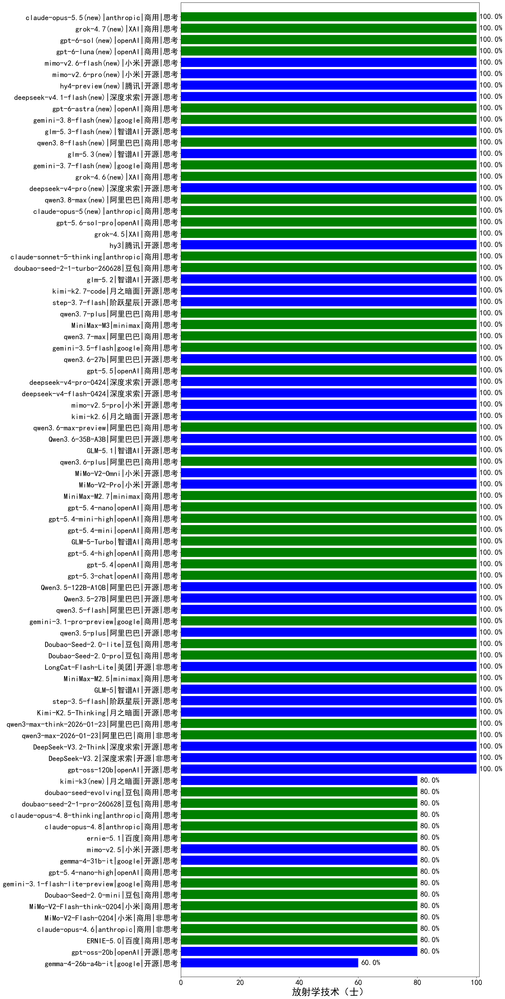

|类别|机构|大模型|【放射学技术（士）】准确率|平均耗时|平均消耗token|花费/千次（元）|排名（准确率）|
|---|---|-----|-------------------|-------|-----------|-----------|-----------|
|开源|openAI|gpt-oss-120b|100.0%|4s|618|1.6|1|
|商用|minimax|MiniMax-M3|100.0%|19s|626|7.5|2|
|开源|腾讯|hy3|100.0%|73s|238|0.7|3|
|商用|anthropic|claude-sonnet-5-thinking|100.0%|27s|781|48.0|4|
|商用|豆包|doubao-seed-2-1-turbo-260628|100.0%|196s|4621|68.0|5|
|开源|智谱AI|glm-5.2|100.0%|29s|1278|34.2|6|
|开源|月之暗面|kimi-k2.7-code|100.0%|17s|513|12.3|7|
|开源|阶跃星辰|step-3.7-flash|100.0%|28s|2374|18.7|8|
|商用|阿里巴巴|qwen3.7-plus|100.0%|15s|759|5.6|9|
|商用|阿里巴巴|qwen3.7-max|100.0%|18s|735|24.6|10|
|开源|阿里巴巴|Qwen3.6-35B-A3B|100.0%|10s|1887|19.7|11|
|商用|google|gemini-3.5-flash|100.0%|11s|1048|61.9|12|
|开源|阿里巴巴|qwen3.6-27b|100.0%|29s|1833|31.8|13|
|商用|openAI|gpt-5.5|100.0%|10s|566|101.5|14|
|开源|深度求索|deepseek-v4-pro-0424|100.0%|36s|493|11.0|15|
|开源|深度求索|deepseek-v4-flash-0424|100.0%|49s|765|1.5|16|
|开源|小米|mimo-v2.5-pro|100.0%|18s|1095|18.4|17|
|开源|月之暗面|kimi-k2.6|100.0%|60s|1017|25.9|18|
|商用|XAI|grok-4.5|100.0%|42s|1002|34.3|19|
|商用|openAI|gpt-5.6-sol-pro|100.0%|13s|3276|246.6|20|
|商用|anthropic|claude-opus-5(new)|100.0%|12s|569|82.9|21|
|商用|阿里巴巴|qwen3.8-max(new)|100.0%|12s|562|17.4|22|
|商用|XAI|grok-4.7(new)|100.0%|51s|2643|74.3|23|
|商用|openAI|gpt-6-sol(new)|100.0%|100s|227|10.3|24|
|商用|openAI|gpt-6-luna(new)|100.0%|608s|543|1.6|25|
|开源|小米|mimo-v2.6-flash(new)|100.0%|30s|848|1.6|26|
|开源|小米|mimo-v2.6-pro(new)|100.0%|16s|744|4.2|27|
|开源|腾讯|hy4-preview(new)|100.0%|47s|1537|26.6|28|
|开源|深度求索|deepseek-v4.1-flash(new)|100.0%|2s|412|2.7|29|
|商用|openAI|gpt-6-astra(new)|100.0%|13s|248|58.9|30|
|商用|google|gemini-3.8-flash(new)|100.0%|9s|673|32.1|31|
|开源|智谱AI|glm-5.3-flash(new)|100.0%|27s|1162|3.1|32|
|商用|阿里巴巴|qwen3.8-flash(new)|100.0%|23s|812|1.9|33|
|开源|智谱AI|glm-5.3(new)|100.0%|25s|886|23.2|34|
|商用|google|gemini-3.7-flash(new)|100.0%|4s|637|15.1|35|
|商用|XAI|grok-4.6(new)|100.0%|42s|881|29.3|36|
|开源|深度求索|deepseek-v4-pro(new)|100.0%|119s|470|10.0|37|
|商用|阿里巴巴|qwen3.6-max-preview|100.0%|51s|1587|82.1|38|
|商用|anthropic|claude-opus-5.5(new)|100.0%|43s|528|60.4|39|
|开源|智谱AI|GLM-5.1|100.0%|110s|1112|25.3|40|
|商用|minimax|MiniMax-M2.5|100.0%|18s|823|6.2|41|
|开源|阿里巴巴|qwen3.5-flash|100.0%|323s|2391|4.6|42|
|商用|google|gemini-3.1-pro-preview|100.0%|21s|1256|101.5|43|
|开源|阿里巴巴|qwen3.5-plus|100.0%|24s|1943|9.0|44|
|商用|豆包|Doubao-Seed-2.0-lite|100.0%|151s|684|2.1|45|
|商用|豆包|Doubao-Seed-2.0-pro|100.0%|287s|1262|18.7|46|
|开源|美团|LongCat-Flash-Lite|100.0%|42s|391|0.0|47|
|开源|智谱AI|GLM-5|100.0%|45s|1685|29.3|48|
|商用|openAI|gpt-5.3-chat|100.0%|54s|442|34.8|49|
|开源|阶跃星辰|step-3.5-flash|100.0%|13s|1471|3.0|50|
|开源|月之暗面|Kimi-K2.5-Thinking|100.0%|354s|2073|42.3|51|
|商用|阿里巴巴|qwen3-max-think-2026-01-23|100.0%|93s|2663|26.0|52|
|商用|阿里巴巴|qwen3-max-2026-01-23|100.0%|117s|550|4.9|53|
|开源|深度求索|DeepSeek-V3.2-Think|100.0%|140s|1131|3.3|54|
|开源|深度求索|DeepSeek-V3.2|100.0%|92s|409|1.2|55|
|开源|阿里巴巴|Qwen3.5-27B|100.0%|333s|2754|12.9|56|
|开源|阿里巴巴|Qwen3.5-122B-A10B|100.0%|114s|2597|16.2|57|
|商用|openAI|gpt-5.4|100.0%|19s|285|21.2|58|
|商用|阿里巴巴|qwen3.6-plus|100.0%|34s|1343|15.3|59|
|商用|openAI|gpt-5.4-high|100.0%|24s|714|66.3|60|
|商用|智谱AI|GLM-5-Turbo|100.0%|36s|1117|23.3|61|
|开源|小米|MiMo-V2-Omni|100.0%|404s|1412|16.1|62|
|商用|openAI|gpt-5.4-mini|100.0%|72s|234|4.8|63|
|开源|小米|MiMo-V2-Pro|100.0%|14s|1092|18.4|64|
|商用|minimax|MiniMax-M2.7|100.0%|34s|1270|10.0|65|
|商用|openAI|gpt-5.4-mini-high|100.0%|152s|1820|54.7|66|
|商用|openAI|gpt-5.4-nano|100.0%|3s|291|1.8|67|
|商用|百度|ernie-5.1|80.0%|43s|775|13.0|68|
|开源|google|gemma-4-31b-it|80.0%|56s|472|1.2|69|
|开源|openAI|gpt-oss-20b|80.0%|4s|1026|1.1|70|
|商用|百度|ERNIE-5.0|80.0%|144s|1645|38.2|71|
|商用|anthropic|claude-opus-4.6|80.0%|10s|575|83.9|72|
|商用|openAI|gpt-5.4-nano-high|80.0%|13s|604|4.6|73|
|商用|小米|MiMo-V2-Flash-think-0204|80.0%|1069s|2182|4.4|74|
|商用|小米|MiMo-V2-Flash-0204|80.0%|457s|739|1.4|75|
|商用|豆包|doubao-seed-2-1-pro-260628|80.0%|146s|4030|118.2|76|
|商用|anthropic|claude-opus-4.8|80.0%|9s|569|83.0|77|
|商用|豆包|Doubao-Seed-2.0-mini|80.0%|594s|2604|5.0|78|
|开源|月之暗面|kimi-k3(new)|80.0%|23s|428|30.6|79|
|商用|anthropic|claude-opus-4.8-thinking|80.0%|9s|630|93.6|80|
|商用|豆包|doubao-seed-evolving|80.0%|108s|5218|153.8|81|
|商用|google|gemini-3.1-flash-lite-preview|80.0%|4s|323|2.7|82|
|开源|小米|mimo-v2.5|80.0%|8s|1068|11.3|83|
|开源|google|gemma-4-26b-a4b-it|60.0%|91s|583|1.5|84|

