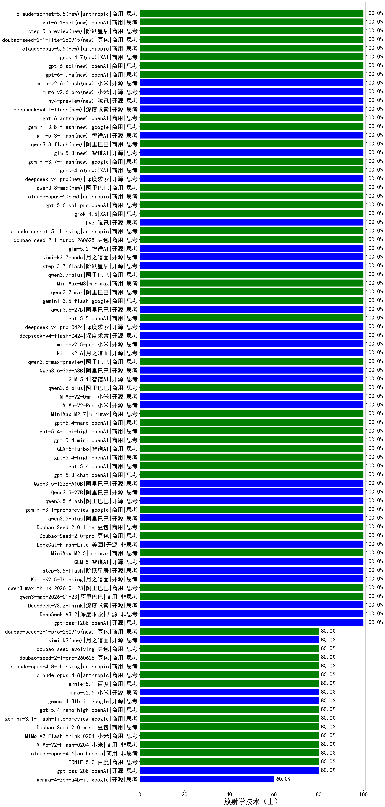

|类别|机构|大模型|【放射学技术（士）】准确率|平均耗时|平均消耗token|花费/千次（元）|排名（准确率）|
|---|---|-----|-------------------|-------|-----------|-----------|-----------|
|开源|openAI|gpt-oss-120b|100.0%|4s|618|1.6|1|
|商用|openAI|gpt-6-luna(new)|100.0%|608s|543|1.6|2|
|开源|阶跃星辰|step-3.7-flash|100.0%|28s|2374|18.7|3|
|商用|anthropic|claude-opus-5.5(new)|100.0%|43s|528|60.4|4|
|开源|月之暗面|kimi-k2.7-code|100.0%|17s|513|12.3|5|
|开源|智谱AI|glm-5.2|100.0%|29s|1278|34.2|6|
|商用|XAI|grok-4.7(new)|100.0%|51s|2643|74.3|7|
|商用|豆包|doubao-seed-2-1-turbo-260628|100.0%|196s|4621|68.0|8|
|商用|openAI|gpt-6-sol(new)|100.0%|100s|227|10.3|9|
|商用|anthropic|claude-sonnet-5-thinking|100.0%|27s|781|48.0|10|
|开源|腾讯|hy3|100.0%|73s|238|0.7|11|
|商用|XAI|grok-4.5|100.0%|42s|1002|34.3|12|
|商用|openAI|gpt-5.6-sol-pro|100.0%|13s|3276|246.6|13|
|商用|anthropic|claude-opus-5|100.0%|12s|569|82.9|14|
|开源|小米|mimo-v2.6-flash(new)|100.0%|30s|848|1.6|15|
|商用|阿里巴巴|qwen3.8-max|100.0%|12s|562|17.4|16|
|开源|深度求索|deepseek-v4-pro|100.0%|119s|470|10.0|17|
|商用|XAI|grok-4.6|100.0%|42s|881|29.3|18|
|商用|google|gemini-3.7-flash|100.0%|4s|637|15.1|19|
|开源|智谱AI|glm-5.3(new)|100.0%|25s|886|23.2|20|
|商用|阿里巴巴|qwen3.8-flash(new)|100.0%|23s|812|1.9|21|
|开源|智谱AI|glm-5.3-flash(new)|100.0%|27s|1162|3.1|22|
|商用|google|gemini-3.8-flash(new)|100.0%|9s|673|32.1|23|
|商用|openAI|gpt-6-astra(new)|100.0%|13s|248|58.9|24|
|开源|深度求索|deepseek-v4.1-flash(new)|100.0%|2s|412|2.7|25|
|开源|腾讯|hy4-preview(new)|100.0%|47s|1537|26.6|26|
|商用|阿里巴巴|qwen3.7-plus|100.0%|15s|759|5.6|27|
|商用|minimax|MiniMax-M3|100.0%|19s|626|7.5|28|
|开源|智谱AI|GLM-5.1|100.0%|110s|1112|25.3|29|
|商用|阿里巴巴|qwen3.7-max|100.0%|18s|735|24.6|30|
|开源|深度求索|DeepSeek-V3.2|100.0%|92s|409|1.2|31|
|开源|深度求索|DeepSeek-V3.2-Think|100.0%|140s|1131|3.3|32|
|商用|anthropic|claude-haiku-5.5(new)|100.0%|367s|606|1.8|33|
|商用|google|gemini-3.1-pro-preview|100.0%|21s|1256|101.5|34|
|开源|阿里巴巴|Qwen3.5-27B|100.0%|333s|2754|12.9|35|
|开源|阿里巴巴|Qwen3.5-122B-A10B|100.0%|114s|2597|16.2|36|
|商用|google|gemini-4-argon(new)|100.0%|15s|349|37.1|37|
|商用|minimax|MiniMax-M2.7|100.0%|34s|1270|10.0|38|
|商用|阿里巴巴|qwen3.6-plus|100.0%|34s|1343|15.3|39|
|商用|anthropic|claude-sonnet-5.5(new)|100.0%|6s|422|22.8|40|
|商用|openAI|gpt-6.1-sol(new)|100.0%|4s|235|10.9|41|
|开源|小米|mimo-v2.6-pro(new)|100.0%|16s|744|4.2|42|
|开源|阿里巴巴|Qwen3.6-35B-A3B|100.0%|10s|1887|19.7|43|
|商用|阿里巴巴|qwen3.6-max-preview|100.0%|51s|1587|82.1|44|
|开源|月之暗面|kimi-k2.6|100.0%|60s|1017|25.9|45|
|商用|阶跃星辰|step-5-preview(new)|100.0%|35s|874|16.5|46|
|开源|小米|mimo-v2.5-pro|100.0%|18s|1095|18.4|47|
|开源|深度求索|deepseek-v4-flash-0424|100.0%|49s|765|1.5|48|
|开源|深度求索|deepseek-v4-pro-0424|100.0%|36s|493|11.0|49|
|商用|openAI|gpt-5.5|100.0%|10s|566|101.5|50|
|开源|阿里巴巴|qwen3.6-27b|100.0%|29s|1833|31.8|51|
|商用|豆包|doubao-seed-2-1-lite-260915(new)|100.0%|35s|1647|4.3|52|
|商用|google|gemini-3.5-flash|100.0%|11s|1048|61.9|53|
|商用|豆包|doubao-seed-2-1-pro-260915(new)|80.0%|38s|1460|41.1|54|
|商用|豆包|doubao-seed-2-1-pro-260628|80.0%|146s|4030|118.2|55|
|开源|月之暗面|kimi-k3|80.0%|23s|428|30.6|56|
|商用|豆包|doubao-seed-evolving|80.0%|108s|5218|153.8|57|
|开源|openAI|gpt-oss-20b|80.0%|4s|1026|1.1|58|
|商用|anthropic|claude-opus-4.8-thinking|80.0%|9s|630|93.6|59|
|商用|anthropic|claude-opus-4.8|80.0%|9s|569|83.0|60|
|商用|百度|ernie-5.1|80.0%|43s|775|13.0|61|
|开源|小米|mimo-v2.5|80.0%|8s|1068|11.3|62|
|开源|google|gemma-4-31b-it|80.0%|56s|472|1.2|63|
|商用|google|gemini-3.1-flash-lite-preview|80.0%|4s|323|2.7|64|
|商用|百度|ERNIE-5.0|80.0%|144s|1645|38.2|65|
|商用|minimax|MiniMax-M3.1-Flash(new)|80.0%|14s|932|2.9|66|
|开源|google|gemma-4-26b-a4b-it|60.0%|91s|583|1.5|67|

