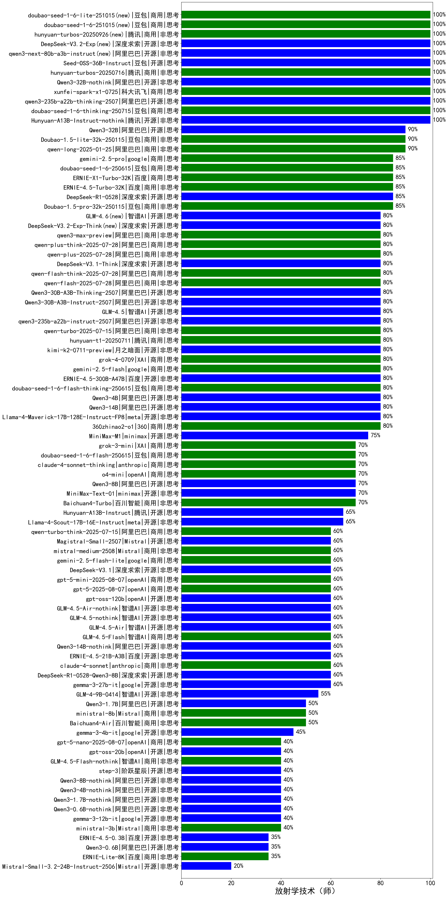

| 类别 | 大模型                         | 放射学技术（师） | 排名 |
|-----|------------------------------|---------|----|
|商用|hunyuan-turbo|100.0|1|
|开源|Qwen3-235B-A22B(new)|100.0|2|
|商用|hunyuan-turbos-20250226|96.3|3|
|商用|ERNIE-4.5-8K-Preview|96.0|4|
|开源|hunyuan-large|94.4|5|
|开源|Qwen3-32B(new)|93.3|6|
|商用|gemini-2.5-pro-preview-03-25(new)|90.0|7|
|商用|hunyuan-turbos-20250313|88.9|8|
|商用|Doubao-1.5-pro-32k-250115|85.2|9|
|商用|hunyuan-t1-20250321|84.9|10|
|商用|gemini-2.5-flash-preview-04-17(new)|83.3|11|
|开源|Qwen3-30B-A3B(new)|83.3|12|
|开源|DeepSeek-R1|81.5|13|
|开源|Llama-4-Maverick-17B-128E-Instruct-FP8(new)|80.0|14|
|商用|ERNIE-X1-32K-Preview(new)|80.0|15|
|开源|deepseek-chat-v3-0324|79.9|16|
|商用|Doubao-1.5-lite-32k-250115|79.6|17|
|商用|kimi-latest-8k|77.8|18|
|商用|qwen-turbo|77.8|19|
|开源|Qwen3-14B(new)|76.7|20|
|开源|Qwen3-8B(new)|76.7|21|
|开源|Qwen3-4B(new)|76.7|22|
|商用|xunfei-spark-max|75.9|23|
|商用|360gpt-turbo|74.1|24|
|商用|qwen-long|74.1|25|
|开源|qwen2.5-72b-instruct|74.1|26|
|开源|GLM-4-32B-0414(new)|73.4|27|
|开源|Llama-4-Scout-17B-16E-Instruct(new)|72.4|28|
|商用|qwen-plus|72.2|29|
|商用|SenseChat-5-beta|72.2|30|
|商用|360gpt2-o1|72.2|31|
|商用|360gpt2-pro|72.2|32|
|开源|DeepSeek-R1-Distill-Qwen-32B|70.4|33|
|开源|qwen2.5-14b-instruct|70.4|34|
|商用|qwen2.5-max|70.4|35|
|商用|360zhinao2-o1|70.4|36|
|商用|hunyuan-standard|70.4|37|
|开源|qwen2.5-32b-instruct|70.4|38|
|商用|xunfei-4.0Ultra|70.0|39|
|商用|ERNIE-4.0-Turbo-8K|70.0|40|
|开源|GLM-Z1-32B-0414(new)|70.0|41|
|商用|GLM-Z1-Air(new)|70.0|42|
|商用|GLM-4-Plus|70.0|43|
|商用|qwq-plus-2025-03-05|68.5|44|
|开源|internlm2_5-20b-chat|68.5|45|
|开源|qwen2.5-7b-instruct|68.5|46|
|开源|MiniMax-Text-01|68.5|47|
|开源|DeepSeek-R1-Distill-Llama-70B|66.7|48|
|开源|Meta-Llama-3.1-405B-Instruct|66.7|49|
|商用|Baichuan4-Turbo|66.7|50|
|商用|gemini-1.5-pro|64.8|51|
|开源|internlm2_5-7b-chat|64.8|52|
|商用|gemini-2.0-flash-thinking-exp-01-21|64.8|53|
|开源|qwq-32b|64.8|54|
|商用|chatgpt-4o-latest|64.8|55|
|开源|DeepSeek-R1-Distill-Qwen-14B|64.8|56|
|开源|GLM-Z1-9B-0414(new)|64.3|57|
|商用|SenseChat-5-1202|63.0|58|
|商用|xunfei-spark-pro|63.0|59|
|商用|SenseChat-Turbo-1202|63.0|60|
|开源|Llama-3.3-70B-Instruct|63.0|61|
|商用|GLM-Z1-FlashX(new)|62.8|62|
|开源|GLM-4-9B-0414(new)|62.8|63|
|开源|Mistral-Small-3.1-24B-Instruct-2503(new)|61.8|64|
|商用|yi-lightning|61.1|65|
|商用|gemini-2.0-flash-001|61.1|66|
|商用|GLM-4-Long|61.1|67|
|开源|Mistral-Small-24B-Instruct-2501|60.3|68|
|商用|GLM-Z1-Flash(new)|59.8|69|
|商用|GLM-4-FlashX|59.3|70|
|商用|o3-mini|59.3|71|
|商用|ERNIE-Lite-8K|57.8|72|
|商用|GLM-4-Flash|57.4|73|
|商用|GLM-4-AirX|57.4|74|
|开源|Llama-3.3-70B-Instruct-fp8|57.4|75|
|商用|GLM-4-Air|57.4|76|
|开源|glm-4-9b-chat|57.4|77|
|开源|gemma-3-27b-it|56.8|78|
|商用|moonshot-v1-8k|55.6|79|
|商用|gemini-1.5-flash|53.7|80|
|商用|step-1-8k|53.7|81|
|商用|Baichuan4-Air|53.7|82|
|开源|Hermes-3-Llama-3.1-405B|53.7|83|
|商用|GLM-Z1-AirX(new)|53.3|84|
|商用|gpt-4o-mini|51.9|85|
|商用|mistral-large|51.9|86|
|商用|ERNIE-Speed-Pro-128K|51.9|87|
|商用|step-2-mini|51.9|88|
|商用|ERNIE-Speed-8K|51.9|89|
|商用|ERNIE-3.5-8K|51.9|90|
|开源|gemma-3-12b-it|48.2|91|
|商用|mistral-small|48.1|92|
|开源|Qwen3-1.7B(new)|46.7|93|
|开源|phi-4|44.4|94|
|开源|qwen2.5-3b-instruct|44.4|95|
|开源|Llama-3.2-3B-Instruct|44.4|96|
|商用|abab6.5s-chat|44.4|97|
|开源|qwen2.5-1.5b-instruct|44.4|98|
|商用|ERNIE-Lite-Pro-128K|44.4|99|
|开源|gemma-3-4b-it|40.7|100|
|商用|Claude-3.5-Sonnet|40.0|101|
|商用|ERNIE-Tiny-8K|35.2|102|
|开源|Meta-Llama-3.1-8B-Instruct-fp8|35.2|103|
|开源|DeepSeek-R1-Distill-Llama-8B|33.3|104|
|开源|Llama-3.1-8B-Instruct|33.3|105|
|开源|qwen2.5-0.5b-instruct|33.3|106|
|商用|ministral-8b|33.3|107|
|开源|Qwen3-0.6B(new)|30.0|108|
|开源|GLM-Z1-Rumination-32B-0414(new)|30.0|109|
|商用|gemini-1.5-flash-8b|29.6|110|
|开源|gemma-3-1b-it|28.1|111|
|开源|Llama-3.2-1B-Instruct|27.8|112|
|商用|ministral-3b|27.8|113|
|开源|DeepSeek-R1-Distill-Qwen-1.5B|18.5|114|
|开源|DeepSeek-R1-Distill-Qwen-7B|18.5|115|
|商用|xunfei-spark-lite|13.0|116|

