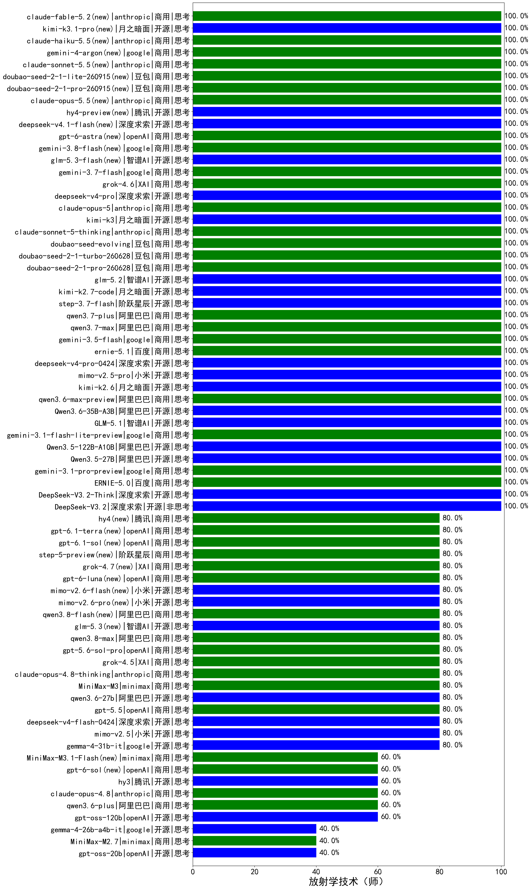

|类别|机构|大模型|【放射学技术（师）】准确率|平均耗时|平均消耗token|花费/千次（元）|排名（准确率）|
|---|---|-----|-------------------|-------|-----------|-----------|-----------|
|商用|anthropic|claude-sonnet-5-thinking|100.0%|13s|874|54.3|1|
|商用|google|gemini-3.8-flash(new)|100.0%|58s|775|37.2|2|
|开源|月之暗面|kimi-k2.7-code|100.0%|49s|1522|39.4|3|
|开源|智谱AI|glm-5.2|100.0%|57s|2464|67.2|4|
|商用|豆包|doubao-seed-2-1-pro-260628|100.0%|309s|15635|466.1|5|
|商用|豆包|doubao-seed-2-1-turbo-260628|100.0%|328s|13379|199.2|6|
|商用|豆包|doubao-seed-evolving|100.0%|368s|15386|458.6|7|
|开源|月之暗面|kimi-k3|100.0%|429s|1376|124.6|8|
|商用|anthropic|claude-opus-5|100.0%|13s|717|108.1|9|
|开源|深度求索|deepseek-v4-pro|100.0%|58s|2277|58.6|10|
|商用|XAI|grok-4.6|100.0%|49s|2317|89.3|11|
|商用|google|gemini-3.7-flash|100.0%|5s|722|17.2|12|
|开源|智谱AI|glm-5.3-flash(new)|100.0%|64s|2713|7.4|13|
|商用|openAI|gpt-6-astra(new)|100.0%|13s|302|77.0|14|
|商用|阿里巴巴|qwen3.7-plus|100.0%|26s|1409|10.7|15|
|开源|深度求索|deepseek-v4.1-flash(new)|100.0%|17s|1467|11.1|16|
|开源|腾讯|hy4-preview(new)|100.0%|140s|7423|132.4|17|
|商用|anthropic|claude-opus-5.5(new)|100.0%|152s|595|69.2|18|
|商用|豆包|doubao-seed-2-1-pro-260915(new)|100.0%|44s|1100|30.1|19|
|商用|豆包|doubao-seed-2-1-lite-260915(new)|100.0%|42s|1620|4.2|20|
|商用|anthropic|claude-sonnet-5.5(new)|100.0%|7s|620|36.4|21|
|商用|google|gemini-4-argon(new)|100.0%|10s|573|67.6|22|
|商用|anthropic|claude-haiku-5.5(new)|100.0%|10s|729|2.2|23|
|开源|月之暗面|kimi-k3.1-pro(new)|100.0%|71s|2277|145.9|24|
|商用|anthropic|claude-fable-5.2(new)|100.0%|14s|517|116.5|25|
|商用|google|gemini-4-carbon(new)|100.0%|21s|1192|154.3|26|
|开源|阶跃星辰|step-3.7-flash|100.0%|82s|7010|56.2|27|
|商用|腾讯|hy4-flash(new)|100.0%|16s|2963|5.8|28|
|开源|智谱AI|GLM-5.1|100.0%|101s|3676|86.7|29|
|商用|google|gemini-3.1-pro-preview|100.0%|43s|1333|107.6|30|
|开源|阿里巴巴|Qwen3.6-35B-A3B|100.0%|20s|2818|29.6|31|
|商用|阿里巴巴|qwen3.6-max-preview|100.0%|51s|1552|79.9|32|
|商用|google|gemini-3.1-flash-lite-preview|100.0%|4s|353|3.0|33|
|开源|月之暗面|kimi-k2.6|100.0%|93s|2268|59.5|34|
|开源|小米|mimo-v2.5-pro|100.0%|36s|2119|39.8|35|
|开源|阿里巴巴|Qwen3.5-122B-A10B|100.0%|232s|3458|21.6|36|
|开源|阿里巴巴|Qwen3.5-27B|100.0%|389s|3670|17.2|37|
|开源|深度求索|deepseek-v4-pro-0424|100.0%|44s|898|20.6|38|
|商用|百度|ERNIE-5.0|100.0%|223s|2344|54.9|39|
|开源|深度求索|DeepSeek-V3.2-Think|100.0%|53s|1584|4.7|40|
|商用|百度|ernie-5.1|100.0%|35s|1198|20.4|41|
|商用|google|gemini-3.5-flash|100.0%|8s|1234|73.3|42|
|商用|阿里巴巴|qwen3.7-max|100.0%|20s|980|33.2|43|
|开源|深度求索|DeepSeek-V3.2|100.0%|103s|402|1.1|44|
|商用|openAI|gpt-6.1-terra(new)|80.0%|6s|392|10.8|45|
|开源|小米|mimo-v2.6-pro(new)|80.0%|35s|1587|9.3|46|
|商用|腾讯|hy4(new)|80.0%|106s|5286|94.0|47|
|商用|openAI|gpt-6.1-sol(new)|80.0%|6s|243|11.2|48|
|商用|阶跃星辰|step-5-preview(new)|80.0%|41s|3203|62.9|49|
|商用|XAI|grok-4.7(new)|80.0%|100s|6968|255.6|50|
|商用|openAI|gpt-6-luna(new)|80.0%|520s|718|2.2|51|
|开源|小米|mimo-v2.6-flash(new)|80.0%|66s|2328|4.6|52|
|商用|minimax|MiniMax-M3|80.0%|25s|701|8.6|53|
|开源|google|gemma-4-31b-it|80.0%|105s|603|1.5|54|
|开源|小米|mimo-v2.5|80.0%|19s|1551|18.0|55|
|商用|anthropic|claude-opus-4.8-thinking|80.0%|11s|791|121.0|56|
|开源|阿里巴巴|qwen3.6-27b|80.0%|33s|2038|35.4|57|
|商用|openAI|gpt-5.5|80.0%|8s|512|89.5|58|
|商用|XAI|grok-4.5|80.0%|65s|1516|55.6|59|
|商用|openAI|gpt-5.6-sol-pro|80.0%|32s|3568|282.7|60|
|商用|阿里巴巴|qwen3.8-max|80.0%|42s|1672|57.2|61|
|开源|深度求索|deepseek-v4-flash-0424|80.0%|38s|1483|2.9|62|
|开源|智谱AI|glm-5.3(new)|80.0%|63s|1774|47.9|63|
|商用|阿里巴巴|qwen3.8-flash(new)|80.0%|82s|5529|14.7|64|
|商用|阿里巴巴|qwen3.6-plus|60.0%|46s|1746|20.3|65|
|商用|minimax|MiniMax-M3.1-Flash(new)|60.0%|26s|1678|5.9|66|
|开源|腾讯|hy3|60.0%|88s|392|1.3|67|
|商用|openAI|gpt-6-sol(new)|60.0%|107s|293|14.7|68|
|商用|anthropic|claude-opus-4.8|60.0%|8s|535|76.4|69|
|开源|openAI|gpt-oss-120b|60.0%|14s|951|2.7|70|
|开源|google|gemma-4-26b-a4b-it|40.0%|35s|649|1.6|71|
|商用|minimax|MiniMax-M2.7|40.0%|147s|6378|52.9|72|
|开源|openAI|gpt-oss-20b|40.0%|13s|1971|2.2|73|

