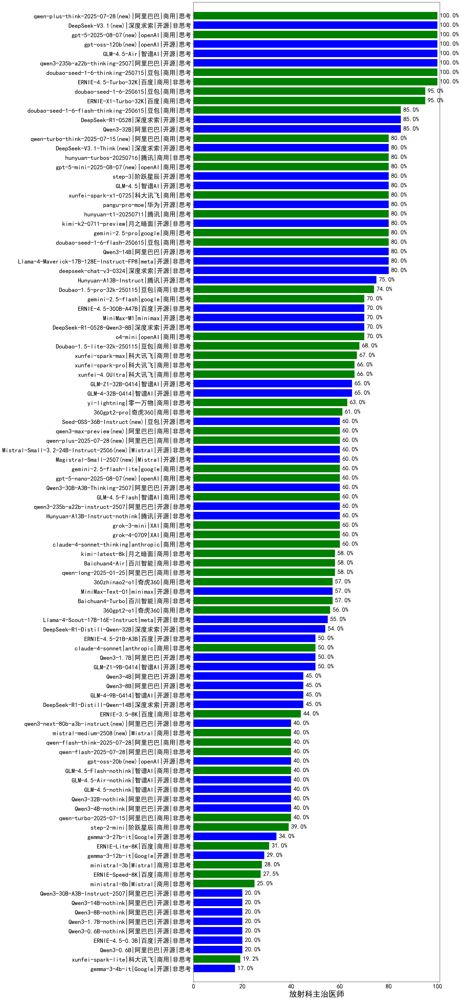

|类别|机构|大模型|【放射科主治医师】准确率|平均耗时|平均消耗token|花费/千次（元）|排名（准确率）|
|---|---|-----|-------------------|-------|-----------|-----------|-----------|
|开源|openAI|gpt-oss-120b(new)|100.0%|2s|529|1.3|1|
|开源|智谱AI|GLM-4.5-Air(new)|100.0%|29s|1510|8.7|2|
|开源|阿里巴巴|qwen3-235b-a22b-thinking-2507(new)|100.0%|173s|2935|57.3|3|
|商用|豆包|doubao-seed-1-6-thinking-250715(new)|100.0%|59s|1552|11.9|4|
|商用|openAI|gpt-5-2025-08-07(new)|100.0%|18s|223|10.5|5|
|商用|百度|ERNIE-4.5-Turbo-32K|100.0%|21s|541|1.6|6|
|商用|百度|ERNIE-X1-Turbo-32K|95.0%|97s|2307|9.1|7|
|商用|豆包|doubao-seed-1-6-250615|95.0%|165s|404|2.5|8|
|开源|阿里巴巴|Qwen3-30B-A3B|90.0%|19s|1250|3.3|9|
|商用|阿里巴巴|qwen-plus-think-2025-04-28|90.0%|212s|2260|17.6|10|
|开源|阿里巴巴|Qwen3-235B-A22B|90.0%|72s|2171|21.1|11|
|商用|阿里巴巴|qwen-turbo-think-2025-04-28|85.0%|67s|2703|7.9|12|
|开源|阿里巴巴|Qwen3-32B|85.0%|48s|1984|7.7|13|
|商用|豆包|doubao-seed-1-6-flash-thinking-250615|85.0%|16s|592|0.7|14|
|开源|深度求索|DeepSeek-R1-0528|85.0%|241s|1986|31.0|15|
|商用|openAI|gpt-4.1-mini|80.0%|10s|401|3.8|16|
|商用|腾讯|hunyuan-t1-20250711(new)|80.0%|46s|2743|10.7|17|
|开源|阿里巴巴|Qwen3-14B|80.0%|23s|1139|2.2|18|
|开源|月之暗面|kimi-k2-0711-preview(new)|80.0%|26s|461|6.6|19|
|开源|阿里巴巴|Qwen3-235B-A22B-nothink|80.0%|18s|465|4.0|20|
|开源|深度求索|deepseek-chat-v3-0324|80.0%|108s|333|2.3|21|
|开源|智谱AI|GLM-4.5(new)|80.0%|86s|1388|18.7|22|
|开源|阶跃星辰|step-3(new)|80.0%|104s|1998|7.8|23|
|商用|openAI|gpt-5-mini-2025-08-07(new)|80.0%|20s|978|13.0|24|
|商用|腾讯|hunyuan-turbos-20250716(new)|80.0%|10s|494|0.9|25|
|开源|阿里巴巴|Qwen3-30B-A3B-nothink|80.0%|21s|449|1.1|26|
|开源|meta|Llama-4-Maverick-17B-128E-Instruct-FP8|80.0%|8s|520|2.0|27|
|商用|google|gemini-2.5-pro|80.0%|40s|2369|167.3|28|
|商用|豆包|doubao-seed-1-6-flash-250615|80.0%|3s|255|0.3|29|
|开源|华为|pangu-pro-moe|80.0%|102s|2154|8.4|30|
|商用|科大讯飞|xunfei-spark-x1-0725(new)|80.0%|/|1379|16.6|31|
|商用|阿里巴巴|qwen-plus-2025-07-14(new)|80.0%|12s|469|0.8|32|
|开源|腾讯|Hunyuan-A13B-Instruct|75.0%|85s|1242|4.8|33|
|商用|智谱AI|GLM-Z1-Air|75.0%|54s|1805|0.9|34|
|商用|腾讯|hunyuan-turbos-20250604|75.0%|9s|413|0.7|35|
|商用|豆包|Doubao-1.5-pro-32k-250115|74.0%|9s|332|0.6|36|
|商用|openAI|gpt-4.1|70.0%|12s|333|15.2|37|
|商用|智谱AI|GLM-Z1-AirX|70.0%|20s|1819|11.6|38|
|商用|智谱AI|GLM-Z1-Flash|70.0%|25s|2823|0.0|39|
|商用|openAI|o4-mini|70.0%|32s|894|26.2|40|
|开源|深度求索|DeepSeek-R1-0528-Qwen3-8B|70.0%|245s|1745|0.0|41|
|开源|minimax|MiniMax-M1|70.0%|271s|2878|21.8|42|
|开源|百度|ERNIE-4.5-300B-A47B|70.0%|47s|300|2.0|43|
|商用|google|gemini-2.5-flash|70.0%|11s|1930|33.9|44|
|商用|豆包|Doubao-1.5-lite-32k-250115|68.0%|4s|178|0.1|45|
|商用|阿里巴巴|qwen2.5-max|67.0%|24s|479|4.1|46|
|商用|智谱AI|GLM-4-Plus|67.0%|10s|286|1.4|47|
|商用|科大讯飞|xunfei-spark-max|67.0%|5s|117|3.5|48|
|开源|腾讯|hunyuan-large|66.0%|12s|337|3.4|49|
|商用|科大讯飞|xunfei-4.0Ultra|66.0%|3s|113|7.9|50|
|商用|科大讯飞|xunfei-spark-pro|66.0%|/|/|/|51|
|开源|智谱AI|GLM-4-32B-0414|65.0%|12s|371|0.7|52|
|开源|智谱AI|GLM-Z1-32B-0414|65.0%|190s|3057|12.0|53|
|商用|阶跃星辰|step-r1-v-mini|65.0%|204s|2015|15.6|54|
|商用|零一万物|yi-lightning|63.0%|/|/|/|55|
|商用|奇虎360|360gpt2-pro|61.0%|13s|270|1.1|56|
|开源|阿里巴巴|qwen2.5-72b-instruct|61.0%|13s|286|2.8|57|
|开源|阿里巴巴|qwq-32b|60.5%|54s|3074|18.2|58|
|开源|腾讯|Hunyuan-A13B-Instruct-nothink(new)|60.0%|12s|314|1.0|59|
|商用|智谱AI|GLM-4.5-Flash(new)|60.0%|31s|1691|0.0|60|
|商用|openAI|gpt-5-nano-2025-08-07(new)|60.0%|35s|2337|6.5|61|
|开源|阿里巴巴|qwen3-235b-a22b-instruct-2507(new)|60.0%|10s|446|3.1|62|
|商用|google|gemini-2.5-flash-lite-preview-06-17|60.0%|2s|620|1.6|63|
|商用|anthropic|claude-4-sonnet-thinking|60.0%|48s|1144|113.6|64|
|商用|XAI|grok-3-mini|60.0%|302s|1193|4.2|65|
|开源|阿里巴巴|Qwen3-30B-A3B-Thinking-2507(new)|60.0%|99s|4294|11.9|66|
|商用|XAI|grok-4-0709|60.0%|87s|1352|140.0|67|
|开源|上海人工智能实验室|internlm2_5-7b-chat|59.0%|/|/|/|68|
|商用|阿里巴巴|qwen-long-2025-01-25|58.0%|40s|336|0.6|69|
|商用|腾讯|hunyuan-standard|58.0%|/|/|/|70|
|商用|百川智能|Baichuan4-Air|58.0%|/|/|/|71|
|商用|月之暗面|kimi-latest-8k|58.0%|18s|509|6.1|72|
|商用|阿里巴巴|qwq-plus-2025-03-05|57.5%|80s|3487|13.8|73|
|商用|奇虎360|360zhinao2-o1|57.0%|/|/|/|74|
|商用|百川智能|Baichuan4-Turbo|57.0%|/|/|/|75|
|商用|openAI|chatgpt-4o-latest|57.0%|/|/|/|76|
|开源|minimax|MiniMax-Text-01|57.0%|14s|905|7.3|77|
|商用|智谱AI|GLM-4-Long|56.7%|8s|329|0.3|78|
|商用|奇虎360|360gpt-turbo|56.0%|/|/|/|79|
|商用|奇虎360|360gpt2-o1|56.0%|20s|305|12.7|80|
|商用|智谱AI|GLM-Z1-FlashX|55.0%|25s|1862|0.4|81|
|开源|meta|Llama-4-Scout-17B-16E-Instruct|55.0%|9s|568|1.1|82|
|开源|深度求索|DeepSeek-R1-Distill-Qwen-32B|54.0%|46s|760|1.0|83|
|商用|智谱AI|GLM-4-AirX|53.3%|4s|248|2.5|84|
|商用|商汤|SenseChat-5-1202|52.0%|/|/|/|85|
|开源|阿里巴巴|qwen2.5-14b-instruct|52.0%|9s|238|0.6|86|
|开源|阿里巴巴|qwen2.5-7b-instruct|51.0%|3s|203|0.2|87|
|开源|阿里巴巴|qwen2.5-32b-instruct|51.0%|10s|271|1.3|88|
|开源|百度|ERNIE-4.5-21B-A3B|50.0%|47s|290|0.0|89|
|开源|阿里巴巴|Qwen3-1.7B|50.0%|21s|2079|6.0|90|
|商用|anthropic|claude-4-sonnet|50.0%|45s|564|50.4|91|
|开源|Mistral|Mistral-Small-3.1-24B-Instruct-2503|50.0%|/|/|/|92|
|开源|智谱AI|GLM-Z1-9B-0414|50.0%|155s|3527|0.0|93|
|开源|阿里巴巴|Qwen3-4B|45.0%|31s|2789|8.2|94|
|商用|Mistral|mistral-large|45.0%|/|/|/|95|
|开源|智谱AI|GLM-4-9B-0414|45.0%|11s|437|0.0|96|
|开源|智谱AI|GLM-Z1-Rumination-32B-0414|45.0%|17s|930|2.1|97|
|开源|深度求索|DeepSeek-R1-Distill-Qwen-14B|45.0%|/|/|/|98|
|开源|阿里巴巴|Qwen3-8B|45.0%|185s|5388|0.0|99|
|商用|百度|ERNIE-3.5-8K|44.0%|19s|311|0.5|100|
|商用|智谱AI|GLM-4-FlashX|41.0%|7s|281|0.0|101|
|商用|阿里巴巴|qwen-flash-think-2025-07-28(new)|40.0%|39s|4067|6.0|102|
|商用|OpenAI|gpt-4o-mini|40.0%|/|/|/|103|
|商用|阿里巴巴|qwen-flash-2025-07-28(new)|40.0%|44s|646|0.9|104|
|开源|openAI|gpt-oss-20b(new)|40.0%|244s|1071|1.1|105|
|开源|阿里巴巴|Qwen3-32B-nothink|40.0%|24s|599|2.1|106|
|开源|阿里巴巴|Qwen3-4B-nothink|40.0%|28s|493|1.3|107|
|开源|智谱AI|GLM-4.5-nothink|40.0%|22s|617|7.8|108|
|商用|智谱AI|GLM-4.5-Flash-nothink|40.0%|19s|840|0.0|109|
|商用|阿里巴巴|qwen-turbo-2025-07-15(new)|40.0%|6s|357|0.2|110|
|商用|Mistral|mistral-small|40.0%|/|/|/|111|
|开源|智谱AI|GLM-4.5-Air-nothink|40.0%|12s|902|5.0|112|
|商用|阶跃星辰|step-2-mini|39.0%|6s|345|0.6|113|
|开源|阿里巴巴|qwen2.5-1.5b-instruct|38.0%|5s|164|0.0|114|
|开源|Google|gemma-3-27b-it|34.0%|/|/|/|115|
|商用|百度|ERNIE-Lite-8K|31.0%|/|/|/|116|
|开源|阿里巴巴|qwen2.5-3b-instruct|30.0%|4s|264|0.2|117|
|开源|Google|gemma-3-12b-it|29.0%|/|/|/|118|
|开源|微软|phi-4|29.0%|/|/|/|119|
|商用|Mistral|ministral-3b|28.0%|/|/|/|120|
|商用|百度|ERNIE-Speed-8K|27.5%|/|/|/|121|
|商用|Mistral|ministral-8b|25.0%|/|/|/|122|
|开源|阿里巴巴|qwen2.5-0.5b-instruct|21.0%|3s|260|0.0|123|
|开源|百度|ERNIE-4.5-0.3B|20.0%|57s|360|0.0|124|
|开源|阿里巴巴|Qwen3-0.6B|20.0%|7s|1452|4.2|125|
|开源|阿里巴巴|Qwen3-14B-nothink|20.0%|11s|539|1.0|126|
|开源|阿里巴巴|Qwen3-0.6B-nothink|20.0%|8s|192|0.4|127|
|开源|阿里巴巴|Qwen3-1.7B-nothink|20.0%|10s|384|0.9|128|
|开源|阿里巴巴|Qwen3-8B-nothink|20.0%|33s|699|0.0|129|
|开源|阿里巴巴|Qwen3-30B-A3B-Instruct-2507(new)|20.0%|5s|569|1.5|130|
|商用|科大讯飞|xunfei-spark-lite|19.2%|/|/|/|131|
|商用|百度|ERNIE-Tiny-8K|19.0%|/|/|/|132|
|开源|Google|gemma-3-4b-it|17.0%|/|/|/|133|

