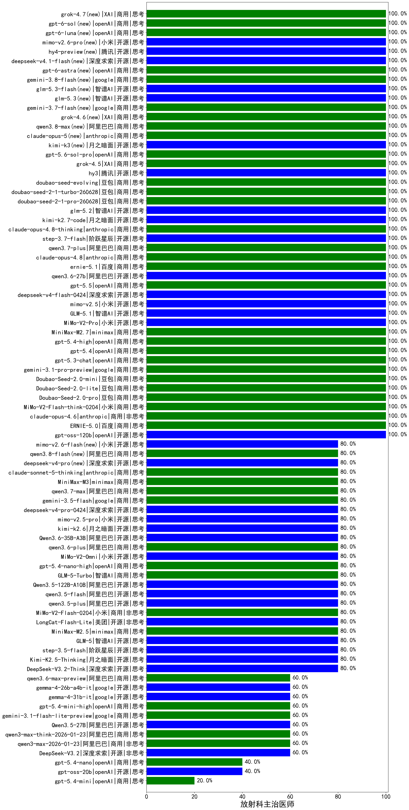

|类别|机构|大模型|【放射科主治医师】准确率|平均耗时|平均消耗token|花费/千次（元）|排名（准确率）|
|---|---|-----|-------------------|-------|-----------|-----------|-----------|
|开源|openAI|gpt-oss-120b|100.0%|2s|529|1.3|1|
|开源|月之暗面|kimi-k2.7-code(new)|100.0%|13s|475|11.5|2|
|开源|阶跃星辰|step-3.7-flash(new)|100.0%|17s|1818|14.2|3|
|商用|阿里巴巴|qwen3.7-plus(new)|100.0%|26s|1337|10.2|4|
|商用|anthropic|claude-opus-4.8(new)|100.0%|8s|532|77.7|5|
|商用|百度|ernie-5.1|100.0%|26s|1082|18.5|6|
|开源|阿里巴巴|qwen3.6-27b|100.0%|30s|1881|32.7|7|
|商用|openAI|gpt-5.5|100.0%|5s|340|54.5|8|
|开源|深度求索|deepseek-v4-flash-0424|100.0%|38s|1047|2.0|9|
|开源|小米|mimo-v2.5|100.0%|13s|1037|11.0|10|
|开源|智谱AI|GLM-5.1|100.0%|88s|1726|40.2|11|
|开源|小米|MiMo-V2-Pro|100.0%|46s|1023|17.0|12|
|商用|minimax|MiniMax-M2.7|100.0%|30s|1336|10.6|13|
|商用|openAI|gpt-5.4-high|100.0%|22s|432|36.9|14|
|商用|openAI|gpt-5.4|100.0%|22s|286|21.6|15|
|商用|openAI|gpt-5.3-chat|100.0%|23s|387|29.7|16|
|商用|google|gemini-3.1-pro-preview|100.0%|41s|1524|124.5|17|
|商用|anthropic|claude-opus-4.8-thinking(new)|100.0%|10s|661|100.3|18|
|开源|智谱AI|glm-5.2(new)|100.0%|41s|1816|49.3|19|
|商用|豆包|Doubao-Seed-2.0-lite|100.0%|236s|997|3.3|20|
|商用|豆包|doubao-seed-2-1-pro-260628(new)|100.0%|546s|11017|327.9|21|
|开源|深度求索|deepseek-v4.1-flash(new)|100.0%|13s|1323|10.0|22|
|商用|openAI|gpt-6-astra(new)|100.0%|13s|256|62.5|23|
|商用|google|gemini-3.8-flash(new)|100.0%|10s|724|34.9|24|
|开源|智谱AI|glm-5.3-flash(new)|100.0%|33s|1311|3.5|25|
|开源|智谱AI|glm-5.3(new)|100.0%|33s|1236|33.1|26|
|商用|google|gemini-3.7-flash(new)|100.0%|7s|873|21.4|27|
|商用|XAI|grok-4.6(new)|100.0%|21s|1243|44.6|28|
|商用|阿里巴巴|qwen3.8-max(new)|100.0%|12s|538|16.7|29|
|商用|anthropic|claude-opus-5(new)|100.0%|13s|707|108.2|30|
|开源|月之暗面|kimi-k3(new)|100.0%|23s|482|36.6|31|
|商用|openAI|gpt-5.6-sol-pro(new)|100.0%|22s|2973|213.4|32|
|商用|XAI|grok-4.5(new)|100.0%|80s|1417|51.9|33|
|开源|腾讯|hy3(new)|100.0%|72s|245|0.8|34|
|商用|豆包|doubao-seed-evolving(new)|100.0%|300s|10942|325.7|35|
|商用|豆包|doubao-seed-2-1-turbo-260628(new)|100.0%|242s|9491|141.1|36|
|商用|豆包|Doubao-Seed-2.0-mini|100.0%|202s|2101|4.0|37|
|开源|腾讯|hy4-preview(new)|100.0%|39s|2572|45.3|38|
|商用|豆包|Doubao-Seed-2.0-pro|100.0%|220s|949|13.8|39|
|商用|anthropic|claude-opus-4.6|100.0%|25s|601|89.6|40|
|商用|openAI|gpt-5.2-high|100.0%|12s|386|30.0|41|
|商用|openAI|gpt-5.2-medium|100.0%|9s|336|25.0|42|
|商用|google|gemini-3-flash-preview|100.0%|83s|1179|23.8|43|
|商用|豆包|doubao-seed-1-8-251215|100.0%|26s|693|4.8|44|
|商用|minimax|MiniMax-M2.1|100.0%|56s|918|7.1|45|
|商用|百度|ERNIE-5.0|100.0%|98s|1820|42.6|46|
|商用|小米|MiMo-V2-Flash-think-0204|100.0%|711s|1561|3.1|47|
|开源|美团|LongCat-Flash-Lite|80.0%|87s|631|0.0|48|
|开源|阿里巴巴|Qwen3.5-122B-A10B|80.0%|399s|4163|26.2|49|
|开源|深度求索|DeepSeek-V3.2-Think|80.0%|133s|1974|5.9|50|
|商用|minimax|MiniMax-M2.5|80.0%|30s|1277|10.1|51|
|商用|minimax|MiniMax-M3(new)|80.0%|19s|571|6.6|52|
|商用|阿里巴巴|qwen3-max-preview-think|80.0%|233s|2974|69.9|53|
|开源|智谱AI|GLM-4.7|80.0%|80s|3250|44.7|54|
|开源|小米|MiMo-V2-Flash-think|80.0%|26s|2499|0.0|55|
|开源|小米|MiMo-V2-Flash|80.0%|38s|456|0.0|56|
|开源|阿里巴巴|qwen3.5-flash|80.0%|404s|4505|8.9|57|
|开源|阿里巴巴|qwen3.5-plus|80.0%|56s|4602|21.8|58|
|商用|anthropic|claude-sonnet-5-thinking(new)|80.0%|14s|737|45.4|59|
|商用|阿里巴巴|qwen-plus-think-2025-12-01|80.0%|85s|3612|28.3|60|
|商用|阿里巴巴|qwen-plus-2025-12-01|80.0%|22s|988|1.9|61|
|商用|openAI|gpt-5.2|80.0%|5s|223|13.8|62|
|商用|腾讯|hunyuan-2.0-thinking-20251109|80.0%|31s|815|3.1|63|
|开源|深度求索|deepseek-v4-pro(new)|80.0%|209s|902|21.7|64|
|商用|阿里巴巴|qwen3.8-flash(new)|80.0%|16s|738|1.8|65|
|商用|google|gemini-3.5-flash|80.0%|8s|1456|87.8|66|
|商用|阿里巴巴|qwen3.7-max|80.0%|38s|1773|62.0|67|
|商用|阿里巴巴|qwen3.6-plus|80.0%|28s|1885|21.9|68|
|开源|阿里巴巴|Qwen3.6-35B-A3B|80.0%|10s|1662|17.3|69|
|商用|智谱AI|GLM-5-Turbo|80.0%|33s|2143|46.0|70|
|商用|openAI|gpt-5.4-nano-high|80.0%|50s|538|4.0|71|
|开源|智谱AI|GLM-5|80.0%|87s|2842|50.2|72|
|商用|小米|MiMo-V2-Flash-0204|80.0%|127s|586|1.1|73|
|开源|小米|MiMo-V2-Omni|80.0%|10s|1604|18.9|74|
|开源|深度求索|deepseek-v4-pro-0424|80.0%|26s|918|21.2|75|
|开源|阶跃星辰|step-3.5-flash|80.0%|20s|1411|2.9|76|
|开源|阿里巴巴|qwen3-next-80b-a3b-thinking|80.0%|230s|5110|20.2|77|
|开源|月之暗面|kimi-k2.6|80.0%|100s|2085|54.9|78|
|开源|月之暗面|Kimi-K2.5-Thinking|80.0%|477s|2161|44.2|79|
|开源|小米|mimo-v2.5-pro|80.0%|20s|1326|23.3|80|
|商用|google|gemini-3.1-flash-lite-preview|60.0%|5s|405|3.6|81|
|开源|google|gemma-4-26b-a4b-it|60.0%|61s|555|1.4|82|
|开源|美团|LongCat-Flash-Thinking-2601|60.0%|90s|1439|0.0|83|
|开源|深度求索|DeepSeek-V3.2|60.0%|9s|310|0.9|84|
|商用|腾讯|hunyuan-2.0-instruct-20251111|60.0%|11s|545|1.0|85|
|商用|openAI|gpt-5.4-mini-high|60.0%|17s|973|28.1|86|
|商用|阿里巴巴|qwen3-max-2026-01-23|60.0%|11s|454|4.0|87|
|商用|阿里巴巴|qwen3-max-think-2026-01-23|60.0%|186s|3636|35.8|88|
|商用|阿里巴巴|qwen3.6-max-preview|60.0%|55s|1713|89.1|89|
|开源|阿里巴巴|Qwen3.5-27B|60.0%|487s|6033|28.6|90|
|开源|google|gemma-4-31b-it|60.0%|60s|496|1.2|91|
|开源|openAI|gpt-oss-20b|40.0%|244s|1071|1.1|92|
|开源|Mistral|Ministral-3-3B-Instruct-2512|40.0%|2s|563|0.4|93|
|开源|Mistral|Ministral-3-8B-Instruct-2512|40.0%|10s|611|0.7|94|
|开源|Mistral|mistral-large-2512|40.0%|16s|582|5.5|95|
|商用|openAI|gpt-5.4-nano|40.0%|11s|263|1.6|96|
|开源|智谱AI|GLM-4.7-Flash|20.0%|1363s|2770|0.0|97|
|开源|Mistral|Ministral-3-14B-Instruct-2512|20.0%|13s|658|0.9|98|
|商用|openAI|gpt-5.4-mini|20.0%|8s|247|5.2|99|

