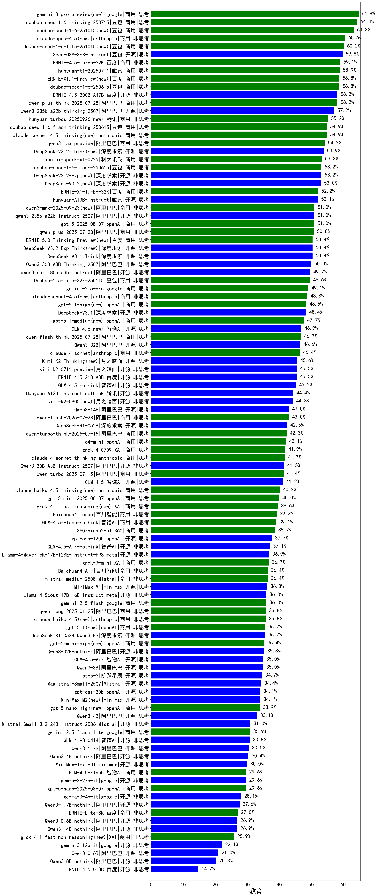

| 类别 | 大模型                         | 教育 | 排名 |
|-----|------------------------------|---------|----|
|商用|Doubao-1.5-pro-32k-250115|89.6|1|
|商用|hunyuan-turbos-20250226|89.5|2|
|商用|hunyuan-t1-20250321(new)|89.4|3|
|商用|ERNIE-X1-32K-Preview(new)|89.2|4|
|开源|DeepSeek-R1|89.2|5|
|商用|ERNIE-4.5-8K-Preview|88.8|6|
|商用|hunyuan-turbos-20250313|88.8|7|
|商用|hunyuan-turbo|88.1|8|
|商用|qwq-plus-2025-03-05|87.9|9|
|商用|gemini-2.5-pro-preview-03-25(new)|87.2|10|
|开源|qwq-32b|87.2|11|
|开源|deepseek-chat-v3-0324(new)|87.0|12|
|商用|Doubao-1.5-lite-32k-250115|86.3|13|
|开源|hunyuan-large|85.5|14|
|开源|DeepSeek-R1-Distill-Qwen-32B|85.1|15|
|商用|xunfei-spark-max|85.0|16|
|商用|xunfei-4.0Ultra|83.7|17|
|商用|GLM-4-Plus|83.0|18|
|开源|Llama-4-Maverick-17B-128E-Instruct-FP8(new)|83.0|19|
|开源|qwen2.5-32b-instruct|82.0|20|
|开源|GLM-Z1-32B-0414(new)|81.9|21|
|商用|kimi-latest-8k|81.5|22|
|商用|SenseChat-5-beta|81.1|23|
|商用|SenseChat-5-1202|81.0|24|
|商用|360gpt2-pro|81.0|25|
|商用|qwen2.5-max|80.9|26|
|商用|Baichuan4-Turbo|80.7|27|
|商用|GLM-Z1-Air(new)|80.7|28|
|商用|xunfei-spark-pro|80.6|29|
|商用|qwen-long|80.3|30|
|开源|qwen2.5-72b-instruct|80.0|31|
|商用|qwen-plus|80.0|32|
|商用|qwen-turbo|79.9|33|
|商用|ERNIE-3.5-8K|79.8|34|
|开源|MiniMax-Text-01|79.8|35|
|开源|DeepSeek-R1-Distill-Qwen-14B|79.3|36|
|商用|ERNIE-4.0-Turbo-8K|79.2|37|
|商用|GLM-4-AirX|78.8|38|
|开源|qwen2.5-14b-instruct|78.6|39|
|商用|yi-lightning|78.4|40|
|商用|GLM-4-Air|78.4|41|
|开源|Llama-4-Scout-17B-16E-Instruct(new)|78.0|42|
|商用|gemini-2.0-flash-thinking-exp-01-21|77.9|43|
|商用|gemini-2.0-flash-001|77.5|44|
|开源|GLM-4-32B-0414(new)|76.5|45|
|商用|360gpt2-o1|76.5|46|
|商用|hunyuan-standard|75.9|47|
|商用|360gpt-turbo|75.6|48|
|开源|qwen2.5-7b-instruct|74.8|49|
|商用|Claude-3.5-Sonnet|74.7|50|
|开源|internlm2_5-20b-chat|73.9|51|
|商用|GLM-4-Flash|73.9|52|
|商用|360zhinao2-o1|73.6|53|
|商用|step-2-mini|73.6|54|
|商用|gemini-1.5-pro|73.6|55|
|商用|GLM-4-Long|73.4|56|
|开源|glm-4-9b-chat|73.4|57|
|商用|gemini-2.5-flash-preview-04-17(new)|73.2|58|
|开源|DeepSeek-R1-Distill-Llama-70B|72.9|59|
|商用|GLM-4-FlashX|72.7|60|
|商用|chatgpt-4o-latest|72.4|61|
|开源|GLM-4-9B-0414(new)|72.0|62|
|商用|moonshot-v1-8k|71.8|63|
|商用|step-1-8k|71.2|64|
|商用|GLM-Z1-Flash(new)|70.6|65|
|商用|SenseChat-Turbo-1202|70.4|66|
|商用|Baichuan4-Air|70.1|67|
|商用|mistral-large|69.8|68|
|开源|GLM-Z1-Rumination-32B-0414(new)|69.6|69|
|开源|Mistral-Small-3.1-24B-Instruct-2503(new)|68.0|70|
|商用|GLM-Z1-FlashX(new)|67.6|71|
|开源|GLM-Z1-9B-0414(new)|66.9|72|
|开源|internlm2_5-7b-chat|66.1|73|
|商用|ERNIE-Speed-Pro-128K|65.9|74|
|商用|gemini-1.5-flash|65.6|75|
|商用|abab6.5s-chat|64.4|76|
|开源|gemma-3-27b-it|64.3|77|
|开源|Meta-Llama-3.1-405B-Instruct|64.1|78|
|开源|Llama-3.3-70B-Instruct|63.8|79|
|商用|o3-mini|63.5|80|
|开源|Llama-3.3-70B-Instruct-fp8|63.0|81|
|商用|ERNIE-Lite-8K|62.9|82|
|商用|GLM-Z1-AirX(new)|62.6|83|
|开源|qwen2.5-3b-instruct|62.4|84|
|开源|Hermes-3-Llama-3.1-405B|62.3|85|
|商用|ERNIE-Lite-Pro-128K|61.8|86|
|商用|gpt-4o-mini-2024-07-18|61.4|87|
|开源|Mistral-Small-24B-Instruct-2501|60.5|88|
|商用|mistral-small|60.3|89|
|开源|phi-4|59.7|90|
|商用|ERNIE-Speed-8K|59.2|91|
|商用|gemini-1.5-flash-8b|58.8|92|
|开源|gemma-3-12b-it|58.2|93|
|开源|qwen2.5-1.5b-instruct|56.0|94|
|开源|DeepSeek-R1-Distill-Qwen-7B|52.8|95|
|开源|DeepSeek-R1-Distill-Llama-8B|51.4|96|
|开源|gemma-3-4b-it|46.6|97|
|商用|ministral-8b|45.4|98|
|开源|Llama-3.1-8B-Instruct|44.3|99|
|开源|Meta-Llama-3.1-8B-Instruct-fp8|43.0|100|
|开源|DeepSeek-R1-Distill-Qwen-1.5B|42.8|101|
|商用|ministral-3b|39.6|102|
|开源|Llama-3.2-3B-Instruct|37.5|103|
|开源|qwen2.5-0.5b-instruct|36.8|104|
|商用|ERNIE-Tiny-8K|35.6|105|
|开源|gemma-3-1b-it|31.9|106|
|开源|Llama-3.2-1B-Instruct|28.3|107|
|商用|xunfei-spark-lite|25.7|108|

