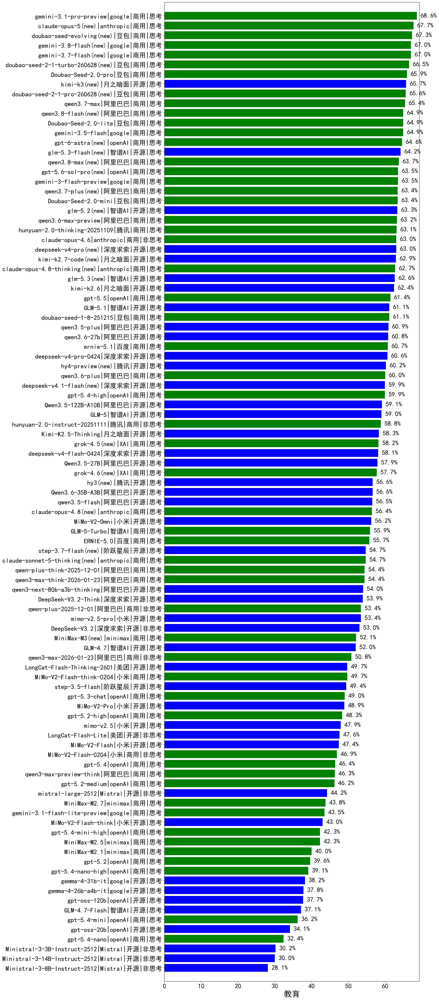

|类别|机构|大模型|【教育】准确率|平均耗时|平均消耗token|花费/千次（元）|排名（准确率）|
|---|---|-----|-------------------|-------|-----------|-----------|-----------|
|商用|google|gemini-3.1-pro-preview|68.6%|49s|2782|226.9|1|
|商用|anthropic|claude-opus-5(new)|67.7%|15s|889|126.2|2|
|商用|豆包|doubao-seed-evolving(new)|67.3%|275s|11062|327.7|3|
|商用|google|gemini-3.8-flash(new)|67.0%|16s|1271|60.8|4|
|商用|google|gemini-3.7-flash(new)|67.0%|8s|1005|23.4|5|
|商用|豆包|doubao-seed-2-1-turbo-260628(new)|66.5%|235s|9667|142.9|6|
|商用|豆包|Doubao-Seed-2.0-pro|65.9%|285s|1402|20.2|7|
|开源|月之暗面|kimi-k3(new)|65.7%|82s|1773|161.0|8|
|商用|豆包|doubao-seed-2-1-pro-260628(new)|65.6%|275s|11564|342.8|9|
|商用|阿里巴巴|qwen3.7-max|65.4%|57s|2957|103.2|10|
|商用|阿里巴巴|qwen3.8-flash(new)|64.9%|78s|4350|11.4|11|
|商用|豆包|Doubao-Seed-2.0-lite|64.9%|261s|1359|4.4|12|
|商用|google|gemini-3.5-flash|64.9%|13s|2325|139.1|13|
|商用|openAI|gpt-6-astra(new)|64.6%|14s|408|99.5|14|
|开源|智谱AI|glm-5.3-flash(new)|64.2%|140s|4732|13.0|15|
|商用|阿里巴巴|qwen3.8-max(new)|63.7%|87s|3743|130.6|16|
|商用|openAI|gpt-5.6-sol-pro(new)|63.5%|25s|4639|402.1|17|
|商用|google|gemini-3-flash-preview|63.5%|78s|2768|56.5|18|
|商用|阿里巴巴|qwen3.7-plus(new)|63.4%|89s|4804|37.6|19|
|商用|豆包|Doubao-Seed-2.0-mini|63.4%|423s|3290|6.3|20|
|开源|智谱AI|glm-5.2(new)|63.3%|96s|3980|108.7|21|
|商用|阿里巴巴|qwen3.6-max-preview|63.2%|88s|2663|137.8|22|
|商用|腾讯|hunyuan-2.0-thinking-20251109|63.1%|42s|2137|8.2|23|
|商用|anthropic|claude-opus-4.6|63.0%|19s|786|109.2|24|
|开源|深度求索|deepseek-v4-pro(new)|63.0%|131s|3175|82.1|25|
|开源|月之暗面|kimi-k2.7-code(new)|62.9%|55s|2157|55.7|26|
|商用|anthropic|claude-opus-4.8-thinking(new)|62.7%|17s|1342|205.6|27|
|开源|智谱AI|glm-5.3(new)|62.6%|241s|5309|145.8|28|
|开源|月之暗面|kimi-k2.6|62.4%|187s|4252|111.4|29|
|商用|openAI|gpt-5.5|61.4%|19s|856|152.6|30|
|开源|智谱AI|GLM-5.1|61.1%|230s|3520|82.1|31|
|商用|豆包|doubao-seed-1-8-251215|61.1%|32s|994|6.7|32|
|开源|阿里巴巴|qwen3.5-plus|60.9%|58s|4902|23.0|33|
|开源|阿里巴巴|qwen3.6-27b|60.8%|63s|4182|73.3|34|
|商用|百度|ernie-5.1|60.7%|54s|2090|35.8|35|
|开源|深度求索|deepseek-v4-pro-0424|60.6%|79s|2538|59.4|36|
|商用|阿里巴巴|qwen3.6-plus|60.0%|70s|3297|38.2|37|
|商用|openAI|gpt-5.4-high|59.9%|23s|1243|117.0|38|
|开源|阿里巴巴|Qwen3.5-122B-A10B|59.1%|377s|5513|34.5|39|
|开源|智谱AI|GLM-5|59.0%|153s|3927|68.9|40|
|商用|腾讯|hunyuan-2.0-instruct-20251111|58.8%|25s|812|1.4|41|
|开源|月之暗面|Kimi-K2.5-Thinking|58.3%|434s|4531|93.0|42|
|商用|XAI|grok-4.5(new)|58.2%|93s|3952|156.5|43|
|开源|深度求索|deepseek-v4-flash-0424|58.1%|53s|2224|4.3|44|
|开源|阿里巴巴|Qwen3.5-27B|57.9%|404s|5707|26.8|45|
|商用|XAI|grok-4.6(new)|57.7%|147s|3093|120.5|46|
|开源|腾讯|hy3(new)|56.6%|64s|471|1.5|47|
|开源|阿里巴巴|Qwen3.6-35B-A3B|56.6%|79s|3650|38.2|48|
|开源|阿里巴巴|qwen3.5-flash|56.5%|395s|5854|11.5|49|
|商用|anthropic|claude-opus-4.8(new)|56.4%|9s|738|99.9|50|
|开源|小米|MiMo-V2-Omni|56.2%|317s|2867|35.8|51|
|商用|智谱AI|GLM-5-Turbo|55.9%|57s|3315|70.7|52|
|商用|百度|ERNIE-5.0|55.7%|242s|3891|91.2|53|
|开源|阶跃星辰|step-3.7-flash(new)|54.7%|237s|4925|39.0|54|
|商用|anthropic|claude-sonnet-5-thinking(new)|54.7%|24s|1717|108.4|55|
|商用|阿里巴巴|qwen-plus-think-2025-12-01|54.4%|97s|3969|30.7|56|
|商用|阿里巴巴|qwen3-max-think-2026-01-23|54.4%|314s|5134|50.3|57|
|开源|阿里巴巴|qwen3-next-80b-a3b-thinking|54.0%|160s|4814|18.8|58|
|开源|深度求索|DeepSeek-V3.2-Think|53.9%|181s|2588|7.6|59|
|商用|阿里巴巴|qwen-plus-2025-12-01|53.4%|38s|1653|3.1|60|
|开源|小米|mimo-v2.5-pro|53.4%|69s|3789|74.2|61|
|开源|深度求索|DeepSeek-V3.2|53.0%|78s|747|2.1|62|
|商用|minimax|MiniMax-M3(new)|52.1%|121s|2898|45.0|63|
|开源|智谱AI|GLM-4.7|52.0%|100s|3605|49.0|64|
|商用|阿里巴巴|qwen3-max-2026-01-23|50.8%|117s|1294|11.9|65|
|开源|美团|LongCat-Flash-Thinking-2601|49.7%|213s|4986|0.0|66|
|商用|小米|MiMo-V2-Flash-think-0204|49.7%|552s|3644|7.4|67|
|开源|阶跃星辰|step-3.5-flash|49.4%|40s|5164|10.7|68|
|商用|openAI|gpt-5.3-chat|49.0%|26s|627|48.2|69|
|开源|小米|MiMo-V2-Pro|48.9%|428s|1952|35.6|70|
|商用|openAI|gpt-5.2-high|48.3%|25s|1132|99.0|71|
|开源|小米|mimo-v2.5|47.9%|49s|2892|36.2|72|
|开源|美团|LongCat-Flash-Lite|47.6%|240s|1185|0.0|73|
|开源|小米|MiMo-V2-Flash|47.4%|58s|1391|0.0|74|
|商用|小米|MiMo-V2-Flash-0204|46.9%|325s|1142|2.2|75|
|商用|openAI|gpt-5.4|46.4%|11s|450|33.7|76|
|商用|阿里巴巴|qwen3-max-preview-think|46.3%|194s|3850|89.8|77|
|商用|openAI|gpt-5.2-medium|46.2%|18s|857|71.7|78|
|开源|Mistral|mistral-large-2512|44.2%|17s|859|7.9|79|
|商用|minimax|MiniMax-M2.7|43.8%|88s|3803|31.0|80|
|商用|google|gemini-3.1-flash-lite-preview|43.5%|21s|539|4.4|81|
|开源|小米|MiMo-V2-Flash-think|43.0%|102s|4102|0.0|82|
|商用|openAI|gpt-5.4-mini-high|42.3%|87s|1996|58.8|83|
|商用|minimax|MiniMax-M2.5|42.3%|54s|3071|24.8|84|
|商用|minimax|MiniMax-M2.1|40.0%|124s|3478|28.2|85|
|商用|openAI|gpt-5.2|39.6%|7s|382|24.5|86|
|商用|openAI|gpt-5.4-nano-high|39.1%|82s|1515|12.1|87|
|开源|google|gemma-4-31b-it|38.2%|86s|673|1.6|88|
|开源|google|gemma-4-26b-a4b-it|37.8%|65s|845|2.1|89|
|开源|openAI|gpt-oss-120b|37.7%|98s|1020|2.8|90|
|开源|智谱AI|GLM-4.7-Flash|37.1%|1613s|7422|0.0|91|
|商用|openAI|gpt-5.4-mini|36.2%|38s|388|8.1|92|
|开源|openAI|gpt-oss-20b|34.1%|113s|1805|1.9|93|
|商用|openAI|gpt-5.4-nano|32.4%|41s|425|2.6|94|
|开源|Mistral|Ministral-3-3B-Instruct-2512|30.2%|16s|2166|1.5|95|
|开源|Mistral|Ministral-3-14B-Instruct-2512|30.0%|19s|1765|2.5|96|
|开源|Mistral|Ministral-3-8B-Instruct-2512|28.1%|17s|1865|2.0|97|

