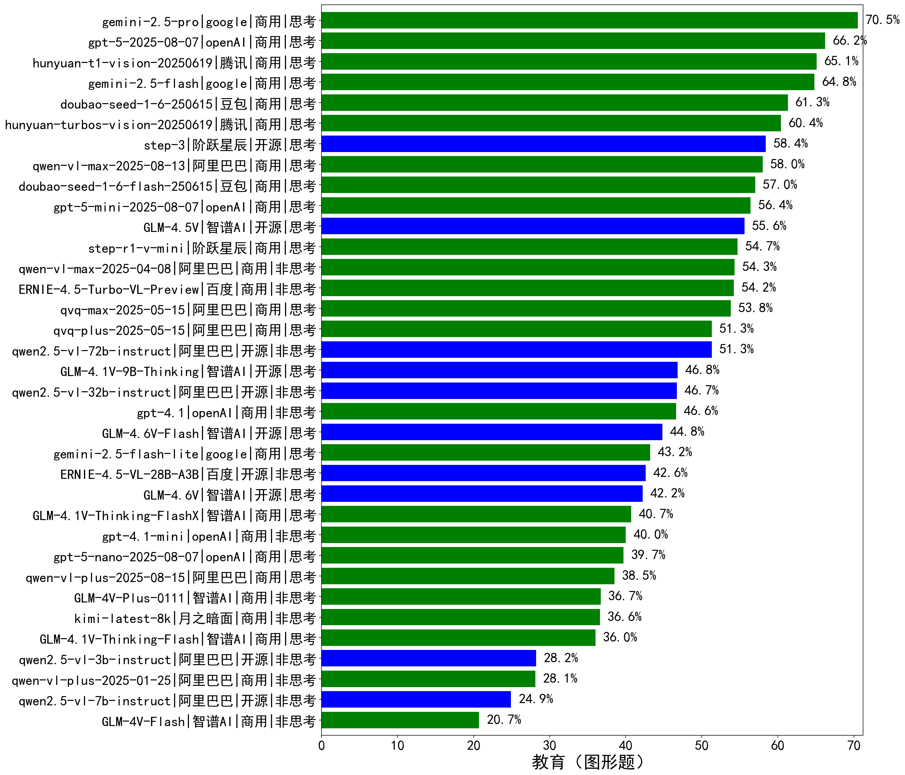

|类别|机构|大模型|【教育（图形题）】准确率|平均耗时|平均消耗token|花费/千次（元）|排名（准确率）|
|---|---|-----|-------------------|-------|-----------|-----------|-----------|
|商用|google|gemini-2.5-pro|70.5%|157s|4429|292.5|1|
|商用|openAI|gpt-5-2025-08-07|66.2%|149s|2577|147.8|2|
|商用|腾讯|hunyuan-t1-vision-20250619|65.1%|172s|2325|16.9|3|
|商用|google|gemini-2.5-flash|64.8%|133s|4386|72.3|4|
|商用|豆包|doubao-seed-1-6-250615|61.3%|/|958|3.7|5|
|商用|腾讯|hunyuan-turbos-vision-20250619|60.4%|139s|980|5.2|6|
|开源|阶跃星辰|step-3|58.4%|394s|3679|13.8|7|
|商用|阿里巴巴|qwen-vl-max-2025-08-13|58.0%|66s|2120|7.3|8|
|商用|豆包|doubao-seed-1-6-flash-250615|57.0%|/|1059|0.9|9|
|商用|openAI|gpt-5-mini-2025-08-07|56.4%|130s|1968|22.6|10|
|开源|智谱AI|GLM-4.5V|55.6%|126s|2031|9.7|11|
|商用|阶跃星辰|step-r1-v-mini|54.7%|187s|4079|29.1|12|
|商用|阿里巴巴|qwen-vl-max-2025-04-08|54.3%|200s|1017|6.0|13|
|商用|百度|ERNIE-4.5-Turbo-VL-Preview|54.2%|145s|2126|9.3|14|
|商用|阿里巴巴|qvq-max-2025-05-15|53.8%|251s|2136|55.7|15|
|商用|阿里巴巴|qvq-plus-2025-05-15|51.3%|327s|3111|14.0|16|
|开源|阿里巴巴|qwen2.5-vl-72b-instruct|51.3%|165s|860|3.6|17|
|开源|智谱AI|GLM-4.1V-9B-Thinking|46.8%|238s|2593|2.1|18|
|开源|阿里巴巴|qwen2.5-vl-32b-instruct|46.7%|178s|1320|2.5|19|
|商用|openAI|gpt-4.1|46.6%|124s|987|31.2|20|
|商用|google|gemini-2.5-flash-lite|43.2%|119s|4232|11.3|21|
|开源|百度|ERNIE-4.5-VL-28B-A3B|42.6%|127s|1092|1.9|22|
|商用|智谱AI|GLM-4.1V-Thinking-FlashX|40.7%|133s|1741|3.4|23|
|商用|openAI|gpt-4.1-mini|40.0%|185s|896|6.3|24|
|商用|openAI|gpt-5-nano-2025-08-07|39.7%|135s|3786|9.8|25|
|商用|阿里巴巴|qwen-vl-plus-2025-08-15|38.5%|7s|1060|1.6|26|
|商用|智谱AI|GLM-4V-Plus-0111|36.7%|93s|874|3.5|27|
|商用|月之暗面|kimi-latest-8k|36.6%|135s|1463|17.5|28|
|商用|智谱AI|GLM-4.1V-Thinking-Flash|36.0%|42s|1619|0.0|29|
|开源|阿里巴巴|qwen2.5-vl-3b-instruct|28.2%|173s|754|1.4|30|
|商用|阿里巴巴|qwen-vl-plus-2025-01-25|28.1%|173s|777|1.9|31|
|开源|阿里巴巴|qwen2.5-vl-7b-instruct|24.9%|35s|958|0.3|32|
|商用|智谱AI|GLM-4V-Flash|20.7%|12s|901|0.0|33|

