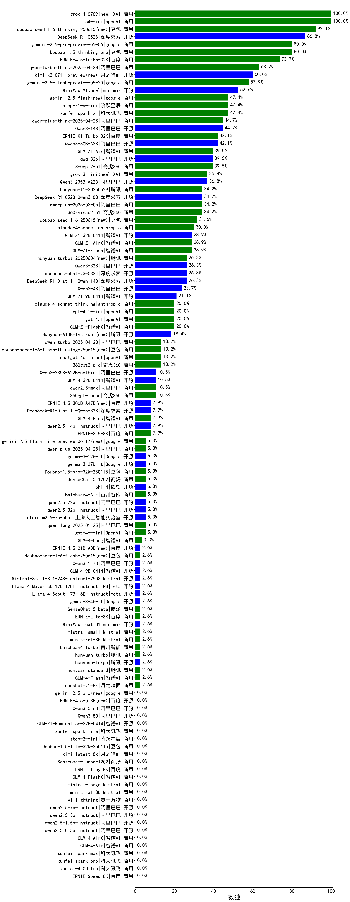

|类别|机构|大模型|【数独】准确率|平均耗时|平均消耗token|花费/千次（元）|排名（准确率）|
|---|---|-----|-------------------|-------|-----------|-----------|-----------|
|商用|openAI|gpt-5-mini-2025-08-07|100.0%|105s|7061|101.2|1|
|商用|openAI|gpt-5.1-medium(new)|100.0%|96s|5359|374.9|2|
|商用|openAI|o4-mini|100.0%|86s|7983|252.5|3|
|开源|openAI|gpt-oss-120b|100.0%|424s|4920|15.7|4|
|商用|openAI|gpt-5-nano-2025-08-07|100.0%|152s|6815|19.5|5|
|商用|XAI|grok-4-0709|100.0%|290s|12341|1334.0|6|
|商用|openAI|gpt-5-2025-08-07|100.0%|60s|910|60.6|7|
|商用|anthropic|claude-haiku-4.5-thinking(new)|93.8%|104s|18496|666.0|8|
|商用|豆包|doubao-seed-1-6-thinking-250715|93.8%|205s|14022|111.3|9|
|开源|月之暗面|Kimi-K2-Thinking(new)|93.8%|973s|16987|270.7|10|
|开源|豆包|Seed-OSS-36B-Instruct|93.8%|955s|19335|77.0|11|
|商用|阿里巴巴|qwen-plus-think-2025-07-28|87.5%|/|19092|151.8|12|
|开源|深度求索|DeepSeek-R1-0528|87.5%|676s|16386|272.0|13|
|商用|阿里巴巴|qwen3-max-preview|87.5%|155s|6407|151.5|14|
|开源|openAI|gpt-oss-20b|81.2%|450s|8299|9.5|15|
|开源|阿里巴巴|Qwen3-30B-A3B-Instruct-2507|81.2%|87s|8917|26.5|16|
|开源|深度求索|DeepSeek-V3.1-Think|81.2%|843s|17525|209.6|17|
|商用|腾讯|hunyuan-t1-20250711|75.0%|345s|22189|88.3|18|
|开源|阿里巴巴|qwen3-next-80b-a3b-instruct|75.0%|136s|9575|37.9|19|
|开源|minimax|MiniMax-M2(new)|75.0%|257s|16390|136.9|20|
|开源|阿里巴巴|qwen3-235b-a22b-thinking-2507|75.0%|426s|18119|360.1|21|
|开源|深度求索|DeepSeek-V3.2-Exp-Think(new)|75.0%|658s|17881|53.6|22|
|开源|阿里巴巴|Qwen3-30B-A3B-Thinking-2507|68.8%|322s|17217|47.9|23|
|开源|阿里巴巴|qwen3-235b-a22b-instruct-2507|68.8%|198s|7631|60.3|24|
|商用|阿里巴巴|qwen-plus-2025-07-28|68.8%|209s|7305|14.5|25|
|开源|智谱AI|GLM-4.5|68.8%|333s|13495|187.7|26|
|开源|智谱AI|GLM-4.6(new)|68.8%|268s|12199|169.6|27|
|商用|百度|ERNIE-4.5-Turbo-32K|68.8%|36s|594|1.7|28|
|商用|豆包|doubao-seed-1-6-lite-251015(new)|56.2%|220s|7873|18.6|29|
|商用|anthropic|claude-4-sonnet|50.0%|99s|1180|115.3|30|
|商用|阿里巴巴|qwen-flash-think-2025-07-28|50.0%|148s|16404|24.4|31|
|开源|minimax|MiniMax-M1|50.0%|578s|17662|139.3|32|
|商用|阿里巴巴|qwen-turbo-think-2025-07-15|50.0%|/|17655|52.6|33|
|开源|智谱AI|GLM-4.5-Air|50.0%|252s|19926|112.7|34|
|商用|google|gemini-2.5-pro|43.8%|91s|9211|660.4|35|
|开源|深度求索|DeepSeek-R1-0528-Qwen3-8B|43.8%|1006s|27164|0.0|36|
|商用|豆包|doubao-seed-1-6-250615|43.8%|107s|1116|7.8|37|
|开源|阿里巴巴|Qwen3-4B|37.5%|164s|11935|35.5|38|
|开源|月之暗面|kimi-k2-0711-preview|37.5%|747s|9279|147.4|39|
|商用|腾讯|hunyuan-turbos-20250926(new)|37.5%|257s|9017|17.8|40|
|开源|阶跃星辰|step-3|37.5%|971s|17763|70.8|41|
|开源|智谱AI|GLM-4.5-Air-nothink|37.5%|127s|10025|59.6|42|
|商用|360|360zhinao2-o1|37.5%|275s|12396|123.2|43|
|商用|XAI|grok-3-mini|37.5%|156s|7230|26.1|44|
|开源|智谱AI|GLM-4.5-nothink|31.2%|226s|8697|120.5|45|
|商用|阿里巴巴|qwen-flash-2025-07-28|31.2%|92s|9519|14.1|46|
|商用|google|gemini-2.5-flash|31.2%|64s|14969|269.4|47|
|开源|深度求索|DeepSeek-V3.1|31.2%|163s|3362|39.6|48|
|商用|豆包|doubao-seed-1-6-251015(new)|31.2%|446s|3824|29.5|49|
|商用|百度|ERNIE-X1-Turbo-32K|31.2%|621s|14910|59.3|50|
|开源|阿里巴巴|Qwen3-8B|25.0%|686s|21813|0.0|51|
|开源|阿里巴巴|Qwen3-32B-nothink|25.0%|58s|1271|4.7|52|
|商用|智谱AI|GLM-4.5-Flash|25.0%|350s|21013|0.0|53|
|开源|Mistral|Magistral-Small-2507|25.0%|202s|22521|243.7|54|
|商用|科大讯飞|xunfei-spark-x1-0725|25.0%|/|15238|182.9|55|
|开源|阿里巴巴|Qwen3-14B|25.0%|181s|12926|25.7|56|
|商用|智谱AI|GLM-4.5-Flash-nothink|25.0%|234s|12362|0.0|57|
|开源|深度求索|DeepSeek-V3.2-Exp(new)|25.0%|168s|4547|13.6|58|
|商用|anthropic|claude-haiku-4.5(new)|18.8%|8s|700|21.7|59|
|开源|阿里巴巴|Qwen3-14B-nothink|18.8%|66s|3453|6.7|60|
|开源|阿里巴巴|Qwen3-32B|18.8%|279s|11648|46.2|61|
|商用|openAI|gpt-5.1(new)|12.5%|101s|622|38.5|62|
|商用|豆包|doubao-seed-1-6-flash-thinking-250615|12.5%|212s|13409|19.9|63|
|开源|阿里巴巴|Qwen3-4B-nothink|12.5%|78s|3006|8.7|64|
|开源|腾讯|Hunyuan-A13B-Instruct|12.5%|352s|16138|64.2|65|
|商用|阿里巴巴|qwen-turbo-2025-07-15|12.5%|39s|2610|1.5|66|
|开源|阿里巴巴|Qwen3-8B-nothink|12.5%|168s|3713|0.0|67|
|开源|Mistral|Mistral-Small-3.2-24B-Instruct-2506|6.2%|305s|8969|19.3|68|
|商用|Mistral|mistral-medium-2508|6.2%|499s|2568|35.4|69|
|商用|阿里巴巴|qwen-long-2025-01-25|6.2%|24s|1133|2.1|70|
|商用|百川智能|Baichuan4-Turbo|6.2%|14s|746|11.2|71|
|开源|百度|ERNIE-4.5-300B-A47B|6.2%|213s|898|6.4|72|
|开源|百度|ERNIE-4.5-21B-A3B|6.2%|53s|4190|0.0|73|
|商用|百度|ERNIE-Lite-8K|6.2%|6s|391|0.0|74|
|商用|豆包|doubao-seed-1-6-flash-250615|6.2%|2s|561|0.7|75|
|开源|google|gemma-3-12b-it|6.2%|17s|445|0.0|76|
|开源|meta|Llama-4-Maverick-17B-128E-Instruct-FP8|6.2%|12s|1035|4.2|77|
|商用|google|gemini-2.5-flash-lite|/%|111s|38905|112.6|78|
|开源|meta|Llama-4-Scout-17B-16E-Instruct|/%|12s|923|1.9|79|
|开源|minimax|MiniMax-Text-01|/%|17s|1167|9.3|80|
|商用|豆包|Doubao-1.5-lite-32k-250115|/%|5s|503|0.3|81|
|开源|google|gemma-3-27b-it|/%|15s|491|0.6|82|
|开源|google|gemma-3-4b-it|/%|5s|590|0.0|83|
|开源|智谱AI|GLM-4-9B-0414|/%|8s|571|0.0|84|
|开源|阿里巴巴|Qwen3-1.7B-nothink|/%|17s|1374|3.8|85|
|开源|阿里巴巴|Qwen3-1.7B|/%|100s|10392|30.8|86|
|开源|阿里巴巴|Qwen3-0.6B|/%|41s|6677|19.7|87|
|商用|anthropic|claude-4-sonnet-thinking|/%|98s|1760|178.3|88|
|开源|百度|ERNIE-4.5-0.3B|/%|16s|870|0.0|89|
|开源|腾讯|Hunyuan-A13B-Instruct-nothink|/%|890s|1116|4.1|90|
|商用|百川智能|Baichuan4-Air|/%|13s|682|0.7|91|
|开源|阿里巴巴|Qwen3-0.6B-nothink|/%|9s|648|1.6|92|

