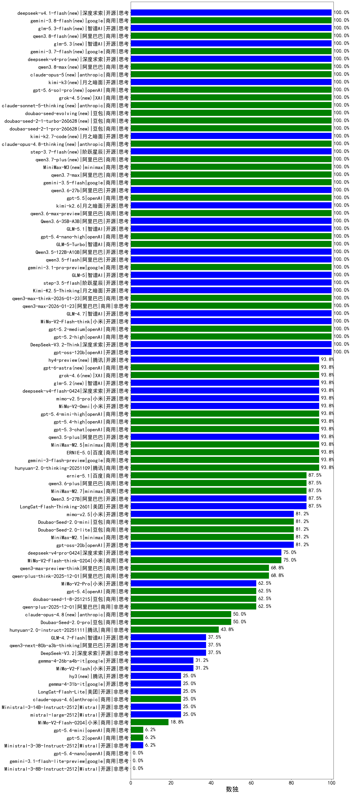

|类别|机构|大模型|【数独】准确率|平均耗时|平均消耗token|花费/千次（元）|排名（准确率）|
|---|---|-----|-------------------|-------|-----------|-----------|-----------|
|开源|openAI|gpt-oss-120b|100.0%|424s|4920|15.7|1|
|商用|google|gemini-3.1-pro-preview|100.0%|143s|10387|876.7|2|
|商用|anthropic|claude-opus-4.8-thinking(new)|100.0%|64s|6573|1134.8|3|
|开源|阶跃星辰|step-3.7-flash(new)|100.0%|135s|18021|145.3|4|
|商用|阿里巴巴|qwen3.7-plus(new)|100.0%|153s|8243|65.2|5|
|商用|minimax|MiniMax-M3(new)|100.0%|437s|19876|330.7|6|
|商用|阿里巴巴|qwen3.7-max|100.0%|129s|8641|308.0|7|
|商用|google|gemini-3.5-flash|100.0%|41s|10138|632.5|8|
|开源|阿里巴巴|qwen3.6-27b|100.0%|282s|19578|350.5|9|
|商用|openAI|gpt-5.5|100.0%|34s|3283|673.7|10|
|开源|月之暗面|kimi-k2.6|100.0%|517s|11583|310.9|11|
|商用|阿里巴巴|qwen3.6-max-preview|100.0%|224s|8495|453.1|12|
|开源|阿里巴巴|Qwen3.6-35B-A3B|100.0%|258s|19126|205.4|13|
|开源|智谱AI|GLM-5.1|100.0%|278s|10692|254.7|14|
|商用|openAI|gpt-5.4-nano-high|100.0%|120s|6011|51.9|15|
|商用|智谱AI|GLM-5-Turbo|100.0%|107s|9342|203.7|16|
|开源|阿里巴巴|Qwen3.5-122B-A10B|100.0%|1077s|13344|84.7|17|
|开源|月之暗面|kimi-k2.7-code(new)|100.0%|174s|6892|184.2|18|
|商用|豆包|doubao-seed-2-1-pro-260628(new)|100.0%|446s|24241|723.3|19|
|商用|豆包|doubao-seed-2-1-turbo-260628(new)|100.0%|472s|17417|259.3|20|
|商用|google|gemini-3.7-flash(new)|100.0%|36s|5034|129.7|21|
|开源|小米|mimo-v2.6-pro(new)|100.0%|136s|10928|65.2|22|
|开源|深度求索|deepseek-v4.1-flash(new)|100.0%|102s|7865|62.2|23|
|商用|google|gemini-3.8-flash(new)|100.0%|28s|5646|291.5|24|
|开源|智谱AI|glm-5.3-flash(new)|100.0%|103s|5321|14.7|25|
|商用|阿里巴巴|qwen3.8-flash(new)|100.0%|89s|7153|19.0|26|
|开源|智谱AI|glm-5.3(new)|100.0%|146s|5547|153.0|27|
|开源|深度求索|deepseek-v4-pro(new)|100.0%|161s|11679|312.3|28|
|商用|豆包|doubao-seed-evolving(new)|100.0%|503s|25060|747.9|29|
|商用|阿里巴巴|qwen3.8-max(new)|100.0%|117s|6398|226.4|30|
|商用|anthropic|claude-opus-5(new)|100.0%|43s|3850|658.3|31|
|开源|月之暗面|kimi-k3(new)|100.0%|170s|6107|597.1|32|
|商用|openAI|gpt-5.6-sol-pro(new)|100.0%|50s|13835|1546.3|33|
|商用|XAI|grok-4.5(new)|100.0%|208s|10178|419.3|34|
|商用|anthropic|claude-sonnet-5-thinking(new)|100.0%|102s|12320|856.2|35|
|开源|阿里巴巴|qwen3.5-flash|100.0%|1063s|14992|29.8|36|
|开源|小米|mimo-v2.6-flash(new)|100.0%|220s|9180|18.2|37|
|开源|月之暗面|Kimi-K2.5-Thinking|100.0%|757s|10130|211.2|38|
|开源|小米|MiMo-V2-Flash-think|100.0%|170s|19963|0.0|39|
|开源|阶跃星辰|step-3.5-flash|100.0%|118s|18676|39.1|40|
|开源|深度求索|DeepSeek-V3.2-Think|100.0%|629s|16343|48.9|41|
|开源|智谱AI|GLM-5|100.0%|408s|12069|215.7|42|
|商用|阿里巴巴|qwen3-max-think-2026-01-23|100.0%|318s|13172|130.7|43|
|商用|阿里巴巴|qwen3-max-2026-01-23|100.0%|546s|6864|67.7|44|
|商用|openAI|gpt-5.2-high|100.0%|40s|3745|364.4|45|
|商用|openAI|gpt-5.2-medium|100.0%|56s|3385|328.7|46|
|开源|智谱AI|GLM-4.7|100.0%|224s|10854|150.8|47|
|开源|深度求索|deepseek-v4-flash-0424|93.8%|241s|17224|34.4|48|
|商用|百度|ERNIE-5.0|93.8%|886s|17946|428.8|49|
|开源|小米|MiMo-V2-Omni|93.8%|1169s|16094|221.2|50|
|商用|minimax|MiniMax-M2.5|93.8%|254s|18135|151.6|51|
|商用|openAI|gpt-5.4-mini-high|93.8%|102s|11622|363.7|52|
|开源|小米|mimo-v2.5-pro|93.8%|257s|15942|329.6|53|
|商用|google|gemini-3-flash-preview|93.8%|87s|11334|239.3|54|
|商用|openAI|gpt-5.4-high|93.8%|44s|3670|377.4|55|
|商用|openAI|gpt-5.3-chat|93.8%|107s|3211|307.0|56|
|商用|腾讯|hunyuan-2.0-thinking-20251109|93.8%|145s|14794|58.9|57|
|商用|XAI|grok-4.6(new)|93.8%|224s|11406|470.9|58|
|商用|openAI|gpt-6-astra(new)|93.8%|36s|1245|410.4|59|
|开源|腾讯|hy4-preview(new)|93.8%|79s|7158|127.6|60|
|开源|阿里巴巴|qwen3.5-plus|93.8%|127s|10803|51.3|61|
|开源|智谱AI|glm-5.2(new)|93.8%|271s|13091|364.3|62|
|开源|美团|LongCat-Flash-Thinking-2601|87.5%|364s|17884|0.0|63|
|商用|百度|ernie-5.1|87.5%|149s|7120|126.6|64|
|商用|阿里巴巴|qwen3.6-plus|87.5%|385s|24702|295.2|65|
|开源|阿里巴巴|Qwen3.5-27B|87.5%|367s|18227|87.0|66|
|商用|minimax|MiniMax-M2.7|87.5%|378s|18925|158.2|67|
|开源|小米|mimo-v2.5|81.2%|145s|16539|227.4|68|
|开源|openAI|gpt-oss-20b|81.2%|450s|8299|9.5|69|
|商用|minimax|MiniMax-M2.1|81.2%|417s|13061|108.9|70|
|商用|豆包|Doubao-Seed-2.0-lite|81.2%|467s|9316|33.0|71|
|商用|豆包|Doubao-Seed-2.0-mini|81.2%|343s|20525|40.8|72|
|商用|小米|MiMo-V2-Flash-think-0204|75.0%|234s|20532|42.9|73|
|开源|深度求索|deepseek-v4-pro-0424|75.0%|283s|13198|315.7|74|
|商用|阿里巴巴|qwen3-max-preview-think|68.8%|848s|17476|417.1|75|
|商用|阿里巴巴|qwen-plus-think-2025-12-01|68.8%|255s|12017|95.2|76|
|开源|小米|MiMo-V2-Pro|62.5%|150s|11525|236.9|77|
|商用|豆包|doubao-seed-1-8-251215|62.5%|177s|6481|50.7|78|
|商用|openAI|gpt-5.4|62.5%|24s|2059|208.3|79|
|商用|阿里巴巴|qwen-plus-2025-12-01|62.5%|239s|8674|17.2|80|
|商用|豆包|Doubao-Seed-2.0-pro|50.0%|1035s|5372|83.8|81|
|商用|anthropic|claude-opus-4.8(new)|50.0%|34s|2221|373.2|82|
|商用|腾讯|hunyuan-2.0-instruct-20251111|43.8%|48s|5196|10.2|83|
|开源|深度求索|DeepSeek-V3.2|37.5%|273s|5758|17.2|84|
|开源|智谱AI|GLM-4.7-Flash|37.5%|3676s|24661|0.0|85|
|开源|阿里巴巴|qwen3-next-80b-a3b-thinking|37.5%|502s|15175|60.3|86|
|开源|小米|MiMo-V2-Flash|31.2%|143s|11498|0.0|87|
|开源|google|gemma-4-26b-a4b-it|31.2%|100s|1797|4.8|88|
|开源|Mistral|Ministral-3-14B-Instruct-2512|25.0%|73s|7077|10.1|89|
|开源|google|gemma-4-31b-it|25.0%|332s|1400|3.7|90|
|开源|Mistral|mistral-large-2512|25.0%|48s|2396|24.4|91|
|开源|美团|LongCat-Flash-Lite|25.0%|165s|9611|0.0|92|
|开源|腾讯|hy3(new)|25.0%|76s|2699|10.5|93|
|商用|anthropic|claude-opus-4.6|25.0%|28s|1309|213.5|94|
|商用|小米|MiMo-V2-Flash-0204|18.8%|630s|3731|7.6|95|
|开源|Mistral|Ministral-3-3B-Instruct-2512|6.2%|27s|3978|2.8|96|
|商用|openAI|gpt-5.4-mini|6.2%|30s|169|2.9|97|
|商用|openAI|gpt-5.2|6.2%|17s|852|76.8|98|
|开源|Mistral|Ministral-3-8B-Instruct-2512|0.0%|26s|2657|2.8|99|
|商用|google|gemini-3.1-flash-lite-preview|0.0%|26s|829|7.7|100|
|商用|openAI|gpt-5.4-nano|0.0%|10s|464|3.4|101|

