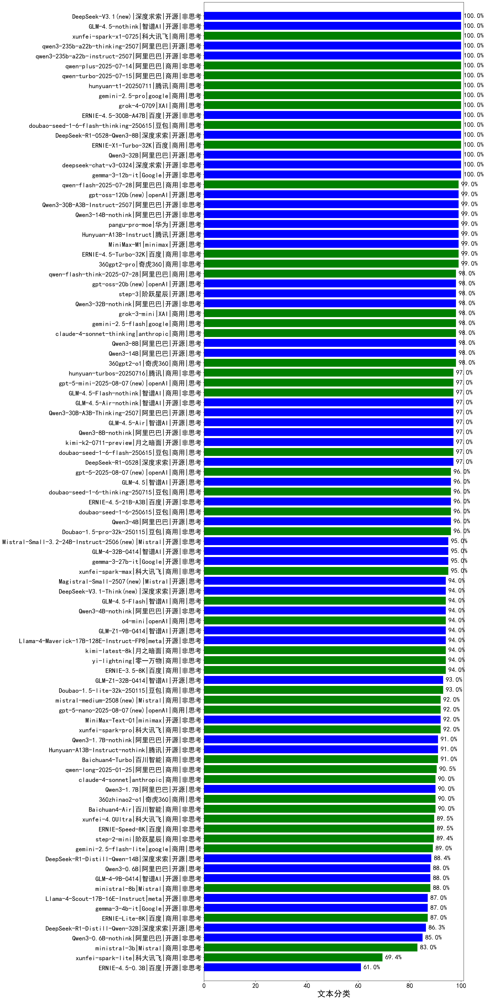

| 类别 |机构| 大模型                         | 文本分类 | 排名 |
|-----|----|--------------------------|---------|----|
|商用|阿里巴巴|qwen-plus-think-2025-04-28|100.0%|1|
|开源|百度|ERNIE-4.5-300B-A47B(new)|100.0%|2|
|商用|google|gemini-2.5-pro-preview-05-06|100.0%|3|
|商用|豆包|Doubao-1.5-thinking-pro|100.0%|4|
|商用|openAI|gpt-4.1|100.0%|5|
|商用|阿里巴巴|qwen-turbo-think-2025-04-28|100.0%|6|
|商用|豆包|doubao-seed-1-6-flash-thinking-250615(new)|100.0%|7|
|商用|豆包|doubao-seed-1-6-thinking-250615(new)|100.0%|8|
|开源|深度求索|DeepSeek-R1-0528-Qwen3-8B|100.0%|9|
|开源|阿里巴巴|Qwen3-32B|100.0%|10|
|开源|深度求索|deepseek-chat-v3-0324|100.0%|11|
|商用|百度|ERNIE-X1-Turbo-32K|100.0%|12|
|开源|Google|gemma-3-12b-it|100.0%|13|
|商用|奇虎360|360gpt2-pro|99.0%|14|
|开源|minimax|MiniMax-M1(new)|99.0%|15|
|开源|腾讯|Hunyuan-A13B-Instruct(new)|99.0%|16|
|商用|智谱AI|GLM-Z1-Air|99.0%|17|
|商用|百度|ERNIE-4.5-Turbo-32K|99.0%|18|
|商用|科大讯飞|xunfei-spark-x1|99.0%|19|
|商用|奇虎360|360gpt2-o1|98.0%|20|
|商用|阶跃星辰|step-r1-v-mini|98.0%|21|
|商用|腾讯|hunyuan-t1-20250529(new)|98.0%|22|
|开源|阿里巴巴|Qwen3-235B-A22B|98.0%|23|
|商用|智谱AI|GLM-Z1-Flash|98.0%|24|
|开源|阿里巴巴|Qwen3-14B|98.0%|25|
|商用|腾讯|hunyuan-t1-20250321|98.0%|26|
|商用|阿里巴巴|qwen-plus-2025-04-28|98.0%|27|
|商用|阿里巴巴|qwen-turbo-2025-04-28|98.0%|28|
|商用|anthropic|claude-4-sonnet-thinking|98.0%|29|
|商用|智谱AI|GLM-Z1-FlashX|97.0%|30|
|开源|阿里巴巴|qwq-32b|97.0%|31|
|商用|豆包|doubao-seed-1-6-flash-250615(new)|97.0%|32|
|商用|奇虎360|360gpt-turbo|97.0%|33|
|开源|深度求索|DeepSeek-R1-0528|97.0%|34|
|商用|腾讯|hunyuan-turbos-20250313|96.0%|35|
|开源|微软|phi-4|96.0%|36|
|商用|豆包|Doubao-1.5-pro-32k-250115|96.0%|37|
|商用|商汤|SenseChat-5-beta|96.0%|38|
|商用|腾讯|hunyuan-turbos-20250604(new)|96.0%|39|
|开源|百度|ERNIE-4.5-21B-A3B(new)|96.0%|40|
|商用|google|gemini-2.5-flash-preview-05-20|96.0%|41|
|开源|阿里巴巴|Qwen3-4B|96.0%|42|
|商用|openAI|gpt-4.1-mini|96.0%|43|
|商用|智谱AI|GLM-Z1-AirX|96.0%|44|
|商用|豆包|doubao-seed-1-6-250615(new)|96.0%|45|
|商用|科大讯飞|xunfei-spark-max|95.0%|46|
|开源|Google|gemma-3-27b-it|95.0%|47|
|商用|阿里巴巴|qwq-plus-2025-03-05|95.0%|48|
|开源|智谱AI|GLM-4-32B-0414|95.0%|49|
|商用|月之暗面|kimi-latest-8k|94.0%|50|
|商用|百度|ERNIE-3.5-8K|94.0%|51|
|商用|商汤|SenseChat-5-1202|94.0%|52|
|开源|智谱AI|GLM-Z1-9B-0414|94.0%|53|
|开源|Meta|Llama-4-Maverick-17B-128E-Instruct-FP8|94.0%|54|
|开源|阿里巴巴|Qwen3-8B|94.0%|55|
|商用|零一万物|yi-lightning|94.0%|56|
|商用|openAI|o4-mini|94.0%|57|
|开源|智谱AI|GLM-Z1-32B-0414|93.0%|58|
|开源|阿里巴巴|Qwen3-30B-A3B|93.0%|59|
|商用|豆包|Doubao-1.5-lite-32k-250115|93.0%|60|
|商用|腾讯|hunyuan-turbo|93.0%|61|
|商用|月之暗面|moonshot-v1-8k|92.6%|62|
|商用|OpenAI|gpt-4o-mini|92.6%|63|
|开源|阿里巴巴|qwen2.5-32b-instruct|92.6%|64|
|开源|阿里巴巴|qwen2.5-72b-instruct|92.6%|65|
|商用|科大讯飞|xunfei-spark-pro|92.0%|66|
|商用|智谱AI|GLM-4-Air|92.0%|67|
|商用|openAI|chatgpt-4o-latest|92.0%|68|
|开源|Mistral|Mistral-Small-3.1-24B-Instruct-2503|92.0%|69|
|开源|minimax|MiniMax-Text-01|92.0%|70|
|商用|智谱AI|GLM-4-AirX|91.0%|71|
|商用|阿里巴巴|qwen2.5-max|91.0%|72|
|商用|智谱AI|GLM-4-Long|91.0%|73|
|商用|Mistral|mistral-small|91.0%|74|
|商用|百川智能|Baichuan4-Turbo|91.0%|75|
|开源|腾讯|hunyuan-large|91.0%|76|
|商用|商汤|SenseChat-Turbo-1202|91.0%|77|
|商用|智谱AI|GLM-4-Flash|91.0%|78|
|商用|阿里巴巴|qwen-long-2025-01-25|90.5%|79|
|商用|百川智能|Baichuan4-Air|90.0%|80|
|商用|奇虎360|360zhinao2-o1|90.0%|81|
|开源|阿里巴巴|Qwen3-1.7B|90.0%|82|
|商用|anthropic|claude-4-sonnet|90.0%|83|
|开源|阿里巴巴|qwen2.5-14b-instruct|89.5%|84|
|商用|阿里巴巴|qwen-plus-2025-01-25|89.5%|85|
|商用|科大讯飞|xunfei-4.0Ultra|89.5%|86|
|商用|百度|ERNIE-Speed-8K|89.5%|87|
|开源|深度求索|DeepSeek-R1|89.4%|88|
|商用|阶跃星辰|step-2-mini|89.4%|89|
|开源|深度求索|DeepSeek-R1-Distill-Qwen-14B|88.4%|90|
|开源|阿里巴巴|Qwen3-0.6B|88.0%|91|
|开源|智谱AI|GLM-4-9B-0414|88.0%|92|
|商用|Mistral|ministral-8b|88.0%|93|
|商用|Mistral|mistral-large|88.0%|94|
|商用|智谱AI|GLM-4-FlashX|88.0%|95|
|开源|上海人工智能实验室|internlm2_5-7b-chat|87.4%|96|
|商用|智谱AI|GLM-4-Plus|87.0%|97|
|商用|腾讯|hunyuan-standard|87.0%|98|
|商用|百度|ERNIE-Lite-8K|87.0%|99|
|开源|Google|gemma-3-4b-it|87.0%|100|
|开源|Meta|Llama-4-Scout-17B-16E-Instruct|87.0%|101|
|开源|深度求索|DeepSeek-R1-Distill-Qwen-32B|86.3%|102|
|开源|阿里巴巴|qwen2.5-7b-instruct|86.3%|103|
|商用|阿里巴巴|qwen-turbo-2025-02-11|84.2%|104|
|开源|阿里巴巴|qwen2.5-3b-instruct|83.2%|105|
|商用|Mistral|ministral-3b|83.0%|106|
|开源|智谱AI|GLM-Z1-Rumination-32B-0414|81.0%|107|
|开源|阿里巴巴|qwen2.5-1.5b-instruct|69.5%|108|
|商用|科大讯飞|xunfei-spark-lite|69.4%|109|
|商用|百度|ERNIE-Tiny-8K|64.0%|110|
|开源|百度|ERNIE-4.5-0.3B(new)|61.0%|111|
|开源|阿里巴巴|qwen2.5-0.5b-instruct|51.6%|112|

