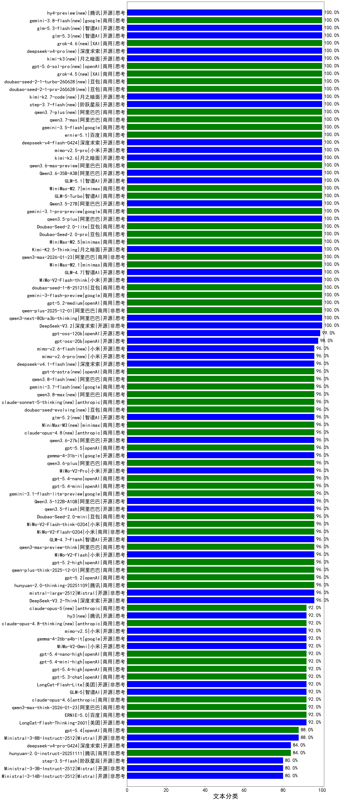

|类别|机构|大模型|【文本分类】准确率|平均耗时|平均消耗token|花费/千次（元）|排名（准确率）|
|---|---|-----|-------------------|-------|-----------|-----------|-----------|
|开源|月之暗面|kimi-k2.6|100.0%|48s|765|19.7|1|
|开源|月之暗面|kimi-k2.7-code|100.0%|16s|689|17.7|2|
|开源|智谱AI|GLM-5.1|100.0%|113s|733|16.8|3|
|开源|阿里巴巴|Qwen3.6-35B-A3B|100.0%|7s|1038|10.8|4|
|商用|阿里巴巴|qwen3.6-max-preview|100.0%|31s|1006|52.1|5|
|开源|小米|mimo-v2.5-pro|100.0%|12s|860|13.9|6|
|开源|深度求索|deepseek-v4-flash-0424|100.0%|29s|1533|3.0|7|
|商用|百度|ernie-5.1|100.0%|41s|523|8.7|8|
|商用|google|gemini-3.5-flash|100.0%|6s|934|56.2|9|
|商用|阿里巴巴|qwen3.7-max|100.0%|18s|925|32.1|10|
|商用|阿里巴巴|qwen3.7-plus|100.0%|15s|749|5.7|11|
|开源|阶跃星辰|step-3.7-flash|100.0%|18s|1061|8.2|12|
|商用|豆包|doubao-seed-2-1-pro-260628|100.0%|311s|5210|154.1|13|
|商用|智谱AI|GLM-5-Turbo|100.0%|14s|753|15.8|14|
|商用|豆包|doubao-seed-2-1-turbo-260628|100.0%|70s|2190|31.7|15|
|商用|XAI|grok-4.5|100.0%|38s|964|33.4|16|
|商用|openAI|gpt-5.6-sol-pro|100.0%|7s|2407|152.3|17|
|开源|月之暗面|kimi-k3(new)|100.0%|67s|1332|123.3|18|
|开源|深度求索|deepseek-v4-pro(new)|100.0%|654s|848|20.7|19|
|商用|XAI|grok-4.6(new)|100.0%|19s|1130|40.4|20|
|开源|智谱AI|glm-5.3(new)|100.0%|19s|557|14.5|21|
|开源|智谱AI|glm-5.3-flash(new)|100.0%|29s|864|2.3|22|
|商用|google|gemini-3.8-flash(new)|100.0%|20s|730|36.2|23|
|开源|腾讯|hy4-preview(new)|100.0%|42s|2767|49.1|24|
|商用|minimax|MiniMax-M2.7|100.0%|19s|673|5.2|25|
|商用|XAI|grok-4.7(new)|100.0%|9s|1835|41.0|26|
|开源|月之暗面|Kimi-K2.5-Thinking|100.0%|162s|879|17.7|27|
|商用|阿里巴巴|qwen3-max-2026-01-23|100.0%|26s|214|1.8|28|
|商用|豆包|Doubao-Seed-2.0-lite|100.0%|130s|653|2.1|29|
|开源|阿里巴巴|qwen3.5-plus|100.0%|26s|2078|9.8|30|
|商用|minimax|MiniMax-M2.5|100.0%|12s|618|4.7|31|
|商用|google|gemini-3.1-pro-preview|100.0%|62s|1024|83.7|32|
|开源|阿里巴巴|Qwen3.5-27B|100.0%|336s|2400|11.3|33|
|商用|豆包|Doubao-Seed-2.0-pro|100.0%|193s|880|12.9|34|
|开源|深度求索|DeepSeek-V3.2|100.0%|77s|264|0.8|35|
|开源|openAI|gpt-oss-120b|99.0%|2s|478|1.3|36|
|开源|openAI|gpt-oss-20b|98.0%|3s|584|0.6|37|
|开源|小米|mimo-v2.6-pro(new)|96.0%|111s|456|2.6|38|
|商用|openAI|gpt-6-sol(new)|96.0%|59s|169|8.3|39|
|商用|小米|MiMo-V2-Flash-0204|96.0%|219s|340|0.6|40|
|商用|openAI|gpt-6-luna(new)|96.0%|124s|237|0.7|41|
|开源|智谱AI|glm-5.2|96.0%|20s|889|23.8|42|
|开源|小米|mimo-v2.6-flash(new)|96.0%|20s|695|1.3|43|
|商用|豆包|doubao-seed-evolving|96.0%|243s|5421|160.4|44|
|商用|openAI|gpt-6-astra(new)|96.0%|14s|184|46.9|45|
|开源|深度求索|DeepSeek-V3.2-Think|96.0%|165s|1255|3.7|46|
|商用|阿里巴巴|qwen3.8-max(new)|96.0%|40s|1662|57.7|47|
|商用|minimax|MiniMax-M3|96.0%|23s|692|8.9|48|
|商用|google|gemini-3.7-flash(new)|96.0%|4s|701|17.4|49|
|开源|深度求索|deepseek-v4.1-flash(new)|96.0%|30s|2836|22.3|50|
|商用|阿里巴巴|qwen3.8-flash(new)|96.0%|7s|320|0.7|51|
|商用|anthropic|claude-sonnet-5-thinking|96.0%|15s|535|32.5|52|
|商用|小米|MiMo-V2-Flash-think-0204|96.0%|1037s|1991|4.1|53|
|商用|anthropic|claude-opus-4.8|96.0%|8s|407|59.0|54|
|开源|阿里巴巴|qwen3.5-flash|96.0%|113s|1978|3.9|55|
|商用|openAI|gpt-5.4-mini|96.0%|7s|133|2.6|56|
|商用|openAI|gpt-5.4-nano|96.0%|39s|132|0.7|57|
|开源|小米|MiMo-V2-Pro|96.0%|10s|768|12.0|58|
|商用|阿里巴巴|qwen3.6-plus|96.0%|46s|1274|14.8|59|
|开源|google|gemma-4-31b-it|96.0%|28s|136|0.3|60|
|商用|google|gemini-3.1-flash-lite-preview|96.0%|4s|161|1.3|61|
|开源|阿里巴巴|Qwen3.5-122B-A10B|96.0%|296s|1960|12.3|62|
|商用|openAI|gpt-5.5|96.0%|18s|229|37.0|63|
|商用|豆包|Doubao-Seed-2.0-mini|96.0%|37s|858|1.5|64|
|开源|阿里巴巴|qwen3.6-27b|96.0%|25s|1290|22.5|65|
|商用|百度|ERNIE-5.0|92.0%|61s|1059|24.7|66|
|商用|anthropic|claude-opus-4.8-thinking|92.0%|7s|479|71.5|67|
|商用|openAI|gpt-5.4-mini-high|92.0%|27s|501|14.1|68|
|商用|openAI|gpt-5.4-nano-high|92.0%|11s|199|1.3|69|
|商用|openAI|gpt-5.3-chat|92.0%|36s|142|8.5|70|
|开源|小米|MiMo-V2-Omni|92.0%|362s|946|10.0|71|
|开源|美团|LongCat-Flash-Lite|92.0%|46s|186|0.0|72|
|开源|腾讯|hy3|92.0%|19s|179|0.6|73|
|开源|智谱AI|GLM-5|92.0%|49s|1248|21.8|74|
|开源|google|gemma-4-26b-a4b-it|92.0%|9s|178|0.4|75|
|商用|阿里巴巴|qwen3-max-think-2026-01-23|92.0%|107s|2913|28.7|76|
|开源|小米|mimo-v2.5|92.0%|14s|1078|11.8|77|
|商用|anthropic|claude-opus-5(new)|92.0%|12s|711|112.1|78|
|商用|anthropic|claude-opus-4.6|92.0%|8s|353|49.1|79|
|商用|openAI|gpt-5.4-high|92.0%|7s|336|29.8|80|
|商用|openAI|gpt-5.4|88.0%|4s|174|12.7|81|
|开源|深度求索|deepseek-v4-pro-0424|84.0%|11s|405|9.2|82|
|开源|阶跃星辰|step-3.5-flash|80.0%|15s|1253|2.6|83|

