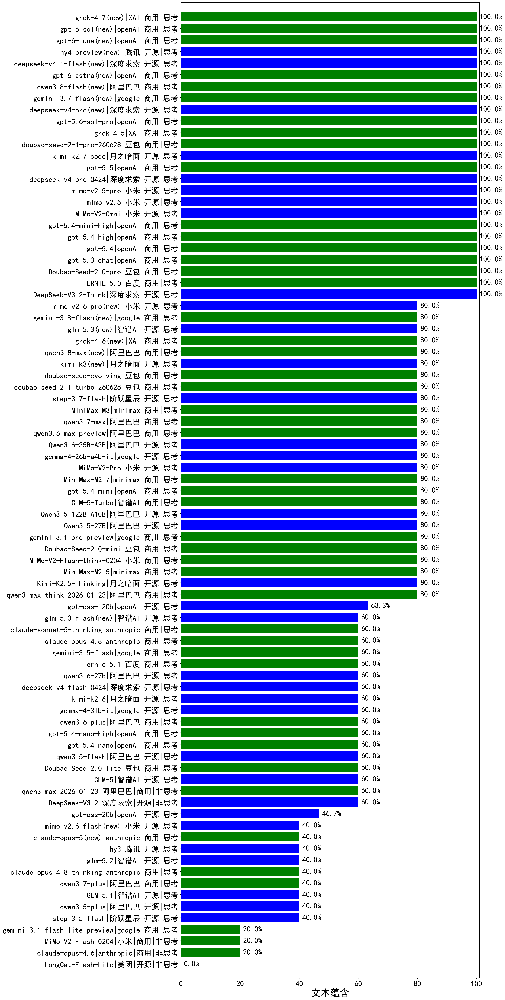

|类别|机构|大模型|【文本蕴含】准确率|平均耗时|平均消耗token|花费/千次（元）|排名（准确率）|
|---|---|-----|-------------------|-------|-----------|-----------|-----------|
|商用|openAI|gpt-6-sol(new)|100.0%|120s|208|10.5|1|
|商用|google|gemini-3.7-flash(new)|100.0%|4s|464|11.0|2|
|开源|月之暗面|kimi-k2.7-code|100.0%|11s|321|7.6|3|
|商用|openAI|gpt-5.5|100.0%|5s|271|44.2|4|
|开源|深度求索|deepseek-v4-pro-0424|100.0%|33s|1025|24.0|5|
|商用|豆包|doubao-seed-2-1-pro-260628|100.0%|578s|13477|402.0|6|
|开源|小米|mimo-v2.5-pro|100.0%|23s|1402|25.2|7|
|开源|小米|mimo-v2.5|100.0%|25s|1646|19.7|8|
|商用|XAI|grok-4.5|100.0%|112s|1535|57.1|9|
|商用|openAI|gpt-5.6-sol-pro|100.0%|11s|2558|163.3|10|
|开源|小米|MiMo-V2-Omni|100.0%|494s|1297|14.8|11|
|商用|openAI|gpt-5.4-mini-high|100.0%|20s|446|12.2|12|
|商用|openAI|gpt-5.4-high|100.0%|7s|452|41.1|13|
|商用|openAI|gpt-5.3-chat|100.0%|7s|386|31.7|14|
|开源|深度求索|deepseek-v4-pro(new)|100.0%|25s|994|24.5|15|
|商用|openAI|gpt-5.4|100.0%|6s|275|22.6|16|
|开源|深度求索|deepseek-v4.1-flash(new)|100.0%|4s|763|5.6|17|
|商用|豆包|Doubao-Seed-2.0-pro|100.0%|347s|1493|22.6|18|
|开源|腾讯|hy4-preview(new)|100.0%|47s|1956|34.4|19|
|商用|openAI|gpt-6-luna(new)|100.0%|189s|266|0.7|20|
|开源|深度求索|DeepSeek-V3.2-Think|100.0%|183s|1119|3.3|21|
|商用|百度|ERNIE-5.0|100.0%|110s|2165|51.1|22|
|商用|阿里巴巴|qwen3.8-flash(new)|100.0%|20s|592|1.4|23|
|商用|openAI|gpt-6-astra(new)|100.0%|15s|184|44.3|24|
|商用|阿里巴巴|qwen3.6-max-preview|80.0%|47s|1456|76.1|25|
|开源|google|gemma-4-26b-a4b-it|80.0%|15s|468|1.2|26|
|商用|豆包|doubao-seed-evolving|80.0%|330s|12189|363.4|27|
|开源|阿里巴巴|Qwen3.6-35B-A3B|80.0%|9s|1568|16.4|28|
|开源|智谱AI|glm-5.3(new)|80.0%|166s|5429|150.8|29|
|商用|豆包|doubao-seed-2-1-turbo-260628|80.0%|265s|10255|152.7|30|
|开源|月之暗面|Kimi-K2.5-Thinking|80.0%|453s|2248|46.3|31|
|开源|小米|mimo-v2.6-pro(new)|80.0%|32s|1091|6.4|32|
|开源|阶跃星辰|step-3.7-flash|80.0%|28s|2980|23.7|33|
|商用|阿里巴巴|qwen3-max-think-2026-01-23|80.0%|127s|3511|34.7|34|
|开源|小米|MiMo-V2-Pro|80.0%|342s|1345|24.1|35|
|商用|豆包|Doubao-Seed-2.0-mini|80.0%|677s|2949|5.7|36|
|商用|minimax|MiniMax-M2.7|80.0%|38s|1428|11.4|37|
|开源|月之暗面|kimi-k3(new)|80.0%|43s|1110|100.5|38|
|商用|阿里巴巴|qwen3.8-max(new)|80.0%|59s|2365|82.9|39|
|商用|minimax|MiniMax-M2.5|80.0%|30s|1526|12.3|40|
|商用|openAI|gpt-5.4-mini|80.0%|10s|192|4.2|41|
|商用|智谱AI|GLM-5-Turbo|80.0%|26s|960|20.2|42|
|商用|google|gemini-3.8-flash(new)|80.0%|13s|779|38.5|43|
|商用|阿里巴巴|qwen3.7-max|80.0%|20s|879|30.3|44|
|商用|小米|MiMo-V2-Flash-think-0204|80.0%|478s|1661|3.4|45|
|开源|阿里巴巴|Qwen3.5-122B-A10B|80.0%|253s|3702|23.4|46|
|开源|阿里巴巴|Qwen3.5-27B|80.0%|370s|3483|16.5|47|
|商用|XAI|grok-4.6(new)|80.0%|30s|1550|57.8|48|
|商用|google|gemini-3.1-pro-preview|80.0%|25s|1143|93.3|49|
|商用|minimax|MiniMax-M3|80.0%|28s|797|10.6|50|
|开源|openAI|gpt-oss-120b|63.3%|240s|450|1.1|51|
|商用|anthropic|claude-opus-4.8|60.0%|6s|387|54.2|52|
|开源|google|gemma-4-31b-it|60.0%|38s|364|0.9|53|
|开源|深度求索|DeepSeek-V3.2|60.0%|82s|435|1.3|54|
|商用|阿里巴巴|qwen3-max-2026-01-23|60.0%|121s|456|4.1|55|
|开源|智谱AI|GLM-5|60.0%|64s|2201|38.9|56|
|开源|智谱AI|glm-5.3-flash(new)|60.0%|94s|1513|4.1|57|
|商用|豆包|Doubao-Seed-2.0-lite|60.0%|255s|1141|3.8|58|
|开源|阿里巴巴|qwen3.5-flash|60.0%|474s|5778|11.5|59|
|商用|openAI|gpt-5.4-nano|60.0%|6s|185|1.1|60|
|商用|google|gemini-3.5-flash|60.0%|13s|1638|100.2|61|
|商用|openAI|gpt-5.4-nano-high|60.0%|12s|277|1.9|62|
|商用|阿里巴巴|qwen3.6-plus|60.0%|29s|1512|17.6|63|
|开源|月之暗面|kimi-k2.6|60.0%|69s|1219|31.8|64|
|开源|阿里巴巴|qwen3.6-27b|60.0%|27s|1584|27.6|65|
|商用|anthropic|claude-sonnet-5-thinking|60.0%|11s|545|32.8|66|
|开源|深度求索|deepseek-v4-flash-0424|60.0%|28s|1111|2.2|67|
|商用|百度|ernie-5.1|60.0%|23s|915|15.6|68|
|开源|openAI|gpt-oss-20b|46.7%|238s|613|0.6|69|
|商用|阿里巴巴|qwen3.7-plus|40.0%|48s|2400|18.9|70|
|开源|小米|mimo-v2.6-flash(new)|40.0%|45s|806|1.6|71|
|开源|阶跃星辰|step-3.5-flash|40.0%|21s|3417|7.1|72|
|商用|anthropic|claude-opus-4.8-thinking|40.0%|11s|695|108.2|73|
|开源|腾讯|hy3|40.0%|148s|164|0.5|74|
|开源|智谱AI|glm-5.2|40.0%|34s|1092|29.4|75|
|开源|阿里巴巴|qwen3.5-plus|40.0%|61s|4680|22.2|76|
|开源|智谱AI|GLM-5.1|40.0%|114s|1161|26.9|77|
|商用|anthropic|claude-opus-5(new)|40.0%|9s|537|80.4|78|
|商用|小米|MiMo-V2-Flash-0204|20.0%|62s|303|0.5|79|
|商用|anthropic|claude-opus-4.6|20.0%|18s|442|63.6|80|
|商用|google|gemini-3.1-flash-lite-preview|20.0%|2s|282|2.5|81|
|开源|美团|LongCat-Flash-Lite|0.0%|163s|210|0.0|82|

