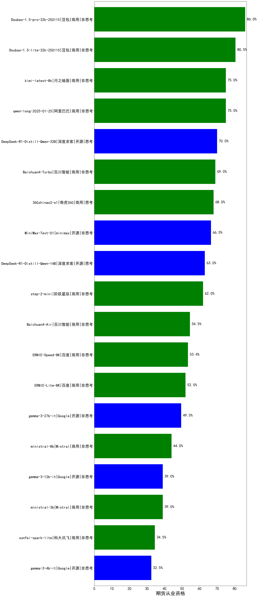

|类别|机构|大模型|【期货从业资格】准确率|平均耗时|平均消耗token|花费/千次（元）|排名（准确率）|
|---|---|-----|-------------------|-------|-----------|-----------|-----------|
|商用|豆包|Doubao-1.5-pro-32k-250115|86.0%|11s|323|0.6|1|
|商用|科大讯飞|xunfei-spark-max|84.0%|8s|189|5.7|2|
|商用|科大讯飞|xunfei-4.0Ultra|83.0%|7s|193|13.5|3|
|商用|豆包|Doubao-1.5-lite-32k-250115|80.5%|6s|212|0.1|4|
|商用|阿里巴巴|qwen-long-2025-01-25|75.0%|151s|423|0.7|5|
|商用|月之暗面|kimi-latest-8k|75.0%|17s|491|5.9|6|
|商用|奇虎360|360gpt2-pro|73.5%|16s|369|1.5|7|
|商用|科大讯飞|xunfei-spark-pro|71.5%|/|/|/|8|
|商用|奇虎360|360gpt2-o1|71.0%|18s|422|18.7|9|
|开源|深度求索|DeepSeek-R1-Distill-Qwen-32B|70.0%|58s|1685|2.1|10|
|商用|百川智能|Baichuan4-Turbo|69.0%|/|/|/|11|
|商用|奇虎360|360zhinao2-o1|68.0%|/|/|/|12|
|开源|minimax|MiniMax-Text-01|66.5%|14s|925|7.4|13|
|商用|零一万物|yi-lightning|66.0%|/|/|/|14|
|开源|深度求索|DeepSeek-R1-Distill-Qwen-14B|63.0%|/|/|/|15|
|商用|阶跃星辰|step-2-mini|62.0%|8s|321|0.6|16|
|商用|百度|ERNIE-3.5-8K|60.0%|25s|504|0.9|17|
|商用|百川智能|Baichuan4-Air|54.5%|/|/|/|18|
|商用|百度|ERNIE-Speed-8K|53.4%|/|/|/|19|
|商用|百度|ERNIE-Lite-8K|52.0%|/|/|/|20|
|开源|Google|gemma-3-27b-it|49.5%|/|/|/|21|
|商用|Mistral|ministral-8b|44.0%|/|/|/|22|
|商用|Mistral|ministral-3b|39.0%|/|/|/|23|
|开源|Google|gemma-3-12b-it|39.0%|/|/|/|24|
|商用|科大讯飞|xunfei-spark-lite|34.5%|/|/|/|25|
|开源|Google|gemma-3-4b-it|32.5%|/|/|/|26|
|开源|深度求索|deepseek-chat-v3-0324|nan%|164s|524|3.8|27|
|开源|meta|Llama-4-Scout-17B-16E-Instruct|nan%|9s|541|1.1|28|
|开源|meta|Llama-4-Maverick-17B-128E-Instruct-FP8|nan%|7s|555|2.2|29|
|开源|智谱AI|GLM-4-9B-0414|nan%|10s|342|0.0|30|
|开源|智谱AI|GLM-Z1-9B-0414|nan%|81s|3134|0.0|31|
|开源|智谱AI|GLM-4-32B-0414|nan%|13s|394|0.7|32|
|开源|智谱AI|GLM-Z1-32B-0414|nan%|102s|2127|8.3|33|
|开源|阿里巴巴|Qwen3-32B|nan%|16s|731|2.7|34|
|开源|阿里巴巴|Qwen3-14B|nan%|31s|868|1.6|35|
|开源|阿里巴巴|Qwen3-8B|nan%|1021s|12246|0.0|36|
|开源|阿里巴巴|Qwen3-4B|nan%|20s|1062|3.0|37|
|开源|阿里巴巴|Qwen3-1.7B|nan%|10s|1200|3.4|38|
|开源|阿里巴巴|Qwen3-0.6B|nan%|15s|2400|7.0|39|
|商用|openAI|o4-mini|nan%|33s|845|25.2|40|
|开源|深度求索|DeepSeek-R1-0528|nan%|264s|2710|42.6|41|
|商用|百度|ERNIE-4.5-Turbo-32K|nan%|26s|500|1.5|42|
|商用|百度|ERNIE-X1-Turbo-32K|nan%|69s|1678|6.5|43|
|开源|深度求索|DeepSeek-R1-0528-Qwen3-8B|nan%|169s|2897|0.0|44|
|商用|anthropic|claude-4-sonnet|nan%|98s|443|39.8|45|
|商用|anthropic|claude-4-sonnet-thinking|nan%|33s|971|97.2|46|
|商用|豆包|doubao-seed-1-6-flash-250615|nan%|5s|510|0.7|47|
|商用|豆包|doubao-seed-1-6-flash-thinking-250615|nan%|10s|1199|1.6|48|
|商用|豆包|doubao-seed-1-6-250615|nan%|101s|368|2.2|49|
|开源|minimax|MiniMax-M1|nan%|391s|5442|40.3|50|
|开源|百度|ERNIE-4.5-0.3B|nan%|42s|314|0.0|51|
|开源|百度|ERNIE-4.5-21B-A3B|nan%|51s|593|0.0|52|
|开源|百度|ERNIE-4.5-300B-A47B|nan%|24s|490|3.4|53|
|开源|腾讯|Hunyuan-A13B-Instruct|nan%|75s|1253|4.8|54|
|商用|google|gemini-2.5-flash|nan%|10s|1553|26.9|55|
|商用|XAI|grok-4-0709|nan%|181s|1131|117.1|56|
|商用|XAI|grok-3-mini|nan%|226s|884|3.1|57|
|商用|google|gemini-2.5-pro|nan%|22s|1976|138.2|58|
|开源|月之暗面|kimi-k2-0711-preview|nan%|15s|274|3.7|59|
|商用|腾讯|hunyuan-t1-20250711|nan%|16s|1087|4.0|60|
|开源|华为|pangu-pro-moe|nan%|92s|1654|6.4|61|
|商用|阿里巴巴|qwen-turbo-2025-07-15|nan%|9s|447|0.2|62|
|商用|阿里巴巴|qwen-plus-2025-07-14|nan%|11s|484|0.9|63|
|开源|腾讯|Hunyuan-A13B-Instruct-nothink|nan%|313s|407|1.4|64|
|开源|阿里巴巴|qwen3-235b-a22b-instruct-2507|nan%|9s|481|3.3|65|
|商用|豆包|doubao-seed-1-6-thinking-250715|nan%|34s|1136|8.4|66|
|开源|阿里巴巴|qwen3-235b-a22b-thinking-2507|nan%|47s|2151|41.5|67|
|商用|科大讯飞|xunfei-spark-x1-0725|nan%|/|994|11.9|68|
|开源|阿里巴巴|Qwen3-0.6B-nothink|nan%|5s|309|0.7|69|
|开源|阿里巴巴|Qwen3-1.7B-nothink|nan%|17s|523|1.3|70|
|开源|阿里巴巴|Qwen3-4B-nothink|nan%|27s|514|1.3|71|
|开源|阿里巴巴|Qwen3-8B-nothink|nan%|22s|526|0.0|72|
|开源|阿里巴巴|Qwen3-14B-nothink|nan%|24s|581|1.0|73|
|开源|阿里巴巴|Qwen3-32B-nothink|nan%|21s|551|1.9|74|
|商用|智谱AI|GLM-4.5-Flash|nan%|60s|3458|0.0|75|
|开源|智谱AI|GLM-4.5-Air|nan%|50s|2583|15.1|76|
|开源|智谱AI|GLM-4.5|nan%|260s|4424|61.1|77|
|开源|阿里巴巴|Qwen3-30B-A3B-Instruct-2507|nan%|6s|551|1.5|78|
|开源|阿里巴巴|Qwen3-30B-A3B-Thinking-2507|nan%|78s|2813|7.7|79|
|开源|阶跃星辰|step-3|nan%|136s|2603|10.2|80|
|开源|智谱AI|GLM-4.5-nothink|nan%|398s|13637|190.0|81|
|开源|智谱AI|GLM-4.5-Air-nothink|nan%|253s|13707|81.8|82|
|商用|智谱AI|GLM-4.5-Flash-nothink|nan%|16s|1045|0.0|83|
|开源|openAI|gpt-oss-120b(new)|nan%|4s|620|1.7|84|
|开源|openAI|gpt-oss-20b(new)|nan%|5s|903|0.9|85|
|商用|openAI|gpt-5-2025-08-07(new)|nan%|27s|394|23.2|86|
|商用|openAI|gpt-5-mini-2025-08-07(new)|nan%|30s|613|7.8|87|
|商用|openAI|gpt-5-nano-2025-08-07(new)|nan%|63s|1870|5.2|88|
|商用|腾讯|hunyuan-turbos-20250716|nan%|21s|1084|2.0|89|
|商用|阿里巴巴|qwen-flash-2025-07-28|nan%|6s|527|0.7|90|
|商用|阿里巴巴|qwen-flash-think-2025-07-28|nan%|56s|2548|3.7|91|
|开源|深度求索|DeepSeek-V3.1(new)|nan%|14s|289|2.9|92|
|开源|深度求索|DeepSeek-V3.1-Think(new)|nan%|77s|1486|17.2|93|
|商用|google|gemini-2.5-flash-lite|nan%|42s|13530|39.1|94|
|商用|Mistral|mistral-medium-2508(new)|nan%|24s|434|5.0|95|
|开源|Mistral|Magistral-Small-2507(new)|nan%|75s|7367|79.3|96|
|开源|Mistral|Mistral-Small-3.2-24B-Instruct-2506(new)|nan%|20s|909|1.8|97|
|商用|阿里巴巴|qwen-plus-2025-07-28(new)|nan%|12s|515|0.9|98|
|商用|阿里巴巴|qwen-plus-think-2025-07-28(new)|nan%|/|1936|14.9|99|
|商用|阿里巴巴|qwen-turbo-think-2025-07-15(new)|nan%|/|3485|10.2|100|
|商用|阿里巴巴|qwen3-max-preview(new)|nan%|10s|505|10.6|101|

