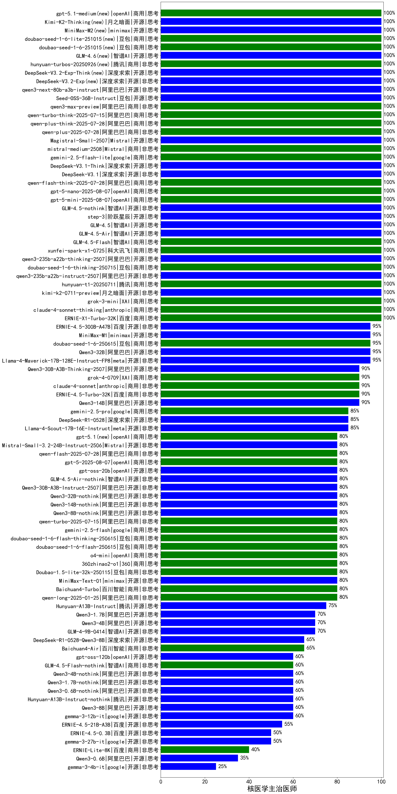

|类别|机构|大模型|【核医学主治医师】准确率|平均耗时|平均消耗token|花费/千次（元）|排名（准确率）|
|---|---|-----|-------------------|-------|-----------|-----------|-----------|
|商用|anthropic|claude-opus-4.5(new)|100.0%|25s|759|120.5|1|
|开源|智谱AI|GLM-4.6(new)|100.0%|69s|2136|29.1|2|
|商用|openAI|gpt-5-nano-2025-08-07|100.0%|26s|1500|4.1|3|
|开源|深度求索|DeepSeek-V3.2-Exp-Think(new)|100.0%|487s|1109|3.3|4|
|开源|深度求索|DeepSeek-V3.2-Exp(new)|100.0%|104s|374|1.1|5|
|商用|XAI|grok-3-mini|100.0%|154s|983|3.4|6|
|开源|月之暗面|kimi-k2-0711-preview|100.0%|33s|610|8.8|7|
|商用|腾讯|hunyuan-t1-20250711|100.0%|23s|1426|5.4|8|
|开源|阿里巴巴|qwen3-next-80b-a3b-instruct|100.0%|12s|524|1.9|9|
|开源|豆包|Seed-OSS-36B-Instruct|100.0%|53s|1163|4.5|10|
|开源|阿里巴巴|qwen3-235b-a22b-instruct-2507|100.0%|13s|529|3.8|11|
|商用|豆包|doubao-seed-1-6-thinking-250715|100.0%|20s|1003|7.5|12|
|开源|阿里巴巴|qwen3-235b-a22b-thinking-2507|100.0%|19s|1518|29.0|13|
|商用|科大讯飞|xunfei-spark-x1-0725|100.0%|/|858|10.3|14|
|商用|阿里巴巴|qwen3-max-preview|100.0%|11s|487|10.3|15|
|商用|阿里巴巴|qwen-turbo-think-2025-07-15|100.0%|/|1575|4.5|16|
|商用|阿里巴巴|qwen-plus-think-2025-07-28|100.0%|/|1440|11.0|17|
|商用|阿里巴巴|qwen-plus-2025-07-28|100.0%|13s|516|0.9|18|
|开源|Mistral|Magistral-Small-2507|100.0%|42s|4150|44.4|19|
|商用|智谱AI|GLM-4.5-Flash|100.0%|20s|1084|0.0|20|
|开源|智谱AI|GLM-4.5-Air|100.0%|24s|1199|6.8|21|
|开源|智谱AI|GLM-4.5|100.0%|37s|1303|17.5|22|
|商用|Mistral|mistral-medium-2508|100.0%|18s|437|5.2|23|
|开源|阶跃星辰|step-3|100.0%|68s|1371|5.3|24|
|开源|智谱AI|GLM-4.5-nothink|100.0%|30s|1011|13.4|25|
|商用|google|gemini-2.5-flash-lite|100.0%|2s|416|1.1|26|
|开源|深度求索|DeepSeek-V3.1-Think|100.0%|39s|780|8.8|27|
|开源|深度求索|DeepSeek-V3.1|100.0%|15s|314|3.3|28|
|商用|阿里巴巴|qwen-flash-think-2025-07-28|100.0%|18s|1806|2.6|29|
|商用|腾讯|hunyuan-turbos-20250926(new)|100.0%|14s|591|1.1|30|
|商用|openAI|gpt-5-mini-2025-08-07|100.0%|24s|1042|14.0|31|
|商用|百度|ERNIE-X1-Turbo-32K|100.0%|77s|1807|7.0|32|
|开源|minimax|MiniMax-M2(new)|100.0%|49s|3454|28.4|33|
|商用|anthropic|claude-haiku-4.5-thinking(new)|100.0%|38s|1587|53.3|34|
|商用|openAI|gpt-5.1-medium(new)|100.0%|66s|465|27.7|35|
|商用|google|gemini-3-pro-preview(new)|100.0%|64s|1119|90.6|36|
|开源|月之暗面|Kimi-K2-Thinking(new)|100.0%|98s|1508|23.3|37|
|开源|月之暗面|kimi-k2-0905(new)|100.0%|86s|414|5.6|38|
|商用|openAI|gpt-5.1-high(new)|100.0%|144s|1463|98.6|39|
|商用|XAI|grok-4-1-fast-reasoning(new)|100.0%|91s|817|2.4|40|
|商用|anthropic|claude-sonnet-4.5-thinking(new)|100.0%|22s|1447|145.9|41|
|商用|百度|ERNIE-X1.1-Preview(new)|100.0%|87s|571|2.1|42|
|商用|anthropic|claude-4-sonnet-thinking|100.0%|50s|1077|104.8|43|
|商用|百度|ERNIE-5.0-Thinking-Preview(new)|100.0%|81s|1244|28.8|44|
|商用|豆包|doubao-seed-1-6-lite-251015(new)|100.0%|35s|691|1.5|45|
|商用|豆包|doubao-seed-1-6-251015(new)|100.0%|6s|654|4.6|46|
|开源|阿里巴巴|Qwen3-32B|95.0%|24s|722|2.6|47|
|开源|meta|Llama-4-Maverick-17B-128E-Instruct-FP8|95.0%|9s|466|1.8|48|
|开源|minimax|MiniMax-M1|95.0%|54s|1341|7.5|49|
|开源|百度|ERNIE-4.5-300B-A47B|95.0%|18s|366|2.4|50|
|商用|豆包|doubao-seed-1-6-250615|95.0%|7s|464|2.9|51|
|开源|阿里巴巴|Qwen3-30B-A3B-Thinking-2507|90.0%|55s|2401|6.5|52|
|商用|百度|ERNIE-4.5-Turbo-32K|90.0%|24s|602|1.8|53|
|商用|anthropic|claude-4-sonnet|90.0%|42s|583|51.0|54|
|商用|XAI|grok-4-0709|90.0%|367s|990|99.2|55|
|开源|阿里巴巴|Qwen3-14B|90.0%|22s|729|1.3|56|
|开源|meta|Llama-4-Scout-17B-16E-Instruct|85.0%|9s|594|1.2|57|
|开源|深度求索|DeepSeek-R1-0528|85.0%|238s|2107|32.8|58|
|商用|google|gemini-2.5-pro|85.0%|32s|2285|160.4|59|
|开源|Mistral|Mistral-Small-3.2-24B-Instruct-2506|80.0%|13s|626|1.2|60|
|商用|anthropic|claude-haiku-4.5(new)|80.0%|7s|614|18.8|61|
|商用|XAI|grok-4-1-fast-non-reasoning(new)|80.0%|77s|581|1.6|62|
|商用|openAI|gpt-5.1(new)|80.0%|151s|246|12.2|63|
|商用|anthropic|claude-sonnet-4.5(new)|80.0%|9s|598|56.1|64|
|商用|阿里巴巴|qwen-flash-2025-07-28|80.0%|8s|520|0.7|65|
|商用|阿里巴巴|qwen-long-2025-01-25|80.0%|12s|371|0.6|66|
|商用|openAI|gpt-5-2025-08-07|80.0%|68s|314|17.7|67|
|商用|阿里巴巴|qwen-turbo-2025-07-15|80.0%|7s|366|0.2|68|
|商用|百川智能|Baichuan4-Turbo|80.0%|/|/|/|69|
|开源|minimax|MiniMax-Text-01|80.0%|18s|911|7.3|70|
|商用|豆包|Doubao-1.5-lite-32k-250115|80.0%|5s|191|0.1|71|
|商用|360|360zhinao2-o1|80.0%|/|/|/|72|
|商用|openAI|o4-mini|80.0%|34s|756|21.5|73|
|商用|豆包|doubao-seed-1-6-flash-250615|80.0%|4s|357|0.4|74|
|开源|openAI|gpt-oss-20b|80.0%|220s|1055|1.1|75|
|商用|google|gemini-2.5-flash|80.0%|9s|1682|29.2|76|
|商用|豆包|doubao-seed-1-6-flash-thinking-250615|80.0%|7s|685|0.9|77|
|开源|阿里巴巴|Qwen3-32B-nothink|80.0%|18s|536|1.9|78|
|开源|阿里巴巴|Qwen3-14B-nothink|80.0%|12s|605|1.1|79|
|开源|智谱AI|GLM-4.5-Air-nothink|80.0%|17s|979|5.5|80|
|开源|阿里巴巴|Qwen3-30B-A3B-Instruct-2507|80.0%|5s|517|1.4|81|
|开源|阿里巴巴|Qwen3-8B-nothink|80.0%|25s|526|0.0|82|
|开源|腾讯|Hunyuan-A13B-Instruct|75.0%|52s|1105|4.2|83|
|开源|智谱AI|GLM-4-9B-0414|70.0%|9s|490|0.0|84|
|开源|阿里巴巴|Qwen3-4B|70.0%|20s|1095|3.0|85|
|开源|阿里巴巴|Qwen3-1.7B|70.0%|14s|1369|3.9|86|
|开源|深度求索|DeepSeek-R1-0528-Qwen3-8B|65.0%|256s|1841|0.0|87|
|商用|百川智能|Baichuan4-Air|65.0%|/|/|/|88|
|开源|腾讯|Hunyuan-A13B-Instruct-nothink|60.0%|22s|475|1.7|89|
|开源|阿里巴巴|Qwen3-8B|60.0%|600s|12559|0.0|90|
|开源|google|gemma-3-12b-it|60.0%|/|/|/|91|
|开源|阿里巴巴|Qwen3-4B-nothink|60.0%|20s|494|1.3|92|
|开源|阿里巴巴|Qwen3-1.7B-nothink|60.0%|24s|485|1.2|93|
|商用|智谱AI|GLM-4.5-Flash-nothink|60.0%|22s|956|0.0|94|
|开源|openAI|gpt-oss-120b|60.0%|5s|688|1.9|95|
|开源|阿里巴巴|Qwen3-0.6B-nothink|60.0%|9s|325|0.8|96|
|开源|百度|ERNIE-4.5-21B-A3B|55.0%|4s|364|0.0|97|
|开源|百度|ERNIE-4.5-0.3B|50.0%|3s|440|0.0|98|
|开源|google|gemma-3-27b-it|50.0%|/|/|/|99|
|商用|百度|ERNIE-Lite-8K|40.0%|/|/|/|100|
|开源|阿里巴巴|Qwen3-0.6B|35.0%|6s|1132|3.2|101|
|开源|google|gemma-3-4b-it|25.0%|/|/|/|102|

