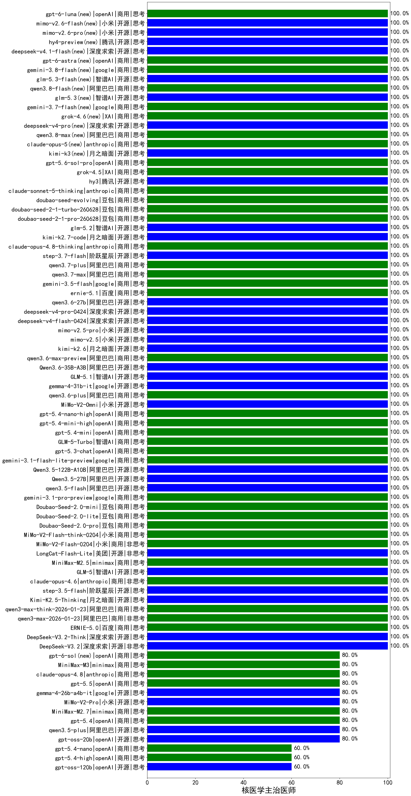

|类别|机构|大模型|【核医学主治医师】准确率|平均耗时|平均消耗token|花费/千次（元）|排名（准确率）|
|---|---|-----|-------------------|-------|-----------|-----------|-----------|
|开源|月之暗面|kimi-k2.6|100.0%|58s|1414|36.8|1|
|商用|阿里巴巴|qwen3.7-plus|100.0%|21s|1087|8.3|2|
|商用|豆包|doubao-seed-evolving|100.0%|155s|4461|131.3|3|
|商用|豆包|doubao-seed-2-1-turbo-260628|100.0%|120s|4645|68.4|4|
|商用|豆包|doubao-seed-2-1-pro-260628|100.0%|441s|8301|246.5|5|
|开源|智谱AI|glm-5.2|100.0%|87s|1330|35.8|6|
|开源|月之暗面|kimi-k2.7-code|100.0%|69s|1015|26.0|7|
|商用|anthropic|claude-opus-4.8-thinking|100.0%|27s|723|112.3|8|
|开源|阶跃星辰|step-3.7-flash|100.0%|16s|1153|8.8|9|
|商用|阿里巴巴|qwen3.7-max|100.0%|38s|1256|43.5|10|
|开源|腾讯|hy3|100.0%|232s|225|0.7|11|
|商用|google|gemini-3.5-flash|100.0%|11s|1309|78.9|12|
|商用|百度|ernie-5.1|100.0%|19s|767|12.9|13|
|开源|阿里巴巴|qwen3.6-27b|100.0%|21s|1357|23.3|14|
|开源|深度求索|deepseek-v4-pro-0424|100.0%|23s|513|11.6|15|
|开源|深度求索|deepseek-v4-flash-0424|100.0%|20s|488|0.9|16|
|开源|小米|mimo-v2.5-pro|100.0%|18s|999|16.5|17|
|开源|小米|mimo-v2.5|100.0%|15s|859|8.5|18|
|商用|anthropic|claude-sonnet-5-thinking|100.0%|14s|745|46.5|19|
|商用|XAI|grok-4.5|100.0%|127s|1049|36.5|20|
|开源|阿里巴巴|Qwen3.6-35B-A3B|100.0%|108s|1497|15.5|21|
|开源|智谱AI|glm-5.3-flash(new)|100.0%|25s|1034|2.7|22|
|商用|openAI|gpt-6-luna(new)|100.0%|212s|582|1.8|23|
|开源|小米|mimo-v2.6-flash(new)|100.0%|40s|672|1.3|24|
|开源|小米|mimo-v2.6-pro(new)|100.0%|16s|754|4.3|25|
|开源|腾讯|hy4-preview(new)|100.0%|25s|1666|29.0|26|
|开源|深度求索|deepseek-v4.1-flash(new)|100.0%|3s|480|3.3|27|
|商用|openAI|gpt-6-astra(new)|100.0%|8s|222|53.8|28|
|商用|google|gemini-3.8-flash(new)|100.0%|14s|635|30.5|29|
|商用|阿里巴巴|qwen3.8-flash(new)|100.0%|21s|845|2.0|30|
|商用|openAI|gpt-5.6-sol-pro|100.0%|66s|2804|192.5|31|
|开源|智谱AI|glm-5.3(new)|100.0%|45s|1073|28.6|32|
|商用|google|gemini-3.7-flash(new)|100.0%|4s|672|16.2|33|
|商用|XAI|grok-4.6(new)|100.0%|826s|1595|59.5|34|
|开源|深度求索|deepseek-v4-pro(new)|100.0%|18s|529|11.7|35|
|商用|阿里巴巴|qwen3.8-max(new)|100.0%|10s|473|14.4|36|
|商用|anthropic|claude-opus-5(new)|100.0%|11s|615|93.3|37|
|开源|月之暗面|kimi-k3(new)|100.0%|21s|510|39.4|38|
|商用|阿里巴巴|qwen3.6-max-preview|100.0%|47s|1651|85.9|39|
|商用|XAI|grok-4.7(new)|100.0%|43s|3732|120.2|40|
|开源|智谱AI|GLM-5.1|100.0%|175s|1295|29.9|41|
|开源|阿里巴巴|Qwen3.5-122B-A10B|100.0%|108s|2567|16.0|42|
|商用|google|gemini-3.1-pro-preview|100.0%|30s|1229|99.9|43|
|商用|豆包|Doubao-Seed-2.0-mini|100.0%|168s|1315|2.4|44|
|商用|豆包|Doubao-Seed-2.0-lite|100.0%|143s|727|2.3|45|
|商用|豆包|Doubao-Seed-2.0-pro|100.0%|154s|724|10.2|46|
|商用|小米|MiMo-V2-Flash-think-0204|100.0%|118s|1799|3.7|47|
|商用|小米|MiMo-V2-Flash-0204|100.0%|105s|549|1.0|48|
|开源|美团|LongCat-Flash-Lite|100.0%|332s|554|0.0|49|
|商用|minimax|MiniMax-M2.5|100.0%|23s|1348|10.7|50|
|开源|智谱AI|GLM-5|100.0%|37s|1434|24.9|51|
|商用|anthropic|claude-opus-4.6|100.0%|21s|631|96.0|52|
|开源|阶跃星辰|step-3.5-flash|100.0%|11s|1096|2.2|53|
|开源|月之暗面|Kimi-K2.5-Thinking|100.0%|246s|1458|29.5|54|
|商用|阿里巴巴|qwen3-max-think-2026-01-23|100.0%|68s|1912|18.6|55|
|商用|阿里巴巴|qwen3-max-2026-01-23|100.0%|137s|493|4.4|56|
|商用|百度|ERNIE-5.0|100.0%|55s|1094|25.2|57|
|开源|深度求索|DeepSeek-V3.2-Think|100.0%|196s|861|2.5|58|
|开源|深度求索|DeepSeek-V3.2|100.0%|97s|399|1.1|59|
|开源|阿里巴巴|qwen3.5-flash|100.0%|240s|3082|6.0|60|
|开源|阿里巴巴|Qwen3.5-27B|100.0%|103s|2209|10.3|61|
|开源|google|gemma-4-31b-it|100.0%|87s|522|1.3|62|
|商用|openAI|gpt-5.4-nano-high|100.0%|31s|449|3.3|63|
|商用|openAI|gpt-5.3-chat|100.0%|8s|423|34.1|64|
|商用|阿里巴巴|qwen3.6-plus|100.0%|44s|1629|18.8|65|
|开源|小米|MiMo-V2-Omni|100.0%|6s|1230|13.7|66|
|商用|智谱AI|GLM-5-Turbo|100.0%|19s|1246|26.3|67|
|商用|openAI|gpt-5.4-mini|100.0%|13s|259|5.9|68|
|商用|openAI|gpt-5.4-mini-high|100.0%|178s|1010|29.6|69|
|商用|google|gemini-3.1-flash-lite-preview|100.0%|34s|381|3.4|70|
|商用|openAI|gpt-5.5|80.0%|10s|600|111.1|71|
|开源|小米|MiMo-V2-Pro|80.0%|421s|1096|18.6|72|
|商用|minimax|MiniMax-M2.7|80.0%|35s|1287|10.2|73|
|开源|openAI|gpt-oss-20b|80.0%|220s|1055|1.1|74|
|商用|anthropic|claude-opus-4.8|80.0%|8s|484|70.5|75|
|开源|google|gemma-4-26b-a4b-it|80.0%|29s|506|1.3|76|
|商用|openAI|gpt-6-sol(new)|80.0%|110s|312|17.1|77|
|商用|openAI|gpt-5.4|80.0%|13s|282|22.1|78|
|开源|阿里巴巴|qwen3.5-plus|80.0%|33s|2496|11.7|79|
|商用|minimax|MiniMax-M3|80.0%|20s|569|6.6|80|
|商用|openAI|gpt-5.4-nano|60.0%|103s|277|1.8|81|
|商用|openAI|gpt-5.4-high|60.0%|39s|1680|168.9|82|
|开源|openAI|gpt-oss-120b|60.0%|5s|688|1.9|83|

