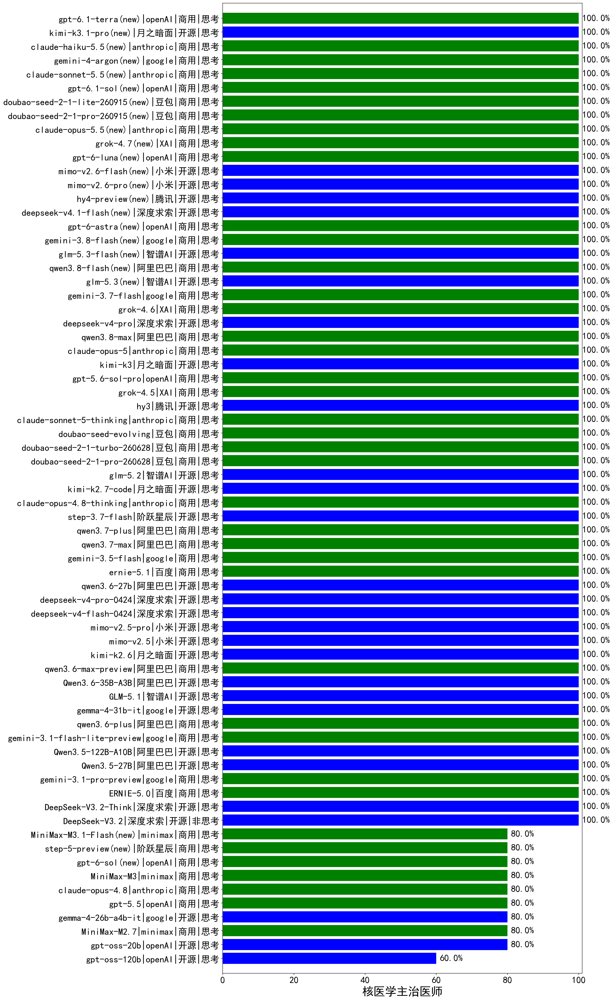

|类别|机构|大模型|【核医学主治医师】准确率|平均耗时|平均消耗token|花费/千次（元）|排名（准确率）|
|---|---|-----|-------------------|-------|-----------|-----------|-----------|
|商用|豆包|doubao-seed-2-1-turbo-260628|100.0%|120s|4645|68.4|1|
|商用|豆包|doubao-seed-2-1-pro-260628|100.0%|441s|8301|246.5|2|
|商用|anthropic|claude-sonnet-5-thinking|100.0%|14s|745|46.5|3|
|开源|腾讯|hy3|100.0%|232s|225|0.7|4|
|商用|XAI|grok-4.5|100.0%|127s|1049|36.5|5|
|商用|openAI|gpt-5.6-sol-pro|100.0%|66s|2804|192.5|6|
|开源|月之暗面|kimi-k3|100.0%|21s|510|39.4|7|
|商用|anthropic|claude-opus-5|100.0%|11s|615|93.3|8|
|商用|阿里巴巴|qwen3.8-max|100.0%|10s|473|14.4|9|
|开源|深度求索|deepseek-v4-pro|100.0%|18s|529|11.7|10|
|商用|XAI|grok-4.6|100.0%|826s|1595|59.5|11|
|商用|google|gemini-3.7-flash|100.0%|4s|672|16.2|12|
|开源|智谱AI|glm-5.3(new)|100.0%|45s|1073|28.6|13|
|商用|阿里巴巴|qwen3.8-flash(new)|100.0%|21s|845|2.0|14|
|开源|智谱AI|glm-5.3-flash(new)|100.0%|25s|1034|2.7|15|
|商用|google|gemini-3.8-flash(new)|100.0%|14s|635|30.5|16|
|商用|openAI|gpt-6-astra(new)|100.0%|8s|222|53.8|17|
|开源|深度求索|deepseek-v4.1-flash(new)|100.0%|3s|480|3.3|18|
|开源|腾讯|hy4-preview(new)|100.0%|25s|1666|29.0|19|
|开源|小米|mimo-v2.6-pro(new)|100.0%|16s|754|4.3|20|
|开源|小米|mimo-v2.6-flash(new)|100.0%|40s|672|1.3|21|
|商用|openAI|gpt-6-luna(new)|100.0%|212s|582|1.8|22|
|商用|XAI|grok-4.7(new)|100.0%|43s|3732|120.2|23|
|商用|anthropic|claude-opus-5.5(new)|100.0%|16s|634|77.2|24|
|商用|豆包|doubao-seed-2-1-pro-260915(new)|100.0%|29s|729|19.3|25|
|商用|豆包|doubao-seed-2-1-lite-260915(new)|100.0%|20s|547|1.3|26|
|商用|openAI|gpt-6.1-sol(new)|100.0%|8s|255|13.1|27|
|商用|anthropic|claude-sonnet-5.5(new)|100.0%|7s|469|27.0|28|
|商用|google|gemini-4-argon(new)|100.0%|28s|366|40.6|29|
|商用|anthropic|claude-haiku-5.5(new)|100.0%|10s|695|2.1|30|
|开源|月之暗面|kimi-k3.1-pro(new)|100.0%|30s|1106|67.3|31|
|商用|豆包|doubao-seed-evolving|100.0%|155s|4461|131.3|32|
|商用|openAI|gpt-6.1-terra(new)|100.0%|4s|189|4.2|33|
|开源|智谱AI|glm-5.2|100.0%|87s|1330|35.8|34|
|开源|小米|mimo-v2.5-pro|100.0%|18s|999|16.5|35|
|开源|深度求索|DeepSeek-V3.2|100.0%|97s|399|1.1|36|
|开源|深度求索|DeepSeek-V3.2-Think|100.0%|196s|861|2.5|37|
|商用|百度|ERNIE-5.0|100.0%|55s|1094|25.2|38|
|商用|google|gemini-3.1-pro-preview|100.0%|30s|1229|99.9|39|
|开源|阿里巴巴|Qwen3.5-27B|100.0%|103s|2209|10.3|40|
|开源|阿里巴巴|Qwen3.5-122B-A10B|100.0%|108s|2567|16.0|41|
|商用|google|gemini-3.1-flash-lite-preview|100.0%|34s|381|3.4|42|
|商用|阿里巴巴|qwen3.6-plus|100.0%|44s|1629|18.8|43|
|开源|google|gemma-4-31b-it|100.0%|87s|522|1.3|44|
|开源|智谱AI|GLM-5.1|100.0%|175s|1295|29.9|45|
|开源|阿里巴巴|Qwen3.6-35B-A3B|100.0%|108s|1497|15.5|46|
|开源|月之暗面|kimi-k2.6|100.0%|58s|1414|36.8|47|
|开源|小米|mimo-v2.5|100.0%|15s|859|8.5|48|
|商用|阿里巴巴|qwen3.6-max-preview|100.0%|47s|1651|85.9|49|
|开源|深度求索|deepseek-v4-flash-0424|100.0%|20s|488|0.9|50|
|商用|google|gemini-3.5-flash|100.0%|11s|1309|78.9|51|
|开源|月之暗面|kimi-k2.7-code|100.0%|69s|1015|26.0|52|
|商用|anthropic|claude-opus-4.8-thinking|100.0%|27s|723|112.3|53|
|开源|阶跃星辰|step-3.7-flash|100.0%|16s|1153|8.8|54|
|商用|阿里巴巴|qwen3.7-plus|100.0%|21s|1087|8.3|55|
|开源|深度求索|deepseek-v4-pro-0424|100.0%|23s|513|11.6|56|
|商用|阿里巴巴|qwen3.7-max|100.0%|38s|1256|43.5|57|
|商用|百度|ernie-5.1|100.0%|19s|767|12.9|58|
|开源|阿里巴巴|qwen3.6-27b|100.0%|21s|1357|23.3|59|
|商用|openAI|gpt-6-sol(new)|80.0%|110s|312|17.1|60|
|商用|minimax|MiniMax-M2.7|80.0%|35s|1287|10.2|61|
|商用|anthropic|claude-opus-4.8|80.0%|8s|484|70.5|62|
|商用|阶跃星辰|step-5-preview(new)|80.0%|53s|2868|56.4|63|
|商用|minimax|MiniMax-M3|80.0%|20s|569|6.6|64|
|开源|google|gemma-4-26b-a4b-it|80.0%|29s|506|1.3|65|
|商用|openAI|gpt-5.5|80.0%|10s|600|111.1|66|
|商用|minimax|MiniMax-M3.1-Flash(new)|80.0%|20s|1342|4.6|67|
|开源|openAI|gpt-oss-20b|80.0%|220s|1055|1.1|68|
|开源|openAI|gpt-oss-120b|60.0%|5s|688|1.9|69|

