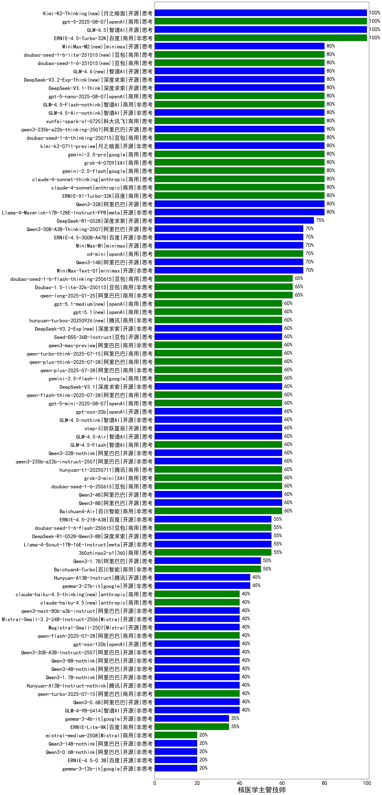

|类别|机构|大模型|【核医学主管技师】准确率|平均耗时|平均消耗token|花费/千次（元）|排名（准确率）|
|---|---|-----|-------------------|-------|-----------|-----------|-----------|
|商用|百度|ERNIE-4.5-Turbo-32K|100.0%|21s|538|1.6|1|
|开源|腾讯|hunyuan-large|86.2%|13s|1144|7.2|2|
|开源|阿里巴巴|Qwen3-235B-A22B|85.0%|138s|3528|34.6|3|
|开源|阿里巴巴|Qwen3-30B-A3B|85.0%|22s|1071|2.8|4|
|商用|腾讯|hunyuan-t1-20250529|85.0%|112s|1390|5.2|5|
|商用|阿里巴巴|qwen-plus-think-2025-04-28|85.0%|245s|2424|22.6|6|
|商用|anthropic|claude-4-sonnet-thinking|80.0%|46s|974|95.4|7|
|商用|百度|ERNIE-X1-Turbo-32K|80.0%|138s|2940|11.5|8|
|商用|XAI|grok-4-0709(new)|80.0%|110s|2402|253.7|9|
|商用|google|gemini-2.5-pro(new)|80.0%|44s|2662|187.9|10|
|开源|月之暗面|kimi-k2-0711-preview(new)|80.0%|34s|590|8.5|11|
|商用|google|gemini-2.5-flash(new)|80.0%|14s|2038|35.6|12|
|开源|深度求索|deepseek-chat-v3-0324|80.0%|36s|346|2.2|13|
|开源|阿里巴巴|Qwen3-32B|80.0%|48s|2089|8.1|14|
|开源|meta|Llama-4-Maverick-17B-128E-Instruct-FP8|80.0%|12s|524|2.0|15|
|商用|anthropic|claude-4-sonnet|80.0%|42s|525|46.7|16|
|商用|豆包|doubao-seed-1-6-thinking-250615|80.0%|36s|1845|14.2|17|
|商用|科大讯飞|xunfei-4.0Ultra|80.0%|5s|209|14.7|18|
|商用|智谱AI|GLM-4-Plus|80.0%|16s|285|1.4|19|
|商用|豆包|doubao-seed-1-6-thinking-250715(new)|80.0%|61s|1139|8.4|20|
|开源|minimax|MiniMax-Text-01|79.3%|11s|907|7.3|21|
|商用|智谱AI|GLM-Z1-Flash|75.0%|23s|2403|0.0|22|
|商用|腾讯|hunyuan-turbos-20250604|75.0%|169s|467|0.8|23|
|开源|深度求索|DeepSeek-R1-0528|75.0%|249s|2101|32.7|24|
|开源|智谱AI|GLM-4-32B-0414|75.0%|14s|408|0.8|25|
|商用|阿里巴巴|qwen-turbo-2025-04-28|75.0%|6s|496|0.3|26|
|商用|智谱AI|GLM-4-Air|73.3%|15s|330|0.2|27|
|商用|openAI|chatgpt-4o-latest|72.4%|/|/|/|28|
|商用|阿里巴巴|qwen-turbo-think-2025-04-28|70.0%|217s|2248|8.5|29|
|开源|minimax|MiniMax-M1(new)|70.0%|123s|2442|19.0|30|
|商用|智谱AI|GLM-Z1-AirX|70.0%|23s|2782|13.9|31|
|商用|智谱AI|GLM-Z1-Air|70.0%|70s|2195|0.8|32|
|商用|openAI|o4-mini|70.0%|36s|1288|38.8|33|
|开源|阿里巴巴|Qwen3-14B|70.0%|32s|1156|2.2|34|
|开源|百度|ERNIE-4.5-300B-A47B(new)|70.0%|7s|346|2.3|35|
|商用|阿里巴巴|qwen-plus-2025-04-28|70.0%|140s|521|0.9|36|
|开源|阿里巴巴|Qwen3-235B-A22B-nothink|70.0%|48s|525|4.5|37|
|开源|阿里巴巴|qwq-32b|69.0%|68s|2858|16.8|38|
|商用|豆包|Doubao-1.5-pro-32k-250115|69.0%|7s|344|0.6|39|
|商用|月之暗面|kimi-latest-8k|69.0%|34s|543|6.5|40|
|开源|阿里巴巴|qwen2.5-32b-instruct|69.0%|6s|282|1.3|41|
|商用|腾讯|hunyuan-standard|69.0%|/|/|/|42|
|商用|豆包|Doubao-1.5-lite-32k-250115|69.0%|3s|183|0.1|43|
|商用|阿里巴巴|qwq-plus-2025-03-05|65.5%|67s|2340|9.1|44|
|商用|阿里巴巴|qwen2.5-max|65.5%|45s|473|4.0|45|
|商用|商汤|SenseChat-5-beta|65.5%|19s|362|6.3|46|
|商用|阿里巴巴|qwen-long-2025-01-25|65.5%|6s|296|0.5|47|
|开源|智谱AI|GLM-Z1-32B-0414|65.0%|230s|2468|9.8|48|
|商用|google|gemini-2.5-flash-lite-preview-06-17(new)|65.0%|2s|505|1.3|49|
|商用|阶跃星辰|step-r1-v-mini|65.0%|240s|2915|22.8|50|
|商用|豆包|doubao-seed-1-6-flash-thinking-250615|65.0%|5s|619|0.7|51|
|开源|阿里巴巴|Qwen3-8B|65.0%|264s|6177|0.0|52|
|商用|零一万物|yi-lightning|62.1%|/|/|/|53|
|商用|科大讯飞|xunfei-spark-max|62.1%|5s|184|5.5|54|
|开源|阿里巴巴|qwen2.5-14b-instruct|62.1%|2s|278|0.6|55|
|商用|阿里巴巴|qwen-plus-2025-07-14(new)|60.0%|8s|526|0.9|56|
|开源|阿里巴巴|qwen3-235b-a22b-instruct-2507(new)|60.0%|13s|537|3.7|57|
|商用|XAI|grok-3-mini(new)|60.0%|159s|1087|3.8|58|
|开源|华为|pangu-pro-moe(new)|60.0%|96s|1730|6.6|59|
|商用|豆包|doubao-seed-1-6-250615|60.0%|101s|505|3.2|60|
|商用|openAI|gpt-4.1|60.0%|11s|347|15.8|61|
|商用|腾讯|hunyuan-t1-20250711(new)|60.0%|30s|1752|6.6|62|
|商用|openAI|gpt-4.1-mini|60.0%|8s|392|3.7|63|
|商用|科大讯飞|xunfei-spark-x1|60.0%|57s|1661|19.9|64|
|开源|阿里巴巴|Qwen3-4B|60.0%|47s|2838|8.3|65|
|开源|阿里巴巴|qwen2.5-72b-instruct|58.6%|32s|318|3.2|66|
|商用|商汤|SenseChat-5-1202|58.6%|/|/|/|67|
|开源|深度求索|DeepSeek-R1-Distill-Qwen-32B|58.6%|55s|976|1.2|68|
|商用|百川智能|Baichuan4-Air|58.6%|/|/|/|69|
|商用|奇虎360|360gpt2-pro|58.6%|13s|274|1.0|70|
|商用|奇虎360|360gpt-turbo|58.6%|/|/|/|71|
|商用|百川智能|Baichuan4-Turbo|58.6%|/|/|/|72|
|开源|Google|gemma-3-27b-it|58.0%|/|/|/|73|
|商用|智谱AI|GLM-4-AirX|56.7%|17s|330|3.3|74|
|商用|商汤|SenseChat-Turbo-1202|55.2%|/|/|/|75|
|商用|Mistral|mistral-small|55.2%|/|/|/|76|
|商用|奇虎360|360zhinao2-o1|55.2%|/|/|/|77|
|开源|阿里巴巴|qwen2.5-7b-instruct|55.2%|7s|232|0.2|78|
|商用|智谱AI|GLM-4-Flash|55.2%|9s|335|0.0|79|
|开源|深度求索|DeepSeek-R1-Distill-Qwen-14B|55.2%|/|/|/|80|
|商用|豆包|doubao-seed-1-6-flash-250615|55.0%|3s|320|0.4|81|
|开源|百度|ERNIE-4.5-21B-A3B(new)|55.0%|58s|322|0.0|82|
|开源|深度求索|DeepSeek-R1-0528-Qwen3-8B|55.0%|236s|2273|0.0|83|
|商用|智谱AI|GLM-4-Long|53.3%|21s|415|0.4|84|
|开源|上海人工智能实验室|internlm2_5-7b-chat|51.7%|/|/|/|85|
|商用|科大讯飞|xunfei-spark-pro|51.7%|/|/|/|86|
|商用|百度|ERNIE-3.5-8K|51.7%|25s|380|0.7|87|
|开源|Google|gemma-3-12b-it|51.5%|/|/|/|88|
|开源|meta|Llama-4-Scout-17B-16E-Instruct|50.0%|86s|479|1.3|89|
|开源|阿里巴巴|Qwen3-1.7B|50.0%|20s|2035|5.9|90|
|开源|智谱AI|GLM-Z1-9B-0414|50.0%|155s|3054|0.0|91|
|商用|百度|ERNIE-Lite-8K|49.5%|/|/|/|92|
|开源|腾讯|Hunyuan-A13B-Instruct(new)|45.0%|62s|1348|5.2|93|
|商用|智谱AI|GLM-4-FlashX|44.8%|6s|329|0.0|94|
|商用|奇虎360|360gpt2-o1|44.8%|19s|382|16.1|95|
|商用|OpenAI|gpt-4o-mini|44.8%|/|/|/|96|
|商用|阶跃星辰|step-2-mini|44.8%|112s|388|0.7|97|
|商用|Mistral|mistral-large|44.8%|/|/|/|98|
|商用|Mistral|ministral-3b|41.4%|/|/|/|99|
|商用|Mistral|ministral-8b|41.4%|/|/|/|100|
|开源|智谱AI|GLM-4-9B-0414|40.0%|13s|476|0.0|101|
|商用|阿里巴巴|qwen-turbo-2025-07-15(new)|40.0%|9s|391|0.2|102|
|开源|腾讯|Hunyuan-A13B-Instruct-nothink(new)|40.0%|14s|391|1.3|103|
|开源|阿里巴巴|Qwen3-0.6B|40.0%|7s|1542|4.4|104|
|商用|智谱AI|GLM-Z1-FlashX|40.0%|69s|3174|0.3|105|
|开源|微软|phi-4|37.9%|/|/|/|106|
|开源|阿里巴巴|qwen2.5-0.5b-instruct|37.9%|8s|232|0.0|107|
|开源|Google|gemma-3-4b-it|36.5%|/|/|/|108|
|开源|Mistral|Mistral-Small-3.1-24B-Instruct-2503|35.0%|/|/|/|109|
|开源|阿里巴巴|qwen2.5-1.5b-instruct|31.0%|5s|225|0.0|110|
|开源|智谱AI|GLM-Z1-Rumination-32B-0414|30.0%|20s|1008|2.4|111|
|开源|阿里巴巴|qwen2.5-3b-instruct|27.6%|7s|331|0.2|112|
|商用|百度|ERNIE-Speed-8K|24.1%|/|/|/|113|
|商用|百度|ERNIE-Tiny-8K|20.7%|/|/|/|114|
|开源|百度|ERNIE-4.5-0.3B(new)|20.0%|57s|404|0.0|115|
|商用|科大讯飞|xunfei-spark-lite|13.8%|/|/|/|116|

