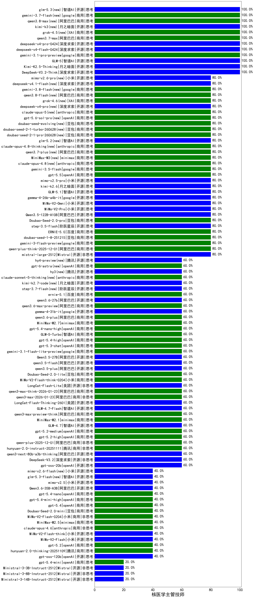

|类别|机构|大模型|【核医学主管技师】准确率|平均耗时|平均消耗token|花费/千次（元）|排名（准确率）|
|---|---|-----|-------------------|-------|-----------|-----------|-----------|
|开源|深度求索|deepseek-v4-flash-0424|100.0%|36s|1565|3.0|1|
|商用|阿里巴巴|qwen3.7-max|100.0%|46s|2116|73.8|2|
|商用|XAI|grok-4.5(new)|100.0%|59s|1946|73.6|3|
|开源|深度求索|deepseek-v4-pro-0424|100.0%|77s|1136|26.2|4|
|开源|月之暗面|Kimi-K2.5-Thinking|100.0%|465s|2421|49.3|5|
|开源|月之暗面|kimi-k3(new)|100.0%|98s|2656|252.1|6|
|商用|阿里巴巴|qwen3.8-max(new)|100.0%|55s|2648|92.0|7|
|商用|google|gemini-3.1-pro-preview|100.0%|47s|1985|162.5|8|
|商用|google|gemini-3.7-flash(new)|100.0%|7s|1088|26.6|9|
|开源|智谱AI|glm-5.3(new)|100.0%|-495s|8877|246.6|10|
|开源|智谱AI|GLM-5|100.0%|134s|2805|49.2|11|
|开源|深度求索|DeepSeek-V3.2-Think|100.0%|51s|1497|4.4|12|
|商用|豆包|Doubao-Seed-2.0-pro|80.0%|360s|1633|24.4|13|
|商用|google|gemini-3.5-flash|80.0%|11s|2027|122.9|14|
|商用|minimax|MiniMax-M3(new)|80.0%|24s|731|9.1|15|
|商用|阿里巴巴|qwen3.7-plus(new)|80.0%|33s|1766|13.5|16|
|商用|anthropic|claude-opus-4.8(new)|80.0%|8s|515|71.3|17|
|商用|anthropic|claude-opus-4.8-thinking(new)|80.0%|10s|756|113.5|18|
|商用|openAI|gpt-5.5|80.0%|39s|1120|216.5|19|
|开源|阿里巴巴|Qwen3.5-122B-A10B|80.0%|388s|3678|23.0|20|
|开源|小米|mimo-v2.5-pro|80.0%|21s|1273|22.0|21|
|开源|月之暗面|kimi-k2.6|80.0%|189s|5624|150.0|22|
|开源|智谱AI|GLM-5.1|80.0%|351s|2804|65.7|23|
|开源|google|gemma-4-26b-a4b-it|80.0%|92s|625|1.6|24|
|开源|小米|MiMo-V2-Omni|80.0%|405s|1628|19.0|25|
|开源|阶跃星辰|step-3.5-flash|80.0%|66s|2754|5.6|26|
|开源|小米|MiMo-V2-Pro|80.0%|726s|944|15.1|27|
|商用|google|gemini-3-flash-preview|80.0%|24s|1488|30.1|28|
|商用|XAI|grok-4.6(new)|80.0%|49s|2649|103.1|29|
|商用|anthropic|claude-opus-5(new)|80.0%|15s|863|132.1|30|
|商用|阿里巴巴|qwen-plus-think-2025-12-01|80.0%|83s|3599|28.1|31|
|商用|openAI|gpt-5.6-sol-pro(new)|80.0%|107s|4566|409.9|32|
|商用|豆包|doubao-seed-1-8-251215|80.0%|26s|734|4.9|33|
|开源|Mistral|mistral-large-2512|80.0%|10s|421|3.7|34|
|商用|阿里巴巴|qwen3.8-flash(new)|80.0%|14s|674|1.5|35|
|开源|深度求索|deepseek-v4-pro(new)|80.0%|90s|2746|71.1|36|
|商用|豆包|doubao-seed-evolving(new)|80.0%|223s|10222|303.4|37|
|商用|豆包|doubao-seed-2-1-turbo-260628(new)|80.0%|225s|13035|193.9|38|
|商用|豆包|doubao-seed-2-1-pro-260628(new)|80.0%|298s|12925|384.5|39|
|开源|智谱AI|glm-5.2(new)|80.0%|86s|3612|99.2|40|
|商用|google|gemini-3.8-flash(new)|80.0%|15s|1367|67.9|41|
|商用|百度|ERNIE-5.0|80.0%|271s|3426|80.7|42|
|商用|阿里巴巴|qwen3.6-plus|60.0%|38s|1610|18.5|43|
|商用|阿里巴巴|qwen3.6-max-preview|60.0%|61s|2302|119.8|44|
|开源|google|gemma-4-31b-it|60.0%|155s|520|1.3|45|
|开源|阶跃星辰|step-3.7-flash(new)|60.0%|10s|1295|9.8|46|
|商用|minimax|MiniMax-M2.7|60.0%|67s|2826|23.0|47|
|开源|阿里巴巴|qwen3.6-27b|60.0%|35s|1798|30.9|48|
|商用|百度|ernie-5.1|60.0%|32s|1196|20.3|49|
|开源|腾讯|hy3(new)|60.0%|31s|241|0.7|50|
|商用|anthropic|claude-sonnet-5-thinking(new)|60.0%|16s|822|50.0|51|
|开源|月之暗面|kimi-k2.7-code(new)|60.0%|147s|4812|128.1|52|
|商用|智谱AI|GLM-5-Turbo|60.0%|49s|2744|58.8|53|
|商用|openAI|gpt-6-astra(new)|60.0%|10s|297|74.0|54|
|商用|openAI|gpt-5.4-nano-high|60.0%|86s|398|2.7|55|
|商用|小米|MiMo-V2-Flash-think-0204|60.0%|538s|1880|3.8|56|
|开源|深度求索|DeepSeek-V3.2|60.0%|51s|375|1.0|57|
|开源|阿里巴巴|qwen3-next-80b-a3b-thinking|60.0%|168s|4184|16.4|58|
|商用|腾讯|hunyuan-2.0-instruct-20251111|60.0%|8s|506|0.9|59|
|商用|阿里巴巴|qwen-plus-2025-12-01|60.0%|21s|786|1.5|60|
|商用|openAI|gpt-5.2-high|60.0%|8s|501|40.4|61|
|商用|openAI|gpt-5.2-medium|60.0%|14s|574|47.8|62|
|开源|智谱AI|GLM-4.7|60.0%|94s|3845|52.8|63|
|商用|minimax|MiniMax-M2.1|60.0%|89s|2807|22.8|64|
|商用|阿里巴巴|qwen3-max-preview-think|60.0%|120s|3505|82.3|65|
|开源|智谱AI|GLM-4.7-Flash|60.0%|1183s|2444|0.0|66|
|开源|美团|LongCat-Flash-Thinking-2601|60.0%|209s|2205|0.0|67|
|商用|阿里巴巴|qwen3-max-2026-01-23|60.0%|20s|497|4.2|68|
|开源|美团|LongCat-Flash-Lite|60.0%|436s|492|0.0|69|
|商用|阿里巴巴|qwen3-max-think-2026-01-23|60.0%|362s|4753|46.8|70|
|商用|豆包|Doubao-Seed-2.0-lite|60.0%|271s|1289|4.2|71|
|开源|openAI|gpt-oss-20b|60.0%|7s|1179|1.2|72|
|开源|阿里巴巴|qwen3.5-plus|60.0%|47s|4025|18.9|73|
|开源|阿里巴巴|qwen3.5-flash|60.0%|388s|3642|7.1|74|
|开源|阿里巴巴|Qwen3.5-27B|60.0%|365s|3424|16.0|75|
|商用|google|gemini-3.1-flash-lite-preview|60.0%|3s|355|2.9|76|
|商用|openAI|gpt-5.3-chat|60.0%|5s|468|36.7|77|
|商用|openAI|gpt-5.4-high|60.0%|18s|962|91.7|78|
|商用|openAI|gpt-5.4|40.0%|3s|276|19.6|79|
|商用|openAI|gpt-5.4-mini-high|40.0%|19s|2199|66.5|80|
|开源|智谱AI|glm-5.3-flash(new)|40.0%|451s|26628|74.4|81|
|商用|腾讯|hunyuan-2.0-thinking-20251109|40.0%|20s|1332|5.1|82|
|商用|openAI|gpt-5.2|40.0%|9s|210|11.6|83|
|开源|阿里巴巴|Qwen3.6-35B-A3B|40.0%|111s|1712|17.6|84|
|开源|小米|MiMo-V2-Flash|40.0%|10s|500|0.0|85|
|商用|小米|MiMo-V2-Flash-0204|40.0%|72s|538|1.0|86|
|开源|小米|MiMo-V2-Flash-think|40.0%|31s|2544|0.0|87|
|开源|小米|mimo-v2.5|40.0%|21s|1507|17.3|88|
|商用|openAI|gpt-5.4-nano|40.0%|11s|241|1.3|89|
|商用|anthropic|claude-opus-4.6|40.0%|23s|672|99.1|90|
|商用|minimax|MiniMax-M2.5|40.0%|26s|1422|11.2|91|
|商用|豆包|Doubao-Seed-2.0-mini|40.0%|470s|1994|3.7|92|
|开源|openAI|gpt-oss-120b|40.0%|13s|617|1.6|93|
|开源|Mistral|Ministral-3-3B-Instruct-2512|20.0%|2s|573|0.4|94|
|开源|Mistral|Ministral-3-8B-Instruct-2512|20.0%|3s|510|0.5|95|
|开源|Mistral|Ministral-3-14B-Instruct-2512|20.0%|7s|494|0.7|96|
|商用|openAI|gpt-5.4-mini|20.0%|25s|255|5.2|97|

