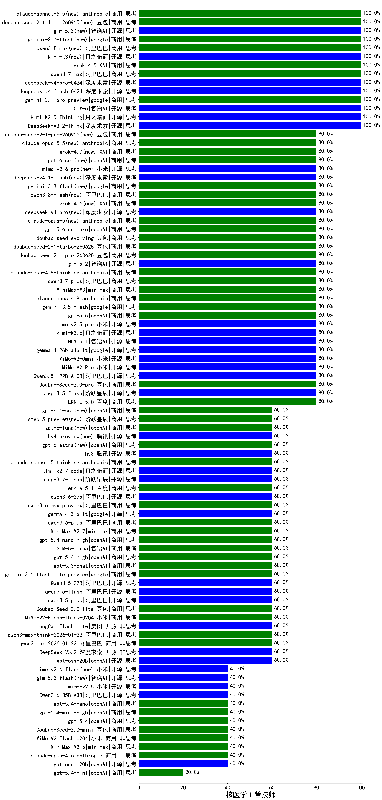

|类别|机构|大模型|【核医学主管技师】准确率|平均耗时|平均消耗token|花费/千次（元）|排名（准确率）|
|---|---|-----|-------------------|-------|-----------|-----------|-----------|
|商用|豆包|doubao-seed-2-1-lite-260915(new)|100.0%|62s|1908|4.9|1|
|商用|anthropic|claude-sonnet-5.5(new)|100.0%|8s|712|42.2|2|
|商用|阿里巴巴|qwen3.7-max|100.0%|46s|2116|73.8|3|
|商用|XAI|grok-4.5|100.0%|59s|1946|73.6|4|
|开源|月之暗面|kimi-k3|100.0%|98s|2656|252.1|5|
|开源|深度求索|deepseek-v4-pro-0424|100.0%|77s|1136|26.2|6|
|开源|深度求索|deepseek-v4-flash-0424|100.0%|36s|1565|3.0|7|
|商用|阿里巴巴|qwen3.8-max|100.0%|55s|2648|92.0|8|
|开源|智谱AI|glm-5.3(new)|100.0%|-495s|8877|246.6|9|
|商用|google|gemini-3.7-flash|100.0%|7s|1088|26.6|10|
|开源|深度求索|DeepSeek-V3.2-Think|100.0%|51s|1497|4.4|11|
|商用|google|gemini-3.1-pro-preview|100.0%|47s|1985|162.5|12|
|商用|google|gemini-3.8-flash(new)|80.0%|15s|1367|67.9|13|
|开源|深度求索|deepseek-v4.1-flash(new)|80.0%|10s|2042|15.7|14|
|商用|豆包|doubao-seed-2-1-turbo-260628|80.0%|225s|13035|193.9|15|
|商用|豆包|doubao-seed-2-1-pro-260915(new)|80.0%|90s|2331|66.7|16|
|商用|豆包|doubao-seed-evolving|80.0%|223s|10222|303.4|17|
|商用|openAI|gpt-5.6-sol-pro|80.0%|107s|4566|409.9|18|
|商用|anthropic|claude-opus-5.5(new)|80.0%|15s|863|105.5|19|
|商用|XAI|grok-4.7(new)|80.0%|118s|9262|351.8|20|
|商用|anthropic|claude-opus-5|80.0%|15s|863|132.1|21|
|商用|openAI|gpt-6-sol(new)|80.0%|515s|473|27.1|22|
|开源|深度求索|deepseek-v4-pro|80.0%|90s|2746|71.1|23|
|商用|XAI|grok-4.6|80.0%|49s|2649|103.1|24|
|商用|阿里巴巴|qwen3.7-plus|80.0%|33s|1766|13.5|25|
|开源|小米|mimo-v2.6-pro(new)|80.0%|20s|868|4.9|26|
|商用|阿里巴巴|qwen3.8-flash(new)|80.0%|14s|674|1.5|27|
|开源|智谱AI|glm-5.2|80.0%|86s|3612|99.2|28|
|商用|豆包|doubao-seed-2-1-pro-260628|80.0%|298s|12925|384.5|29|
|商用|anthropic|claude-opus-4.8-thinking|80.0%|10s|756|113.5|30|
|开源|月之暗面|kimi-k2.6|80.0%|189s|5624|150.0|31|
|开源|google|gemma-4-26b-a4b-it|80.0%|92s|625|1.6|32|
|商用|minimax|MiniMax-M3|80.0%|24s|731|9.1|33|
|商用|百度|ERNIE-5.0|80.0%|271s|3426|80.7|34|
|商用|anthropic|claude-opus-4.8|80.0%|8s|515|71.3|35|
|商用|google|gemini-3.5-flash|80.0%|11s|2027|122.9|36|
|开源|智谱AI|GLM-5.1|80.0%|351s|2804|65.7|37|
|开源|阿里巴巴|Qwen3.5-122B-A10B|80.0%|388s|3678|23.0|38|
|商用|openAI|gpt-5.5|80.0%|39s|1120|216.5|39|
|开源|小米|mimo-v2.5-pro|80.0%|21s|1273|22.0|40|
|商用|google|gemini-4-argon(new)|80.0%|18s|418|45.2|41|
|开源|腾讯|hy4-preview(new)|60.0%|71s|4624|82.0|42|
|商用|google|gemini-3.1-flash-lite-preview|60.0%|3s|355|2.9|43|
|商用|openAI|gpt-6.1-sol(new)|60.0%|31s|320|16.4|44|
|商用|openAI|gpt-6-astra(new)|60.0%|10s|297|74.0|45|
|商用|openAI|gpt-6-luna(new)|60.0%|117s|1005|3.2|46|
|开源|阿里巴巴|Qwen3.5-27B|60.0%|365s|3424|16.0|47|
|开源|深度求索|DeepSeek-V3.2|60.0%|51s|375|1.0|48|
|商用|minimax|MiniMax-M2.7|60.0%|67s|2826|23.0|49|
|开源|阶跃星辰|step-3.7-flash|60.0%|10s|1295|9.8|50|
|商用|阿里巴巴|qwen3.6-plus|60.0%|38s|1610|18.5|51|
|开源|google|gemma-4-31b-it|60.0%|155s|520|1.3|52|
|商用|阶跃星辰|step-5-preview(new)|60.0%|53s|3215|63.1|53|
|商用|阿里巴巴|qwen3.6-max-preview|60.0%|61s|2302|119.8|54|
|开源|阿里巴巴|qwen3.6-27b|60.0%|35s|1798|30.9|55|
|商用|百度|ernie-5.1|60.0%|32s|1196|20.3|56|
|开源|腾讯|hy3|60.0%|31s|241|0.7|57|
|商用|anthropic|claude-sonnet-5-thinking|60.0%|16s|822|50.0|58|
|开源|openAI|gpt-oss-20b|60.0%|7s|1179|1.2|59|
|开源|月之暗面|kimi-k2.7-code|60.0%|147s|4812|128.1|60|
|商用|anthropic|claude-haiku-5.5(new)|40.0%|5s|846|2.6|61|
|开源|openAI|gpt-oss-120b|40.0%|13s|617|1.6|62|
|开源|小米|mimo-v2.6-flash(new)|40.0%|40s|671|1.2|63|
|开源|智谱AI|glm-5.3-flash(new)|40.0%|451s|26628|74.4|64|
|开源|小米|mimo-v2.5|40.0%|21s|1507|17.3|65|
|开源|阿里巴巴|Qwen3.6-35B-A3B|40.0%|111s|1712|17.6|66|
|商用|minimax|MiniMax-M3.1-Flash(new)|40.0%|28s|2082|7.5|67|

