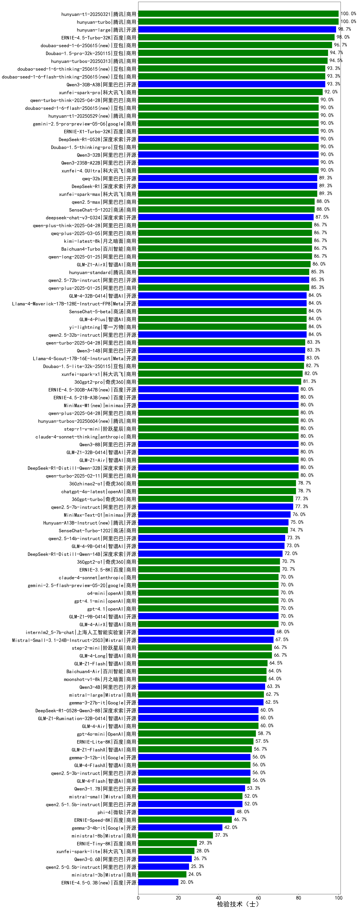

|类别|机构|大模型|【检验技术（士）】准确率|平均耗时|平均消耗token|花费/千次（元）|排名（准确率）|
|---|---|-----|-------------------|-------|-----------|-----------|-----------|
|开源|阿里巴巴|Qwen3-8B-nothink|100.0%|24s|536|0.0|1|
|开源|阿里巴巴|qwen3-235b-a22b-thinking-2507|100.0%|97s|1533|29.4|2|
|开源|Mistral|Mistral-Small-3.2-24B-Instruct-2506|100.0%|16s|498|0.9|3|
|商用|Mistral|mistral-medium-2508|100.0%|520s|512|6.3|4|
|商用|google|gemini-2.5-flash-lite|100.0%|3s|488|1.3|5|
|开源|深度求索|DeepSeek-V3.1-Think|100.0%|33s|645|7.2|6|
|开源|深度求索|DeepSeek-V3.1|100.0%|14s|289|3.0|7|
|商用|阿里巴巴|qwen-flash-think-2025-07-28|100.0%|16s|1652|2.4|8|
|商用|阿里巴巴|qwen-flash-2025-07-28|100.0%|7s|595|0.8|9|
|商用|openAI|gpt-5-nano-2025-08-07|100.0%|13s|1131|3.1|10|
|商用|openAI|gpt-5-mini-2025-08-07|100.0%|83s|451|5.5|11|
|商用|openAI|gpt-5-2025-08-07|100.0%|28s|168|7.4|12|
|开源|openAI|gpt-oss-120b|100.0%|4s|499|1.3|13|
|商用|智谱AI|GLM-4.5-Flash-nothink|100.0%|18s|829|0.0|14|
|开源|智谱AI|GLM-4.5-nothink|100.0%|20s|688|8.9|15|
|开源|阶跃星辰|step-3|100.0%|68s|1366|5.3|16|
|开源|阿里巴巴|Qwen3-30B-A3B-Instruct-2507|100.0%|4s|497|1.3|17|
|开源|智谱AI|GLM-4.5|100.0%|82s|1927|26.3|18|
|开源|智谱AI|GLM-4.5-Air|100.0%|24s|1270|7.3|19|
|商用|智谱AI|GLM-4.5-Flash|100.0%|24s|1167|0.0|20|
|开源|阿里巴巴|Qwen3-32B-nothink|100.0%|27s|489|1.7|21|
|商用|阿里巴巴|qwen-plus-2025-07-28|100.0%|12s|500|0.9|22|
|商用|阿里巴巴|qwen-plus-think-2025-07-28|100.0%|/|1554|11.9|23|
|商用|阿里巴巴|qwen-turbo-think-2025-07-15|100.0%|/|1655|4.8|24|
|开源|月之暗面|Kimi-K2-Thinking(new)|100.0%|53s|953|14.5|25|
|商用|anthropic|claude-sonnet-4.5(new)|100.0%|9s|602|56.6|26|
|商用|openAI|gpt-5.1-high(new)|100.0%|129s|346|19.4|27|
|开源|月之暗面|kimi-k2-0905(new)|100.0%|16s|327|4.2|28|
|商用|google|gemini-3-pro-preview(new)|100.0%|10s|1162|94.4|29|
|商用|anthropic|claude-haiku-4.5-thinking(new)|100.0%|17s|1998|68.2|30|
|商用|anthropic|claude-haiku-4.5(new)|100.0%|8s|655|20.4|31|
|商用|openAI|gpt-5.1-medium(new)|100.0%|145s|312|17.0|32|
|商用|openAI|gpt-5.1(new)|100.0%|92s|223|10.7|33|
|开源|minimax|MiniMax-M2(new)|100.0%|40s|925|7.2|34|
|商用|阿里巴巴|qwen3-max-preview|100.0%|10s|418|8.8|35|
|商用|豆包|doubao-seed-1-6-lite-251015(new)|100.0%|16s|739|1.6|36|
|商用|豆包|doubao-seed-1-6-251015(new)|100.0%|7s|666|4.7|37|
|开源|智谱AI|GLM-4.6(new)|100.0%|60s|1929|26.3|38|
|商用|腾讯|hunyuan-turbos-20250926(new)|100.0%|14s|571|1.0|39|
|开源|深度求索|DeepSeek-V3.2-Exp-Think(new)|100.0%|487s|634|1.8|40|
|开源|深度求索|DeepSeek-V3.2-Exp(new)|100.0%|30s|312|0.9|41|
|开源|阿里巴巴|qwen3-next-80b-a3b-instruct|100.0%|12s|449|1.6|42|
|开源|豆包|Seed-OSS-36B-Instruct|100.0%|70s|1115|4.3|43|
|商用|科大讯飞|xunfei-spark-x1-0725|100.0%|/|827|9.9|44|
|商用|anthropic|claude-sonnet-4.5-thinking(new)|100.0%|21s|1349|135.3|45|
|商用|豆包|doubao-seed-1-6-thinking-250715|100.0%|14s|754|5.6|46|
|商用|百度|ERNIE-4.5-Turbo-32K|100.0%|22s|560|1.7|47|
|开源|阿里巴巴|qwen3-235b-a22b-instruct-2507|100.0%|13s|492|3.5|48|
|开源|腾讯|Hunyuan-A13B-Instruct-nothink|100.0%|315s|414|1.5|49|
|商用|阿里巴巴|qwen-turbo-2025-07-15|100.0%|9s|346|0.2|50|
|商用|腾讯|hunyuan-t1-20250711|100.0%|16s|969|3.6|51|
|商用|豆包|doubao-seed-1-6-250615|95.0%|120s|483|3.2|52|
|商用|google|gemini-2.5-pro|90.0%|48s|2726|193.5|53|
|商用|google|gemini-2.5-flash|90.0%|11s|1923|33.8|54|
|商用|XAI|grok-4-0709|90.0%|173s|1231|128.2|55|
|开源|深度求索|DeepSeek-R1-0528|90.0%|244s|2031|31.7|56|
|商用|豆包|doubao-seed-1-6-flash-thinking-250615|90.0%|7s|507|0.6|57|
|开源|阿里巴巴|Qwen3-30B-A3B-Thinking-2507|90.0%|75s|2658|7.3|58|
|开源|阿里巴巴|Qwen3-32B|85.0%|33s|1153|4.4|59|
|商用|百川智能|Baichuan4-Turbo|85.0%|/|/|/|60|
|商用|百度|ERNIE-X1-Turbo-32K|85.0%|108s|1599|6.2|61|
|商用|豆包|doubao-seed-1-6-flash-250615|85.0%|4s|328|0.4|62|
|开源|meta|Llama-4-Scout-17B-16E-Instruct|80.0%|7s|478|0.9|63|
|商用|XAI|grok-4-1-fast-reasoning(new)|80.0%|8s|814|2.4|64|
|商用|anthropic|claude-4-sonnet-thinking|80.0%|48s|1066|106.8|65|
|开源|阿里巴巴|Qwen3-14B|80.0%|25s|1157|2.2|66|
|开源|Mistral|Magistral-Small-2507|80.0%|82s|6060|65.2|67|
|开源|月之暗面|kimi-k2-0711-preview|80.0%|44s|704|10.6|68|
|开源|openAI|gpt-oss-20b|80.0%|6s|1319|1.4|69|
|开源|百度|ERNIE-4.5-21B-A3B|80.0%|56s|316|0.0|70|
|开源|百度|ERNIE-4.5-300B-A47B|80.0%|11s|304|2.0|71|
|开源|阿里巴巴|Qwen3-4B-nothink|80.0%|31s|495|1.3|72|
|开源|智谱AI|GLM-4.5-Air-nothink|80.0%|14s|942|5.3|73|
|商用|豆包|Doubao-1.5-lite-32k-250115|75.0%|2s|175|0.1|74|
|商用|阿里巴巴|qwen-long-2025-01-25|75.0%|182s|360|0.6|75|
|开源|腾讯|Hunyuan-A13B-Instruct|75.0%|32s|1068|4.1|76|
|开源|minimax|MiniMax-M1|70.0%|80s|1360|7.7|77|
|商用|XAI|grok-3-mini|70.0%|252s|987|3.5|78|
|商用|openAI|o4-mini|70.0%|26s|737|21.7|79|
|商用|anthropic|claude-4-sonnet|70.0%|44s|550|50.7|80|
|开源|meta|Llama-4-Maverick-17B-128E-Instruct-FP8|65.0%|6s|457|1.8|81|
|商用|360|360zhinao2-o1|65.0%|/|/|/|82|
|开源|阿里巴巴|Qwen3-1.7B-nothink|60.0%|18s|482|1.3|83|
|开源|minimax|MiniMax-Text-01|60.0%|13s|898|7.2|84|
|商用|XAI|grok-4-1-fast-non-reasoning(new)|60.0%|5s|571|1.5|85|
|开源|阿里巴巴|Qwen3-0.6B-nothink|60.0%|7s|253|0.6|86|
|商用|百川智能|Baichuan4-Air|60.0%|/|/|/|87|
|开源|阿里巴巴|Qwen3-14B-nothink|60.0%|27s|528|0.9|88|
|开源|阿里巴巴|Qwen3-8B|60.0%|123s|3693|0.0|89|
|开源|智谱AI|GLM-4-9B-0414|55.0%|12s|423|0.0|90|
|开源|阿里巴巴|Qwen3-1.7B|55.0%|26s|2840|8.3|91|
|开源|google|gemma-3-27b-it|50.0%|/|/|/|92|
|开源|阿里巴巴|Qwen3-4B|50.0%|19s|1757|5.1|93|
|开源|深度求索|DeepSeek-R1-0528-Qwen3-8B|50.0%|289s|1686|0.0|94|
|开源|google|gemma-3-12b-it|40.0%|/|/|/|95|
|商用|百度|ERNIE-Lite-8K|40.0%|/|/|/|96|
|开源|google|gemma-3-4b-it|30.0%|/|/|/|97|
|开源|阿里巴巴|Qwen3-0.6B|25.0%|7s|1491|4.3|98|
|开源|百度|ERNIE-4.5-0.3B|15.0%|6s|388|0.0|99|

