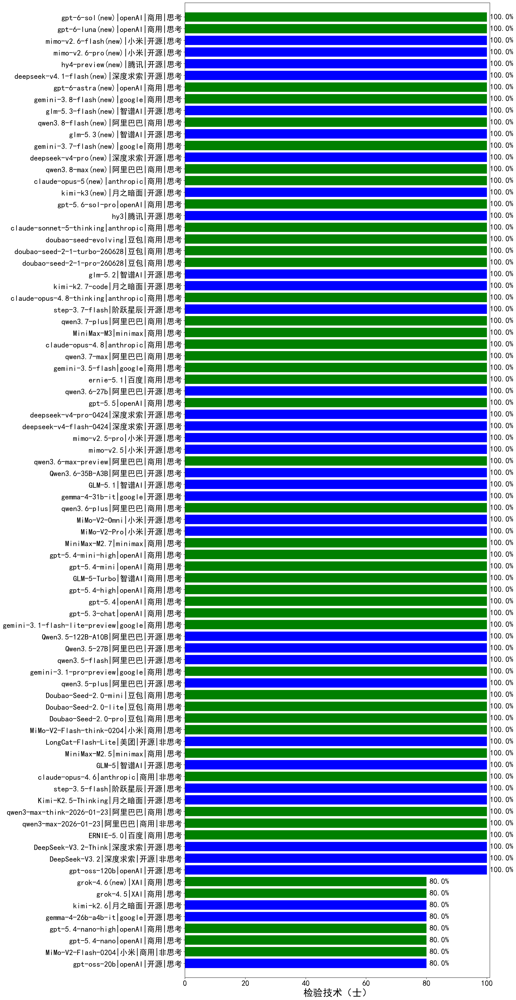

|类别|机构|大模型|【检验技术（士）】准确率|平均耗时|平均消耗token|花费/千次（元）|排名（准确率）|
|---|---|-----|-------------------|-------|-----------|-----------|-----------|
|开源|openAI|gpt-oss-120b|100.0%|4s|499|1.3|1|
|开源|小米|mimo-v2.5-pro|100.0%|17s|1013|16.9|2|
|商用|minimax|MiniMax-M3(new)|100.0%|17s|509|5.7|3|
|商用|anthropic|claude-opus-4.8(new)|100.0%|7s|473|68.8|4|
|商用|阿里巴巴|qwen3.7-max|100.0%|24s|741|25.1|5|
|商用|google|gemini-3.5-flash|100.0%|7s|1049|62.7|6|
|商用|百度|ernie-5.1|100.0%|21s|705|11.9|7|
|开源|阿里巴巴|qwen3.6-27b|100.0%|22s|1398|24.2|8|
|商用|openAI|gpt-5.5|100.0%|20s|284|45.2|9|
|开源|深度求索|deepseek-v4-pro-0424|100.0%|18s|442|9.9|10|
|开源|深度求索|deepseek-v4-flash-0424|100.0%|11s|366|0.7|11|
|开源|小米|mimo-v2.5|100.0%|13s|931|9.6|12|
|开源|阶跃星辰|step-3.7-flash(new)|100.0%|16s|1344|10.4|13|
|商用|阿里巴巴|qwen3.6-max-preview|100.0%|39s|1282|66.3|14|
|开源|阿里巴巴|Qwen3.6-35B-A3B|100.0%|92s|1475|15.3|15|
|开源|智谱AI|GLM-5.1|100.0%|110s|1005|23.0|16|
|开源|google|gemma-4-31b-it|100.0%|84s|518|1.3|17|
|商用|阿里巴巴|qwen3.6-plus|100.0%|41s|1223|14.0|18|
|开源|小米|MiMo-V2-Omni|100.0%|502s|1059|11.4|19|
|开源|小米|MiMo-V2-Pro|100.0%|153s|1065|18.0|20|
|商用|minimax|MiniMax-M2.7|100.0%|17s|715|5.4|21|
|商用|openAI|gpt-5.4-mini|100.0%|25s|235|5.3|22|
|商用|阿里巴巴|qwen3.7-plus(new)|100.0%|16s|712|5.3|23|
|商用|anthropic|claude-opus-4.8-thinking(new)|100.0%|11s|676|104.3|24|
|商用|openAI|gpt-5.4-high|100.0%|7s|387|33.5|25|
|开源|深度求索|deepseek-v4-pro(new)|100.0%|8s|380|7.7|26|
|开源|小米|mimo-v2.6-pro(new)|100.0%|53s|565|3.2|27|
|开源|腾讯|hy4-preview(new)|100.0%|54s|680|11.3|28|
|开源|深度求索|deepseek-v4.1-flash(new)|100.0%|21s|311|2.0|29|
|商用|openAI|gpt-6-astra(new)|100.0%|8s|217|52.9|30|
|商用|google|gemini-3.8-flash(new)|100.0%|19s|584|28.0|31|
|开源|智谱AI|glm-5.3-flash(new)|100.0%|19s|689|1.8|32|
|商用|阿里巴巴|qwen3.8-flash(new)|100.0%|132s|465|1.0|33|
|开源|智谱AI|glm-5.3(new)|100.0%|1107s|703|18.3|34|
|商用|google|gemini-3.7-flash(new)|100.0%|5s|591|14.2|35|
|商用|阿里巴巴|qwen3.8-max(new)|100.0%|9s|485|15.0|36|
|开源|月之暗面|kimi-k2.7-code(new)|100.0%|10s|414|9.9|37|
|商用|anthropic|claude-opus-5(new)|100.0%|30s|662|101.8|38|
|开源|月之暗面|kimi-k3(new)|100.0%|18s|360|24.8|39|
|商用|openAI|gpt-5.6-sol-pro(new)|100.0%|8s|2618|168.0|40|
|开源|腾讯|hy3(new)|100.0%|72s|205|0.6|41|
|商用|anthropic|claude-sonnet-5-thinking(new)|100.0%|12s|676|41.7|42|
|商用|豆包|doubao-seed-evolving(new)|100.0%|113s|2916|85.0|43|
|商用|豆包|doubao-seed-2-1-turbo-260628(new)|100.0%|104s|3982|58.5|44|
|商用|豆包|doubao-seed-2-1-pro-260628(new)|100.0%|95s|4004|117.7|45|
|开源|智谱AI|glm-5.2(new)|100.0%|29s|940|24.9|46|
|商用|智谱AI|GLM-5-Turbo|100.0%|15s|997|20.9|47|
|商用|openAI|gpt-5.4-mini-high|100.0%|31s|336|8.4|48|
|商用|openAI|gpt-5.4|100.0%|6s|276|21.8|49|
|商用|google|gemini-3-flash-preview|100.0%|65s|901|18.1|50|
|商用|openAI|gpt-5.3-chat|100.0%|6s|309|23.2|51|
|开源|美团|LongCat-Flash-Thinking-2601|100.0%|92s|1171|0.0|52|
|开源|智谱AI|GLM-4.7-Flash|100.0%|1441s|1550|0.0|53|
|商用|阿里巴巴|qwen3-max-preview-think|100.0%|53s|1432|33.1|54|
|商用|minimax|MiniMax-M2.1|100.0%|63s|605|4.5|55|
|开源|智谱AI|GLM-4.7|100.0%|52s|1486|20.1|56|
|开源|小米|MiMo-V2-Flash-think|100.0%|16s|1349|0.0|57|
|开源|小米|MiMo-V2-Flash|100.0%|9s|413|0.0|58|
|商用|豆包|doubao-seed-1-8-251215|100.0%|23s|660|4.5|59|
|商用|openAI|gpt-5.2-medium|100.0%|3s|234|16.1|60|
|商用|阿里巴巴|qwen3-max-think-2026-01-23|100.0%|188s|1772|17.2|61|
|商用|openAI|gpt-5.2-high|100.0%|8s|265|19.2|62|
|商用|阿里巴巴|qwen-plus-2025-12-01|100.0%|18s|608|1.1|63|
|商用|openAI|gpt-5.2|100.0%|3s|190|11.8|64|
|商用|腾讯|hunyuan-2.0-thinking-20251109|100.0%|4s|506|1.9|65|
|商用|腾讯|hunyuan-2.0-instruct-20251111|100.0%|8s|414|0.7|66|
|开源|Mistral|Ministral-3-8B-Instruct-2512|100.0%|11s|534|0.6|67|
|开源|阿里巴巴|qwen3-next-80b-a3b-thinking|100.0%|126s|1786|6.9|68|
|开源|深度求索|DeepSeek-V3.2-Think|100.0%|15s|498|1.4|69|
|开源|深度求索|DeepSeek-V3.2|100.0%|30s|369|1.0|70|
|商用|阿里巴巴|qwen3-max-2026-01-23|100.0%|15s|424|3.7|71|
|商用|百度|ERNIE-5.0|100.0%|89s|1645|38.5|72|
|开源|月之暗面|Kimi-K2.5-Thinking|100.0%|292s|1467|29.8|73|
|商用|豆包|Doubao-Seed-2.0-lite|100.0%|148s|742|2.4|74|
|商用|google|gemini-3.1-flash-lite-preview|100.0%|5s|364|3.3|75|
|开源|阿里巴巴|Qwen3.5-122B-A10B|100.0%|67s|1601|9.9|76|
|开源|阿里巴巴|Qwen3.5-27B|100.0%|295s|2161|10.1|77|
|开源|阿里巴巴|qwen3.5-flash|100.0%|65s|1714|3.3|78|
|商用|google|gemini-3.1-pro-preview|100.0%|54s|1080|87.4|79|
|开源|阶跃星辰|step-3.5-flash|100.0%|13s|795|1.6|80|
|开源|阿里巴巴|qwen3.5-plus|100.0%|21s|1479|6.8|81|
|商用|豆包|Doubao-Seed-2.0-mini|100.0%|229s|944|1.7|82|
|开源|小米|mimo-v2.6-flash(new)|100.0%|63s|587|1.1|83|
|开源|智谱AI|GLM-5|100.0%|36s|1307|22.7|84|
|商用|anthropic|claude-opus-4.6|100.0%|23s|697|107.8|85|
|商用|豆包|Doubao-Seed-2.0-pro|100.0%|171s|749|10.6|86|
|商用|小米|MiMo-V2-Flash-think-0204|100.0%|583s|1275|2.6|87|
|开源|美团|LongCat-Flash-Lite|100.0%|251s|474|0.0|88|
|商用|minimax|MiniMax-M2.5|100.0%|17s|825|6.3|89|
|开源|openAI|gpt-oss-20b|80.0%|6s|1319|1.4|90|
|商用|openAI|gpt-5.4-nano|80.0%|8s|247|1.6|91|
|商用|openAI|gpt-5.4-nano-high|80.0%|94s|274|1.8|92|
|开源|Mistral|mistral-large-2512|80.0%|12s|506|4.7|93|
|开源|Mistral|Ministral-3-14B-Instruct-2512|80.0%|15s|616|0.9|94|
|开源|月之暗面|kimi-k2.6|80.0%|58s|1030|26.6|95|
|商用|XAI|grok-4.5(new)|80.0%|41s|822|27.1|96|
|商用|XAI|grok-4.6(new)|80.0%|17s|951|32.5|97|
|商用|小米|MiMo-V2-Flash-0204|80.0%|204s|504|0.9|98|
|商用|阿里巴巴|qwen-plus-think-2025-12-01|80.0%|44s|1813|14.0|99|
|开源|google|gemma-4-26b-a4b-it|80.0%|16s|605|1.6|100|
|开源|Mistral|Ministral-3-3B-Instruct-2512|60.0%|9s|1058|0.8|101|

