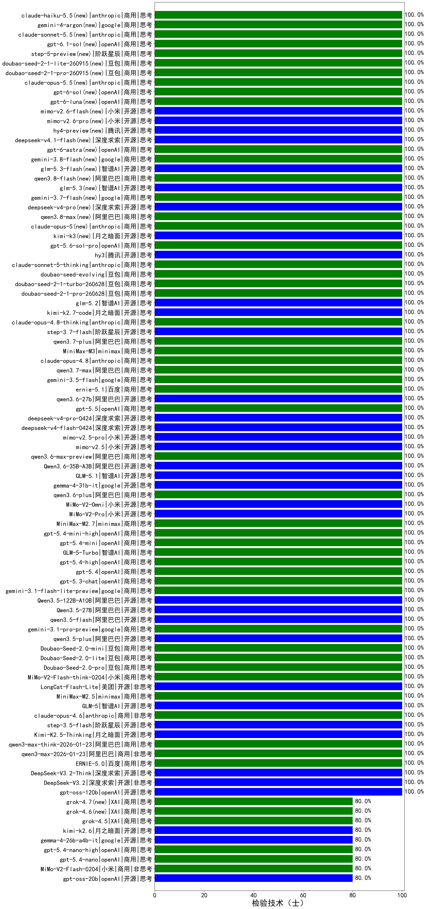

|类别|机构|大模型|【检验技术（士）】准确率|平均耗时|平均消耗token|花费/千次（元）|排名（准确率）|
|---|---|-----|-------------------|-------|-----------|-----------|-----------|
|开源|openAI|gpt-oss-120b|100.0%|4s|499|1.3|1|
|开源|智谱AI|glm-5.2|100.0%|29s|940|24.9|2|
|商用|豆包|doubao-seed-evolving|100.0%|113s|2916|85.0|3|
|商用|anthropic|claude-sonnet-5-thinking|100.0%|12s|676|41.7|4|
|开源|腾讯|hy3|100.0%|72s|205|0.6|5|
|商用|openAI|gpt-5.6-sol-pro|100.0%|8s|2618|168.0|6|
|开源|月之暗面|kimi-k3|100.0%|18s|360|24.8|7|
|商用|anthropic|claude-opus-5|100.0%|30s|662|101.8|8|
|商用|阿里巴巴|qwen3.8-max|100.0%|9s|485|15.0|9|
|开源|深度求索|deepseek-v4-pro|100.0%|8s|380|7.7|10|
|商用|google|gemini-3.7-flash|100.0%|5s|591|14.2|11|
|开源|智谱AI|glm-5.3(new)|100.0%|1107s|703|18.3|12|
|商用|阿里巴巴|qwen3.8-flash(new)|100.0%|132s|465|1.0|13|
|开源|智谱AI|glm-5.3-flash(new)|100.0%|19s|689|1.8|14|
|商用|google|gemini-3.8-flash(new)|100.0%|19s|584|28.0|15|
|商用|openAI|gpt-6-astra(new)|100.0%|8s|217|52.9|16|
|开源|深度求索|deepseek-v4.1-flash(new)|100.0%|21s|311|2.0|17|
|开源|腾讯|hy4-preview(new)|100.0%|54s|680|11.3|18|
|开源|小米|mimo-v2.6-pro(new)|100.0%|53s|565|3.2|19|
|开源|小米|mimo-v2.6-flash(new)|100.0%|63s|587|1.1|20|
|商用|openAI|gpt-6-luna(new)|100.0%|243s|266|0.7|21|
|商用|openAI|gpt-6-sol(new)|100.0%|61s|184|8.3|22|
|商用|anthropic|claude-opus-5.5(new)|100.0%|125s|636|77.6|23|
|商用|豆包|doubao-seed-2-1-pro-260915(new)|100.0%|51s|926|25.3|24|
|商用|豆包|doubao-seed-2-1-lite-260915(new)|100.0%|15s|420|1.0|25|
|商用|阶跃星辰|step-5-preview(new)|100.0%|5s|361|6.3|26|
|商用|openAI|gpt-6.1-sol(new)|100.0%|5s|203|9.6|27|
|商用|anthropic|claude-sonnet-5.5(new)|100.0%|8s|492|28.7|28|
|商用|google|gemini-4-argon(new)|100.0%|23s|352|39.1|29|
|商用|anthropic|claude-haiku-5.5(new)|100.0%|6s|735|2.3|30|
|商用|minimax|MiniMax-M3.1-Flash(new)|100.0%|9s|516|1.3|31|
|商用|豆包|doubao-seed-2-1-pro-260628|100.0%|95s|4004|117.7|32|
|商用|豆包|doubao-seed-2-1-turbo-260628|100.0%|104s|3982|58.5|33|
|开源|月之暗面|kimi-k2.7-code|100.0%|10s|414|9.9|34|
|开源|小米|mimo-v2.5-pro|100.0%|17s|1013|16.9|35|
|开源|深度求索|DeepSeek-V3.2|100.0%|30s|369|1.0|36|
|开源|深度求索|DeepSeek-V3.2-Think|100.0%|15s|498|1.4|37|
|商用|百度|ERNIE-5.0|100.0%|89s|1645|38.5|38|
|商用|google|gemini-3.1-pro-preview|100.0%|54s|1080|87.4|39|
|开源|阿里巴巴|Qwen3.5-27B|100.0%|295s|2161|10.1|40|
|开源|阿里巴巴|Qwen3.5-122B-A10B|100.0%|67s|1601|9.9|41|
|商用|google|gemini-3.1-flash-lite-preview|100.0%|5s|364|3.3|42|
|商用|minimax|MiniMax-M2.7|100.0%|17s|715|5.4|43|
|商用|阿里巴巴|qwen3.6-plus|100.0%|41s|1223|14.0|44|
|开源|google|gemma-4-31b-it|100.0%|84s|518|1.3|45|
|开源|智谱AI|GLM-5.1|100.0%|110s|1005|23.0|46|
|开源|阿里巴巴|Qwen3.6-35B-A3B|100.0%|92s|1475|15.3|47|
|商用|阿里巴巴|qwen3.6-max-preview|100.0%|39s|1282|66.3|48|
|开源|小米|mimo-v2.5|100.0%|13s|931|9.6|49|
|开源|深度求索|deepseek-v4-flash-0424|100.0%|11s|366|0.7|50|
|商用|google|gemini-3.5-flash|100.0%|7s|1049|62.7|51|
|商用|anthropic|claude-opus-4.8-thinking|100.0%|11s|676|104.3|52|
|开源|阶跃星辰|step-3.7-flash|100.0%|16s|1344|10.4|53|
|商用|阿里巴巴|qwen3.7-plus|100.0%|16s|712|5.3|54|
|商用|minimax|MiniMax-M3|100.0%|17s|509|5.7|55|
|商用|anthropic|claude-opus-4.8|100.0%|7s|473|68.8|56|
|商用|阿里巴巴|qwen3.7-max|100.0%|24s|741|25.1|57|
|商用|百度|ernie-5.1|100.0%|21s|705|11.9|58|
|开源|阿里巴巴|qwen3.6-27b|100.0%|22s|1398|24.2|59|
|商用|openAI|gpt-5.5|100.0%|20s|284|45.2|60|
|开源|深度求索|deepseek-v4-pro-0424|100.0%|18s|442|9.9|61|
|开源|openAI|gpt-oss-20b|80.0%|6s|1319|1.4|62|
|商用|XAI|grok-4.7(new)|80.0%|60s|2299|60.1|63|
|商用|XAI|grok-4.6|80.0%|17s|951|32.5|64|
|开源|google|gemma-4-26b-a4b-it|80.0%|16s|605|1.6|65|
|商用|XAI|grok-4.5|80.0%|41s|822|27.1|66|
|开源|月之暗面|kimi-k2.6|80.0%|58s|1030|26.6|67|
|开源|月之暗面|kimi-k3.1-pro(new)|80.0%|66s|1652|104.6|68|

