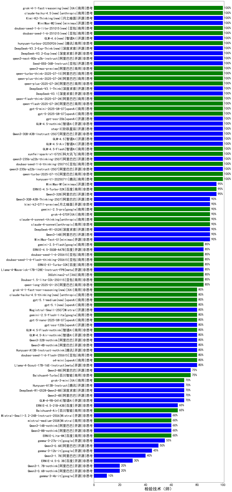

| 类别 | 大模型                         | 检验技术（师） | 排名 |
|-----|------------------------------|---------|----|
|商用|hunyuan-turbo|100.0|1|
|商用|ERNIE-4.5-8K-Preview|98.0|2|
|开源|hunyuan-large|97.1|3|
|商用|hunyuan-turbos-20250226|97.1|4|
|商用|GLM-4-Plus|90.0|5|
|商用|claude-4-sonnet(new)|90.0|6|
|商用|claude-4-sonnet-thinking(new)|90.0|7|
|商用|xunfei-4.0Ultra|90.0|8|
|商用|gemini-2.5-pro-preview-05-06(new)|90.0|9|
|商用|gemini-2.5-pro-preview-03-25|90.0|10|
|开源|Qwen3-235B-A22B|90.0|11|
|商用|Doubao-1.5-thinking-pro(new)|90.0|12|
|商用|gpt-4.1(new)|90.0|13|
|商用|ERNIE-4.5-Turbo-32K(new)|88.0|14|
|开源|DeepSeek-R1-0528(new)|86.7|15|
|开源|Qwen3-32B|86.7|16|
|商用|hunyuan-turbos-20250313|85.0|17|
|商用|hunyuan-t1-20250321|84.8|18|
|商用|Doubao-1.5-lite-32k-250115|83.8|19|
|商用|Doubao-1.5-pro-32k-250115|83.8|20|
|开源|Qwen3-30B-A3B|83.3|21|
|开源|Qwen3-14B|83.3|22|
|开源|Llama-4-Maverick-17B-128E-Instruct-FP8|83.0|23|
|开源|DeepSeek-R1|82.4|24|
|商用|Claude-3.5-Sonnet|80.0|25|
|商用|o4-mini(new)|80.0|26|
|开源|Qwen3-8B|80.0|27|
|商用|ERNIE-X1-Turbo-32K(new)|80.0|28|
|商用|gpt-4.1-mini(new)|80.0|29|
|商用|gemini-2.5-flash-preview-05-20(new)|80.0|30|
|开源|Llama-4-Scout-17B-16E-Instruct|79.5|31|
|商用|xunfei-spark-max|79.4|32|
|开源|deepseek-chat-v3-0324|78.5|33|
|开源|GLM-4-32B-0414|78.0|34|
|商用|xunfei-spark-x1(new)|78.0|35|
|商用|gemini-2.5-flash-preview-04-17|76.7|36|
|开源|GLM-Z1-32B-0414|76.7|37|
|商用|qwq-plus-2025-03-05|76.5|38|
|商用|hunyuan-standard|75.0|39|
|商用|GLM-Z1-Air|75.0|40|
|商用|qwen2.5-max|75.0|41|
|商用|360gpt2-pro|73.5|42|
|开源|DeepSeek-R1-Distill-Qwen-32B|73.5|43|
|商用|xunfei-spark-pro|73.5|44|
|商用|qwen-plus|73.5|45|
|商用|SenseChat-5-beta|73.5|46|
|商用|qwen-long|72.1|47|
|开源|qwen2.5-32b-instruct|72.1|48|
|商用|qwen-turbo|72.1|49|
|商用|360gpt2-o1|72.1|50|
|商用|kimi-latest-8k|72.1|51|
|开源|qwq-32b|70.6|52|
|开源|MiniMax-Text-01|70.6|53|
|开源|qwen2.5-72b-instruct|69.1|54|
|商用|yi-lightning|69.1|55|
|商用|chatgpt-4o-latest|67.6|56|
|商用|GLM-4-Air|67.6|57|
|开源|GLM-4-9B-0414|67.0|58|
|商用|GLM-Z1-AirX|66.7|59|
|商用|SenseChat-5-1202|66.2|60|
|商用|360zhinao2-o1|66.2|61|
|开源|qwen2.5-14b-instruct|66.2|62|
|开源|DeepSeek-R1-Distill-Qwen-14B|66.2|63|
|商用|GLM-4-AirX|66.2|64|
|商用|Baichuan4-Turbo|66.2|65|
|商用|GLM-4-Long|66.2|66|
|开源|GLM-Z1-9B-0414|65.0|67|
|开源|qwen2.5-7b-instruct|64.7|68|
|开源|Qwen3-4B|63.3|69|
|商用|GLM-Z1-FlashX|60.5|70|
|开源|Llama-3.3-70B-Instruct|60.3|71|
|开源|Meta-Llama-3.1-405B-Instruct|60.3|72|
|开源|internlm2_5-7b-chat|60.3|73|
|商用|360gpt-turbo|60.3|74|
|开源|Llama-3.3-70B-Instruct-fp8|60.3|75|
|商用|GLM-Z1-Flash|59.0|76|
|商用|ERNIE-3.5-8K|58.8|77|
|商用|SenseChat-Turbo-1202|58.8|78|
|开源|gemma-3-27b-it|58.0|79|
|商用|Baichuan4-Air|57.4|80|
|开源|Mistral-Small-3.1-24B-Instruct-2503|57.0|81|
|开源|DeepSeek-R1-0528-Qwen3-8B(new)|56.7|82|
|开源|gemma-3-12b-it|56.0|83|
|开源|DeepSeek-R1-Distill-Llama-70B|55.9|84|
|商用|ERNIE-Lite-8K|54.0|85|
|商用|GLM-4-FlashX|52.9|86|
|商用|mistral-large|51.5|87|
|商用|gpt-4o-mini|48.5|88|
|商用|step-2-mini|48.5|89|
|开源|qwen2.5-3b-instruct|48.5|90|
|商用|ERNIE-Speed-8K|47.1|91|
|商用|GLM-4-Flash|47.1|92|
|开源|Qwen3-1.7B|46.7|93|
|开源|phi-4|45.6|94|
|开源|GLM-Z1-Rumination-32B-0414|43.3|95|
|开源|Qwen3-0.6B|43.3|96|
|商用|mistral-small|42.6|97|
|开源|Llama-3.1-8B-Instruct|42.6|98|
|商用|moonshot-v1-8k|42.6|99|
|商用|ERNIE-Speed-Pro-128K|42.6|100|
|开源|qwen2.5-1.5b-instruct|41.2|101|
|商用|ERNIE-Lite-Pro-128K|39.7|102|
|开源|Meta-Llama-3.1-8B-Instruct-fp8|35.3|103|
|开源|gemma-3-4b-it|33.0|104|
|开源|Llama-3.2-3B-Instruct|32.4|105|
|商用|ministral-8b|30.9|106|
|开源|DeepSeek-R1-Distill-Llama-8B|30.9|107|
|开源|qwen2.5-0.5b-instruct|27.9|108|
|开源|Llama-3.2-1B-Instruct|26.5|109|
|商用|ministral-3b|25.0|110|
|商用|xunfei-spark-lite|20.6|111|
|商用|ERNIE-Tiny-8K|20.6|112|
|开源|DeepSeek-R1-Distill-Qwen-7B|19.1|113|

