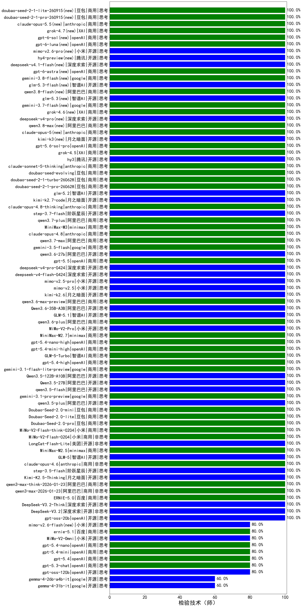

|类别|机构|大模型|【检验技术（师）】准确率|平均耗时|平均消耗token|花费/千次（元）|排名（准确率）|
|---|---|-----|-------------------|-------|-----------|-----------|-----------|
|开源|小米|mimo-v2.5-pro|100.0%|15s|954|15.7|1|
|开源|阶跃星辰|step-3.7-flash|100.0%|75s|1185|9.2|2|
|开源|腾讯|hy3|100.0%|246s|174|0.5|3|
|商用|anthropic|claude-sonnet-5-thinking|100.0%|18s|639|40.2|4|
|商用|豆包|doubao-seed-evolving|100.0%|203s|6475|191.9|5|
|商用|豆包|doubao-seed-2-1-turbo-260628|100.0%|170s|5543|81.9|6|
|商用|豆包|doubao-seed-2-1-pro-260628|100.0%|353s|5842|172.9|7|
|开源|智谱AI|glm-5.2|100.0%|33s|1052|28.1|8|
|开源|月之暗面|kimi-k2.7-code|100.0%|12s|346|8.1|9|
|商用|anthropic|claude-opus-4.8-thinking|100.0%|10s|550|85.0|10|
|商用|阿里巴巴|qwen3.7-plus|100.0%|17s|790|5.9|11|
|开源|小米|mimo-v2.5|100.0%|11s|842|8.4|12|
|商用|minimax|MiniMax-M3|100.0%|17s|525|6.0|13|
|商用|anthropic|claude-opus-4.8|100.0%|10s|521|79.8|14|
|商用|阿里巴巴|qwen3.7-max|100.0%|27s|734|24.9|15|
|商用|google|gemini-3.5-flash|100.0%|7s|1010|60.6|16|
|开源|阿里巴巴|qwen3.6-27b|100.0%|19s|1207|20.8|17|
|商用|openAI|gpt-5.5|100.0%|6s|241|39.1|18|
|开源|深度求索|deepseek-v4-pro-0424|100.0%|21s|404|9.0|19|
|开源|深度求索|deepseek-v4-flash-0424|100.0%|16s|398|0.7|20|
|商用|XAI|grok-4.5|100.0%|110s|806|26.6|21|
|商用|openAI|gpt-5.6-sol-pro|100.0%|8s|2571|171.2|22|
|开源|月之暗面|kimi-k3(new)|100.0%|21s|383|27.3|23|
|商用|anthropic|claude-opus-5(new)|100.0%|12s|550|84.9|24|
|商用|豆包|doubao-seed-2-1-pro-260915(new)|100.0%|36s|662|17.5|25|
|商用|anthropic|claude-opus-5.5(new)|100.0%|15s|527|64.4|26|
|商用|XAI|grok-4.7(new)|100.0%|31s|1960|46.0|27|
|商用|openAI|gpt-6-sol(new)|100.0%|413s|139|6.0|28|
|商用|openAI|gpt-6-luna(new)|100.0%|199s|222|0.6|29|
|开源|小米|mimo-v2.6-pro(new)|100.0%|18s|617|3.5|30|
|开源|腾讯|hy4-preview(new)|100.0%|16s|839|14.2|31|
|开源|深度求索|deepseek-v4.1-flash(new)|100.0%|3s|277|1.7|32|
|商用|openAI|gpt-6-astra(new)|100.0%|12s|167|40.1|33|
|商用|google|gemini-3.8-flash(new)|100.0%|23s|507|24.2|34|
|开源|智谱AI|glm-5.3-flash(new)|100.0%|27s|1079|2.9|35|
|商用|阿里巴巴|qwen3.8-flash(new)|100.0%|11s|510|1.2|36|
|开源|智谱AI|glm-5.3(new)|100.0%|22s|649|16.8|37|
|商用|google|gemini-3.7-flash(new)|100.0%|45s|707|17.3|38|
|商用|XAI|grok-4.6(new)|100.0%|29s|801|26.3|39|
|开源|深度求索|deepseek-v4-pro(new)|100.0%|10s|368|7.5|40|
|商用|阿里巴巴|qwen3.8-max(new)|100.0%|8s|399|11.9|41|
|开源|openAI|gpt-oss-20b|100.0%|5s|933|1.0|42|
|商用|豆包|doubao-seed-2-1-lite-260915(new)|100.0%|17s|430|1.0|43|
|开源|月之暗面|kimi-k2.6|100.0%|65s|1105|28.6|44|
|商用|minimax|MiniMax-M2.5|100.0%|17s|916|7.1|45|
|商用|google|gemini-3.1-pro-preview|100.0%|25s|1171|95.7|46|
|开源|阿里巴巴|qwen3.5-plus|100.0%|21s|1649|7.7|47|
|商用|豆包|Doubao-Seed-2.0-mini|100.0%|457s|2099|4.0|48|
|商用|豆包|Doubao-Seed-2.0-lite|100.0%|158s|747|2.4|49|
|商用|豆包|Doubao-Seed-2.0-pro|100.0%|207s|849|12.3|50|
|商用|小米|MiMo-V2-Flash-think-0204|100.0%|720s|1160|2.3|51|
|商用|小米|MiMo-V2-Flash-0204|100.0%|319s|526|1.0|52|
|开源|美团|LongCat-Flash-Lite|100.0%|209s|403|0.0|53|
|开源|智谱AI|GLM-5|100.0%|57s|1386|24.1|54|
|商用|阿里巴巴|qwen3.6-max-preview|100.0%|38s|1311|67.9|55|
|商用|anthropic|claude-opus-4.6|100.0%|23s|537|82.7|56|
|开源|阶跃星辰|step-3.5-flash|100.0%|13s|798|1.6|57|
|开源|月之暗面|Kimi-K2.5-Thinking|100.0%|252s|1296|26.2|58|
|商用|阿里巴巴|qwen3-max-think-2026-01-23|100.0%|112s|2276|22.2|59|
|商用|阿里巴巴|qwen3-max-2026-01-23|100.0%|16s|412|3.6|60|
|商用|百度|ERNIE-5.0|100.0%|142s|1524|35.6|61|
|开源|深度求索|DeepSeek-V3.2-Think|100.0%|83s|579|1.7|62|
|开源|深度求索|DeepSeek-V3.2|100.0%|9s|245|0.7|63|
|开源|阿里巴巴|qwen3.5-flash|100.0%|301s|2383|4.6|64|
|开源|阿里巴巴|Qwen3.5-27B|100.0%|141s|2205|10.3|65|
|开源|阿里巴巴|Qwen3.5-122B-A10B|100.0%|280s|1986|12.3|66|
|商用|openAI|gpt-5.4-nano-high|100.0%|51s|473|3.7|67|
|开源|阿里巴巴|Qwen3.6-35B-A3B|100.0%|9s|1356|14.1|68|
|开源|智谱AI|GLM-5.1|100.0%|55s|993|22.8|69|
|商用|阿里巴巴|qwen3.6-plus|100.0%|25s|1224|14.0|70|
|开源|小米|MiMo-V2-Pro|100.0%|188s|1045|17.6|71|
|商用|google|gemini-3.1-flash-lite-preview|100.0%|27s|282|2.5|72|
|商用|minimax|MiniMax-M2.7|100.0%|27s|1079|8.5|73|
|商用|openAI|gpt-5.4-mini-high|100.0%|6s|504|14.2|74|
|商用|智谱AI|GLM-5-Turbo|100.0%|20s|1047|22.0|75|
|商用|openAI|gpt-5.4-high|100.0%|7s|360|32.0|76|
|商用|openAI|gpt-5.4-nano|80.0%|5s|174|1.0|77|
|商用|openAI|gpt-5.4-mini|80.0%|21s|174|3.8|78|
|开源|小米|MiMo-V2-Omni|80.0%|199s|1025|10.9|79|
|开源|小米|mimo-v2.6-flash(new)|80.0%|27s|989|1.9|80|
|商用|百度|ernie-5.1|80.0%|20s|657|11.1|81|
|商用|openAI|gpt-5.4|80.0%|14s|208|16.1|82|
|商用|openAI|gpt-5.3-chat|80.0%|7s|330|26.7|83|
|开源|openAI|gpt-oss-120b|80.0%|212s|545|1.5|84|
|开源|google|gemma-4-31b-it|60.0%|89s|527|1.3|85|
|开源|google|gemma-4-26b-a4b-it|60.0%|62s|581|1.5|86|

