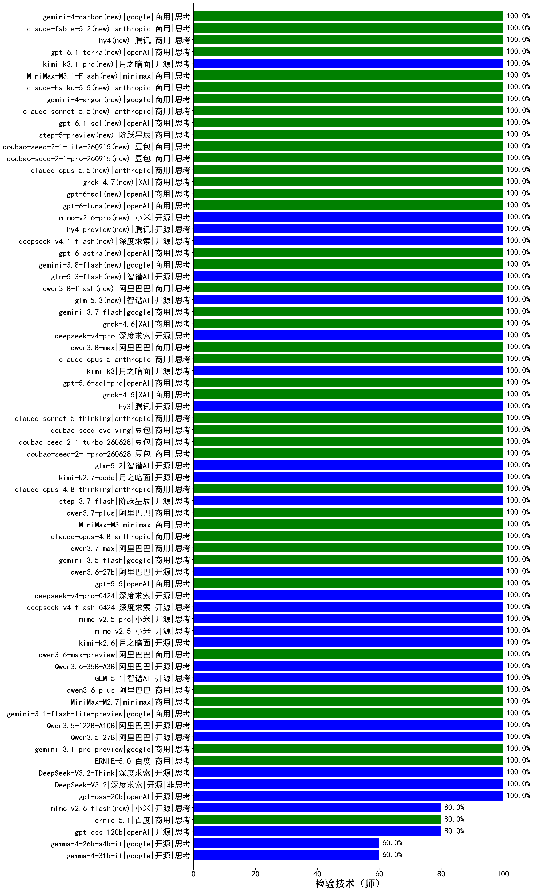

|类别|机构|大模型|【检验技术（师）】准确率|平均耗时|平均消耗token|花费/千次（元）|排名（准确率）|
|---|---|-----|-------------------|-------|-----------|-----------|-----------|
|商用|豆包|doubao-seed-evolving|100.0%|203s|6475|191.9|1|
|商用|XAI|grok-4.6|100.0%|29s|801|26.3|2|
|商用|openAI|gpt-6-astra(new)|100.0%|12s|167|40.1|3|
|商用|google|gemini-3.8-flash(new)|100.0%|23s|507|24.2|4|
|开源|智谱AI|glm-5.3-flash(new)|100.0%|27s|1079|2.9|5|
|商用|阿里巴巴|qwen3.8-flash(new)|100.0%|11s|510|1.2|6|
|开源|智谱AI|glm-5.3(new)|100.0%|22s|649|16.8|7|
|商用|google|gemini-3.7-flash|100.0%|45s|707|17.3|8|
|开源|深度求索|deepseek-v4-pro|100.0%|10s|368|7.5|9|
|开源|腾讯|hy4-preview(new)|100.0%|16s|839|14.2|10|
|商用|阿里巴巴|qwen3.8-max|100.0%|8s|399|11.9|11|
|商用|anthropic|claude-opus-5|100.0%|12s|550|84.9|12|
|开源|月之暗面|kimi-k3|100.0%|21s|383|27.3|13|
|商用|openAI|gpt-5.6-sol-pro|100.0%|8s|2571|171.2|14|
|商用|XAI|grok-4.5|100.0%|110s|806|26.6|15|
|开源|腾讯|hy3|100.0%|246s|174|0.5|16|
|开源|深度求索|deepseek-v4.1-flash(new)|100.0%|3s|277|1.7|17|
|开源|小米|mimo-v2.6-pro(new)|100.0%|18s|617|3.5|18|
|开源|openAI|gpt-oss-20b|100.0%|5s|933|1.0|19|
|商用|anthropic|claude-sonnet-5.5(new)|100.0%|9s|404|23.6|20|
|商用|腾讯|hy4(new)|100.0%|36s|1138|19.6|21|
|商用|openAI|gpt-6.1-terra(new)|100.0%|5s|165|3.9|22|
|开源|月之暗面|kimi-k3.1-pro(new)|100.0%|19s|688|39.3|23|
|商用|minimax|MiniMax-M3.1-Flash(new)|100.0%|10s|601|1.6|24|
|商用|anthropic|claude-haiku-5.5(new)|100.0%|8s|496|1.5|25|
|商用|google|gemini-4-argon(new)|100.0%|12s|487|58.5|26|
|商用|openAI|gpt-6.1-sol(new)|100.0%|6s|151|6.9|27|
|商用|openAI|gpt-6-luna(new)|100.0%|199s|222|0.6|28|
|商用|阶跃星辰|step-5-preview(new)|100.0%|5s|365|6.5|29|
|商用|豆包|doubao-seed-2-1-lite-260915(new)|100.0%|17s|430|1.0|30|
|商用|豆包|doubao-seed-2-1-pro-260915(new)|100.0%|36s|662|17.5|31|
|商用|anthropic|claude-opus-5.5(new)|100.0%|15s|527|64.4|32|
|商用|XAI|grok-4.7(new)|100.0%|31s|1960|46.0|33|
|商用|openAI|gpt-6-sol(new)|100.0%|413s|139|6.0|34|
|商用|anthropic|claude-sonnet-5-thinking|100.0%|18s|639|40.2|35|
|商用|anthropic|claude-fable-5.2(new)|100.0%|17s|351|79.7|36|
|商用|豆包|doubao-seed-2-1-turbo-260628|100.0%|170s|5543|81.9|37|
|开源|小米|mimo-v2.5-pro|100.0%|15s|954|15.7|38|
|开源|深度求索|DeepSeek-V3.2|100.0%|9s|245|0.7|39|
|开源|深度求索|DeepSeek-V3.2-Think|100.0%|83s|579|1.7|40|
|商用|百度|ERNIE-5.0|100.0%|142s|1524|35.6|41|
|商用|google|gemini-3.1-pro-preview|100.0%|25s|1171|95.7|42|
|开源|阿里巴巴|Qwen3.5-27B|100.0%|141s|2205|10.3|43|
|开源|阿里巴巴|Qwen3.5-122B-A10B|100.0%|280s|1986|12.3|44|
|商用|google|gemini-3.1-flash-lite-preview|100.0%|27s|282|2.5|45|
|商用|minimax|MiniMax-M2.7|100.0%|27s|1079|8.5|46|
|商用|阿里巴巴|qwen3.6-plus|100.0%|25s|1224|14.0|47|
|开源|智谱AI|GLM-5.1|100.0%|55s|993|22.8|48|
|开源|阿里巴巴|Qwen3.6-35B-A3B|100.0%|9s|1356|14.1|49|
|商用|阿里巴巴|qwen3.6-max-preview|100.0%|38s|1311|67.9|50|
|开源|月之暗面|kimi-k2.6|100.0%|65s|1105|28.6|51|
|商用|豆包|doubao-seed-2-1-pro-260628|100.0%|353s|5842|172.9|52|
|开源|小米|mimo-v2.5|100.0%|11s|842|8.4|53|
|开源|深度求索|deepseek-v4-flash-0424|100.0%|16s|398|0.7|54|
|商用|anthropic|claude-opus-4.8|100.0%|10s|521|79.8|55|
|开源|智谱AI|glm-5.2|100.0%|33s|1052|28.1|56|
|开源|月之暗面|kimi-k2.7-code|100.0%|12s|346|8.1|57|
|商用|anthropic|claude-opus-4.8-thinking|100.0%|10s|550|85.0|58|
|开源|阶跃星辰|step-3.7-flash|100.0%|75s|1185|9.2|59|
|商用|阿里巴巴|qwen3.7-plus|100.0%|17s|790|5.9|60|
|商用|minimax|MiniMax-M3|100.0%|17s|525|6.0|61|
|商用|阿里巴巴|qwen3.7-max|100.0%|27s|734|24.9|62|
|商用|google|gemini-3.5-flash|100.0%|7s|1010|60.6|63|
|开源|阿里巴巴|qwen3.6-27b|100.0%|19s|1207|20.8|64|
|商用|openAI|gpt-5.5|100.0%|6s|241|39.1|65|
|开源|深度求索|deepseek-v4-pro-0424|100.0%|21s|404|9.0|66|
|开源|小米|mimo-v2.6-flash(new)|80.0%|27s|989|1.9|67|
|商用|百度|ernie-5.1|80.0%|20s|657|11.1|68|
|开源|openAI|gpt-oss-120b|80.0%|212s|545|1.5|69|
|开源|google|gemma-4-31b-it|60.0%|89s|527|1.3|70|
|开源|google|gemma-4-26b-a4b-it|60.0%|62s|581|1.5|71|

