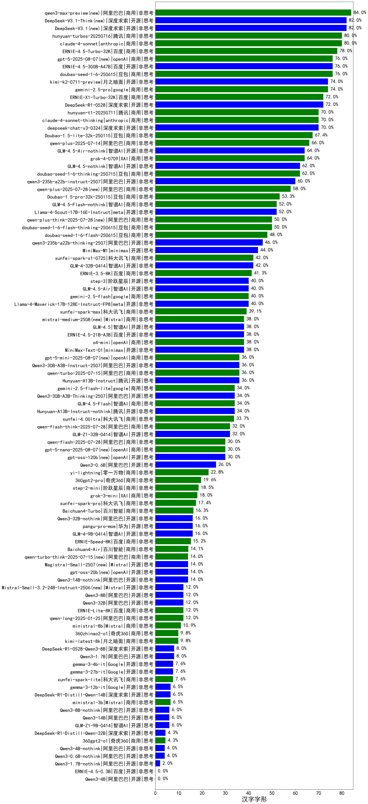

|类别|机构|大模型|【汉字字形】准确率|平均耗时|平均消耗token|花费/千次（元）|排名（准确率）|
|---|---|-----|-------------------|-------|-----------|-----------|-----------|
|开源|深度求索|DeepSeek-V3.2-Think(new)|96.7%|208s|1149|3.4|1|
|开源|深度求索|DeepSeek-V3.2-Exp-Think(new)|90.0%|276s|1207|3.6|2|
|商用|阿里巴巴|qwen3-max-preview|86.7%|10s|441|10.1|3|
|商用|腾讯|hunyuan-2.0-thinking-20251109(new)|83.3%|17s|1591|6.3|4|
|商用|google|gemini-3-pro-preview(new)|83.3%|100s|2853|241.7|5|
|开源|深度求索|DeepSeek-V3.1|83.3%|17s|301|3.4|6|
|开源|深度求索|DeepSeek-V3.1-Think|83.3%|77s|1389|16.5|7|
|开源|月之暗面|kimi-k2-0711-preview|83.3%|66s|1040|16.3|8|
|商用|百度|ERNIE-X1-Turbo-32K|83.3%|374s|1399|5.5|9|
|开源|深度求索|DeepSeek-V3.2-Exp(new)|80.0%|15s|324|1.0|10|
|开源|百度|ERNIE-4.5-300B-A47B|80.0%|205s|79|0.5|11|
|商用|百度|ERNIE-4.5-Turbo-32K|80.0%|7s|167|0.5|12|
|商用|豆包|doubao-seed-1-6-250615|80.0%|141s|193|1.1|13|
|商用|豆包|Doubao-1.5-lite-32k-250115|80.0%|1s|95|0.0|14|
|商用|anthropic|claude-opus-4.5(new)|80.0%|13s|157|23.1|15|
|商用|anthropic|claude-4-sonnet|77.8%|37s|127|11.3|16|
|商用|openAI|gpt-5-2025-08-07|76.7%|42s|495|34.6|17|
|商用|anthropic|claude-sonnet-4.5(new)|76.7%|3s|144|12.7|18|
|开源|深度求索|DeepSeek-R1-0528|76.7%|155s|2695|42.8|19|
|开源|深度求索|DeepSeek-V3.2(new)|76.7%|103s|380|1.1|20|
|商用|阿里巴巴|qwen3-max-2025-09-23(new)|76.7%|277s|443|10.2|21|
|开源|月之暗面|Kimi-K2-Thinking(new)|73.3%|49s|555|8.6|22|
|商用|腾讯|hunyuan-turbos-20250926(new)|73.3%|16s|625|1.2|23|
|商用|openAI|gpt-5.1-medium(new)|70.0%|42s|1036|71.9|24|
|商用|google|gemini-2.5-pro|70.0%|25s|2311|166.2|25|
|商用|XAI|grok-4-0709|70.0%|424s|2595|279.9|26|
|商用|百度|ERNIE-5.0-Thinking-Preview(new)|70.0%|100s|1143|27.1|27|
|开源|月之暗面|kimi-k2-0905(new)|70.0%|107s|1252|19.5|28|
|商用|anthropic|claude-sonnet-4.5-thinking(new)|70.0%|26s|1439|150.9|29|
|开源|智谱AI|GLM-4.5-Air-nothink|70.0%|3s|256|1.4|30|
|商用|openAI|gpt-5.1-high(new)|66.7%|209s|3486|245.9|31|
|商用|anthropic|claude-4-sonnet-thinking|66.7%|42s|437|44.9|32|
|商用|openAI|gpt-5.1(new)|66.7%|110s|100|5.5|33|
|开源|Mistral|mistral-large-2512(new)|66.7%|8s|244|2.4|34|
|商用|百度|ERNIE-X1.1-Preview(new)|63.3%|84s|1503|6.0|35|
|商用|豆包|doubao-seed-1-6-251015(new)|63.3%|42s|634|4.7|36|
|商用|腾讯|hunyuan-t1-20250711|63.3%|27s|1488|5.8|37|
|商用|阿里巴巴|qwen-plus-2025-07-28|63.3%|20s|639|1.2|38|
|开源|阿里巴巴|qwen3-235b-a22b-instruct-2507|63.3%|15s|591|4.6|39|
|开源|meta|Llama-4-Scout-17B-16E-Instruct|60.0%|1s|59|0.1|40|
|商用|腾讯|hunyuan-2.0-instruct-20251111(new)|60.0%|13s|835|1.6|41|
|商用|豆包|doubao-seed-1-6-thinking-250715|56.7%|9s|1207|9.5|42|
|开源|智谱AI|GLM-4.5-nothink|56.7%|12s|331|4.3|43|
|开源|minimax|MiniMax-M1|53.3%|89s|2215|16.7|44|
|商用|豆包|doubao-seed-1-6-flash-thinking-250615|53.3%|6s|588|0.8|45|
|商用|豆包|doubao-seed-1-6-flash-250615|53.3%|2s|315|0.4|46|
|开源|minimax|MiniMax-Text-01|50.0%|6s|728|5.0|47|
|商用|智谱AI|GLM-4.5-Flash-nothink|50.0%|7s|225|0.0|48|
|商用|阿里巴巴|qwen-plus-think-2025-07-28|46.7%|/|3460|27.5|49|
|开源|阿里巴巴|qwen3-235b-a22b-thinking-2507|43.3%|91s|3868|76.9|50|
|开源|阿里巴巴|qwen3-next-80b-a3b-instruct|43.3%|8s|545|2.1|51|
|开源|meta|Llama-4-Maverick-17B-128E-Instruct-FP8|43.3%|3s|278|1.1|52|
|开源|阿里巴巴|qwen3-next-80b-a3b-thinking(new)|40.0%|42s|4623|18.4|53|
|开源|智谱AI|GLM-4.6(new)|40.0%|49s|2400|33.3|54|
|商用|anthropic|claude-haiku-4.5-thinking(new)|40.0%|51s|3056|108.5|55|
|商用|anthropic|claude-haiku-4.5(new)|40.0%|9s|174|4.9|56|
|开源|阶跃星辰|step-3|40.0%|102s|1950|7.7|57|
|开源|智谱AI|GLM-4.5|40.0%|90s|2689|37.4|58|
|开源|腾讯|Hunyuan-A13B-Instruct-nothink|40.0%|36s|152|0.5|59|
|开源|百度|ERNIE-4.5-21B-A3B|40.0%|54s|161|0.0|60|
|开源|阿里巴巴|Qwen3-0.6B|36.7%|4s|869|2.5|61|
|商用|openAI|gpt-5-mini-2025-08-07|36.7%|34s|1595|22.8|62|
|开源|腾讯|Hunyuan-A13B-Instruct|36.7%|59s|1272|5.0|63|
|商用|openAI|o4-mini|36.7%|132s|3326|105.3|64|
|开源|minimax|MiniMax-M2(new)|34.5%|38s|2694|22.3|65|
|商用|阿里巴巴|qwen-turbo-2025-07-15|33.3%|7s|311|0.2|66|
|商用|科大讯飞|xunfei-spark-x1-0725|33.3%|/|809|9.7|67|
|开源|智谱AI|GLM-4.5-Air|33.3%|31s|1959|11.6|68|
|商用|google|gemini-2.5-flash|33.3%|8s|1048|18.7|69|
|商用|阿里巴巴|qwen-flash-think-2025-07-28|33.3%|29s|2910|4.3|70|
|商用|智谱AI|GLM-4.5-Flash|33.3%|55s|2174|0.0|71|
|商用|openAI|gpt-5-mini-high(new)|33.3%|91s|5378|77.6|72|
|开源|豆包|Seed-OSS-36B-Instruct|30.0%|162s|2221|8.8|73|
|商用|豆包|doubao-seed-1-6-lite-251015(new)|30.0%|116s|767|1.7|74|
|开源|阿里巴巴|Qwen3-30B-A3B-Thinking-2507|30.0%|72s|3072|8.5|75|
|商用|google|gemini-2.5-flash-lite|30.0%|1s|96|0.2|76|
|开源|阿里巴巴|Qwen3-30B-A3B-Instruct-2507|30.0%|6s|655|1.9|77|
|商用|Mistral|mistral-medium-2508|30.0%|14s|133|1.6|78|
|商用|阿里巴巴|qwen-flash-2025-07-28|23.3%|9s|635|0.9|79|
|商用|openAI|gpt-5-nano-2025-08-07|23.3%|29s|3727|10.7|80|
|开源|openAI|gpt-oss-120b|23.3%|240s|1091|3.4|81|
|商用|百度|ERNIE-Lite-8K|20.0%|3s|148|0.0|82|
|开源|阿里巴巴|Qwen3-32B|16.7%|49s|2367|9.4|83|
|开源|google|gemma-3-12b-it|16.7%|4s|109|0.0|84|
|商用|百川智能|Baichuan4-Turbo|16.7%|9s|450|6.8|85|
|商用|百川智能|Baichuan4-Air|16.7%|7s|345|0.3|86|
|商用|阿里巴巴|qwen-long-2025-01-25|16.7%|85s|208|0.4|87|
|开源|阿里巴巴|Qwen3-32B-nothink|16.7%|19s|278|1.0|88|
|开源|智谱AI|GLM-4-9B-0414|13.3%|2s|149|0.0|89|
|商用|openAI|gpt-5-nano-high(new)|13.3%|103s|9694|28.0|90|
|开源|Mistral|Mistral-Small-3.2-24B-Instruct-2506|13.3%|33s|646|1.4|91|
|商用|XAI|grok-3-mini|13.3%|141s|925|3.3|92|
|开源|Mistral|Magistral-Small-2507|10.0%|216s|7342|79.6|93|
|开源|google|gemma-3-4b-it|10.0%|1s|92|0.0|94|
|商用|阿里巴巴|qwen-turbo-think-2025-07-15|10.0%|/|2316|6.9|95|
|开源|openAI|gpt-oss-20b|10.0%|216s|4441|5.1|96|
|开源|Mistral|Ministral-3-14B-Instruct-2512(new)|10.0%|2s|202|0.3|97|
|商用|360|360zhinao2-o1|10.0%|102s|2524|25.3|98|
|商用|XAI|grok-4-1-fast-non-reasoning(new)|10.0%|116s|322|0.7|99|
|开源|阿里巴巴|Qwen3-8B|6.7%|115s|3206|0.0|100|
|开源|阿里巴巴|Qwen3-14B|6.7%|50s|3383|6.7|101|
|开源|深度求索|DeepSeek-R1-0528-Qwen3-8B|6.7%|556s|1895|0.0|102|
|开源|google|gemma-3-27b-it|6.7%|3s|113|0.1|103|
|开源|Mistral|Ministral-3-3B-Instruct-2512(new)|3.3%|1s|170|0.1|104|
|开源|Mistral|Ministral-3-8B-Instruct-2512(new)|3.3%|2s|221|0.2|105|
|商用|XAI|grok-4-1-fast-reasoning(new)|3.3%|12s|1066|3.4|106|
|开源|阿里巴巴|Qwen3-4B-nothink|3.3%|15s|481|1.4|107|
|开源|阿里巴巴|Qwen3-0.6B-nothink|3.3%|5s|136|0.3|108|
|开源|阿里巴巴|Qwen3-1.7B|3.3%|21s|2504|7.4|109|
|开源|阿里巴巴|Qwen3-8B-nothink|3.3%|14s|261|0.0|110|
|开源|阿里巴巴|Qwen3-14B-nothink|3.3%|10s|237|0.4|111|
|开源|百度|ERNIE-4.5-0.3B|/%|47s|117|0.0|112|
|开源|阿里巴巴|Qwen3-1.7B-nothink|/%|14s|682|2.0|113|
|开源|阿里巴巴|Qwen3-4B|/%|20s|1896|5.6|114|

