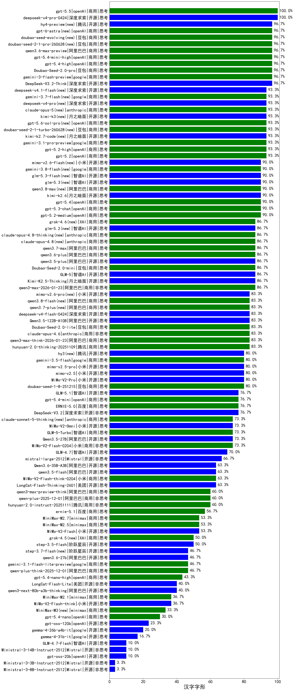

|类别|机构|大模型|【汉字字形】准确率|平均耗时|平均消耗token|花费/千次（元）|排名（准确率）|
|---|---|-----|-------------------|-------|-----------|-----------|-----------|
|开源|深度求索|deepseek-v4-pro-0424|100.0%|40s|830|19.7|1|
|商用|openAI|gpt-5.5|100.0%|14s|354|69.7|2|
|商用|openAI|gpt-6-astra(new)|96.7%|14s|160|48.8|3|
|商用|google|gemini-3-flash-preview|96.7%|16s|1232|25.9|4|
|商用|openAI|gpt-5.4-mini-high|96.7%|19s|1212|37.5|5|
|商用|openAI|gpt-5.4-high|96.7%|14s|646|65.6|6|
|商用|豆包|Doubao-Seed-2.0-pro|96.7%|278s|1235|18.9|7|
|商用|豆包|doubao-seed-evolving(new)|96.7%|259s|10195|304.3|8|
|商用|豆包|doubao-seed-2-1-pro-260628(new)|96.7%|237s|9548|284.9|9|
|商用|阿里巴巴|qwen3.6-max-preview|96.7%|49s|1515|80.6|10|
|开源|深度求索|DeepSeek-V3.2-Think|96.7%|208s|1149|3.4|11|
|商用|anthropic|claude-opus-5(new)|93.3%|12s|672|113.0|12|
|商用|google|gemini-3.1-pro-preview|93.3%|58s|3826|324.5|13|
|商用|豆包|doubao-seed-2-1-turbo-260628(new)|93.3%|176s|8670|129.3|14|
|商用|openAI|gpt-5.6-sol-pro(new)|93.3%|12s|2591|186.3|15|
|开源|月之暗面|kimi-k3(new)|93.3%|103s|2180|202.9|16|
|开源|月之暗面|kimi-k2.7-code(new)|93.3%|72s|3602|96.7|17|
|商用|google|gemini-3.7-flash(new)|93.3%|6s|1022|26.4|18|
|商用|openAI|gpt-5.2|93.3%|7s|104|8.0|19|
|商用|openAI|gpt-5.2-high|93.3%|22s|846|81.8|20|
|开源|深度求索|deepseek-v4-pro(new)|93.3%|173s|4948|131.8|21|
|开源|月之暗面|kimi-k2.6|90.0%|254s|3520|94.5|22|
|商用|openAI|gpt-5.3-chat|90.0%|6s|370|34.0|23|
|商用|openAI|gpt-5.4|90.0%|9s|92|7.4|24|
|开源|智谱AI|glm-5.3-flash(new)|90.0%|145s|5396|15.0|25|
|商用|google|gemini-3.8-flash(new)|90.0%|34s|3291|171.9|26|
|开源|智谱AI|glm-5.3(new)|90.0%|212s|4858|135.4|27|
|商用|阿里巴巴|qwen3.8-max(new)|90.0%|92s|3921|139.6|28|
|商用|openAI|gpt-5.2-medium|90.0%|12s|551|52.5|29|
|商用|豆包|Doubao-Seed-2.0-mini|86.7%|104s|1880|3.6|30|
|商用|阿里巴巴|qwen3.7-max|86.7%|51s|2420|86.5|31|
|商用|anthropic|claude-opus-4.8(new)|86.7%|5s|195|29.6|32|
|开源|阿里巴巴|qwen3.5-plus|86.7%|68s|5117|24.4|33|
|商用|阿里巴巴|qwen3.6-plus|86.7%|38s|1838|21.8|34|
|商用|XAI|grok-4.6(new)|86.7%|40s|2009|78.1|35|
|商用|阿里巴巴|qwen3-max-2026-01-23|86.7%|14s|401|3.8|36|
|开源|智谱AI|glm-5.2(new)|86.7%|140s|6351|177.2|37|
|开源|月之暗面|Kimi-K2.5-Thinking|86.7%|575s|2781|58.0|38|
|开源|智谱AI|GLM-5|86.7%|197s|5249|94.2|39|
|商用|anthropic|claude-opus-4.8-thinking(new)|86.7%|14s|902|153.4|40|
|商用|腾讯|hunyuan-2.0-thinking-20251109|83.3%|17s|1591|6.3|41|
|商用|阿里巴巴|qwen3-max-think-2026-01-23|83.3%|305s|3672|36.5|42|
|开源|深度求索|deepseek-v4-flash-0424|83.3%|61s|2034|4.0|43|
|商用|anthropic|claude-opus-4.6|83.3%|17s|227|34.9|44|
|商用|阿里巴巴|qwen3.8-flash(new)|83.3%|130s|7354|19.7|45|
|商用|阿里巴巴|qwen3.7-plus(new)|83.3%|362s|19652|157.1|46|
|商用|豆包|Doubao-Seed-2.0-lite|83.3%|393s|1726|6.0|47|
|开源|阿里巴巴|Qwen3.5-122B-A10B|83.3%|532s|4238|27.0|48|
|商用|google|gemini-3.5-flash|80.0%|14s|1766|110.2|49|
|开源|小米|mimo-v2.5-pro|80.0%|45s|2308|44.7|50|
|开源|小米|MiMo-V2-Pro|80.0%|379s|913|15.4|51|
|开源|小米|mimo-v2.5|80.0%|32s|2371|30.2|52|
|开源|腾讯|hy3(new)|80.0%|32s|271|1.0|53|
|商用|豆包|doubao-seed-1-8-251215|80.0%|23s|553|3.9|54|
|商用|百度|ERNIE-5.0|76.7%|289s|2731|65.2|55|
|开源|深度求索|DeepSeek-V3.2|76.7%|103s|380|1.1|56|
|开源|智谱AI|GLM-5.1|76.7%|463s|6483|155.2|57|
|商用|openAI|gpt-5.4-mini|76.7%|49s|106|2.7|58|
|商用|anthropic|claude-sonnet-5-thinking(new)|73.3%|27s|824|55.8|59|
|商用|智谱AI|GLM-5-Turbo|73.3%|75s|4144|90.8|60|
|开源|小米|MiMo-V2-Omni|73.3%|748s|1344|15.8|61|
|开源|阿里巴巴|Qwen3.5-27B|73.3%|178s|5514|26.3|62|
|商用|小米|MiMo-V2-Flash-0204|73.3%|149s|254|0.5|63|
|开源|智谱AI|GLM-4.7|70.0%|111s|4132|57.6|64|
|开源|Mistral|mistral-large-2512|66.7%|8s|244|2.4|65|
|开源|阿里巴巴|Qwen3.6-35B-A3B|63.3%|148s|1876|20.0|66|
|商用|小米|MiMo-V2-Flash-think-0204|63.3%|799s|3501|7.3|67|
|开源|美团|LongCat-Flash-Thinking-2601|63.3%|169s|2103|0.0|68|
|开源|阿里巴巴|qwen3.5-flash|63.3%|603s|5568|11.1|69|
|商用|腾讯|hunyuan-2.0-instruct-20251111|60.0%|13s|835|1.6|70|
|商用|阿里巴巴|qwen-plus-2025-12-01|60.0%|31s|1357|2.7|71|
|商用|阿里巴巴|qwen3-max-preview-think|60.0%|82s|3029|72.2|72|
|商用|百度|ernie-5.1|56.7%|45s|1593|28.4|73|
|开源|小米|MiMo-V2-Flash|53.3%|30s|206|0.0|74|
|商用|minimax|MiniMax-M2.5|53.3%|59s|3102|25.7|75|
|商用|minimax|MiniMax-M2.7|53.3%|121s|4907|40.9|76|
|开源|阶跃星辰|step-3.5-flash|50.0%|38s|3275|6.8|77|
|商用|XAI|grok-4.5(new)|50.0%|49s|1958|76.0|78|
|开源|阶跃星辰|step-3.7-flash(new)|46.7%|25s|2400|19.2|79|
|商用|阿里巴巴|qwen-plus-think-2025-12-01|46.7%|79s|3709|29.5|80|
|商用|google|gemini-3.1-flash-lite-preview|46.7%|4s|154|1.4|81|
|开源|阿里巴巴|qwen3.6-27b|46.7%|39s|2321|41.4|82|
|商用|openAI|gpt-5.4-nano-high|43.3%|100s|1199|10.3|83|
|开源|美团|LongCat-Flash-Lite|40.0%|76s|494|0.0|84|
|开源|阿里巴巴|qwen3-next-80b-a3b-thinking|40.0%|42s|4623|18.4|85|
|开源|小米|MiMo-V2-Flash-think|36.7%|56s|2977|0.0|86|
|商用|minimax|MiniMax-M2.1|36.7%|136s|3516|29.2|87|
|商用|minimax|MiniMax-M3(new)|33.3%|135s|2423|38.3|88|
|商用|openAI|gpt-5.4-nano|30.0%|7s|121|0.9|89|
|开源|openAI|gpt-oss-120b|23.3%|240s|1091|3.4|90|
|开源|google|gemma-4-26b-a4b-it|20.0%|46s|205|0.5|91|
|开源|google|gemma-4-31b-it|16.7%|34s|122|0.3|92|
|开源|openAI|gpt-oss-20b|10.0%|216s|4441|5.1|93|
|开源|智谱AI|GLM-4.7-Flash|10.0%|440s|2378|0.0|94|
|开源|Mistral|Ministral-3-14B-Instruct-2512|10.0%|2s|202|0.3|95|
|开源|Mistral|Ministral-3-3B-Instruct-2512|3.3%|1s|170|0.1|96|
|开源|Mistral|Ministral-3-8B-Instruct-2512|3.3%|2s|221|0.2|97|

