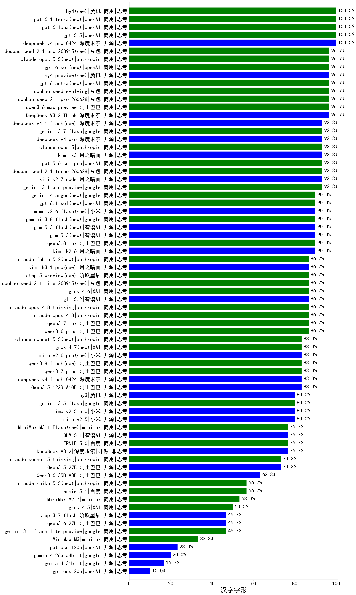

|类别|机构|大模型|【汉字字形】准确率|平均耗时|平均消耗token|花费/千次（元）|排名（准确率）|
|---|---|-----|-------------------|-------|-----------|-----------|-----------|
|商用|openAI|gpt-5.5|100.0%|14s|354|69.7|1|
|商用|openAI|gpt-6-luna(new)|100.0%|250s|324|1.1|2|
|开源|深度求索|deepseek-v4-pro-0424|100.0%|40s|830|19.7|3|
|商用|腾讯|hy4(new)|100.0%|66s|3232|57.7|4|
|商用|openAI|gpt-6.1-terra(new)|100.0%|5s|216|6.8|5|
|商用|anthropic|claude-opus-5.5(new)|96.7%|13s|306|39.0|6|
|商用|豆包|doubao-seed-2-1-pro-260628|96.7%|237s|9548|284.9|7|
|商用|豆包|doubao-seed-evolving|96.7%|259s|10195|304.3|8|
|商用|豆包|doubao-seed-2-1-pro-260915(new)|96.7%|113s|3805|112.6|9|
|商用|阿里巴巴|qwen3.6-max-preview|96.7%|49s|1515|80.6|10|
|商用|openAI|gpt-6-sol(new)|96.7%|112s|197|12.3|11|
|商用|openAI|gpt-6-astra(new)|96.7%|14s|160|48.8|12|
|开源|腾讯|hy4-preview(new)|96.7%|208s|13081|235.0|13|
|开源|深度求索|DeepSeek-V3.2-Think|96.7%|208s|1149|3.4|14|
|开源|月之暗面|kimi-k2.7-code|93.3%|72s|3602|96.7|15|
|开源|月之暗面|kimi-k3|93.3%|103s|2180|202.9|16|
|商用|openAI|gpt-5.6-sol-pro|93.3%|12s|2591|186.3|17|
|开源|深度求索|deepseek-v4-pro|93.3%|173s|4948|131.8|18|
|商用|google|gemini-3.7-flash|93.3%|6s|1022|26.4|19|
|开源|深度求索|deepseek-v4.1-flash(new)|93.3%|11s|2365|18.6|20|
|商用|豆包|doubao-seed-2-1-turbo-260628|93.3%|176s|8670|129.3|21|
|商用|anthropic|claude-opus-5|93.3%|12s|672|113.0|22|
|商用|google|gemini-4-carbon(new)|93.3%|44s|495|63.7|23|
|商用|google|gemini-3.1-pro-preview|93.3%|58s|3826|324.5|24|
|商用|openAI|gpt-6.1-sol(new)|90.0%|8s|185|11.4|25|
|商用|google|gemini-3.8-flash(new)|90.0%|34s|3291|171.9|26|
|商用|阿里巴巴|qwen3.8-max|90.0%|92s|3921|139.6|27|
|开源|小米|mimo-v2.6-flash(new)|90.0%|206s|8363|16.7|28|
|开源|智谱AI|glm-5.3(new)|90.0%|212s|4858|135.4|29|
|商用|google|gemini-4-argon(new)|90.0%|17s|212|24.1|30|
|开源|智谱AI|glm-5.3-flash(new)|90.0%|145s|5396|15.0|31|
|开源|月之暗面|kimi-k2.6|90.0%|254s|3520|94.5|32|
|商用|阿里巴巴|qwen3.6-plus|86.7%|38s|1838|21.8|33|
|开源|月之暗面|kimi-k3.1-pro(new)|86.7%|55s|1803|117.0|34|
|商用|anthropic|claude-fable-5.2(new)|86.7%|29s|322|82.4|35|
|开源|智谱AI|glm-5.2|86.7%|140s|6351|177.2|36|
|商用|anthropic|claude-opus-4.8-thinking|86.7%|14s|902|153.4|37|
|商用|豆包|doubao-seed-2-1-lite-260915(new)|86.7%|197s|6915|18.6|38|
|商用|阶跃星辰|step-5-preview(new)|86.7%|39s|2955|58.7|39|
|商用|anthropic|claude-opus-4.8|86.7%|5s|195|29.6|40|
|商用|阿里巴巴|qwen3.7-max|86.7%|51s|2420|86.5|41|
|商用|XAI|grok-4.6|86.7%|40s|2009|78.1|42|
|开源|阿里巴巴|Qwen3.5-122B-A10B|83.3%|532s|4238|27.0|43|
|开源|小米|mimo-v2.6-pro(new)|83.3%|483s|15578|93.4|44|
|商用|阿里巴巴|qwen3.8-flash(new)|83.3%|130s|7354|19.7|45|
|商用|阿里巴巴|qwen3.7-plus|83.3%|362s|19652|157.1|46|
|开源|深度求索|deepseek-v4-flash-0424|83.3%|61s|2034|4.0|47|
|商用|anthropic|claude-sonnet-5.5(new)|83.3%|8s|523|34.7|48|
|商用|XAI|grok-4.7(new)|83.3%|23s|2644|75.7|49|
|商用|google|gemini-3.5-flash|80.0%|14s|1766|110.2|50|
|开源|腾讯|hy3|80.0%|32s|271|1.0|51|
|开源|小米|mimo-v2.5|80.0%|32s|2371|30.2|52|
|开源|小米|mimo-v2.5-pro|80.0%|45s|2308|44.7|53|
|开源|智谱AI|GLM-5.1|76.7%|463s|6483|155.2|54|
|商用|百度|ERNIE-5.0|76.7%|289s|2731|65.2|55|
|开源|深度求索|DeepSeek-V3.2|76.7%|103s|380|1.1|56|
|商用|minimax|MiniMax-M3.1-Flash(new)|76.7%|18s|1019|3.4|57|
|商用|anthropic|claude-sonnet-5-thinking|73.3%|27s|824|55.8|58|
|开源|阿里巴巴|Qwen3.5-27B|73.3%|178s|5514|26.3|59|
|开源|阿里巴巴|Qwen3.6-35B-A3B|63.3%|148s|1876|20.0|60|
|商用|百度|ernie-5.1|56.7%|45s|1593|28.4|61|
|商用|anthropic|claude-haiku-5.5(new)|56.7%|10s|958|3.3|62|
|商用|minimax|MiniMax-M2.7|53.3%|121s|4907|40.9|63|
|商用|XAI|grok-4.5|50.0%|49s|1958|76.0|64|
|开源|阶跃星辰|step-3.7-flash|46.7%|25s|2400|19.2|65|
|开源|阿里巴巴|qwen3.6-27b|46.7%|39s|2321|41.4|66|
|商用|google|gemini-3.1-flash-lite-preview|46.7%|4s|154|1.4|67|
|商用|minimax|MiniMax-M3|33.3%|135s|2423|38.3|68|
|开源|openAI|gpt-oss-120b|23.3%|240s|1091|3.4|69|
|开源|google|gemma-4-26b-a4b-it|20.0%|46s|205|0.5|70|
|开源|google|gemma-4-31b-it|16.7%|34s|122|0.3|71|
|开源|openAI|gpt-oss-20b|10.0%|216s|4441|5.1|72|

