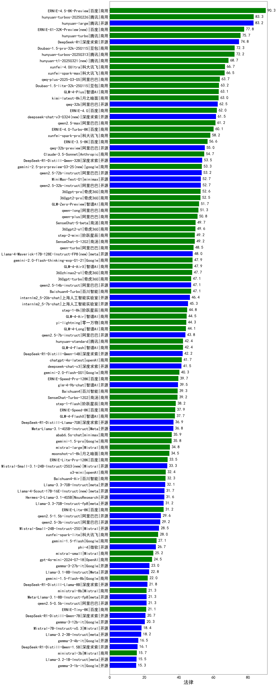

| 类别 |机构| 大模型                         | 法律 | 排名 |
|-----|----|--------------------------|---------|----|
|商用|百度|ERNIE-4.5-Turbo-32K|89.0%|1|
|商用|豆包|doubao-seed-1-6-thinking-250615(new)|85.0%|2|
|商用|豆包|Doubao-1.5-thinking-pro|83.3%|3|
|开源|腾讯|hunyuan-large|82.3%|4|
|商用|百度|ERNIE-X1-Turbo-32K|81.7%|5|
|开源|百度|ERNIE-4.5-300B-A47B(new)|80.0%|6|
|商用|阿里巴巴|qwen-plus-think-2025-04-28|79.4%|7|
|商用|豆包|doubao-seed-1-6-250615(new)|78.9%|8|
|商用|腾讯|hunyuan-turbo|77.3%|9|
|商用|豆包|doubao-seed-1-6-flash-thinking-250615(new)|77.2%|10|
|商用|腾讯|hunyuan-t1-20250321|75.7%|11|
|商用|豆包|Doubao-1.5-pro-32k-250115|75.3%|12|
|开源|深度求索|DeepSeek-R1|74.7%|13|
|商用|腾讯|hunyuan-turbos-20250313|74.3%|14|
|商用|豆包|doubao-seed-1-6-flash-250615(new)|73.9%|15|
|商用|腾讯|hunyuan-turbos-20250604(new)|73.3%|16|
|开源|深度求索|DeepSeek-R1-0528|73.3%|17|
|开源|阿里巴巴|Qwen3-235B-A22B|70.0%|18|
|开源|深度求索|deepseek-chat-v3-0324|70.0%|19|
|商用|腾讯|hunyuan-t1-20250529(new)|70.0%|20|
|开源|minimax|MiniMax-M1(new)|70.0%|21|
|商用|科大讯飞|xunfei-4.0Ultra|68.6%|22|
|商用|智谱AI|GLM-4-Plus|67.7%|23|
|商用|科大讯飞|xunfei-spark-x1|67.7%|24|
|商用|智谱AI|GLM-Z1-AirX|67.7%|25|
|商用|科大讯飞|xunfei-spark-max|67.3%|26|
|商用|阿里巴巴|qwen2.5-max|66.3%|27|
|商用|阿里巴巴|qwq-plus-2025-03-05|66.0%|28|
|开源|阿里巴巴|qwq-32b|65.7%|29|
|开源|阿里巴巴|Qwen3-32B|65.6%|30|
|商用|阿里巴巴|qwen-plus-2025-04-28|65.0%|31|
|商用|阿里巴巴|qwen-plus-2025-01-25|64.3%|32|
|商用|月之暗面|kimi-latest-8k|64.1%|33|
|开源|阿里巴巴|Qwen3-14B|63.9%|34|
|开源|智谱AI|GLM-Z1-32B-0414|63.3%|35|
|开源|minimax|MiniMax-Text-01|63.3%|36|
|商用|百度|ERNIE-3.5-8K|62.3%|37|
|商用|智谱AI|GLM-Z1-Air|62.3%|38|
|商用|豆包|Doubao-1.5-lite-32k-250115|62.0%|39|
|开源|腾讯|Hunyuan-A13B-Instruct(new)|60.7%|40|
|商用|阿里巴巴|qwen-long-2025-01-25|60.7%|41|
|商用|google|gemini-2.5-flash-preview-05-20|60.0%|42|
|开源|智谱AI|GLM-4-32B-0414|60.0%|43|
|商用|阶跃星辰|step-r1-v-mini|60.0%|44|
|开源|阿里巴巴|qwen2.5-72b-instruct|60.0%|45|
|商用|科大讯飞|xunfei-spark-pro|59.7%|46|
|开源|Meta|Llama-4-Maverick-17B-128E-Instruct-FP8|59.0%|47|
|开源|阿里巴巴|qwen2.5-32b-instruct|57.3%|48|
|商用|阿里巴巴|qwen-turbo-think-2025-04-28|57.2%|49|
|商用|百川智能|Baichuan4-Turbo|57.0%|50|
|开源|深度求索|DeepSeek-R1-Distill-Qwen-32B|57.0%|51|
|开源|百度|ERNIE-4.5-21B-A3B(new)|56.7%|52|
|商用|奇虎360|360gpt2-pro|56.7%|53|
|商用|openAI|gpt-4.1|56.7%|54|
|开源|阿里巴巴|qwen2.5-14b-instruct|56.3%|55|
|开源|上海人工智能实验室|internlm2_5-7b-chat|55.3%|56|
|商用|商汤|SenseChat-5-1202|55.3%|57|
|商用|阿里巴巴|qwen-turbo-2025-02-11|54.7%|58|
|商用|商汤|SenseChat-5-beta|54.3%|59|
|商用|智谱AI|GLM-4-Flash|54.0%|60|
|商用|阶跃星辰|step-2-mini|54.0%|61|
|商用|google|gemini-2.5-pro-preview-05-06|53.3%|62|
|商用|零一万物|yi-lightning|53.0%|63|
|开源|阿里巴巴|Qwen3-30B-A3B|52.8%|64|
|商用|智谱AI|GLM-4-FlashX|52.7%|65|
|商用|奇虎360|360gpt2-o1|52.3%|66|
|开源|深度求索|DeepSeek-R1-0528-Qwen3-8B|51.7%|67|
|开源|智谱AI|GLM-4-9B-0414|51.0%|68|
|开源|阿里巴巴|Qwen3-8B|50.0%|69|
|商用|anthropic|claude-4-sonnet|50.0%|70|
|商用|anthropic|claude-4-sonnet-thinking|50.0%|71|
|商用|智谱AI|GLM-Z1-Flash|50.0%|72|
|商用|智谱AI|GLM-4-Long|49.5%|73|
|商用|百度|ERNIE-Speed-8K|48.7%|74|
|商用|奇虎360|360gpt-turbo|48.3%|75|
|商用|奇虎360|360zhinao2-o1|47.7%|76|
|商用|阿里巴巴|qwen-turbo-2025-04-28|46.7%|77|
|商用|openAI|chatgpt-4o-latest|46.3%|78|
|商用|智谱AI|GLM-4-Air|46.1%|79|
|开源|阿里巴巴|qwen2.5-7b-instruct|46.0%|80|
|商用|智谱AI|GLM-4-AirX|43.3%|81|
|开源|阿里巴巴|Qwen3-4B|43.3%|82|
|商用|腾讯|hunyuan-standard|42.7%|83|
|商用|智谱AI|GLM-Z1-FlashX|41.1%|84|
|开源|Meta|Llama-4-Scout-17B-16E-Instruct|41.0%|85|
|开源|阿里巴巴|qwen2.5-3b-instruct|40.7%|86|
|开源|深度求索|DeepSeek-R1-Distill-Qwen-14B|40.7%|87|
|开源|Mistral|Mistral-Small-3.1-24B-Instruct-2503|40.0%|88|
|商用|Mistral|mistral-large|40.0%|89|
|商用|月之暗面|moonshot-v1-8k|39.3%|90|
|商用|百度|ERNIE-Lite-8K|38.7%|91|
|开源|智谱AI|GLM-Z1-Rumination-32B-0414|37.8%|92|
|商用|百川智能|Baichuan4-Air|36.7%|93|
|商用|商汤|SenseChat-Turbo-1202|36.7%|94|
|商用|openAI|o4-mini|36.7%|95|
|开源|智谱AI|GLM-Z1-9B-0414|35.0%|96|
|开源|微软|phi-4|34.0%|97|
|商用|openAI|gpt-4.1-mini|33.3%|98|
|商用|Mistral|mistral-small|33.0%|99|
|开源|Google|gemma-3-12b-it|33.0%|100|
|开源|阿里巴巴|Qwen3-1.7B|32.2%|101|
|开源|Google|gemma-3-27b-it|29.3%|102|
|商用|百度|ERNIE-Tiny-8K|28.3%|103|
|开源|阿里巴巴|qwen2.5-1.5b-instruct|26.4%|104|
|商用|OpenAI|gpt-4o-mini|26.0%|105|
|开源|阿里巴巴|qwen2.5-0.5b-instruct|25.8%|106|
|商用|科大讯飞|xunfei-spark-lite|25.7%|107|
|商用|Mistral|ministral-8b|23.0%|108|
|开源|Google|gemma-3-4b-it|21.0%|109|
|开源|百度|ERNIE-4.5-0.3B(new)|20.0%|110|
|开源|阿里巴巴|Qwen3-0.6B|13.3%|111|
|商用|Mistral|ministral-3b|10.7%|112|

