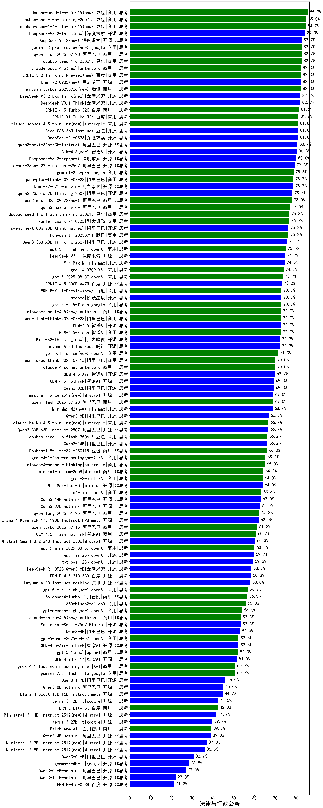

|类别|机构|大模型|【法律与行政公务】准确率|平均耗时|平均消耗token|花费/千次（元）|排名（准确率）|
|---|---|-----|-------------------|-------|-----------|-----------|-----------|
|商用|豆包|doubao-seed-1-6-251015(new)|85.7%|26s|1139|7.9|1|
|商用|豆包|doubao-seed-1-6-thinking-250715|85.0%|72s|2430|18.4|2|
|商用|豆包|doubao-seed-1-6-lite-251015(new)|84.7%|44s|1220|2.6|3|
|开源|深度求索|DeepSeek-V3.2-Think(new)|84.3%|137s|1957|5.7|4|
|商用|google|gemini-3-flash-preview(new)|83.3%|91s|2531|51.3|5|
|商用|豆包|doubao-seed-1-6-250615|82.7%|53s|685|4.3|6|
|商用|阿里巴巴|qwen-plus-2025-07-28|82.7%|29s|1096|2.0|7|
|开源|深度求索|DeepSeek-V3.2(new)|82.7%|67s|809|2.3|8|
|商用|google|gemini-3-pro-preview(new)|82.7%|83s|2700|219.4|9|
|商用|anthropic|claude-opus-4.5(new)|82.3%|17s|1037|152.0|10|
|商用|腾讯|hunyuan-turbos-20250926(new)|82.3%|24s|1052|1.9|11|
|开源|月之暗面|kimi-k2-0905(new)|82.3%|73s|937|13.3|12|
|商用|百度|ERNIE-5.0-Thinking-Preview(new)|82.3%|229s|2021|46.3|13|
|开源|深度求索|DeepSeek-V3.2-Exp-Think(new)|82.0%|300s|1977|5.8|14|
|开源|深度求索|DeepSeek-V3.1-Think|82.0%|85s|1761|20.1|15|
|商用|腾讯|hunyuan-2.0-instruct-20251111(new)|81.7%|9s|755|1.3|16|
|商用|百度|ERNIE-4.5-Turbo-32K|81.5%|29s|808|2.3|17|
|商用|腾讯|hunyuan-2.0-thinking-20251109(new)|81.3%|23s|2140|8.2|18|
|商用|百度|ERNIE-X1-Turbo-32K|81.2%|428s|2451|9.4|19|
|开源|豆包|Seed-OSS-36B-Instruct|81.0%|190s|3016|11.7|20|
|商用|anthropic|claude-sonnet-4.5-thinking(new)|81.0%|49s|3580|366.9|21|
|开源|深度求索|DeepSeek-R1-0528|81.0%|189s|2743|42.4|22|
|开源|阿里巴巴|qwen3-next-80b-a3b-instruct|80.7%|19s|1270|4.7|23|
|开源|智谱AI|GLM-4.6(new)|80.3%|59s|3047|41.2|24|
|开源|深度求索|DeepSeek-V3.2-Exp(new)|80.0%|281s|731|2.1|25|
|开源|阿里巴巴|qwen3-235b-a22b-instruct-2507|79.3%|27s|1115|8.1|26|
|商用|google|gemini-2.5-pro|78.8%|35s|3088|214.1|27|
|商用|阿里巴巴|qwen-plus-think-2025-07-28|78.7%|/|3924|30.4|28|
|开源|月之暗面|kimi-k2-0711-preview|78.7%|72s|1119|16.4|29|
|开源|阿里巴巴|qwen3-235b-a22b-thinking-2507|78.3%|87s|3721|71.9|30|
|商用|阿里巴巴|qwen3-max-2025-09-23(new)|78.0%|212s|1093|23.7|31|
|商用|阿里巴巴|qwen-plus-2025-12-01(new)|77.3%|34s|1459|2.8|32|
|商用|阿里巴巴|qwen3-max-preview|77.0%|19s|873|18.4|33|
|商用|豆包|doubao-seed-1-6-flash-thinking-250615|76.8%|14s|922|1.1|34|
|商用|科大讯飞|xunfei-spark-x1-0725|76.7%|/|1972|23.2|35|
|商用|腾讯|hunyuan-t1-20250711|76.3%|33s|2077|7.8|36|
|开源|阿里巴巴|qwen3-next-80b-a3b-thinking(new)|76.3%|190s|4646|18.2|37|
|商用|openAI|gpt-5.2-high(new)|76.0%|29s|1133|98.3|38|
|开源|阿里巴巴|Qwen3-30B-A3B-Thinking-2507|75.7%|77s|3419|9.3|39|
|商用|阿里巴巴|qwen-plus-think-2025-12-01(new)|75.3%|93s|3693|28.5|40|
|商用|openAI|gpt-5.1-high(new)|75.0%|161s|3350|227.6|41|
|开源|深度求索|DeepSeek-V3.1|74.7%|35s|723|7.7|42|
|开源|minimax|MiniMax-M1|74.5%|415s|5818|44.5|43|
|商用|XAI|grok-4-0709|74.0%|424s|2495|258.8|44|
|商用|openAI|gpt-5-2025-08-07|73.7%|34s|577|31.8|45|
|开源|百度|ERNIE-4.5-300B-A47B|73.2%|224s|564|3.6|46|
|商用|百度|ERNIE-X1.1-Preview(new)|73.0%|121s|1277|4.7|47|
|开源|阶跃星辰|step-3|73.0%|165s|3255|12.7|48|
|商用|google|gemini-2.5-flash|73.0%|15s|2991|51.7|49|
|开源|智谱AI|GLM-4.5|72.7%|84s|2126|27.0|50|
|商用|阿里巴巴|qwen-flash-think-2025-07-28|72.7%|39s|3762|5.5|51|
|商用|智谱AI|GLM-4.5-Flash|72.7%|37s|2154|0.0|52|
|商用|anthropic|claude-sonnet-4.5(new)|72.7%|11s|833|70.7|53|
|开源|月之暗面|Kimi-K2-Thinking(new)|72.3%|472s|8208|129.9|54|
|开源|腾讯|Hunyuan-A13B-Instruct|72.3%|62s|1824|6.9|55|
|商用|openAI|gpt-5.1-medium(new)|71.3%|240s|1544|99.4|56|
|商用|openAI|gpt-5.2-medium(new)|71.0%|18s|882|73.4|57|
|商用|anthropic|claude-4-sonnet|70.0%|44s|771|65.1|58|
|商用|阿里巴巴|qwen-turbo-think-2025-07-15|70.0%|/|3323|9.6|59|
|开源|智谱AI|GLM-4.5-Air|69.7%|36s|2184|12.1|60|
|开源|智谱AI|GLM-4.5-nothink|69.3%|41s|1375|16.9|61|
|开源|阿里巴巴|Qwen3-32B|69.3%|182s|4935|19.3|62|
|商用|阿里巴巴|qwen-flash-2025-07-28|69.0%|13s|1263|1.7|63|
|开源|Mistral|mistral-large-2512(new)|69.0%|17s|857|7.8|64|
|开源|minimax|MiniMax-M2(new)|68.7%|64s|3177|25.7|65|
|开源|阿里巴巴|Qwen3-8B|66.8%|352s|5655|0.0|66|
|开源|阿里巴巴|Qwen3-30B-A3B-Instruct-2507|66.7%|10s|1157|3.2|67|
|商用|anthropic|claude-haiku-4.5-thinking(new)|66.7%|53s|5684|198.2|68|
|商用|openAI|gpt-5.2(new)|66.3%|9s|455|31.0|69|
|商用|豆包|doubao-seed-1-6-flash-250615|66.2%|5s|464|0.5|70|
|开源|阿里巴巴|Qwen3-14B|66.2%|201s|6637|13.1|71|
|商用|豆包|Doubao-1.5-lite-32k-250115|66.0%|5s|465|0.2|72|
|商用|XAI|grok-4-1-fast-reasoning(new)|65.3%|45s|1856|6.0|73|
|商用|anthropic|claude-4-sonnet-thinking|65.0%|63s|1544|149.2|74|
|商用|Mistral|mistral-medium-2508|64.3%|133s|853|10.1|75|
|开源|minimax|MiniMax-Text-01|64.0%|9s|967|7.8|76|
|商用|XAI|grok-3-mini|64.0%|147s|1544|5.4|77|
|商用|openAI|o4-mini|63.3%|35s|1589|47.1|78|
|开源|阿里巴巴|Qwen3-14B-nothink|63.0%|19s|948|1.7|79|
|开源|阿里巴巴|Qwen3-32B-nothink|62.7%|50s|868|3.0|80|
|商用|阿里巴巴|qwen-long-2025-01-25|62.3%|55s|606|1.0|81|
|开源|meta|Llama-4-Maverick-17B-128E-Instruct-FP8|62.0%|12s|787|3.0|82|
|商用|阿里巴巴|qwen-turbo-2025-07-15|61.3%|12s|828|0.5|83|
|商用|智谱AI|GLM-4.5-Flash-nothink|60.7%|35s|2115|0.0|84|
|开源|Mistral|Mistral-Small-3.2-24B-Instruct-2506|60.3%|25s|1486|2.9|85|
|商用|openAI|gpt-5-mini-2025-08-07|60.0%|98s|1568|20.7|86|
|开源|openAI|gpt-oss-20b|59.7%|123s|2182|2.3|87|
|开源|openAI|gpt-oss-120b|59.3%|130s|1227|3.4|88|
|开源|深度求索|DeepSeek-R1-0528-Qwen3-8B|58.5%|518s|2905|0.0|89|
|开源|百度|ERNIE-4.5-21B-A3B|58.3%|31s|1046|0.0|90|
|开源|腾讯|Hunyuan-A13B-Instruct-nothink|58.0%|542s|568|1.9|91|
|商用|openAI|gpt-5-mini-high(new)|56.7%|853s|3633|50.6|92|
|商用|百川智能|Baichuan4-Turbo|56.5%|/|/|/|93|
|商用|360|360zhinao2-o1|55.8%|/|/|/|94|
|商用|openAI|gpt-5-nano-high(new)|54.0%|441s|7590|21.6|95|
|商用|anthropic|claude-haiku-4.5(new)|53.3%|12s|868|24.4|96|
|开源|Mistral|Magistral-Small-2507|53.3%|111s|8317|89.0|97|
|开源|阿里巴巴|Qwen3-4B|53.0%|111s|2845|8.1|98|
|开源|智谱AI|GLM-4.5-Air-nothink|52.3%|41s|3312|18.9|99|
|商用|openAI|gpt-5-nano-2025-08-07|52.3%|47s|3854|10.8|100|
|商用|openAI|gpt-5.1(new)|52.0%|131s|632|34.7|101|
|开源|智谱AI|GLM-4-9B-0414|51.5%|13s|584|0.0|102|
|商用|google|gemini-2.5-flash-lite|50.7%|32s|6752|19.3|103|
|商用|XAI|grok-4-1-fast-non-reasoning(new)|50.7%|57s|727|1.9|104|
|开源|阿里巴巴|Qwen3-1.7B|46.0%|97s|3532|10.2|105|
|开源|阿里巴巴|Qwen3-8B-nothink|45.0%|34s|872|0.0|106|
|开源|meta|Llama-4-Scout-17B-16E-Instruct|44.7%|13s|810|1.6|107|
|开源|google|gemma-3-12b-it|42.5%|/|/|/|108|
|商用|百度|ERNIE-Lite-8K|42.3%|/|/|/|109|
|开源|Mistral|Ministral-3-14B-Instruct-2512(new)|41.7%|18s|1517|2.2|110|
|开源|google|gemma-3-27b-it|39.7%|/|/|/|111|
|商用|百川智能|Baichuan4-Air|39.3%|/|/|/|112|
|开源|阿里巴巴|Qwen3-4B-nothink|39.0%|23s|926|2.4|113|
|开源|Mistral|Ministral-3-3B-Instruct-2512(new)|37.0%|10s|1018|0.7|114|
|开源|Mistral|Ministral-3-8B-Instruct-2512(new)|36.0%|10s|1026|1.1|115|
|开源|阿里巴巴|Qwen3-0.6B|30.7%|65s|2539|7.2|116|
|开源|google|gemma-3-4b-it|28.5%|/|/|/|117|
|开源|阿里巴巴|Qwen3-0.6B-nothink|27.0%|8s|480|1.1|118|
|开源|阿里巴巴|Qwen3-1.7B-nothink|22.0%|12s|775|1.9|119|
|开源|百度|ERNIE-4.5-0.3B|21.3%|16s|758|0.0|120|

