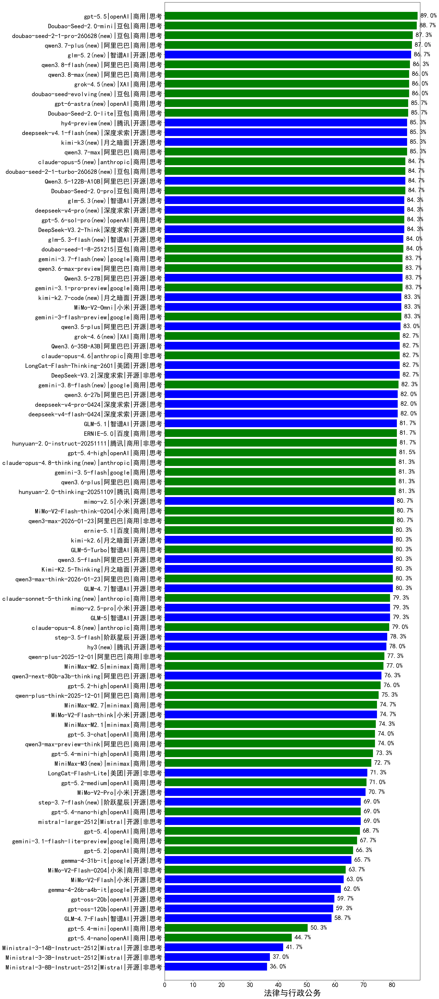

|类别|机构|大模型|【法律与行政公务】准确率|平均耗时|平均消耗token|花费/千次（元）|排名（准确率）|
|---|---|-----|-------------------|-------|-----------|-----------|-----------|
|商用|openAI|gpt-5.5|89.0%|17s|1114|205.2|1|
|商用|豆包|Doubao-Seed-2.0-mini|88.7%|363s|4966|9.6|2|
|商用|豆包|doubao-seed-2-1-pro-260628(new)|87.3%|267s|11201|331.8|3|
|商用|阿里巴巴|qwen3.7-plus(new)|87.0%|50s|2729|21.1|4|
|开源|智谱AI|glm-5.2(new)|86.7%|64s|2749|74.2|5|
|商用|阿里巴巴|qwen3.8-flash(new)|86.3%|57s|3137|8.1|6|
|商用|阿里巴巴|qwen3.8-max(new)|86.0%|78s|3184|110.6|7|
|商用|豆包|doubao-seed-evolving(new)|86.0%|277s|11730|347.6|8|
|商用|XAI|grok-4.5(new)|86.0%|74s|3289|128.5|9|
|商用|豆包|Doubao-Seed-2.0-lite|85.7%|296s|1476|4.8|10|
|商用|openAI|gpt-6-astra(new)|85.7%|17s|495|127.4|11|
|商用|阿里巴巴|qwen3.7-max|85.3%|37s|1842|63.2|12|
|开源|深度求索|deepseek-v4.1-flash(new)|85.3%|12s|1938|14.6|13|
|开源|腾讯|hy4-preview(new)|85.3%|105s|6463|114.6|14|
|开源|月之暗面|kimi-k3(new)|85.3%|103s|2438|223.0|15|
|商用|豆包|doubao-seed-2-1-turbo-260628(new)|84.7%|245s|9470|139.9|16|
|开源|阿里巴巴|Qwen3.5-122B-A10B|84.7%|238s|4438|27.7|17|
|商用|anthropic|claude-opus-5(new)|84.7%|15s|997|142.8|18|
|商用|豆包|Doubao-Seed-2.0-pro|84.7%|303s|1398|20.0|19|
|开源|深度求索|DeepSeek-V3.2-Think|84.3%|137s|1957|5.7|20|
|开源|智谱AI|glm-5.3(new)|84.3%|160s|3844|104.9|21|
|开源|深度求索|deepseek-v4-pro(new)|84.3%|128s|4109|107.3|22|
|商用|openAI|gpt-5.6-sol-pro(new)|84.3%|35s|5341|488.6|23|
|商用|豆包|doubao-seed-1-8-251215|84.0%|37s|1105|7.5|24|
|开源|智谱AI|glm-5.3-flash(new)|84.0%|130s|4319|11.8|25|
|商用|google|gemini-3.7-flash(new)|83.7%|5s|988|22.8|26|
|商用|阿里巴巴|qwen3.6-max-preview|83.7%|88s|2583|133.7|27|
|开源|阿里巴巴|Qwen3.5-27B|83.7%|356s|4390|20.5|28|
|商用|google|gemini-3.1-pro-preview|83.7%|44s|2118|169.9|29|
|开源|月之暗面|kimi-k2.7-code(new)|83.3%|71s|2285|59.2|30|
|开源|小米|MiMo-V2-Omni|83.3%|256s|2299|27.9|31|
|商用|google|gemini-3-flash-preview|83.3%|91s|2531|51.3|32|
|开源|阿里巴巴|qwen3.5-plus|83.0%|50s|4028|18.8|33|
|商用|anthropic|claude-opus-4.6|82.7%|23s|931|130.9|34|
|开源|阿里巴巴|Qwen3.6-35B-A3B|82.7%|49s|2803|29.1|35|
|商用|XAI|grok-4.6(new)|82.7%|74s|2797|107.8|36|
|开源|美团|LongCat-Flash-Thinking-2601|82.7%|237s|4031|0.0|37|
|开源|深度求索|DeepSeek-V3.2|82.7%|67s|809|2.3|38|
|商用|google|gemini-3.8-flash(new)|82.3%|12s|1187|56.1|39|
|开源|阿里巴巴|qwen3.6-27b|82.0%|43s|2741|47.4|40|
|开源|深度求索|deepseek-v4-pro-0424|82.0%|51s|1474|33.9|41|
|开源|深度求索|deepseek-v4-flash-0424|82.0%|35s|1738|3.4|42|
|开源|智谱AI|GLM-5.1|81.7%|187s|2306|53.0|43|
|商用|百度|ERNIE-5.0|81.7%|203s|2926|68.0|44|
|商用|腾讯|hunyuan-2.0-instruct-20251111|81.7%|9s|755|1.3|45|
|商用|openAI|gpt-5.4-high|81.5%|31s|1472|140.2|46|
|商用|google|gemini-3.5-flash|81.3%|14s|2208|131.2|47|
|商用|阿里巴巴|qwen3.6-plus|81.3%|61s|2606|30.0|48|
|商用|腾讯|hunyuan-2.0-thinking-20251109|81.3%|23s|2140|8.2|49|
|商用|anthropic|claude-opus-4.8-thinking(new)|81.3%|18s|1408|214.7|50|
|商用|小米|MiMo-V2-Flash-think-0204|80.7%|427s|2754|5.6|51|
|开源|小米|mimo-v2.5|80.7%|25s|2197|26.5|52|
|商用|阿里巴巴|qwen3-max-2026-01-23|80.7%|94s|1035|9.3|53|
|商用|百度|ernie-5.1|80.3%|53s|2369|40.6|54|
|商用|智谱AI|GLM-5-Turbo|80.3%|38s|2294|48.3|55|
|开源|月之暗面|kimi-k2.6|80.3%|166s|3241|84.0|56|
|开源|月之暗面|Kimi-K2.5-Thinking|80.3%|196s|3815|78.0|57|
|商用|阿里巴巴|qwen3-max-think-2026-01-23|80.3%|150s|4425|43.2|58|
|开源|智谱AI|GLM-4.7|80.3%|87s|3058|41.4|59|
|开源|阿里巴巴|qwen3.5-flash|80.3%|353s|5118|10.0|60|
|商用|anthropic|claude-sonnet-5-thinking(new)|79.3%|22s|1486|91.3|61|
|开源|小米|mimo-v2.5-pro|79.3%|49s|3068|59.1|62|
|开源|智谱AI|GLM-5|79.3%|126s|3217|56.1|63|
|商用|anthropic|claude-opus-4.8(new)|79.0%|10s|794|107.2|64|
|开源|阶跃星辰|step-3.5-flash|78.3%|30s|4434|9.1|65|
|开源|腾讯|hy3(new)|78.0%|64s|446|1.4|66|
|开源|小米|mimo-v2.6-pro(new)|78.0%|77s|3787|22.3|67|
|商用|阿里巴巴|qwen-plus-2025-12-01|77.3%|34s|1459|2.8|68|
|商用|minimax|MiniMax-M2.5|77.0%|51s|2888|23.3|69|
|开源|阿里巴巴|qwen3-next-80b-a3b-thinking|76.3%|190s|4646|18.2|70|
|商用|openAI|gpt-5.2-high|76.0%|29s|1133|98.3|71|
|商用|阿里巴巴|qwen-plus-think-2025-12-01|75.3%|93s|3693|28.5|72|
|商用|minimax|MiniMax-M2.7|74.7%|80s|3391|27.5|73|
|开源|小米|MiMo-V2-Flash-think|74.7%|88s|2835|0.0|74|
|商用|minimax|MiniMax-M2.1|74.3%|107s|2969|23.9|75|
|商用|阿里巴巴|qwen3-max-preview-think|74.0%|216s|3475|80.9|76|
|商用|openAI|gpt-5.3-chat|74.0%|25s|709|55.4|77|
|商用|openAI|gpt-5.4-mini-high|73.3%|72s|2317|68.7|78|
|开源|小米|mimo-v2.6-flash(new)|73.3%|294s|2031|3.9|79|
|商用|minimax|MiniMax-M3(new)|72.7%|77s|1804|26.6|80|
|开源|美团|LongCat-Flash-Lite|71.3%|236s|1111|0.0|81|
|商用|openAI|gpt-5.2-medium|71.0%|18s|882|73.4|82|
|开源|小米|MiMo-V2-Pro|70.7%|322s|1574|27.7|83|
|开源|阶跃星辰|step-3.7-flash(new)|69.0%|891s|4564|36.1|84|
|开源|Mistral|mistral-large-2512|69.0%|17s|857|7.8|85|
|商用|openAI|gpt-5.4-nano-high|69.0%|64s|1464|11.6|86|
|商用|openAI|gpt-5.4|68.7%|8s|543|42.7|87|
|商用|google|gemini-3.1-flash-lite-preview|67.7%|7s|629|5.3|88|
|商用|openAI|gpt-5.2|66.3%|9s|455|31.0|89|
|开源|google|gemma-4-31b-it|65.7%|113s|748|1.8|90|
|商用|小米|MiMo-V2-Flash-0204|63.7%|214s|1096|2.1|91|
|开源|小米|MiMo-V2-Flash|63.0%|19s|1087|0.0|92|
|开源|google|gemma-4-26b-a4b-it|62.0%|48s|952|2.4|93|
|开源|openAI|gpt-oss-20b|59.7%|123s|2182|2.3|94|
|开源|openAI|gpt-oss-120b|59.3%|130s|1227|3.4|95|
|开源|智谱AI|GLM-4.7-Flash|58.7%|837s|8774|0.0|96|
|商用|openAI|gpt-5.4-mini|50.3%|48s|468|10.4|97|
|商用|openAI|gpt-5.4-nano|44.7%|65s|535|3.5|98|
|开源|Mistral|Ministral-3-14B-Instruct-2512|41.7%|18s|1517|2.2|99|
|开源|Mistral|Ministral-3-3B-Instruct-2512|37.0%|10s|1018|0.7|100|
|开源|Mistral|Ministral-3-8B-Instruct-2512|36.0%|10s|1026|1.1|101|

