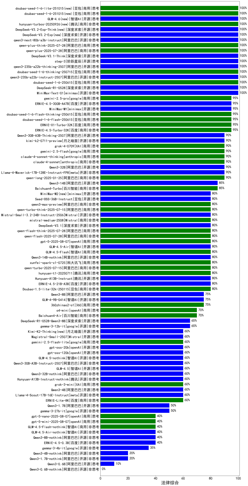

|类别|机构|大模型|【法律综合】准确率|平均耗时|平均消耗token|花费/千次（元）|排名（准确率）|
|---|---|-----|-------------------|-------|-----------|-----------|-----------|
|商用|豆包|doubao-seed-1-6-thinking-250715|100.0%|17s|828|5.9|1|
|开源|阿里巴巴|qwen3-235b-a22b-thinking-2507|100.0%|54s|2249|43.3|2|
|商用|科大讯飞|xunfei-spark-x1-0725|100.0%|/|1130|10.8|3|
|开源|深度求索|DeepSeek-V3.1-Think(new)|100.0%|48s|953|10.8|4|
|商用|腾讯|hunyuan-turbos-20250716|100.0%|11s|610|1.1|5|
|开源|阶跃星辰|step-3(new)|100.0%|70s|1376|5.3|6|
|商用|阿里巴巴|qwen-plus-2025-07-14|100.0%|11s|497|0.9|7|
|开源|阿里巴巴|qwen3-235b-a22b-instruct-2507|100.0%|12s|526|3.6|8|
|商用|豆包|doubao-seed-1-6-250615|100.0%|48s|424|2.2|9|
|开源|深度求索|DeepSeek-R1-0528|100.0%|257s|1906|29.0|10|
|商用|百度|ERNIE-4.5-Turbo-32K|95.0%|22s|590|1.6|11|
|商用|百度|ERNIE-X1-Turbo-32K|95.0%|79s|1801|6.9|12|
|开源|meta|Llama-4-Maverick-17B-128E-Instruct-FP8|95.0%|13s|770|2.9|13|
|开源|百度|ERNIE-4.5-300B-A47B|95.0%|26s|432|2.7|14|
|商用|google|gemini-2.5-pro|95.0%|35s|2376|163.7|15|
|商用|豆包|doubao-seed-1-6-flash-250615|95.0%|4s|408|0.4|16|
|商用|豆包|doubao-seed-1-6-flash-thinking-250615|95.0%|11s|924|1.1|17|
|开源|深度求索|deepseek-chat-v3-0324|90.0%|68s|532|3.8|18|
|开源|阿里巴巴|Qwen3-32B|90.0%|26s|913|3.2|19|
|开源|minimax|MiniMax-M1|90.0%|84s|2324|17.0|20|
|商用|google|gemini-2.5-flash|90.0%|14s|2118|36.2|21|
|开源|月之暗面|kimi-k2-0711-preview|90.0%|42s|729|10.4|22|
|开源|阿里巴巴|Qwen3-30B-A3B-Thinking-2507(new)|90.0%|72s|2834|7.7|23|
|商用|anthropic|claude-4-sonnet-thinking|90.0%|50s|1318|126.3|24|
|开源|智谱AI|GLM-Z1-32B-0414|90.0%|251s|2913|11.3|25|
|商用|anthropic|claude-4-sonnet|90.0%|39s|648|53.4|26|
|商用|XAI|grok-4-0709|90.0%|102s|1497|152.6|27|
|开源|阿里巴巴|Qwen3-14B|85.0%|40s|2577|5.0|28|
|商用|科大讯飞|xunfei-spark-max|81.0%|7s|323|9.7|29|
|开源|百度|ERNIE-4.5-21B-A3B|80.0%|54s|465|0.0|30|
|开源|深度求索|DeepSeek-V3.1(new)|80.0%|13s|287|2.8|31|
|开源|智谱AI|GLM-4.5-Air(new)|80.0%|41s|1851|8.5|32|
|商用|阿里巴巴|qwen-flash-think-2025-07-28|80.0%|21s|2239|3.2|33|
|商用|阿里巴巴|qwen-flash-2025-07-28|80.0%|9s|645|0.8|34|
|商用|智谱AI|GLM-4.5-Flash(new)|80.0%|32s|1849|0.0|35|
|开源|阿里巴巴|Qwen3-14B-nothink|80.0%|14s|548|0.9|36|
|商用|openAI|gpt-5-2025-08-07(new)|80.0%|33s|507|29.9|37|
|开源|腾讯|Hunyuan-A13B-Instruct|80.0%|39s|1847|7.0|38|
|商用|腾讯|hunyuan-t1-20250711|80.0%|18s|1071|3.9|39|
|开源|智谱AI|GLM-4-32B-0414|80.0%|22s|709|1.3|40|
|商用|阿里巴巴|qwen-turbo-2025-07-15|80.0%|8s|371|0.2|41|
|商用|科大讯飞|xunfei-4.0Ultra|76.0%|7s|318|22.3|42|
|商用|月之暗面|kimi-latest-8k|75.0%|17s|604|7.3|43|
|开源|智谱AI|GLM-4-9B-0414|75.0%|17s|683|0.0|44|
|商用|豆包|Doubao-1.5-pro-32k-250115|74.0%|8s|493|0.8|45|
|商用|豆包|Doubao-1.5-lite-32k-250115|71.5%|4s|411|0.2|46|
|开源|阿里巴巴|Qwen3-8B|70.0%|225s|6104|0.0|47|
|商用|openAI|o4-mini|70.0%|35s|1868|56.3|48|
|开源|深度求索|DeepSeek-R1-0528-Qwen3-8B|65.0%|230s|2425|0.0|49|
|开源|meta|Llama-4-Scout-17B-16E-Instruct|65.0%|12s|651|1.3|50|
|开源|深度求索|DeepSeek-R1-Distill-Qwen-32B|62.0%|93s|1305|1.6|51|
|开源|腾讯|Hunyuan-A13B-Instruct-nothink|60.0%|15s|428|1.4|52|
|开源|阿里巴巴|Qwen3-32B-nothink|60.0%|16s|541|1.9|53|
|开源|智谱AI|GLM-4.5(new)|60.0%|94s|1495|12.0|54|
|开源|openAI|gpt-oss-20b(new)|60.0%|10s|1744|1.9|55|
|开源|智谱AI|GLM-4.5-nothink|60.0%|31s|948|7.3|56|
|开源|openAI|gpt-oss-120b(new)|60.0%|10s|617|1.6|57|
|商用|google|gemini-2.5-flash-lite(new)|60.0%|49s|13819|39.9|58|
|开源|阿里巴巴|Qwen3-4B|60.0%|15s|1188|3.2|59|
|开源|华为|pangu-pro-moe|60.0%|79s|1428|5.4|60|
|商用|XAI|grok-3-mini|60.0%|221s|1272|4.4|61|
|开源|阿里巴巴|Qwen3-30B-A3B-Instruct-2507(new)|60.0%|6s|620|1.6|62|
|开源|阿里巴巴|Qwen3-8B-nothink|60.0%|21s|474|0.0|63|
|商用|奇虎360|360gpt2-pro|59.5%|7s|420|1.6|64|
|商用|阿里巴巴|qwen-long-2025-01-25|58.5%|9s|386|0.6|65|
|商用|百川智能|Baichuan4-Turbo|56.0%|/|/|/|66|
|商用|百度|ERNIE-3.5-8K|55.5%|22s|447|0.8|67|
|开源|智谱AI|GLM-Z1-9B-0414|55.0%|144s|4977|0.0|68|
|商用|奇虎360|360zhinao2-o1|55.0%|/|/|/|69|
|开源|minimax|MiniMax-Text-01|55.0%|9s|971|7.8|70|
|商用|奇虎360|360gpt2-o1|54.0%|21s|602|25.4|71|
|商用|百度|ERNIE-Speed-8K|52.4%|/|/|/|72|
|商用|零一万物|yi-lightning|51.0%|/|/|/|73|
|开源|阿里巴巴|Qwen3-1.7B|50.0%|21s|1426|3.9|74|
|商用|科大讯飞|xunfei-spark-pro|49.5%|/|/|/|75|
|商用|阶跃星辰|step-2-mini|45.0%|18s|342|0.6|76|
|开源|深度求索|DeepSeek-R1-Distill-Qwen-14B|42.0%|/|/|/|77|
|开源|百度|ERNIE-4.5-0.3B|40.0%|5s|467|0.0|78|
|商用|openAI|gpt-5-nano-2025-08-07(new)|40.0%|77s|2455|6.8|79|
|商用|智谱AI|GLM-4.5-Flash-nothink|40.0%|17s|796|0.0|80|
|商用|openAI|gpt-5-mini-2025-08-07(new)|40.0%|79s|1146|15.2|81|
|开源|智谱AI|GLM-4.5-Air-nothink|40.0%|10s|807|2.6|82|
|商用|百川智能|Baichuan4-Air|38.0%|/|/|/|83|
|商用|百度|ERNIE-Lite-8K|34.5%|/|/|/|84|
|商用|科大讯飞|xunfei-spark-lite|30.1%|/|/|/|85|
|开源|Google|gemma-3-27b-it|30.0%|/|/|/|86|
|开源|Google|gemma-3-12b-it|25.0%|/|/|/|87|
|商用|Mistral|ministral-8b|23.0%|/|/|/|88|
|开源|Google|gemma-3-4b-it|21.5%|/|/|/|89|
|开源|阿里巴巴|Qwen3-4B-nothink|20.0%|12s|466|1.1|90|
|开源|阿里巴巴|Qwen3-1.7B-nothink|20.0%|17s|439|1.0|91|
|商用|Mistral|ministral-3b|14.0%|/|/|/|92|
|开源|阿里巴巴|Qwen3-0.6B|10.0%|11s|1931|5.4|93|
|开源|阿里巴巴|Qwen3-0.6B-nothink|/%|9s|300|0.6|94|

