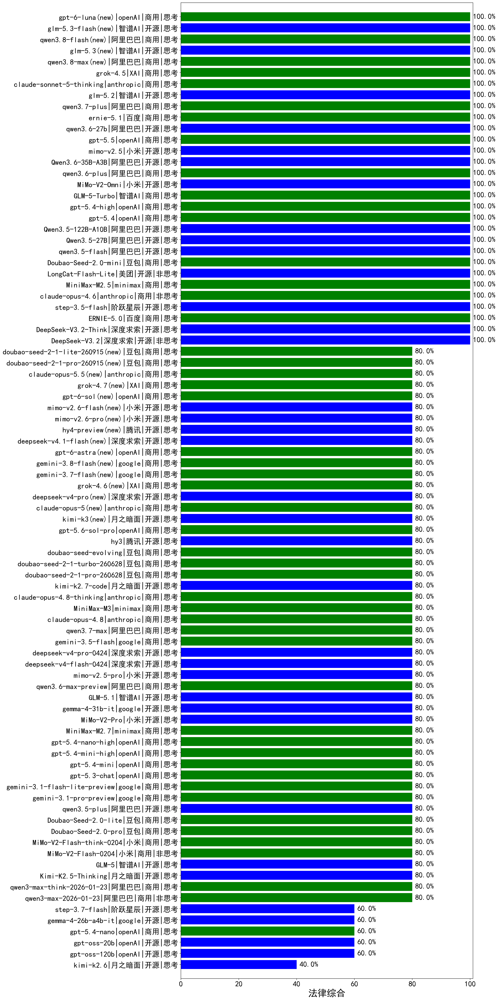

|类别|机构|大模型|【法律综合】准确率|平均耗时|平均消耗token|花费/千次（元）|排名（准确率）|
|---|---|-----|-------------------|-------|-----------|-----------|-----------|
|开源|小米|mimo-v2.5|100.0%|14s|1240|13.6|1|
|开源|小米|MiMo-V2-Omni|100.0%|7s|1166|12.6|2|
|开源|阿里巴巴|Qwen3.5-27B|100.0%|282s|2035|9.4|3|
|开源|阿里巴巴|Qwen3.5-122B-A10B|100.0%|162s|3066|19.1|4|
|商用|阿里巴巴|qwen3.8-flash(new)|100.0%|15s|765|1.8|5|
|开源|智谱AI|glm-5.3(new)|100.0%|35s|1423|37.9|6|
|商用|openAI|gpt-5.4-high|100.0%|14s|845|78.7|7|
|商用|智谱AI|GLM-5-Turbo|100.0%|31s|1130|23.4|8|
|商用|阿里巴巴|qwen3.8-max(new)|100.0%|22s|990|32.5|9|
|商用|阿里巴巴|qwen3.6-plus|100.0%|42s|1631|18.6|10|
|开源|智谱AI|glm-5.3-flash(new)|100.0%|132s|5058|14.0|11|
|商用|XAI|grok-4.5|100.0%|25s|1167|40.8|12|
|开源|阿里巴巴|Qwen3.6-35B-A3B|100.0%|117s|1691|17.4|13|
|商用|anthropic|claude-sonnet-5-thinking|100.0%|23s|637|35.9|14|
|开源|智谱AI|glm-5.2|100.0%|24s|1229|32.4|15|
|商用|openAI|gpt-5.5|100.0%|8s|533|91.8|16|
|开源|阿里巴巴|qwen3.6-27b|100.0%|33s|2082|36.1|17|
|商用|百度|ernie-5.1|100.0%|20s|790|12.9|18|
|开源|阿里巴巴|qwen3.5-flash|100.0%|238s|3223|6.3|19|
|商用|openAI|gpt-5.4|100.0%|5s|337|25.4|20|
|商用|anthropic|claude-opus-4.6|100.0%|11s|613|85.3|21|
|商用|minimax|MiniMax-M2.5|100.0%|27s|1254|9.8|22|
|开源|深度求索|DeepSeek-V3.2|100.0%|101s|486|1.4|23|
|开源|深度求索|DeepSeek-V3.2-Think|100.0%|25s|775|2.2|24|
|商用|百度|ERNIE-5.0|100.0%|53s|1072|24.3|25|
|商用|openAI|gpt-6-luna(new)|100.0%|296s|357|0.9|26|
|开源|阶跃星辰|step-3.5-flash|100.0%|10s|1207|2.4|27|
|商用|豆包|Doubao-Seed-2.0-mini|100.0%|382s|1726|3.2|28|
|商用|阿里巴巴|qwen3.7-plus|100.0%|22s|1137|8.5|29|
|开源|美团|LongCat-Flash-Lite|100.0%|302s|432|0.0|30|
|商用|XAI|grok-4.6(new)|80.0%|29s|1356|48.7|31|
|商用|豆包|doubao-seed-evolving|80.0%|176s|7582|224.1|32|
|商用|anthropic|claude-opus-4.8-thinking|80.0%|9s|690|99.1|33|
|商用|openAI|gpt-6-astra(new)|80.0%|14s|379|100.6|34|
|开源|深度求索|deepseek-v4.1-flash(new)|80.0%|11s|1068|7.9|35|
|开源|腾讯|hy4-preview(new)|80.0%|62s|3658|64.7|36|
|开源|月之暗面|kimi-k2.7-code|80.0%|88s|1031|26.1|37|
|商用|XAI|grok-4.7(new)|80.0%|22s|2734|77.6|38|
|商用|豆包|doubao-seed-2-1-pro-260628|80.0%|220s|6622|195.3|39|
|商用|豆包|doubao-seed-2-1-turbo-260628|80.0%|370s|6133|90.3|40|
|商用|openAI|gpt-6-sol(new)|80.0%|106s|294|14.2|41|
|开源|深度求索|deepseek-v4-pro(new)|80.0%|19s|616|13.7|42|
|商用|minimax|MiniMax-M3|80.0%|27s|818|10.4|43|
|开源|腾讯|hy3|80.0%|213s|253|0.7|44|
|开源|小米|mimo-v2.6-pro(new)|80.0%|16s|817|4.6|45|
|商用|openAI|gpt-5.6-sol-pro|80.0%|29s|3512|277.3|46|
|开源|小米|mimo-v2.6-flash(new)|80.0%|473s|933|1.8|47|
|开源|月之暗面|kimi-k3(new)|80.0%|101s|1579|115.8|48|
|商用|anthropic|claude-opus-5(new)|80.0%|13s|731|106.2|49|
|商用|google|gemini-3.7-flash(new)|80.0%|5s|670|15.5|50|
|商用|google|gemini-3.8-flash(new)|80.0%|11s|665|30.7|51|
|商用|anthropic|claude-opus-5.5(new)|80.0%|39s|706|81.3|52|
|商用|anthropic|claude-opus-4.8|80.0%|9s|597|82.7|53|
|商用|小米|MiMo-V2-Flash-0204|80.0%|204s|565|1.0|54|
|商用|豆包|Doubao-Seed-2.0-pro|80.0%|206s|932|13.1|55|
|商用|豆包|Doubao-Seed-2.0-lite|80.0%|158s|862|2.7|56|
|开源|阿里巴巴|qwen3.5-plus|80.0%|24s|2127|9.8|57|
|商用|google|gemini-3.1-pro-preview|80.0%|23s|1340|107.1|58|
|商用|google|gemini-3.1-flash-lite-preview|80.0%|5s|451|3.9|59|
|商用|openAI|gpt-5.3-chat|80.0%|8s|496|38.8|60|
|商用|openAI|gpt-5.4-mini|80.0%|85s|331|7.4|61|
|商用|openAI|gpt-5.4-mini-high|80.0%|10s|1392|40.8|62|
|商用|阿里巴巴|qwen3.7-max|80.0%|16s|938|31.5|63|
|商用|openAI|gpt-5.4-nano-high|80.0%|16s|840|6.5|64|
|商用|minimax|MiniMax-M2.7|80.0%|47s|1393|11.0|65|
|开源|小米|MiMo-V2-Pro|80.0%|336s|1103|18.5|66|
|开源|google|gemma-4-31b-it|80.0%|121s|587|1.4|67|
|开源|智谱AI|GLM-5|80.0%|74s|2085|36.3|68|
|开源|智谱AI|GLM-5.1|80.0%|172s|1295|29.5|69|
|商用|阿里巴巴|qwen3.6-max-preview|80.0%|58s|1804|93.2|70|
|开源|月之暗面|Kimi-K2.5-Thinking|80.0%|178s|878|17.0|71|
|商用|阿里巴巴|qwen3-max-think-2026-01-23|80.0%|108s|2872|28.0|72|
|开源|小米|mimo-v2.5-pro|80.0%|22s|1453|25.8|73|
|开源|深度求索|deepseek-v4-flash-0424|80.0%|16s|785|1.5|74|
|开源|深度求索|deepseek-v4-pro-0424|80.0%|38s|631|14.2|75|
|商用|google|gemini-3.5-flash|80.0%|12s|1307|77.1|76|
|商用|阿里巴巴|qwen3-max-2026-01-23|80.0%|13s|595|5.2|77|
|商用|小米|MiMo-V2-Flash-think-0204|80.0%|481s|1530|3.1|78|
|商用|openAI|gpt-5.4-nano|60.0%|14s|296|1.8|79|
|开源|google|gemma-4-26b-a4b-it|60.0%|42s|631|1.6|80|
|开源|openAI|gpt-oss-20b|60.0%|10s|1744|1.9|81|
|开源|阶跃星辰|step-3.7-flash|60.0%|49s|2488|19.5|82|
|开源|openAI|gpt-oss-120b|60.0%|10s|617|1.6|83|
|开源|月之暗面|kimi-k2.6|40.0%|39s|952|17.9|84|

