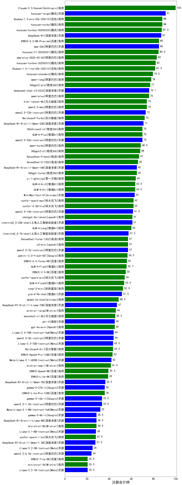

|类别|机构|大模型|【注册会计师】准确率|平均耗时|平均消耗token|花费/千次（元）|排名（准确率）|
|---|---|-----|-------------------|-------|-----------|-----------|-----------|
|商用|豆包|Doubao-1.5-pro-32k-250115|88.0%|12s|453|0.8|1|
|商用|豆包|Doubao-1.5-lite-32k-250115|81.5%|8s|319|0.2|2|
|商用|阿里巴巴|qwen-long-2025-01-25|78.0%|9s|412|0.7|3|
|商用|月之暗面|kimi-latest-8k|74.0%|17s|485|5.8|4|
|商用|百川智能|Baichuan4-Turbo|72.0%|/|/|/|5|
|开源|深度求索|DeepSeek-R1-Distill-Qwen-32B|71.0%|18s|697|0.9|6|
|商用|奇虎360|360zhinao2-o1|70.0%|/|/|/|7|
|开源|深度求索|DeepSeek-R1-Distill-Qwen-14B|65.0%|/|/|/|8|
|开源|minimax|MiniMax-Text-01|63.0%|15s|913|7.3|9|
|商用|阶跃星辰|step-2-mini|52.5%|9s|397|0.7|10|
|商用|百川智能|Baichuan4-Air|43.5%|/|/|/|11|
|商用|百度|ERNIE-Speed-8K|39.3%|/|/|/|12|
|商用|百度|ERNIE-Lite-8K|39.0%|/|/|/|13|
|开源|Google|gemma-3-27b-it|36.0%|/|/|/|14|
|开源|Google|gemma-3-12b-it|33.5%|/|/|/|15|
|开源|Google|gemma-3-4b-it|28.5%|/|/|/|16|
|商用|Mistral|ministral-8b|28.5%|/|/|/|17|
|商用|科大讯飞|xunfei-spark-lite|27.9%|/|/|/|18|
|商用|Mistral|ministral-3b|20.5%|/|/|/|19|
|开源|深度求索|deepseek-chat-v3-0324|nan%|160s|505|3.5|20|
|开源|meta|Llama-4-Scout-17B-16E-Instruct|nan%|12s|601|1.1|21|
|开源|meta|Llama-4-Maverick-17B-128E-Instruct-FP8|nan%|8s|562|2.1|22|
|开源|智谱AI|GLM-4-9B-0414|nan%|14s|515|0.0|23|
|开源|智谱AI|GLM-Z1-9B-0414|nan%|168s|3519|0.0|24|
|开源|智谱AI|GLM-4-32B-0414|nan%|45s|533|1.0|25|
|开源|智谱AI|GLM-Z1-32B-0414|nan%|214s|8002|31.7|26|
|开源|阿里巴巴|Qwen3-32B|nan%|66s|2232|8.6|27|
|开源|阿里巴巴|Qwen3-14B|nan%|43s|1825|3.5|28|
|开源|阿里巴巴|Qwen3-8B|nan%|456s|13092|0.0|29|
|开源|阿里巴巴|Qwen3-4B|nan%|22s|1919|5.4|30|
|开源|阿里巴巴|Qwen3-1.7B|nan%|25s|2136|6.1|31|
|开源|阿里巴巴|Qwen3-0.6B|nan%|12s|2300|6.6|32|
|商用|openAI|o4-mini|nan%|36s|1104|32.2|33|
|开源|深度求索|DeepSeek-R1-0528|nan%|250s|2383|36.9|34|
|商用|百度|ERNIE-4.5-Turbo-32K|nan%|21s|555|1.6|35|
|商用|百度|ERNIE-X1-Turbo-32K|nan%|106s|2593|10.1|36|
|开源|深度求索|DeepSeek-R1-0528-Qwen3-8B|nan%|236s|2358|0.0|37|
|商用|anthropic|claude-4-sonnet|nan%|46s|679|58.9|38|
|商用|anthropic|claude-4-sonnet-thinking|nan%|47s|1223|118.1|39|
|商用|豆包|doubao-seed-1-6-flash-250615|nan%|5s|523|0.6|40|
|商用|豆包|doubao-seed-1-6-flash-thinking-250615|nan%|10s|908|1.1|41|
|商用|豆包|doubao-seed-1-6-250615|nan%|129s|509|3.0|42|
|开源|minimax|MiniMax-M1|nan%|269s|3556|25.0|43|
|开源|百度|ERNIE-4.5-0.3B|nan%|51s|458|0.0|44|
|开源|百度|ERNIE-4.5-21B-A3B|nan%|56s|620|0.0|45|
|开源|百度|ERNIE-4.5-300B-A47B|nan%|30s|497|3.3|46|
|开源|腾讯|Hunyuan-A13B-Instruct|nan%|62s|1219|4.6|47|
|商用|google|gemini-2.5-flash|nan%|15s|2028|34.9|48|
|商用|XAI|grok-4-0709|nan%|251s|1226|123.8|49|
|商用|XAI|grok-3-mini|nan%|208s|1251|4.4|50|
|商用|google|gemini-2.5-pro|nan%|32s|2685|187.4|51|
|开源|月之暗面|kimi-k2-0711-preview|nan%|24s|458|6.2|52|
|商用|腾讯|hunyuan-t1-20250711|nan%|18s|1148|4.2|53|
|开源|华为|pangu-pro-moe|nan%|98s|2178|8.4|54|
|商用|阿里巴巴|qwen-turbo-2025-07-15|nan%|9s|560|0.3|55|
|开源|腾讯|Hunyuan-A13B-Instruct-nothink|nan%|14s|413|1.4|56|
|开源|阿里巴巴|qwen3-235b-a22b-instruct-2507|nan%|14s|579|4.0|57|
|商用|豆包|doubao-seed-1-6-thinking-250715|nan%|18s|962|6.9|58|
|开源|阿里巴巴|qwen3-235b-a22b-thinking-2507|nan%|29s|2246|42.9|59|
|商用|科大讯飞|xunfei-spark-x1-0725|nan%|/|1014|12.2|60|
|开源|阿里巴巴|Qwen3-0.6B-nothink|nan%|11s|307|0.6|61|
|开源|阿里巴巴|Qwen3-1.7B-nothink|nan%|12s|554|1.4|62|
|开源|阿里巴巴|Qwen3-4B-nothink|nan%|23s|582|1.4|63|
|开源|阿里巴巴|Qwen3-8B-nothink|nan%|26s|541|0.0|64|
|开源|阿里巴巴|Qwen3-14B-nothink|nan%|14s|653|1.1|65|
|开源|阿里巴巴|Qwen3-32B-nothink|nan%|23s|613|2.1|66|
|商用|智谱AI|GLM-4.5-Flash|nan%|34s|1999|0.0|67|
|开源|智谱AI|GLM-4.5-Air|nan%|39s|1828|10.5|68|
|开源|智谱AI|GLM-4.5|nan%|46s|1718|23.0|69|
|开源|阿里巴巴|Qwen3-30B-A3B-Instruct-2507|nan%|8s|751|2.0|70|
|开源|阿里巴巴|Qwen3-30B-A3B-Thinking-2507|nan%|72s|2870|7.8|71|
|开源|阶跃星辰|step-3|nan%|88s|1766|6.8|72|
|开源|智谱AI|GLM-4.5-nothink|nan%|31s|1028|13.2|73|
|开源|智谱AI|GLM-4.5-Air-nothink|nan%|14s|712|3.7|74|
|商用|智谱AI|GLM-4.5-Flash-nothink|nan%|16s|799|0.0|75|
|开源|openAI|gpt-oss-120b(new)|nan%|7s|1213|3.5|76|
|开源|openAI|gpt-oss-20b(new)|nan%|7s|1412|1.5|77|
|商用|openAI|gpt-5-2025-08-07(new)|nan%|28s|458|25.4|78|
|商用|openAI|gpt-5-mini-2025-08-07(new)|nan%|141s|1116|14.6|79|
|商用|openAI|gpt-5-nano-2025-08-07(new)|nan%|22s|3537|9.9|80|
|商用|腾讯|hunyuan-turbos-20250716|nan%|12s|653|1.1|81|
|商用|阿里巴巴|qwen-flash-2025-07-28|nan%|7s|697|0.9|82|
|商用|阿里巴巴|qwen-flash-think-2025-07-28|nan%|24s|2505|3.6|83|
|开源|深度求索|DeepSeek-V3.1(new)|nan%|16s|363|3.6|84|
|开源|深度求索|DeepSeek-V3.1-Think(new)|nan%|56s|1124|12.7|85|
|商用|google|gemini-2.5-flash-lite|nan%|4s|602|1.5|86|
|商用|Mistral|mistral-medium-2508(new)|nan%|21s|556|6.2|87|
|开源|Mistral|Magistral-Small-2507|nan%|81s|7649|82.0|88|
|开源|Mistral|Mistral-Small-3.2-24B-Instruct-2506|nan%|25s|703|1.3|89|
|商用|阿里巴巴|qwen-plus-2025-07-28|nan%|17s|659|1.2|90|
|商用|阿里巴巴|qwen-plus-think-2025-07-28|nan%|/|1914|14.5|91|
|商用|阿里巴巴|qwen-turbo-think-2025-07-15|nan%|/|1896|5.4|92|
|商用|阿里巴巴|qwen3-max-preview(new)|nan%|10s|526|10.6|93|
|开源|豆包|Seed-OSS-36B-Instruct(new)|nan%|74s|1315|5.0|94|
|开源|阿里巴巴|qwen3-next-80b-a3b-instruct(new)|nan%|14s|699|2.5|95|
|开源|深度求索|DeepSeek-V3.2-Exp(new)|nan%|148s|381|1.1|96|
|开源|深度求索|DeepSeek-V3.2-Exp-Think(new)|nan%|465s|1023|3.0|97|
|商用|腾讯|hunyuan-turbos-20250926(new)|nan%|25s|982|1.8|98|

