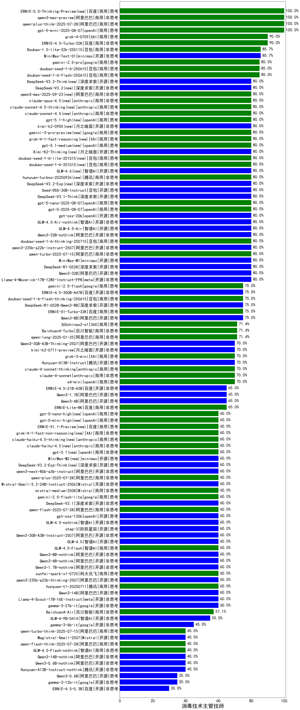

|类别|机构|大模型|【消毒技术主管技师】准确率|平均耗时|平均消耗token|花费/千次（元）|排名（准确率）|
|---|---|-----|-------------------|-------|-----------|-----------|-----------|
|商用|豆包|Doubao-1.5-pro-32k-250115|100.0%|16s|326|0.5|1|
|商用|openAI|gpt-5-mini-2025-08-07(new)|100.0%|117s|694|8.3|2|
|商用|百度|ERNIE-4.5-Turbo-32K|90.0%|21s|527|1.5|3|
|商用|XAI|grok-4-0709|90.0%|496s|1911|198.5|4|
|商用|阿里巴巴|qwen-long-2025-01-25|85.7%|146s|348|0.5|5|
|商用|豆包|Doubao-1.5-lite-32k-250115|85.7%|1s|169|0.1|6|
|商用|科大讯飞|xunfei-spark-pro|85.7%|/|/|/|7|
|商用|科大讯飞|xunfei-spark-max|85.7%|2s|144|4.3|8|
|商用|科大讯飞|xunfei-4.0Ultra|85.7%|2s|144|10.1|9|
|商用|奇虎360|360gpt2-o1|85.7%|10s|261|9.6|10|
|商用|豆包|doubao-seed-1-6-250615|85.0%|101s|412|2.4|11|
|商用|google|gemini-2.5-pro|85.0%|41s|2224|154.7|12|
|开源|minimax|MiniMax-M1|85.0%|143s|2720|18.2|13|
|商用|豆包|doubao-seed-1-6-flash-250615|85.0%|4s|340|0.4|14|
|开源|深度求索|DeepSeek-R1-0528|80.0%|243s|1640|25.2|15|
|开源|meta|Llama-4-Maverick-17B-128E-Instruct-FP8|80.0%|11s|557|2.1|16|
|商用|阿里巴巴|qwen-turbo-2025-07-15|80.0%|8s|379|0.2|17|
|开源|阿里巴巴|Qwen3-32B|80.0%|18s|810|2.9|18|
|商用|豆包|doubao-seed-1-6-thinking-250715|80.0%|14s|905|6.4|19|
|开源|智谱AI|GLM-4.5-Air|80.0%|33s|1584|8.9|20|
|开源|阿里巴巴|Qwen3-8B-nothink|80.0%|154s|491|0.0|21|
|开源|openAI|gpt-oss-20b(new)|80.0%|7s|1043|1.0|22|
|商用|openAI|gpt-5-2025-08-07(new)|80.0%|15s|280|11.8|23|
|开源|阿里巴巴|qwen3-235b-a22b-instruct-2507|80.0%|7s|384|2.3|24|
|开源|阿里巴巴|Qwen3-32B-nothink|80.0%|18s|473|1.5|25|
|开源|深度求索|DeepSeek-V3.1-Think(new)|80.0%|75s|1481|16.9|26|
|商用|openAI|gpt-5-nano-2025-08-07(new)|80.0%|16s|1637|4.4|27|
|开源|智谱AI|GLM-4.5-Air-nothink|80.0%|11s|745|3.8|28|
|开源|深度求索|DeepSeek-R1-0528-Qwen3-8B|75.0%|190s|1526|0.0|29|
|开源|百度|ERNIE-4.5-300B-A47B|75.0%|12s|374|2.4|30|
|商用|google|gemini-2.5-flash|75.0%|10s|1841|31.7|31|
|商用|百度|ERNIE-X1-Turbo-32K|75.0%|64s|1496|5.7|32|
|开源|深度求索|deepseek-chat-v3-0324|75.0%|117s|237|1.2|33|
|开源|阿里巴巴|Qwen3-8B|75.0%|601s|16457|0.0|34|
|商用|豆包|doubao-seed-1-6-flash-thinking-250615|75.0%|5s|508|0.6|35|
|商用|零一万物|yi-lightning|71.4%|/|/|/|36|
|商用|奇虎360|360gpt2-pro|71.4%|10s|284|1.0|37|
|商用|阶跃星辰|step-2-mini|71.4%|7s|432|0.7|38|
|商用|奇虎360|360zhinao2-o1|71.4%|/|/|/|39|
|商用|月之暗面|kimi-latest-8k|71.4%|19s|575|6.9|40|
|商用|百川智能|Baichuan4-Turbo|71.4%|/|/|/|41|
|商用|百度|ERNIE-3.5-8K|71.4%|18s|423|0.7|42|
|开源|阿里巴巴|Qwen3-30B-A3B-Thinking-2507|70.0%|49s|1997|5.4|43|
|商用|XAI|grok-3-mini|70.0%|294s|894|3.1|44|
|开源|月之暗面|kimi-k2-0711-preview|70.0%|29s|539|7.5|45|
|商用|anthropic|claude-4-sonnet-thinking|70.0%|47s|1519|150.9|46|
|商用|anthropic|claude-4-sonnet|70.0%|39s|513|41.5|47|
|商用|openAI|o4-mini|70.0%|37s|930|26.7|48|
|开源|智谱AI|GLM-Z1-9B-0414|70.0%|66s|2481|0.0|49|
|开源|智谱AI|GLM-Z1-32B-0414|70.0%|133s|2775|10.7|50|
|开源|腾讯|Hunyuan-A13B-Instruct|70.0%|71s|784|2.9|51|
|开源|阿里巴巴|Qwen3-4B|65.0%|17s|1703|4.8|52|
|开源|阿里巴巴|Qwen3-1.7B|65.0%|21s|1494|4.2|53|
|开源|百度|ERNIE-4.5-21B-A3B|65.0%|51s|350|0.0|54|
|开源|华为|pangu-pro-moe|60.0%|90s|1624|6.1|55|
|开源|阿里巴巴|Qwen3-14B|60.0%|54s|2269|4.4|56|
|商用|阿里巴巴|qwen-plus-2025-07-14|60.0%|8s|426|0.7|57|
|开源|Mistral|Mistral-Small-3.2-24B-Instruct-2506(new)|60.0%|16s|557|1.0|58|
|商用|阿里巴巴|qwen-flash-2025-07-28|60.0%|7s|437|0.5|59|
|开源|智谱AI|GLM-4.5-nothink|60.0%|24s|690|8.3|60|
|开源|阿里巴巴|Qwen3-30B-A3B-Instruct-2507|60.0%|3s|402|0.9|61|
|开源|智谱AI|GLM-4.5|60.0%|58s|1351|17.7|62|
|开源|阿里巴巴|Qwen3-4B-nothink|60.0%|14s|510|1.2|63|
|开源|智谱AI|GLM-4-32B-0414|60.0%|11s|346|0.7|64|
|商用|腾讯|hunyuan-t1-20250711|60.0%|17s|1121|4.0|65|
|商用|Mistral|mistral-medium-2508(new)|60.0%|610s|422|4.1|66|
|商用|google|gemini-2.5-flash-lite|60.0%|2s|467|1.1|67|
|开源|深度求索|DeepSeek-V3.1(new)|60.0%|9s|231|1.9|68|
|开源|阶跃星辰|step-3|60.0%|84s|1656|6.3|69|
|商用|智谱AI|GLM-4.5-Flash|60.0%|35s|2189|0.0|70|
|开源|阿里巴巴|Qwen3-1.7B-nothink|60.0%|9s|479|1.1|71|
|商用|腾讯|hunyuan-turbos-20250716|60.0%|8s|449|0.7|72|
|开源|openAI|gpt-oss-120b(new)|60.0%|4s|653|1.6|73|
|商用|科大讯飞|xunfei-spark-x1-0725|60.0%|/|920|11.0|74|
|开源|阿里巴巴|qwen3-235b-a22b-thinking-2507|60.0%|221s|3630|70.4|75|
|开源|Google|gemma-3-27b-it|59.0%|/|/|/|76|
|商用|百度|ERNIE-Lite-8K|57.5%|/|/|/|77|
|开源|深度求索|DeepSeek-R1-Distill-Qwen-32B|57.1%|38s|656|0.8|78|
|商用|百度|ERNIE-Speed-8K|57.1%|/|/|/|79|
|商用|百川智能|Baichuan4-Air|57.1%|/|/|/|80|
|商用|Mistral|ministral-8b|57.1%|/|/|/|81|
|开源|minimax|MiniMax-Text-01|57.1%|11s|936|7.5|82|
|开源|深度求索|DeepSeek-R1-Distill-Qwen-14B|57.1%|/|/|/|83|
|开源|Google|gemma-3-12b-it|55.5%|/|/|/|84|
|开源|meta|Llama-4-Scout-17B-16E-Instruct|55.0%|11s|599|1.1|85|
|开源|智谱AI|GLM-4-9B-0414|55.0%|12s|428|0.0|86|
|开源|Google|gemma-3-4b-it|44.0%|/|/|/|87|
|商用|Mistral|ministral-3b|42.9%|/|/|/|88|
|开源|阿里巴巴|Qwen3-0.6B-nothink|40.0%|8s|302|0.6|89|
|商用|阿里巴巴|qwen-flash-think-2025-07-28|40.0%|60s|2016|2.9|90|
|商用|智谱AI|GLM-4.5-Flash-nothink|40.0%|14s|759|0.0|91|
|开源|腾讯|Hunyuan-A13B-Instruct-nothink|40.0%|8s|302|0.8|92|
|开源|阿里巴巴|Qwen3-14B-nothink|40.0%|17s|520|0.8|93|
|开源|Mistral|Magistral-Small-2507(new)|40.0%|60s|5351|56.9|94|
|开源|百度|ERNIE-4.5-0.3B|35.0%|56s|395|0.0|95|
|开源|阿里巴巴|Qwen3-0.6B|35.0%|7s|1332|3.7|96|
|商用|科大讯飞|xunfei-spark-lite|28.6%|/|/|/|97|

