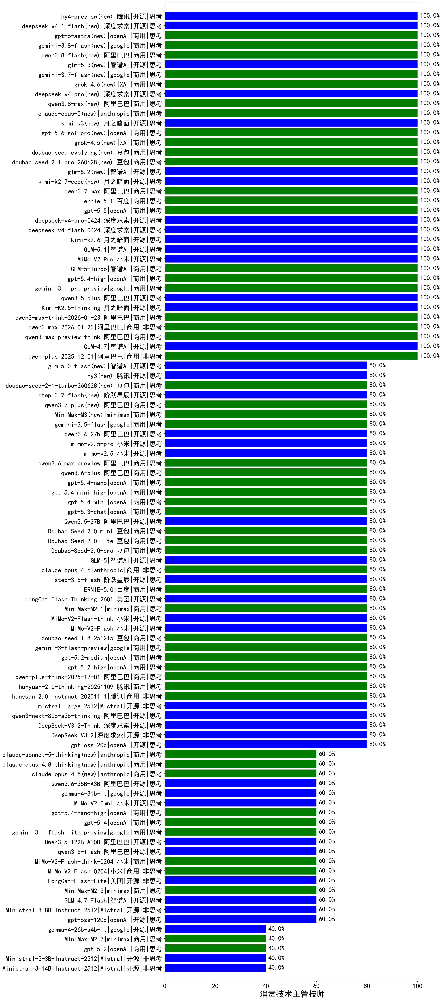

|类别|机构|大模型|【消毒技术主管技师】准确率|平均耗时|平均消耗token|花费/千次（元）|排名（准确率）|
|---|---|-----|-------------------|-------|-----------|-----------|-----------|
|开源|腾讯|hy4-preview(new)|100.0%|24s|1494|25.4|1|
|商用|豆包|doubao-seed-evolving(new)|100.0%|146s|4734|138.3|2|
|开源|智谱AI|GLM-4.7|100.0%|49s|1615|21.4|3|
|商用|豆包|doubao-seed-2-1-pro-260628(new)|100.0%|119s|3684|106.7|4|
|商用|阿里巴巴|qwen3-max-preview-think|100.0%|208s|2258|51.9|5|
|开源|智谱AI|glm-5.2(new)|100.0%|80s|1215|31.6|6|
|开源|月之暗面|kimi-k2.7-code(new)|100.0%|50s|546|12.5|7|
|商用|阿里巴巴|qwen3-max-2026-01-23|100.0%|7s|333|2.4|8|
|商用|阿里巴巴|qwen3-max-think-2026-01-23|100.0%|223s|2513|24.2|9|
|开源|月之暗面|Kimi-K2.5-Thinking|100.0%|214s|1100|21.2|10|
|开源|智谱AI|GLM-5.1|100.0%|147s|1220|27.2|11|
|商用|阿里巴巴|qwen3.7-max|100.0%|16s|787|25.5|12|
|开源|月之暗面|kimi-k2.6|100.0%|92s|1126|28.1|13|
|商用|百度|ernie-5.1|100.0%|49s|720|11.3|14|
|商用|openAI|gpt-5.5|100.0%|7s|403|60.3|15|
|开源|深度求索|deepseek-v4-pro-0424|100.0%|21s|518|11.3|16|
|开源|深度求索|deepseek-v4-flash-0424|100.0%|34s|695|1.3|17|
|开源|阿里巴巴|qwen3.5-plus|100.0%|32s|2618|12.1|18|
|开源|小米|MiMo-V2-Pro|100.0%|55s|932|14.5|19|
|商用|openAI|gpt-5.4-high|100.0%|10s|766|68.3|20|
|商用|XAI|grok-4.6(new)|100.0%|1070s|1048|35.1|21|
|开源|深度求索|deepseek-v4.1-flash(new)|100.0%|32s|577|3.8|22|
|商用|openAI|gpt-6-astra(new)|100.0%|15s|306|68.3|23|
|商用|google|gemini-3.8-flash(new)|100.0%|20s|621|27.1|24|
|商用|智谱AI|GLM-5-Turbo|100.0%|62s|1055|21.3|25|
|商用|阿里巴巴|qwen3.8-flash(new)|100.0%|40s|1025|2.4|26|
|开源|智谱AI|glm-5.3(new)|100.0%|27s|717|17.6|27|
|商用|XAI|grok-4.5(new)|100.0%|54s|1010|33.5|28|
|商用|google|gemini-3.7-flash(new)|100.0%|5s|638|14.0|29|
|开源|深度求索|deepseek-v4-pro(new)|100.0%|23s|597|12.7|30|
|商用|阿里巴巴|qwen3.8-max(new)|100.0%|18s|782|24.4|31|
|商用|阿里巴巴|qwen-plus-2025-12-01|100.0%|16s|674|1.2|32|
|商用|anthropic|claude-opus-5(new)|100.0%|15s|631|84.3|33|
|开源|月之暗面|kimi-k3(new)|100.0%|26s|644|49.2|34|
|商用|openAI|gpt-5.6-sol-pro(new)|100.0%|8s|2902|184.0|35|
|商用|google|gemini-3.1-pro-preview|100.0%|50s|1037|79.1|36|
|商用|阿里巴巴|qwen3.6-max-preview|80.0%|50s|1550|78.3|37|
|商用|阿里巴巴|qwen3.6-plus|80.0%|20s|1541|17.3|38|
|开源|小米|mimo-v2.5|80.0%|14s|1008|10.0|39|
|开源|阶跃星辰|step-3.7-flash(new)|80.0%|18s|1120|8.3|40|
|开源|小米|mimo-v2.5-pro|80.0%|16s|901|13.8|41|
|开源|阿里巴巴|qwen3.6-27b|80.0%|29s|1793|30.5|42|
|商用|google|gemini-3.5-flash|80.0%|8s|1106|62.8|43|
|商用|minimax|MiniMax-M3(new)|80.0%|17s|599|6.5|44|
|商用|阿里巴巴|qwen3.7-plus(new)|80.0%|19s|1033|7.5|45|
|商用|openAI|gpt-5.4-mini-high|80.0%|99s|1354|39.0|46|
|商用|豆包|doubao-seed-2-1-turbo-260628(new)|80.0%|228s|9304|137.7|47|
|开源|腾讯|hy3(new)|80.0%|158s|228|0.6|48|
|开源|智谱AI|glm-5.3-flash(new)|80.0%|35s|1388|3.6|49|
|商用|openAI|gpt-5.4-nano|80.0%|15s|284|1.5|50|
|商用|openAI|gpt-5.4-mini|80.0%|11s|234|3.7|51|
|开源|openAI|gpt-oss-20b|80.0%|7s|1043|1.0|52|
|商用|openAI|gpt-5.2-medium|80.0%|5s|337|21.4|53|
|开源|阶跃星辰|step-3.5-flash|80.0%|23s|2198|4.4|54|
|开源|美团|LongCat-Flash-Thinking-2601|80.0%|134s|2152|0.0|55|
|商用|minimax|MiniMax-M2.1|80.0%|135s|1850|14.6|56|
|开源|小米|MiMo-V2-Flash-think|80.0%|140s|1898|0.0|57|
|开源|小米|MiMo-V2-Flash|80.0%|5s|364|0.0|58|
|商用|豆包|doubao-seed-1-8-251215|80.0%|18s|488|2.8|59|
|商用|google|gemini-3-flash-preview|80.0%|106s|779|14.3|60|
|商用|openAI|gpt-5.2-high|80.0%|7s|441|31.8|61|
|开源|智谱AI|GLM-5|80.0%|88s|1678|28.6|62|
|商用|阿里巴巴|qwen-plus-think-2025-12-01|80.0%|69s|3196|24.7|63|
|商用|腾讯|hunyuan-2.0-thinking-20251109|80.0%|10s|1099|4.1|64|
|商用|腾讯|hunyuan-2.0-instruct-20251111|80.0%|2s|395|0.6|65|
|开源|Mistral|mistral-large-2512|80.0%|8s|491|4.0|66|
|开源|阿里巴巴|qwen3-next-80b-a3b-thinking|80.0%|61s|2592|10.0|67|
|开源|深度求索|DeepSeek-V3.2-Think|80.0%|135s|1046|3.0|68|
|开源|深度求索|DeepSeek-V3.2|80.0%|95s|316|0.8|69|
|商用|anthropic|claude-opus-4.6|80.0%|20s|598|79.6|70|
|商用|百度|ERNIE-5.0|80.0%|83s|1632|37.2|71|
|开源|阿里巴巴|Qwen3.5-27B|80.0%|108s|2652|12.2|72|
|商用|openAI|gpt-5.3-chat|80.0%|15s|355|22.8|73|
|商用|豆包|Doubao-Seed-2.0-pro|80.0%|102s|664|8.6|74|
|商用|豆包|Doubao-Seed-2.0-lite|80.0%|122s|665|1.9|75|
|商用|豆包|Doubao-Seed-2.0-mini|80.0%|137s|1901|3.5|76|
|商用|minimax|MiniMax-M2.5|60.0%|16s|814|5.9|77|
|商用|openAI|gpt-5.4|60.0%|3s|251|14.2|78|
|开源|小米|MiMo-V2-Omni|60.0%|8s|1471|16.5|79|
|开源|Mistral|Ministral-3-8B-Instruct-2512|60.0%|12s|514|0.5|80|
|开源|google|gemma-4-31b-it|60.0%|31s|372|0.8|81|
|商用|google|gemini-3.1-flash-lite-preview|60.0%|4s|308|2.1|82|
|开源|阿里巴巴|Qwen3.6-35B-A3B|60.0%|101s|1579|16.0|83|
|商用|anthropic|claude-opus-4.8(new)|60.0%|7s|480|57.9|84|
|开源|阿里巴巴|Qwen3.5-122B-A10B|60.0%|292s|2304|14.1|85|
|开源|阿里巴巴|qwen3.5-flash|60.0%|229s|3327|6.4|86|
|商用|anthropic|claude-sonnet-5-thinking(new)|60.0%|9s|519|25.9|87|
|开源|智谱AI|GLM-4.7-Flash|60.0%|381s|2519|0.0|88|
|商用|小米|MiMo-V2-Flash-think-0204|60.0%|525s|1511|3.0|89|
|商用|anthropic|claude-opus-4.8-thinking(new)|60.0%|7s|572|74.1|90|
|商用|openAI|gpt-5.4-nano-high|60.0%|7s|453|2.9|91|
|商用|小米|MiMo-V2-Flash-0204|60.0%|55s|441|0.7|92|
|开源|美团|LongCat-Flash-Lite|60.0%|41s|418|0.0|93|
|开源|openAI|gpt-oss-120b|60.0%|4s|653|1.6|94|
|商用|openAI|gpt-5.2|40.0%|3s|239|11.7|95|
|开源|google|gemma-4-26b-a4b-it|40.0%|75s|492|1.1|96|
|开源|Mistral|Ministral-3-3B-Instruct-2512|40.0%|8s|556|0.4|97|
|开源|Mistral|Ministral-3-14B-Instruct-2512|40.0%|11s|556|0.8|98|
|商用|minimax|MiniMax-M2.7|40.0%|44s|1582|12.4|99|

