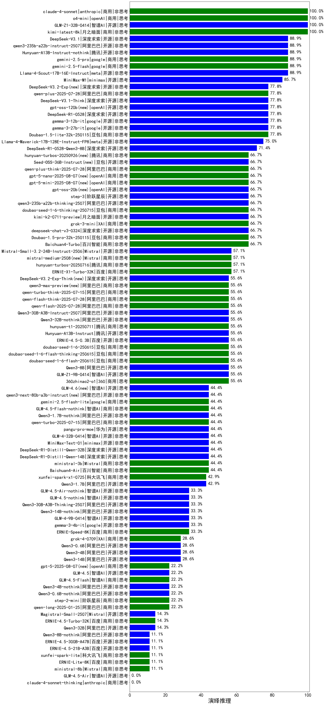

|类别|机构|大模型|【演绎推理】准确率|平均耗时|平均消耗token|花费/千次（元）|排名（准确率）|
|---|---|-----|-------------------|-------|-----------|-----------|-----------|
|商用|anthropic|claude-4-sonnet|100.0%|42s|445|38.1|1|
|商用|openAI|o4-mini|100.0%|20s|423|11.5|2|
|商用|google|gemini-2.5-pro|88.9%|37s|1528|105.9|3|
|商用|google|gemini-2.5-flash|88.9%|27s|924|15.5|4|
|开源|腾讯|Hunyuan-A13B-Instruct-nothink|88.9%|662s|359|1.2|5|
|开源|阿里巴巴|qwen3-235b-a22b-instruct-2507|88.9%|18s|357|2.4|6|
|开源|深度求索|DeepSeek-V3.1|88.9%|12s|248|2.4|7|
|开源|meta|Llama-4-Scout-17B-16E-Instruct|88.9%|7s|514|1.0|8|
|开源|月之暗面|kimi-k2-0905(new)|88.9%|45s|427|5.8|9|
|商用|anthropic|claude-haiku-4.5(new)|88.9%|11s|511|14.6|10|
|开源|minimax|MiniMax-M1|85.7%|250s|4345|33.4|11|
|开源|openAI|gpt-oss-120b|77.8%|41s|498|1.3|12|
|商用|anthropic|claude-sonnet-4.5(new)|77.8%|7s|503|44.0|13|
|开源|深度求索|DeepSeek-V3.1-Think|77.8%|29s|590|6.5|14|
|开源|深度求索|DeepSeek-R1-0528|77.8%|129s|1375|21.2|15|
|开源|深度求索|DeepSeek-V3.2-Exp(new)|77.8%|13s|261|0.7|16|
|商用|豆包|Doubao-1.5-lite-32k-250115|77.8%|4s|261|0.1|17|
|商用|阿里巴巴|qwen-plus-2025-07-28|77.8%|48s|340|0.6|18|
|开源|google|gemma-3-12b-it|77.8%|/|/|/|19|
|商用|腾讯|hunyuan-2.0-instruct-20251111(new)|77.8%|7s|375|0.6|20|
|开源|Mistral|Ministral-3-3B-Instruct-2512(new)|77.8%|9s|543|0.4|21|
|开源|google|gemma-3-27b-it|77.8%|/|/|/|22|
|开源|meta|Llama-4-Maverick-17B-128E-Instruct-FP8|75.0%|8s|563|2.2|23|
|开源|深度求索|DeepSeek-R1-0528-Qwen3-8B|71.4%|674s|1617|0.0|24|
|商用|anthropic|claude-haiku-4.5-thinking(new)|66.7%|13s|1548|51.3|25|
|商用|豆包|doubao-seed-1-6-251015(new)|66.7%|4s|521|3.4|26|
|开源|月之暗面|kimi-k2-0711-preview|66.7%|39s|592|8.7|27|
|开源|豆包|Seed-OSS-36B-Instruct|66.7%|127s|959|3.6|28|
|商用|openAI|gpt-5.1-medium(new)|66.7%|57s|426|25.2|29|
|商用|openAI|gpt-5.1(new)|66.7%|307s|256|13.2|30|
|开源|openAI|gpt-oss-20b|66.7%|105s|490|0.5|31|
|商用|豆包|doubao-seed-1-6-thinking-250715|66.7%|26s|696|5.0|32|
|开源|阿里巴巴|qwen3-235b-a22b-thinking-2507|66.7%|46s|1010|18.5|33|
|商用|腾讯|hunyuan-turbos-20250926(new)|66.7%|8s|403|0.7|34|
|商用|XAI|grok-3-mini|66.7%|166s|750|2.6|35|
|开源|阶跃星辰|step-3|66.7%|91s|1763|6.9|36|
|商用|豆包|doubao-seed-1-6-lite-251015(new)|66.7%|14s|661|1.4|37|
|商用|anthropic|claude-sonnet-4.5-thinking(new)|66.7%|22s|1564|156.9|38|
|商用|openAI|gpt-5-mini-2025-08-07|66.7%|26s|490|6.1|39|
|商用|百川智能|Baichuan4-Turbo|66.7%|/|/|/|40|
|开源|Mistral|Ministral-3-8B-Instruct-2512(new)|66.7%|7s|444|0.5|41|
|商用|阿里巴巴|qwen-plus-think-2025-07-28|66.7%|614s|998|7.4|42|
|开源|Mistral|mistral-large-2512(new)|66.7%|11s|451|4.2|43|
|开源|深度求索|DeepSeek-V3.2(new)|66.7%|79s|331|0.9|44|
|商用|openAI|gpt-5-mini-high(new)|66.7%|73s|1711|23.8|45|
|商用|阿里巴巴|qwen3-max-2025-09-23(new)|66.7%|20s|459|9.7|46|
|商用|openAI|gpt-5-nano-2025-08-07|66.7%|38s|1031|2.8|47|
|商用|百度|ERNIE-5.0-Thinking-Preview(new)|66.7%|93s|1152|26.4|48|
|商用|百度|ERNIE-X1-Turbo-32K|57.1%|359s|760|2.8|49|
|商用|Mistral|mistral-medium-2508|57.1%|392s|332|3.9|50|
|开源|Mistral|Mistral-Small-3.2-24B-Instruct-2506|57.1%|17s|868|1.8|51|
|开源|深度求索|DeepSeek-V3.2-Exp-Think(new)|55.6%|186s|675|2.0|52|
|开源|minimax|MiniMax-M2(new)|55.6%|13s|940|7.3|53|
|商用|阿里巴巴|qwen-flash-2025-07-28|55.6%|52s|390|0.5|54|
|商用|阿里巴巴|qwen-turbo-think-2025-07-15|55.6%|1098s|1159|3.3|55|
|商用|阿里巴巴|qwen-flash-think-2025-07-28|55.6%|62s|1181|1.7|56|
|商用|腾讯|hunyuan-t1-20250711|55.6%|64s|745|2.7|57|
|开源|阿里巴巴|Qwen3-30B-A3B-Instruct-2507|55.6%|36s|389|1.0|58|
|开源|月之暗面|Kimi-K2-Thinking(new)|55.6%|95s|1190|18.2|59|
|商用|360|360zhinao2-o1|55.6%|/|/|/|60|
|开源|Mistral|Ministral-3-14B-Instruct-2512(new)|55.6%|9s|348|0.5|61|
|开源|阿里巴巴|Qwen3-8B|55.6%|55s|1154|0.0|62|
|开源|深度求索|DeepSeek-V3.2-Think(new)|55.6%|42s|897|2.6|63|
|商用|openAI|gpt-5-nano-high(new)|55.6%|319s|3032|8.6|64|
|商用|豆包|doubao-seed-1-6-flash-250615|55.6%|4s|311|0.4|65|
|商用|豆包|doubao-seed-1-6-flash-thinking-250615|55.6%|5s|587|0.7|66|
|商用|豆包|doubao-seed-1-6-250615|55.6%|6s|294|1.6|67|
|开源|百度|ERNIE-4.5-0.3B|55.6%|31s|285|0.0|68|
|商用|anthropic|claude-opus-4.5(new)|55.6%|9s|496|70.8|69|
|开源|腾讯|Hunyuan-A13B-Instruct|55.6%|95s|587|2.2|70|
|商用|openAI|gpt-5.1-high(new)|55.6%|102s|848|55.2|71|
|商用|google|gemini-3-pro-preview(new)|55.6%|64s|2434|201.9|72|
|开源|阿里巴巴|Qwen3-32B-nothink|55.6%|103s|432|1.5|73|
|商用|阿里巴巴|qwen3-max-preview|55.6%|63s|329|6.6|74|
|开源|阿里巴巴|qwen3-next-80b-a3b-instruct|44.4%|32s|364|1.2|75|
|商用|XAI|grok-4-1-fast-reasoning(new)|44.4%|44s|684|1.9|76|
|开源|阿里巴巴|qwen3-next-80b-a3b-thinking(new)|44.4%|123s|2958|11.6|77|
|开源|智谱AI|GLM-4.6(new)|44.4%|40s|1765|23.9|78|
|商用|腾讯|hunyuan-2.0-thinking-20251109(new)|44.4%|16s|1568|6.1|79|
|开源|minimax|MiniMax-Text-01|44.4%|7s|888|7.1|80|
|商用|智谱AI|GLM-4.5-Flash-nothink|44.4%|24s|1138|0.0|81|
|商用|百川智能|Baichuan4-Air|44.4%|/|/|/|82|
|商用|阿里巴巴|qwen-turbo-2025-07-15|44.4%|62s|301|0.2|83|
|商用|google|gemini-2.5-flash-lite|44.4%|21s|434|1.1|84|
|开源|阿里巴巴|Qwen3-1.7B-nothink|44.4%|30s|341|0.8|85|
|商用|科大讯飞|xunfei-spark-x1-0725|42.9%|/|703|8.4|86|
|开源|阿里巴巴|Qwen3-1.7B|42.9%|37s|1056|3.0|87|
|开源|智谱AI|GLM-4.5-Air-nothink|33.3%|43s|1034|5.8|88|
|开源|智谱AI|GLM-4.5-nothink|33.3%|44s|835|10.9|89|
|开源|阿里巴巴|Qwen3-30B-A3B-Thinking-2507|33.3%|72s|1264|3.4|90|
|开源|google|gemma-3-4b-it|33.3%|/|/|/|91|
|开源|智谱AI|GLM-4-9B-0414|33.3%|10s|310|0.0|92|
|开源|阿里巴巴|Qwen3-14B-nothink|33.3%|27s|394|0.7|93|
|商用|XAI|grok-4-1-fast-non-reasoning(new)|33.3%|3s|440|1.1|94|
|开源|阿里巴巴|Qwen3-0.6B|28.6%|24s|755|2.1|95|
|开源|阿里巴巴|Qwen3-14B|28.6%|88s|1429|2.7|96|
|开源|阿里巴巴|Qwen3-4B|28.6%|61s|953|2.7|97|
|商用|XAI|grok-4-0709|28.6%|352s|498|47.6|98|
|商用|百度|ERNIE-X1.1-Preview(new)|22.2%|141s|1119|4.3|99|
|商用|阿里巴巴|qwen-long-2025-01-25|22.2%|32s|409|0.7|100|
|开源|阿里巴巴|Qwen3-0.6B-nothink|22.2%|64s|196|0.4|101|
|开源|阿里巴巴|Qwen3-4B-nothink|22.2%|66s|366|0.9|102|
|商用|智谱AI|GLM-4.5-Flash|22.2%|37s|1756|0.0|103|
|开源|智谱AI|GLM-4.5|22.2%|66s|1907|26.0|104|
|商用|openAI|gpt-5-2025-08-07|22.2%|79s|216|10.8|105|
|商用|百度|ERNIE-4.5-Turbo-32K|14.3%|11s|297|0.8|106|
|开源|阿里巴巴|Qwen3-32B|14.3%|96s|1331|5.1|107|
|开源|Mistral|Magistral-Small-2507|14.3%|480s|5289|56.9|108|
|开源|百度|ERNIE-4.5-300B-A47B|11.1%|60s|295|1.9|109|
|开源|百度|ERNIE-4.5-21B-A3B|11.1%|8s|361|0.0|110|
|开源|阿里巴巴|Qwen3-8B-nothink|11.1%|31s|395|0.0|111|
|商用|百度|ERNIE-Lite-8K|11.1%|/|/|/|112|
|商用|anthropic|claude-4-sonnet-thinking|/%|49s|986|97.0|113|
|开源|智谱AI|GLM-4.5-Air|/%|53s|1843|10.7|114|

