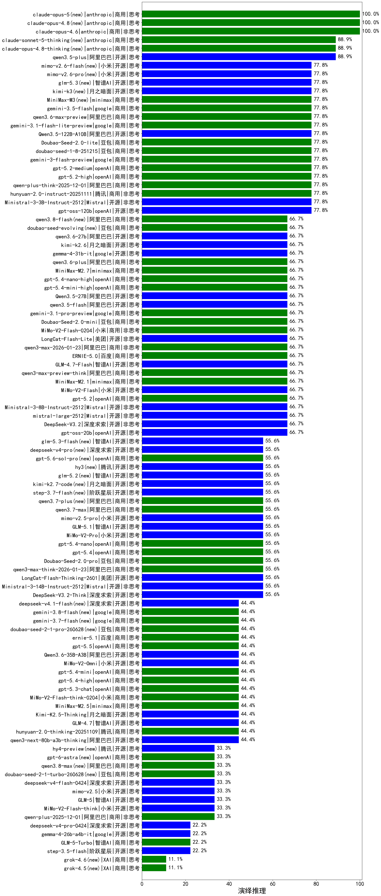

|类别|机构|大模型|【演绎推理】准确率|平均耗时|平均消耗token|花费/千次（元）|排名（准确率）|
|---|---|-----|-------------------|-------|-----------|-----------|-----------|
|商用|anthropic|claude-opus-4.6|100.0%|14s|411|54.7|1|
|商用|anthropic|claude-opus-4.8(new)|100.0%|9s|455|62.8|2|
|商用|anthropic|claude-opus-5(new)|100.0%|7s|478|66.8|3|
|商用|anthropic|claude-sonnet-5-thinking(new)|88.9%|10s|603|35.5|4|
|开源|阿里巴巴|qwen3.5-plus|88.9%|48s|3655|17.2|5|
|商用|anthropic|claude-opus-4.8-thinking(new)|88.9%|14s|920|144.2|6|
|开源|openAI|gpt-oss-120b|77.8%|41s|498|1.3|7|
|商用|openAI|gpt-5.2-medium|77.8%|7s|268|19.6|8|
|开源|智谱AI|glm-5.3(new)|77.8%|82s|2905|79.8|9|
|开源|阿里巴巴|Qwen3.5-122B-A10B|77.8%|223s|4158|26.2|10|
|商用|google|gemini-3.1-flash-lite-preview|77.8%|4s|241|1.9|11|
|商用|阿里巴巴|qwen3.6-max-preview|77.8%|43s|1376|70.7|12|
|商用|豆包|Doubao-Seed-2.0-lite|77.8%|173s|825|2.6|13|
|商用|google|gemini-3-flash-preview|77.8%|40s|1528|31.2|14|
|商用|豆包|doubao-seed-1-8-251215|77.8%|19s|490|3.1|15|
|商用|openAI|gpt-5.2-high|77.8%|6s|341|26.8|16|
|商用|腾讯|hunyuan-2.0-instruct-20251111|77.8%|7s|375|0.6|17|
|开源|月之暗面|kimi-k3(new)|77.8%|38s|830|71.3|18|
|商用|google|gemini-3.5-flash|77.8%|7s|1207|72.0|19|
|商用|minimax|MiniMax-M3(new)|77.8%|27s|810|10.6|20|
|开源|Mistral|Ministral-3-3B-Instruct-2512|77.8%|9s|543|0.4|21|
|商用|阿里巴巴|qwen-plus-think-2025-12-01|77.8%|26s|1245|9.4|22|
|商用|豆包|doubao-seed-evolving(new)|66.7%|219s|7601|225.3|23|
|商用|google|gemini-3.1-pro-preview|66.7%|30s|1178|94.8|24|
|开源|阿里巴巴|qwen3.5-flash|66.7%|206s|3494|6.8|25|
|商用|openAI|gpt-5.4-mini-high|66.7%|16s|307|7.5|26|
|开源|openAI|gpt-oss-20b|66.7%|105s|490|0.5|27|
|商用|openAI|gpt-5.4-nano-high|66.7%|9s|347|2.4|28|
|商用|minimax|MiniMax-M2.7|66.7%|20s|786|6.0|29|
|商用|阿里巴巴|qwen3.6-plus|66.7%|36s|1525|17.5|30|
|开源|google|gemma-4-31b-it|66.7%|15s|327|0.8|31|
|开源|月之暗面|kimi-k2.6|66.7%|117s|1620|42.3|32|
|开源|阿里巴巴|qwen3.6-27b|66.7%|25s|1632|28.2|33|
|商用|豆包|Doubao-Seed-2.0-mini|66.7%|178s|1239|2.3|34|
|开源|阿里巴巴|Qwen3.5-27B|66.7%|328s|4036|19.0|35|
|开源|小米|MiMo-V2-Flash|66.7%|273s|394|0.0|36|
|商用|小米|MiMo-V2-Flash-0204|66.7%|45s|404|0.7|37|
|开源|美团|LongCat-Flash-Lite|66.7%|210s|511|0.0|38|
|开源|深度求索|DeepSeek-V3.2|66.7%|79s|331|0.9|39|
|商用|阿里巴巴|qwen3.8-flash(new)|66.7%|58s|3144|8.2|40|
|商用|minimax|MiniMax-M2.1|66.7%|43s|1116|8.7|41|
|商用|阿里巴巴|qwen3-max-2026-01-23|66.7%|72s|510|4.5|42|
|开源|Mistral|mistral-large-2512|66.7%|11s|451|4.2|43|
|商用|openAI|gpt-5.2|66.7%|4s|220|14.8|44|
|商用|阿里巴巴|qwen3-max-preview-think|66.7%|35s|1189|27.1|45|
|商用|百度|ERNIE-5.0|66.7%|89s|1124|25.8|46|
|开源|智谱AI|GLM-4.7-Flash|66.7%|905s|2654|0.0|47|
|开源|Mistral|Ministral-3-8B-Instruct-2512|66.7%|7s|444|0.5|48|
|商用|阿里巴巴|qwen3.7-max|55.6%|20s|1002|34.2|49|
|开源|深度求索|deepseek-v4-pro(new)|55.6%|56s|2467|63.9|50|
|开源|小米|mimo-v2.5-pro|55.6%|23s|1301|22.9|51|
|开源|智谱AI|GLM-5.1|55.6%|22s|903|20.4|52|
|开源|Mistral|Ministral-3-14B-Instruct-2512|55.6%|9s|348|0.5|53|
|开源|智谱AI|glm-5.3-flash(new)|55.6%|96s|2840|7.8|54|
|开源|阶跃星辰|step-3.7-flash(new)|55.6%|52s|4228|33.7|55|
|开源|月之暗面|kimi-k2.7-code(new)|55.6%|13s|439|10.5|56|
|开源|智谱AI|glm-5.2(new)|55.6%|25s|1140|30.4|57|
|开源|深度求索|DeepSeek-V3.2-Think|55.6%|42s|897|2.6|58|
|商用|阿里巴巴|qwen3.7-plus(new)|55.6%|27s|1258|9.6|59|
|开源|腾讯|hy3(new)|55.6%|58s|225|0.7|60|
|开源|美团|LongCat-Flash-Thinking-2601|55.6%|88s|1946|0.0|61|
|商用|openAI|gpt-5.6-sol-pro(new)|55.6%|12s|2768|192.5|62|
|商用|阿里巴巴|qwen3-max-think-2026-01-23|55.6%|63s|1819|17.6|63|
|开源|小米|MiMo-V2-Pro|55.6%|44s|1247|21.8|64|
|商用|openAI|gpt-5.4|55.6%|5s|230|17.0|65|
|商用|openAI|gpt-5.4-nano|55.6%|44s|231|1.4|66|
|商用|豆包|Doubao-Seed-2.0-pro|55.6%|371s|1691|25.6|67|
|商用|openAI|gpt-5.4-high|44.4%|9s|438|38.9|68|
|商用|minimax|MiniMax-M2.5|44.4%|21s|1148|9.0|69|
|开源|月之暗面|Kimi-K2.5-Thinking|44.4%|319s|1557|31.5|70|
|开源|阿里巴巴|qwen3-next-80b-a3b-thinking|44.4%|123s|2958|11.6|71|
|商用|豆包|doubao-seed-2-1-pro-260628(new)|44.4%|349s|8432|250.2|72|
|商用|openAI|gpt-5.3-chat|44.4%|6s|379|30.2|73|
|开源|阿里巴巴|Qwen3.6-35B-A3B|44.4%|11s|1463|15.1|74|
|商用|openAI|gpt-5.4-mini|44.4%|9s|201|4.2|75|
|商用|腾讯|hunyuan-2.0-thinking-20251109|44.4%|16s|1568|6.1|76|
|商用|百度|ernie-5.1|44.4%|19s|695|11.5|77|
|商用|openAI|gpt-5.5|44.4%|16s|484|87.5|78|
|商用|google|gemini-3.8-flash(new)|44.4%|17s|708|33.9|79|
|开源|小米|MiMo-V2-Omni|44.4%|81s|1345|15.3|80|
|开源|智谱AI|GLM-4.7|44.4%|89s|3862|53.3|81|
|商用|google|gemini-3.7-flash(new)|44.4%|43s|713|17.1|82|
|商用|小米|MiMo-V2-Flash-think-0204|44.4%|1090s|2104|4.3|83|
|商用|阿里巴巴|qwen3.8-max(new)|33.3%|61s|2339|81.4|84|
|商用|openAI|gpt-6-astra(new)|33.3%|10s|195|45.5|85|
|商用|豆包|doubao-seed-2-1-turbo-260628(new)|33.3%|224s|9521|141.4|86|
|开源|深度求索|deepseek-v4-flash-0424|33.3%|36s|724|1.4|87|
|开源|小米|mimo-v2.5|33.3%|16s|1310|14.8|88|
|开源|智谱AI|GLM-5|33.3%|82s|2740|48.3|89|
|开源|小米|MiMo-V2-Flash-think|33.3%|161s|2378|0.0|90|
|商用|阿里巴巴|qwen-plus-2025-12-01|33.3%|16s|669|1.2|91|
|开源|深度求索|deepseek-v4-pro-0424|22.2%|43s|789|18.1|92|
|开源|google|gemma-4-26b-a4b-it|22.2%|30s|565|1.4|93|
|开源|阶跃星辰|step-3.5-flash|22.2%|30s|1610|3.3|94|
|商用|智谱AI|GLM-5-Turbo|22.2%|26s|921|19.1|95|
|商用|XAI|grok-4.5(new)|11.1%|52s|1338|48.5|96|
|商用|XAI|grok-4.6(new)|11.1%|45s|1133|39.9|97|

