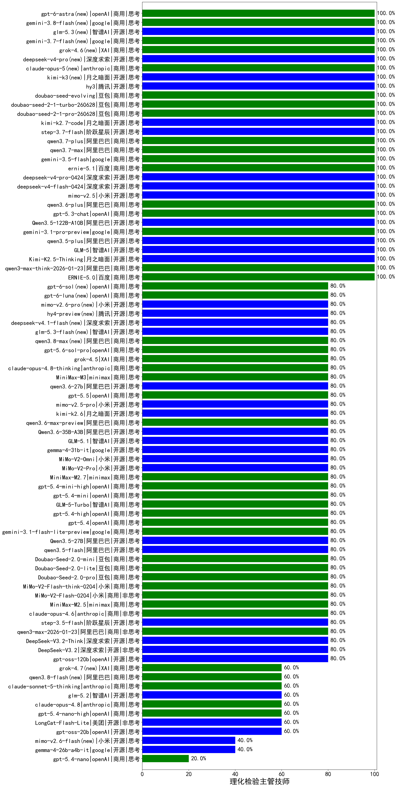

|类别|机构|大模型|【理化检验主管技师】准确率|平均耗时|平均消耗token|花费/千次（元）|排名（准确率）|
|---|---|-----|-------------------|-------|-----------|-----------|-----------|
|开源|阿里巴巴|Qwen3.5-122B-A10B|100.0%|294s|2339|14.6|1|
|商用|google|gemini-3.1-pro-preview|100.0%|25s|1245|101.5|2|
|开源|深度求索|deepseek-v4-flash-0424|100.0%|20s|589|1.1|3|
|开源|月之暗面|kimi-k3(new)|100.0%|66s|1882|177.1|4|
|商用|openAI|gpt-5.3-chat|100.0%|7s|337|26.5|5|
|开源|腾讯|hy3|100.0%|463s|212|0.6|6|
|商用|豆包|doubao-seed-evolving|100.0%|155s|5490|162.2|7|
|商用|豆包|doubao-seed-2-1-turbo-260628|100.0%|173s|9010|133.9|8|
|商用|豆包|doubao-seed-2-1-pro-260628|100.0%|147s|6095|180.3|9|
|开源|月之暗面|kimi-k2.7-code|100.0%|17s|535|13.2|10|
|开源|阶跃星辰|step-3.7-flash|100.0%|18s|1570|12.3|11|
|商用|阿里巴巴|qwen3.7-plus|100.0%|21s|1056|8.0|12|
|商用|阿里巴巴|qwen3.6-plus|100.0%|22s|1210|13.9|13|
|商用|阿里巴巴|qwen3.7-max|100.0%|21s|949|32.6|14|
|商用|google|gemini-3.5-flash|100.0%|11s|1336|80.8|15|
|商用|百度|ernie-5.1|100.0%|47s|676|11.3|16|
|开源|小米|mimo-v2.5|100.0%|14s|1008|10.7|17|
|商用|anthropic|claude-opus-5(new)|100.0%|12s|618|95.7|18|
|开源|深度求索|deepseek-v4-pro-0424|100.0%|26s|535|12.2|19|
|开源|阿里巴巴|qwen3.5-plus|100.0%|23s|2022|9.4|20|
|商用|google|gemini-3.8-flash(new)|100.0%|10s|876|43.3|21|
|开源|月之暗面|Kimi-K2.5-Thinking|100.0%|481s|2397|49.3|22|
|商用|百度|ERNIE-5.0|100.0%|96s|2054|48.3|23|
|开源|智谱AI|GLM-5|100.0%|65s|1865|32.7|24|
|商用|openAI|gpt-6-astra(new)|100.0%|12s|303|84.8|25|
|商用|阿里巴巴|qwen3-max-think-2026-01-23|100.0%|240s|2777|27.2|26|
|开源|智谱AI|glm-5.3(new)|100.0%|-645s|1951|53.3|27|
|商用|google|gemini-3.7-flash(new)|100.0%|7s|647|15.6|28|
|商用|XAI|grok-4.6(new)|100.0%|26s|1359|49.7|29|
|开源|深度求索|deepseek-v4-pro(new)|100.0%|848s|483|10.6|30|
|商用|openAI|gpt-5.5|80.0%|11s|582|109.0|31|
|商用|minimax|MiniMax-M3|80.0%|24s|540|6.2|32|
|商用|openAI|gpt-6-sol(new)|80.0%|68s|297|16.6|33|
|商用|openAI|gpt-6-luna(new)|80.0%|247s|386|1.1|34|
|开源|小米|mimo-v2.6-pro(new)|80.0%|15s|743|4.3|35|
|开源|阿里巴巴|qwen3.6-27b|80.0%|20s|1249|21.5|36|
|开源|深度求索|deepseek-v4.1-flash(new)|80.0%|15s|1194|9.1|37|
|开源|腾讯|hy4-preview(new)|80.0%|44s|2642|46.7|38|
|商用|anthropic|claude-opus-4.8-thinking|80.0%|10s|697|109.5|39|
|商用|阿里巴巴|qwen3.8-max(new)|80.0%|39s|1709|59.0|40|
|开源|智谱AI|glm-5.3-flash(new)|80.0%|38s|1202|3.2|41|
|商用|XAI|grok-4.5|80.0%|73s|1612|60.4|42|
|商用|openAI|gpt-5.6-sol-pro|80.0%|16s|3457|279.4|43|
|开源|openAI|gpt-oss-120b|80.0%|3s|496|1.3|44|
|开源|月之暗面|kimi-k2.6|80.0%|151s|3046|81.0|45|
|开源|小米|mimo-v2.5-pro|80.0%|14s|818|12.8|46|
|商用|小米|MiMo-V2-Flash-think-0204|80.0%|924s|1853|3.8|47|
|商用|google|gemini-3.1-flash-lite-preview|80.0%|6s|242|2.0|48|
|开源|阿里巴巴|Qwen3.5-27B|80.0%|156s|2638|12.4|49|
|开源|阿里巴巴|qwen3.5-flash|80.0%|285s|2071|4.0|50|
|商用|豆包|Doubao-Seed-2.0-mini|80.0%|263s|1220|2.2|51|
|商用|豆包|Doubao-Seed-2.0-lite|80.0%|133s|705|2.2|52|
|商用|豆包|Doubao-Seed-2.0-pro|80.0%|238s|1047|15.4|53|
|商用|小米|MiMo-V2-Flash-0204|80.0%|307s|392|0.7|54|
|商用|智谱AI|GLM-5-Turbo|80.0%|66s|942|19.7|55|
|商用|minimax|MiniMax-M2.5|80.0%|17s|979|7.7|56|
|商用|anthropic|claude-opus-4.6|80.0%|22s|493|73.6|57|
|开源|阶跃星辰|step-3.5-flash|80.0%|25s|1379|2.8|58|
|商用|阿里巴巴|qwen3-max-2026-01-23|80.0%|7s|326|2.7|59|
|开源|深度求索|DeepSeek-V3.2-Think|80.0%|173s|885|2.6|60|
|开源|深度求索|DeepSeek-V3.2|80.0%|9s|256|0.7|61|
|商用|openAI|gpt-5.4-high|80.0%|16s|802|77.6|62|
|商用|openAI|gpt-5.4|80.0%|3s|238|18.4|63|
|开源|小米|MiMo-V2-Omni|80.0%|133s|1118|12.2|64|
|商用|openAI|gpt-5.4-mini|80.0%|17s|184|3.8|65|
|商用|openAI|gpt-5.4-mini-high|80.0%|20s|994|29.3|66|
|商用|阿里巴巴|qwen3.6-max-preview|80.0%|45s|1446|75.1|67|
|开源|阿里巴巴|Qwen3.6-35B-A3B|80.0%|102s|1519|15.8|68|
|开源|智谱AI|GLM-5.1|80.0%|149s|991|22.7|69|
|商用|minimax|MiniMax-M2.7|80.0%|35s|1228|9.7|70|
|开源|小米|MiMo-V2-Pro|80.0%|483s|883|14.2|71|
|开源|google|gemma-4-31b-it|80.0%|73s|367|0.9|72|
|开源|美团|LongCat-Flash-Lite|60.0%|55s|316|0.0|73|
|商用|anthropic|claude-opus-4.8|60.0%|6s|398|57.1|74|
|商用|anthropic|claude-sonnet-5-thinking|60.0%|14s|664|41.5|75|
|开源|openAI|gpt-oss-20b|60.0%|82s|940|1.0|76|
|商用|阿里巴巴|qwen3.8-flash(new)|60.0%|32s|2035|5.3|77|
|商用|openAI|gpt-5.4-nano-high|60.0%|75s|586|4.6|78|
|开源|智谱AI|glm-5.2|60.0%|118s|3043|83.9|79|
|商用|XAI|grok-4.7(new)|60.0%|49s|3323|103.2|80|
|开源|google|gemma-4-26b-a4b-it|40.0%|12s|418|1.0|81|
|开源|小米|mimo-v2.6-flash(new)|40.0%|24s|663|1.3|82|
|商用|openAI|gpt-5.4-nano|20.0%|4s|250|1.6|83|

