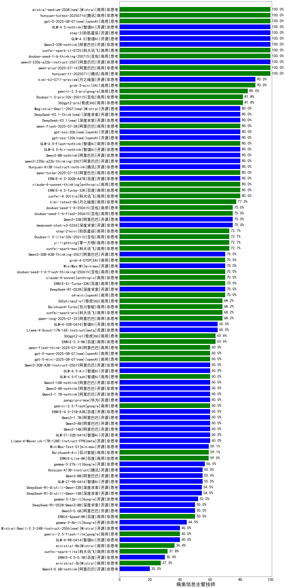

|类别|机构|大模型|【病案信息主管技师】准确率|平均耗时|平均消耗token|花费/千次（元）|排名（准确率）|
|---|---|-----|-------------------|-------|-----------|-----------|-----------|
|商用|minimax|MiniMax-M2.1(new)|100.0%|90s|1707|13.8|1|
|商用|豆包|doubao-seed-1-6-thinking-250715|100.0%|20s|1124|8.5|2|
|开源|月之暗面|kimi-k2-0905(new)|100.0%|60s|358|4.8|3|
|商用|google|gemini-3-pro-preview(new)|100.0%|95s|2511|209.5|4|
|商用|XAI|grok-4-1-fast-non-reasoning(new)|100.0%|86s|621|1.7|5|
|商用|openAI|gpt-5-2025-08-07|100.0%|17s|298|17.1|6|
|商用|豆包|doubao-seed-1-6-lite-251015(new)|100.0%|31s|676|1.4|7|
|商用|腾讯|hunyuan-t1-20250711|100.0%|18s|1060|4.0|8|
|商用|豆包|doubao-seed-1-6-251015(new)|100.0%|6s|667|4.7|9|
|开源|智谱AI|GLM-4.6(new)|100.0%|50s|1875|25.6|10|
|开源|阿里巴巴|qwen3-235b-a22b-instruct-2507|100.0%|8s|401|2.8|11|
|商用|腾讯|hunyuan-turbos-20250926(new)|100.0%|12s|501|0.9|12|
|商用|anthropic|claude-sonnet-4.5-thinking(new)|100.0%|22s|1443|146.2|13|
|商用|科大讯飞|xunfei-spark-x1-0725|100.0%|/|1371|16.5|14|
|开源|阿里巴巴|Qwen3-8B-nothink|100.0%|18s|389|0.0|15|
|开源|阿里巴巴|Qwen3-32B-nothink|100.0%|22s|451|1.6|16|
|商用|阿里巴巴|qwen3-max-preview|100.0%|8s|416|8.8|17|
|开源|智谱AI|GLM-4.5|100.0%|62s|1569|21.3|18|
|商用|阿里巴巴|qwen-plus-2025-07-28|100.0%|13s|443|0.8|19|
|开源|阶跃星辰|step-3|100.0%|91s|1774|6.9|20|
|开源|智谱AI|GLM-4.5-nothink|100.0%|12s|483|6.1|21|
|商用|Mistral|mistral-medium-2508|100.0%|25s|398|4.8|22|
|商用|openAI|gpt-5.1-high(new)|100.0%|137s|1228|82.4|23|
|商用|openAI|gpt-5.1-medium(new)|100.0%|186s|373|21.7|24|
|商用|腾讯|hunyuan-2.0-thinking-20251109(new)|100.0%|9s|631|2.4|25|
|开源|深度求索|DeepSeek-V3.2-Think(new)|100.0%|26s|792|2.3|26|
|商用|openAI|gpt-5.2-high(new)|100.0%|7s|331|26.2|27|
|商用|anthropic|claude-opus-4.5(new)|100.0%|9s|596|92.7|28|
|商用|阿里巴巴|qwen3-max-2025-09-23(new)|100.0%|478s|426|9.0|29|
|商用|openAI|gpt-5.2-medium(new)|100.0%|8s|271|20.2|30|
|商用|阿里巴巴|qwen-plus-2025-12-01(new)|100.0%|19s|840|1.6|31|
|商用|百度|ERNIE-X1.1-Preview(new)|100.0%|91s|488|1.8|32|
|开源|小米|MiMo-V2-Flash(new)|100.0%|39s|374|0.0|33|
|商用|腾讯|hunyuan-2.0-instruct-20251111(new)|100.0%|6s|355|0.6|34|
|商用|豆包|doubao-seed-1-8-251215(new)|100.0%|21s|547|3.6|35|
|开源|深度求索|DeepSeek-V3.2(new)|100.0%|17s|281|0.8|36|
|商用|阿里巴巴|qwen-plus-think-2025-12-01(new)|100.0%|57s|2544|19.9|37|
|开源|Mistral|mistral-large-2512(new)|100.0%|11s|408|3.8|38|
|商用|google|gemini-3-flash-preview(new)|100.0%|12s|1364|27.9|39|
|商用|XAI|grok-3-mini|90.0%|248s|893|3.1|40|
|开源|月之暗面|kimi-k2-0711-preview|90.0%|22s|397|5.6|41|
|商用|google|gemini-2.5-pro|85.0%|26s|2276|160.7|42|
|开源|Mistral|Magistral-Small-2507|80.0%|69s|6192|66.7|43|
|开源|小米|MiMo-V2-Flash-think(new)|80.0%|29s|1925|0.0|44|
|商用|阿里巴巴|qwen-plus-think-2025-07-28|80.0%|/|1902|14.7|45|
|开源|智谱AI|GLM-4.7(new)|80.0%|56s|2013|27.5|46|
|开源|深度求索|DeepSeek-V3.1-Think|80.0%|55s|1039|12.0|47|
|开源|深度求索|DeepSeek-V3.1|80.0%|20s|382|4.1|48|
|开源|豆包|Seed-OSS-36B-Instruct|80.0%|90s|1690|6.6|49|
|商用|anthropic|claude-sonnet-4.5(new)|80.0%|12s|599|57.0|50|
|开源|阿里巴巴|qwen3-next-80b-a3b-instruct|80.0%|15s|647|2.4|51|
|开源|深度求索|DeepSeek-V3.2-Exp(new)|80.0%|481s|307|0.9|52|
|开源|深度求索|DeepSeek-V3.2-Exp-Think(new)|80.0%|482s|1204|3.6|53|
|商用|openAI|gpt-5.2(new)|80.0%|3s|207|13.8|54|
|开源|阿里巴巴|qwen3-next-80b-a3b-thinking(new)|80.0%|165s|2834|11.1|55|
|开源|minimax|MiniMax-M2(new)|80.0%|42s|1107|8.7|56|
|开源|月之暗面|Kimi-K2-Thinking(new)|80.0%|60s|1031|15.8|57|
|商用|openAI|gpt-5.1(new)|80.0%|101s|205|9.8|58|
|商用|openAI|gpt-5-nano-high(new)|80.0%|101s|3892|11.1|59|
|商用|anthropic|claude-haiku-4.5(new)|80.0%|16s|590|18.2|60|
|商用|XAI|grok-4-1-fast-reasoning(new)|80.0%|91s|1669|5.5|61|
|商用|百度|ERNIE-5.0-Thinking-Preview(new)|80.0%|208s|1849|43.4|62|
|商用|阿里巴巴|qwen-flash-2025-07-28|80.0%|8s|520|0.7|63|
|开源|openAI|gpt-oss-20b|80.0%|4s|804|0.8|64|
|商用|阿里巴巴|qwen-turbo-2025-07-15|80.0%|6s|314|0.2|65|
|商用|anthropic|claude-4-sonnet-thinking|80.0%|40s|554|52.1|66|
|开源|腾讯|Hunyuan-A13B-Instruct-nothink|80.0%|165s|368|1.3|67|
|开源|openAI|gpt-oss-120b|80.0%|7s|585|1.6|68|
|商用|智谱AI|GLM-4.5-Flash-nothink|80.0%|18s|830|0.0|69|
|开源|阿里巴巴|qwen3-235b-a22b-thinking-2507|80.0%|56s|2392|46.6|70|
|开源|智谱AI|GLM-4.5-Air-nothink|80.0%|81s|840|4.7|71|
|开源|百度|ERNIE-4.5-300B-A47B|80.0%|17s|315|2.1|72|
|商用|百度|ERNIE-4.5-Turbo-32K|80.0%|20s|501|1.5|73|
|商用|豆包|Doubao-1.5-lite-32k-250115|75.0%|2s|176|0.1|74|
|开源|阿里巴巴|Qwen3-32B|75.0%|25s|682|2.5|75|
|商用|豆包|doubao-seed-1-6-250615|75.0%|139s|396|2.5|76|
|商用|豆包|doubao-seed-1-6-flash-250615|75.0%|4s|274|0.3|77|
|开源|minimax|MiniMax-M1|70.0%|52s|1211|6.5|78|
|商用|豆包|doubao-seed-1-6-flash-thinking-250615|70.0%|6s|529|0.6|79|
|商用|anthropic|claude-4-sonnet|70.0%|43s|641|60.0|80|
|商用|百度|ERNIE-X1-Turbo-32K|70.0%|59s|1342|5.2|81|
|商用|openAI|o4-mini|70.0%|37s|1227|37.2|82|
|商用|360|360zhinao2-o1|70.0%|/|/|/|83|
|商用|百川智能|Baichuan4-Turbo|70.0%|/|/|/|84|
|开源|深度求索|DeepSeek-R1-0528|70.0%|229s|1686|26.2|85|
|商用|阿里巴巴|qwen-long-2025-01-25|70.0%|193s|284|0.5|86|
|商用|XAI|grok-4-0709|70.0%|70s|1224|126.7|87|
|开源|阿里巴巴|Qwen3-30B-A3B-Thinking-2507|70.0%|80s|2929|8.0|88|
|开源|minimax|MiniMax-Text-01|65.0%|11s|860|6.9|89|
|商用|google|gemini-2.5-flash|60.0%|12s|1672|29.2|90|
|商用|阿里巴巴|qwen-turbo-think-2025-07-15|60.0%|/|2533|7.4|91|
|商用|百川智能|Baichuan4-Air|60.0%|/|/|/|92|
|商用|阿里巴巴|qwen-flash-think-2025-07-28|60.0%|26s|2900|4.3|93|
|开源|meta|Llama-4-Scout-17B-16E-Instruct|60.0%|9s|563|1.1|94|
|开源|Mistral|Ministral-3-14B-Instruct-2512(new)|60.0%|10s|502|0.7|95|
|开源|阿里巴巴|Qwen3-14B|60.0%|24s|1402|2.7|96|
|开源|阿里巴巴|Qwen3-4B|60.0%|21s|1039|2.9|97|
|开源|阿里巴巴|Qwen3-30B-A3B-Instruct-2507|60.0%|10s|1025|2.9|98|
|开源|智谱AI|GLM-4.5-Air|60.0%|34s|1569|9.1|99|
|开源|阿里巴巴|Qwen3-1.7B|60.0%|18s|1420|4.1|100|
|开源|阿里巴巴|Qwen3-1.7B-nothink|60.0%|23s|433|1.1|101|
|开源|阿里巴巴|Qwen3-14B-nothink|60.0%|29s|476|0.8|102|
|开源|百度|ERNIE-4.5-21B-A3B|60.0%|55s|323|0.0|103|
|商用|智谱AI|GLM-4.5-Flash|60.0%|34s|1643|0.0|104|
|商用|openAI|gpt-5-nano-2025-08-07|60.0%|18s|1558|4.3|105|
|开源|阿里巴巴|Qwen3-4B-nothink|60.0%|12s|339|0.8|106|
|商用|openAI|gpt-5-mini-2025-08-07|60.0%|30s|1048|14.2|107|
|开源|阿里巴巴|Qwen3-8B|55.0%|122s|3751|0.0|108|
|开源|meta|Llama-4-Maverick-17B-128E-Instruct-FP8|55.0%|7s|524|2.1|109|
|开源|腾讯|Hunyuan-A13B-Instruct|55.0%|50s|822|3.1|110|
|开源|深度求索|DeepSeek-R1-0528-Qwen3-8B|50.0%|244s|1390|0.0|111|
|开源|阿里巴巴|Qwen3-0.6B|50.0%|10s|865|2.4|112|
|开源|google|gemma-3-27b-it|45.0%|/|/|/|113|
|商用|百度|ERNIE-Lite-8K|45.0%|/|/|/|114|
|商用|openAI|gpt-5-mini-high(new)|40.0%|648s|2771|39.2|115|
|开源|智谱AI|GLM-4-9B-0414|40.0%|6s|367|0.0|116|
|开源|Mistral|Ministral-3-8B-Instruct-2512(new)|40.0%|11s|650|0.7|117|
|商用|google|gemini-2.5-flash-lite|40.0%|3s|457|1.2|118|
|商用|anthropic|claude-haiku-4.5-thinking(new)|40.0%|18s|2330|80.5|119|
|开源|Mistral|Mistral-Small-3.2-24B-Instruct-2506|40.0%|100s|473|0.9|120|
|开源|google|gemma-3-4b-it|35.0%|/|/|/|121|
|开源|百度|ERNIE-4.5-0.3B|30.0%|2s|359|0.0|122|
|开源|Mistral|Ministral-3-3B-Instruct-2512(new)|20.0%|12s|974|0.7|123|
|开源|阿里巴巴|Qwen3-0.6B-nothink|20.0%|5s|204|0.4|124|
|开源|google|gemma-3-12b-it|20.0%|/|/|/|125|

