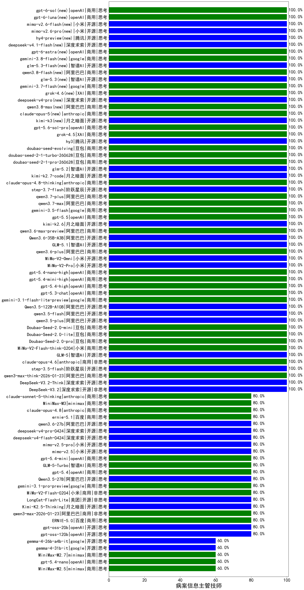

|类别|机构|大模型|【病案信息主管技师】准确率|平均耗时|平均消耗token|花费/千次（元）|排名（准确率）|
|---|---|-----|-------------------|-------|-----------|-----------|-----------|
|开源|腾讯|hy4-preview(new)|100.0%|84s|4996|89.1|1|
|商用|openAI|gpt-5.6-sol-pro(new)|100.0%|14s|3211|245.0|2|
|商用|豆包|Doubao-Seed-2.0-pro|100.0%|174s|752|10.7|3|
|商用|豆包|Doubao-Seed-2.0-lite|100.0%|155s|710|2.2|4|
|商用|豆包|Doubao-Seed-2.0-mini|100.0%|361s|1522|2.9|5|
|开源|阿里巴巴|qwen3.5-plus|100.0%|36s|2807|13.2|6|
|开源|腾讯|hy3(new)|100.0%|30s|166|0.5|7|
|开源|阿里巴巴|qwen3.5-flash|100.0%|347s|2839|5.6|8|
|开源|阿里巴巴|Qwen3.5-122B-A10B|100.0%|396s|3771|23.8|9|
|商用|google|gemini-3.1-flash-lite-preview|100.0%|3s|376|3.4|10|
|商用|openAI|gpt-5.3-chat|100.0%|39s|338|26.6|11|
|商用|豆包|doubao-seed-evolving(new)|100.0%|130s|5789|171.3|12|
|商用|openAI|gpt-5.4-high|100.0%|12s|671|63.7|13|
|商用|豆包|doubao-seed-2-1-turbo-260628(new)|100.0%|159s|7893|117.2|14|
|商用|豆包|doubao-seed-2-1-pro-260628(new)|100.0%|177s|5458|161.3|15|
|商用|openAI|gpt-5.4-mini-high|100.0%|29s|657|18.7|16|
|开源|智谱AI|glm-5.2(new)|100.0%|88s|2941|81.0|17|
|商用|openAI|gpt-5.4-nano-high|100.0%|6s|399|2.9|18|
|开源|月之暗面|kimi-k2.7-code(new)|100.0%|19s|682|17.2|19|
|开源|小米|MiMo-V2-Pro|100.0%|261s|958|15.8|20|
|开源|小米|MiMo-V2-Omni|100.0%|529s|1300|14.7|21|
|商用|阿里巴巴|qwen3.6-plus|100.0%|45s|1548|18.0|22|
|商用|anthropic|claude-opus-4.8-thinking(new)|100.0%|24s|891|142.9|23|
|开源|阶跃星辰|step-3.7-flash(new)|100.0%|17s|2127|16.8|24|
|开源|智谱AI|GLM-5.1|100.0%|196s|1627|38.0|25|
|开源|阿里巴巴|Qwen3.6-35B-A3B|100.0%|98s|1496|15.6|26|
|商用|阿里巴巴|qwen3.6-max-preview|100.0%|42s|1470|76.6|27|
|开源|月之暗面|kimi-k2.6|100.0%|47s|1142|29.6|28|
|商用|阿里巴巴|qwen3.7-plus(new)|100.0%|20s|934|7.1|29|
|商用|阿里巴巴|qwen3.7-max|100.0%|30s|1518|53.1|30|
|商用|openAI|gpt-5.5|100.0%|8s|372|64.7|31|
|商用|小米|MiMo-V2-Flash-think-0204|100.0%|941s|1753|3.6|32|
|商用|XAI|grok-4.5(new)|100.0%|36s|1661|62.4|33|
|开源|月之暗面|kimi-k3(new)|100.0%|44s|901|79.3|34|
|商用|豆包|doubao-seed-1-8-251215|100.0%|21s|547|3.6|35|
|开源|深度求索|DeepSeek-V3.2|100.0%|17s|281|0.8|36|
|开源|深度求索|DeepSeek-V3.2-Think|100.0%|26s|792|2.3|37|
|开源|深度求索|deepseek-v4.1-flash(new)|100.0%|9s|619|4.5|38|
|开源|Mistral|mistral-large-2512|100.0%|11s|408|3.8|39|
|商用|openAI|gpt-6-astra(new)|100.0%|11s|282|77.1|40|
|商用|google|gemini-3.8-flash(new)|100.0%|43s|965|48.0|41|
|开源|智谱AI|glm-5.3-flash(new)|100.0%|29s|1024|2.7|42|
|商用|腾讯|hunyuan-2.0-instruct-20251111|100.0%|6s|355|0.6|43|
|商用|腾讯|hunyuan-2.0-thinking-20251109|100.0%|9s|631|2.4|44|
|商用|阿里巴巴|qwen3.8-flash(new)|100.0%|50s|2437|6.4|45|
|商用|阿里巴巴|qwen-plus-2025-12-01|100.0%|19s|840|1.6|46|
|商用|阿里巴巴|qwen-plus-think-2025-12-01|100.0%|57s|2544|19.9|47|
|商用|openAI|gpt-5.2-high|100.0%|7s|331|26.2|48|
|商用|openAI|gpt-5.2-medium|100.0%|8s|271|20.2|49|
|商用|google|gemini-3-flash-preview|100.0%|12s|1364|27.9|50|
|开源|小米|MiMo-V2-Flash|100.0%|39s|374|0.0|51|
|商用|阿里巴巴|qwen3.8-max(new)|100.0%|16s|628|20.2|52|
|开源|智谱AI|GLM-5|100.0%|456s|1926|33.9|53|
|商用|anthropic|claude-opus-4.6|100.0%|10s|544|82.0|54|
|开源|阶跃星辰|step-3.5-flash|100.0%|64s|2562|5.3|55|
|商用|anthropic|claude-opus-5(new)|100.0%|13s|734|115.5|56|
|商用|阿里巴巴|qwen3-max-think-2026-01-23|100.0%|178s|4693|46.4|57|
|开源|深度求索|deepseek-v4-pro(new)|100.0%|382s|471|10.3|58|
|开源|美团|LongCat-Flash-Thinking-2601|100.0%|83s|1276|0.0|59|
|商用|XAI|grok-4.6(new)|100.0%|355s|1623|60.8|60|
|商用|阿里巴巴|qwen3-max-preview-think|100.0%|94s|2372|55.7|61|
|商用|minimax|MiniMax-M2.1|100.0%|90s|1707|13.8|62|
|商用|google|gemini-3.7-flash(new)|100.0%|5s|708|17.3|63|
|开源|智谱AI|glm-5.3(new)|100.0%|157s|1252|33.8|64|
|商用|google|gemini-3.5-flash|100.0%|8s|1458|88.6|65|
|商用|anthropic|claude-sonnet-5-thinking(new)|80.0%|12s|864|55.3|66|
|商用|百度|ernie-5.1|80.0%|20s|769|13.0|67|
|商用|minimax|MiniMax-M3(new)|80.0%|29s|746|9.7|68|
|商用|anthropic|claude-opus-4.8(new)|80.0%|7s|464|68.2|69|
|开源|openAI|gpt-oss-120b|80.0%|7s|585|1.6|70|
|开源|阿里巴巴|qwen3.6-27b|80.0%|30s|1891|33.1|71|
|商用|google|gemini-3.1-pro-preview|80.0%|41s|2651|221.4|72|
|开源|阿里巴巴|qwen3-next-80b-a3b-thinking|80.0%|165s|2834|11.1|73|
|商用|openAI|gpt-5.2|80.0%|3s|207|13.8|74|
|开源|小米|MiMo-V2-Flash-think|80.0%|29s|1925|0.0|75|
|开源|智谱AI|GLM-4.7|80.0%|56s|2013|27.5|76|
|开源|智谱AI|GLM-4.7-Flash|80.0%|539s|4429|0.0|77|
|商用|百度|ERNIE-5.0|80.0%|92s|1799|42.2|78|
|商用|阿里巴巴|qwen3-max-2026-01-23|80.0%|255s|1017|9.7|79|
|开源|月之暗面|Kimi-K2.5-Thinking|80.0%|322s|1535|31.3|80|
|开源|美团|LongCat-Flash-Lite|80.0%|164s|401|0.0|81|
|开源|深度求索|deepseek-v4-pro-0424|80.0%|34s|1032|24.1|82|
|商用|小米|MiMo-V2-Flash-0204|80.0%|383s|623|1.2|83|
|开源|阿里巴巴|Qwen3.5-27B|80.0%|331s|2672|12.6|84|
|商用|openAI|gpt-5.4|80.0%|6s|269|21.5|85|
|商用|智谱AI|GLM-5-Turbo|80.0%|82s|1919|41.2|86|
|开源|openAI|gpt-oss-20b|80.0%|4s|804|0.8|87|
|开源|小米|mimo-v2.5|80.0%|36s|2077|25.7|88|
|开源|小米|mimo-v2.5-pro|80.0%|19s|1138|19.6|89|
|开源|深度求索|deepseek-v4-flash-0424|80.0%|19s|654|1.3|90|
|商用|openAI|gpt-5.4-mini|80.0%|6s|234|5.3|91|
|商用|minimax|MiniMax-M2.5|60.0%|25s|966|7.5|92|
|商用|openAI|gpt-5.4-nano|60.0%|30s|251|1.6|93|
|商用|minimax|MiniMax-M2.7|60.0%|27s|1044|8.2|94|
|开源|google|gemma-4-31b-it|60.0%|63s|521|1.3|95|
|开源|google|gemma-4-26b-a4b-it|60.0%|22s|530|1.3|96|
|开源|Mistral|Ministral-3-14B-Instruct-2512|60.0%|10s|502|0.7|97|
|开源|Mistral|Ministral-3-8B-Instruct-2512|40.0%|11s|650|0.7|98|
|开源|Mistral|Ministral-3-3B-Instruct-2512|20.0%|12s|974|0.7|99|

