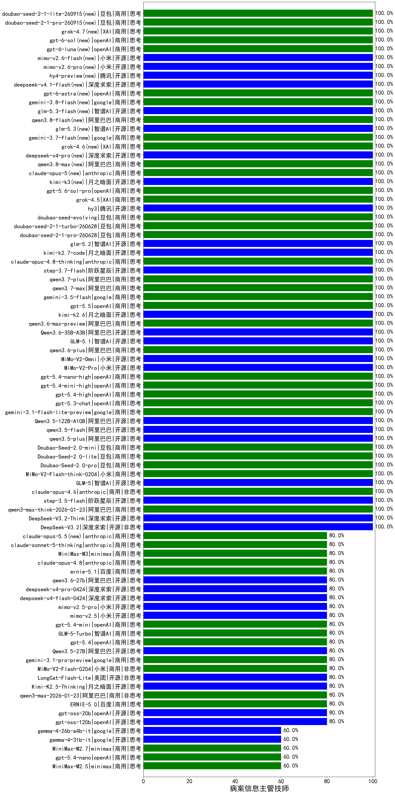

|类别|机构|大模型|【病案信息主管技师】准确率|平均耗时|平均消耗token|花费/千次（元）|排名（准确率）|
|---|---|-----|-------------------|-------|-----------|-----------|-----------|
|商用|openAI|gpt-5.4-mini-high|100.0%|29s|657|18.7|1|
|商用|anthropic|claude-opus-5(new)|100.0%|13s|734|115.5|2|
|商用|openAI|gpt-5.4-nano-high|100.0%|6s|399|2.9|3|
|商用|google|gemini-3.7-flash(new)|100.0%|5s|708|17.3|4|
|开源|小米|MiMo-V2-Pro|100.0%|261s|958|15.8|5|
|开源|小米|MiMo-V2-Omni|100.0%|529s|1300|14.7|6|
|商用|阿里巴巴|qwen3.6-plus|100.0%|45s|1548|18.0|7|
|商用|XAI|grok-4.6(new)|100.0%|355s|1623|60.8|8|
|开源|深度求索|deepseek-v4-pro(new)|100.0%|382s|471|10.3|9|
|开源|智谱AI|GLM-5.1|100.0%|196s|1627|38.0|10|
|开源|阿里巴巴|Qwen3.6-35B-A3B|100.0%|98s|1496|15.6|11|
|商用|阿里巴巴|qwen3.6-max-preview|100.0%|42s|1470|76.6|12|
|开源|月之暗面|kimi-k2.6|100.0%|47s|1142|29.6|13|
|商用|阿里巴巴|qwen3.8-max(new)|100.0%|16s|628|20.2|14|
|开源|月之暗面|kimi-k3(new)|100.0%|44s|901|79.3|15|
|商用|豆包|doubao-seed-2-1-turbo-260628|100.0%|159s|7893|117.2|16|
|商用|openAI|gpt-5.6-sol-pro|100.0%|14s|3211|245.0|17|
|商用|openAI|gpt-5.5|100.0%|8s|372|64.7|18|
|商用|XAI|grok-4.5|100.0%|36s|1661|62.4|19|
|开源|腾讯|hy3|100.0%|30s|166|0.5|20|
|商用|google|gemini-3.5-flash|100.0%|8s|1458|88.6|21|
|商用|阿里巴巴|qwen3.7-max|100.0%|30s|1518|53.1|22|
|商用|豆包|doubao-seed-evolving|100.0%|130s|5789|171.3|23|
|商用|阿里巴巴|qwen3.7-plus|100.0%|20s|934|7.1|24|
|开源|阶跃星辰|step-3.7-flash|100.0%|17s|2127|16.8|25|
|商用|anthropic|claude-opus-4.8-thinking|100.0%|24s|891|142.9|26|
|开源|月之暗面|kimi-k2.7-code|100.0%|19s|682|17.2|27|
|开源|智谱AI|glm-5.2|100.0%|88s|2941|81.0|28|
|开源|智谱AI|glm-5.3(new)|100.0%|157s|1252|33.8|29|
|商用|豆包|doubao-seed-2-1-pro-260628|100.0%|177s|5458|161.3|30|
|商用|阿里巴巴|qwen3.8-flash(new)|100.0%|50s|2437|6.4|31|
|开源|智谱AI|glm-5.3-flash(new)|100.0%|29s|1024|2.7|32|
|开源|深度求索|DeepSeek-V3.2|100.0%|17s|281|0.8|33|
|开源|深度求索|DeepSeek-V3.2-Think|100.0%|26s|792|2.3|34|
|商用|XAI|grok-4.7(new)|100.0%|34s|3205|98.2|35|
|商用|openAI|gpt-6-sol(new)|100.0%|172s|234|12.1|36|
|商用|阿里巴巴|qwen3-max-think-2026-01-23|100.0%|178s|4693|46.4|37|
|商用|openAI|gpt-6-luna(new)|100.0%|458s|752|2.4|38|
|开源|阶跃星辰|step-3.5-flash|100.0%|64s|2562|5.3|39|
|商用|anthropic|claude-opus-4.6|100.0%|10s|544|82.0|40|
|开源|智谱AI|GLM-5|100.0%|456s|1926|33.9|41|
|开源|小米|mimo-v2.6-flash(new)|100.0%|249s|935|1.8|42|
|开源|小米|mimo-v2.6-pro(new)|100.0%|20s|665|3.8|43|
|开源|腾讯|hy4-preview(new)|100.0%|84s|4996|89.1|44|
|商用|小米|MiMo-V2-Flash-think-0204|100.0%|941s|1753|3.6|45|
|商用|豆包|Doubao-Seed-2.0-pro|100.0%|174s|752|10.7|46|
|商用|豆包|Doubao-Seed-2.0-lite|100.0%|155s|710|2.2|47|
|商用|豆包|Doubao-Seed-2.0-mini|100.0%|361s|1522|2.9|48|
|开源|阿里巴巴|qwen3.5-plus|100.0%|36s|2807|13.2|49|
|开源|深度求索|deepseek-v4.1-flash(new)|100.0%|9s|619|4.5|50|
|开源|阿里巴巴|qwen3.5-flash|100.0%|347s|2839|5.6|51|
|商用|openAI|gpt-6-astra(new)|100.0%|11s|282|77.1|52|
|开源|阿里巴巴|Qwen3.5-122B-A10B|100.0%|396s|3771|23.8|53|
|商用|google|gemini-3.1-flash-lite-preview|100.0%|3s|376|3.4|54|
|商用|openAI|gpt-5.3-chat|100.0%|39s|338|26.6|55|
|商用|google|gemini-3.8-flash(new)|100.0%|43s|965|48.0|56|
|商用|openAI|gpt-5.4-high|100.0%|12s|671|63.7|57|
|商用|anthropic|claude-sonnet-5-thinking|80.0%|12s|864|55.3|58|
|开源|openAI|gpt-oss-120b|80.0%|7s|585|1.6|59|
|开源|小米|mimo-v2.5|80.0%|36s|2077|25.7|60|
|商用|minimax|MiniMax-M3|80.0%|29s|746|9.7|61|
|商用|anthropic|claude-opus-4.8|80.0%|7s|464|68.2|62|
|商用|百度|ERNIE-5.0|80.0%|92s|1799|42.2|63|
|商用|阿里巴巴|qwen3-max-2026-01-23|80.0%|255s|1017|9.7|64|
|开源|月之暗面|Kimi-K2.5-Thinking|80.0%|322s|1535|31.3|65|
|开源|美团|LongCat-Flash-Lite|80.0%|164s|401|0.0|66|
|商用|小米|MiMo-V2-Flash-0204|80.0%|383s|623|1.2|67|
|商用|google|gemini-3.1-pro-preview|80.0%|41s|2651|221.4|68|
|开源|阿里巴巴|Qwen3.5-27B|80.0%|331s|2672|12.6|69|
|商用|openAI|gpt-5.4|80.0%|6s|269|21.5|70|
|商用|智谱AI|GLM-5-Turbo|80.0%|82s|1919|41.2|71|
|商用|openAI|gpt-5.4-mini|80.0%|6s|234|5.3|72|
|开源|openAI|gpt-oss-20b|80.0%|4s|804|0.8|73|
|开源|小米|mimo-v2.5-pro|80.0%|19s|1138|19.6|74|
|开源|深度求索|deepseek-v4-flash-0424|80.0%|19s|654|1.3|75|
|开源|深度求索|deepseek-v4-pro-0424|80.0%|34s|1032|24.1|76|
|开源|阿里巴巴|qwen3.6-27b|80.0%|30s|1891|33.1|77|
|商用|百度|ernie-5.1|80.0%|20s|769|13.0|78|
|商用|anthropic|claude-opus-5.5(new)|80.0%|95s|611|74.9|79|
|商用|openAI|gpt-5.4-nano|60.0%|30s|251|1.6|80|
|商用|minimax|MiniMax-M2.7|60.0%|27s|1044|8.2|81|
|开源|google|gemma-4-31b-it|60.0%|63s|521|1.3|82|
|开源|google|gemma-4-26b-a4b-it|60.0%|22s|530|1.3|83|
|商用|minimax|MiniMax-M2.5|60.0%|25s|966|7.5|84|

