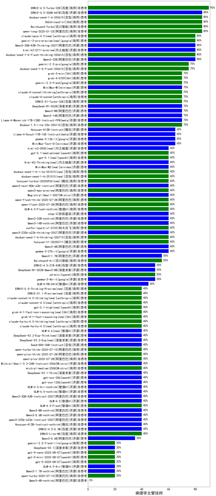

|类别|机构|大模型|【病理学主管技师】准确率|平均耗时|平均消耗token|花费/千次（元）|排名（准确率）|
|---|---|-----|-------------------|-------|-----------|-----------|-----------|
|商用|百度|ERNIE-4.5-Turbo-32K|90.0%|23s|553|1.6|1|
|商用|阿里巴巴|qwen2.5-max|88.5%|17s|439|3.6|2|
|商用|豆包|doubao-seed-1-6-250615|85.0%|38s|514|3.3|3|
|开源|百度|ERNIE-4.5-300B-A47B|85.0%|23s|359|2.4|4|
|开源|阿里巴巴|Qwen3-30B-A3B|85.0%|24s|1053|2.8|5|
|商用|阿里巴巴|qwen-plus-think-2025-04-28|85.0%|148s|1636|12.5|6|
|商用|百川智能|Baichuan4-Turbo|84.6%|/|/|/|7|
|商用|阿里巴巴|qwen-long-2025-01-25|84.6%|100s|318|0.5|8|
|商用|奇虎360|360zhinao2-o1|84.6%|/|/|/|9|
|商用|科大讯飞|xunfei-spark-pro|84.6%|/|/|/|10|
|商用|奇虎360|360gpt2-o1|80.8%|11s|304|12.5|11|
|商用|月之暗面|kimi-latest-8k|80.8%|15s|493|5.9|12|
|开源|腾讯|hunyuan-large|80.8%|12s|885|5.7|13|
|商用|豆包|Doubao-1.5-pro-32k-250115|80.8%|7s|347|0.6|14|
|开源|阿里巴巴|qwen2.5-72b-instruct|80.8%|10s|271|2.6|15|
|商用|奇虎360|360gpt2-pro|80.8%|9s|230|0.9|16|
|开源|月之暗面|kimi-k2-0711-preview(new)|80.0%|31s|511|7.5|17|
|开源|阿里巴巴|Qwen3-32B|80.0%|36s|1583|6.1|18|
|商用|智谱AI|GLM-4-Plus|80.0%|7s|275|1.4|19|
|商用|腾讯|hunyuan-turbos-20250604|80.0%|64s|374|0.6|20|
|商用|豆包|doubao-seed-1-6-flash-thinking-250615|80.0%|5s|532|0.6|21|
|商用|智谱AI|GLM-Z1-AirX|80.0%|31s|1483|7.0|22|
|开源|阿里巴巴|Qwen3-30B-A3B-Thinking-2507(new)|80.0%|76s|2584|7.1|23|
|开源|阿里巴巴|Qwen3-235B-A22B-nothink|80.0%|21s|425|3.7|24|
|开源|深度求索|DeepSeek-R1-Distill-Qwen-14B|76.9%|/|/|/|25|
|商用|科大讯飞|xunfei-spark-max|76.9%|4s|143|4.3|26|
|商用|豆包|doubao-seed-1-6-flash-250615|75.0%|3s|293|0.3|27|
|商用|阿里巴巴|qwen-turbo-think-2025-04-28|75.0%|37s|2226|6.5|28|
|商用|google|gemini-2.5-pro|75.0%|32s|2365|167.1|29|
|开源|阿里巴巴|qwen2.5-32b-instruct|73.1%|5s|237|1.1|30|
|开源|阿里巴巴|qwen2.5-14b-instruct|73.1%|7s|214|0.5|31|
|商用|豆包|Doubao-1.5-lite-32k-250115|73.1%|3s|186|0.1|32|
|开源|阿里巴巴|Qwen3-14B|70.0%|18s|854|1.6|33|
|开源|深度求索|deepseek-chat-v3-0324|70.0%|154s|253|1.6|34|
|商用|google|gemini-2.5-flash|70.0%|11s|1664|29.1|35|
|开源|阿里巴巴|Qwen3-8B|70.0%|129s|3787|0.0|36|
|商用|anthropic|claude-4-sonnet|70.0%|45s|458|41.5|37|
|商用|科大讯飞|xunfei-4.0Ultra|70.0%|3s|118|8.3|38|
|商用|智谱AI|GLM-Z1-Air|70.0%|60s|1356|0.7|39|
|开源|meta|Llama-4-Maverick-17B-128E-Instruct-FP8|70.0%|7s|485|1.9|40|
|开源|minimax|MiniMax-M1|70.0%|112s|1641|11.9|41|
|商用|XAI|grok-3-mini|70.0%|139s|987|3.5|42|
|商用|XAI|grok-4-0709|70.0%|90s|1263|131.6|43|
|商用|anthropic|claude-4-sonnet-thinking|70.0%|51s|995|99.8|44|
|商用|百度|ERNIE-X1-Turbo-32K|70.0%|79s|1818|7.1|45|
|开源|深度求索|DeepSeek-R1-0528|70.0%|191s|1529|23.6|46|
|开源|minimax|MiniMax-Text-01|69.2%|10s|890|7.1|47|
|开源|深度求索|DeepSeek-R1-Distill-Qwen-32B|69.2%|25s|626|0.8|48|
|商用|商汤|SenseChat-5-1202|69.2%|/|/|/|49|
|商用|智谱AI|GLM-4-Long|66.7%|25s|397|0.4|50|
|商用|零一万物|yi-lightning|65.4%|/|/|/|51|
|商用|百度|ERNIE-3.5-8K|65.4%|18s|314|0.6|52|
|商用|openAI|chatgpt-4o-latest|65.4%|/|/|/|53|
|开源|腾讯|Hunyuan-A13B-Instruct|65.0%|51s|817|3.1|54|
|商用|智谱AI|GLM-Z1-Flash|65.0%|24s|2573|0.0|55|
|开源|智谱AI|GLM-Z1-9B-0414|65.0%|120s|3071|0.0|56|
|开源|阿里巴巴|Qwen3-235B-A22B|65.0%|78s|2294|22.4|57|
|商用|智谱AI|GLM-4-AirX|63.3%|5s|310|3.0|58|
|开源|Google|gemma-3-27b-it|62.0%|/|/|/|59|
|商用|奇虎360|360gpt-turbo|61.5%|/|/|/|60|
|开源|阿里巴巴|qwen2.5-7b-instruct|61.5%|3s|207|0.2|61|
|开源|阿里巴巴|qwq-32b|61.5%|42s|2227|13.0|62|
|商用|Mistral|mistral-large|61.5%|/|/|/|63|
|开源|阿里巴巴|Qwen3-32B-nothink|60.0%|19s|585|2.1|64|
|开源|智谱AI|GLM-Z1-Rumination-32B-0414|60.0%|29s|1356|3.8|65|
|开源|智谱AI|GLM-4-32B-0414|60.0%|14s|365|0.7|66|
|商用|openAI|gpt-4.1-mini|60.0%|8s|266|2.4|67|
|开源|阶跃星辰|step-3(new)|60.0%|89s|1734|6.8|68|
|开源|阿里巴巴|Qwen3-30B-A3B-nothink|60.0%|15s|447|1.1|69|
|商用|智谱AI|GLM-4.5-Flash-nothink|60.0%|21s|946|0.0|70|
|开源|阿里巴巴|qwen3-235b-a22b-thinking-2507(new)|60.0%|243s|3824|75.1|71|
|商用|豆包|doubao-seed-1-6-thinking-250715(new)|60.0%|33s|1020|7.7|72|
|开源|Mistral|Mistral-Small-3.1-24B-Instruct-2503|60.0%|/|/|/|73|
|开源|meta|Llama-4-Scout-17B-16E-Instruct|60.0%|9s|516|1.0|74|
|商用|腾讯|hunyuan-t1-20250711(new)|60.0%|17s|1072|4.0|75|
|商用|google|gemini-2.5-flash-lite-preview-06-17|60.0%|2s|457|1.2|76|
|商用|科大讯飞|xunfei-spark-x1-0725(new)|60.0%|/|859|10.3|77|
|开源|阿里巴巴|Qwen3-14B-nothink|60.0%|18s|631|1.1|78|
|商用|阶跃星辰|step-r1-v-mini|60.0%|26s|1660|12.8|79|
|商用|openAI|gpt-4.1|60.0%|12s|232|10.7|80|
|开源|阿里巴巴|Qwen3-4B|60.0%|41s|1938|5.6|81|
|开源|上海人工智能实验室|internlm2_5-7b-chat|57.7%|/|/|/|82|
|商用|腾讯|hunyuan-standard|57.7%|/|/|/|83|
|开源|阿里巴巴|Qwen3-1.7B|55.0%|24s|1611|4.6|84|
|开源|智谱AI|GLM-Z1-32B-0414|55.0%|233s|2133|8.3|85|
|商用|阿里巴巴|qwq-plus-2025-03-05|53.8%|62s|2659|10.4|86|
|商用|Mistral|mistral-small|53.8%|/|/|/|87|
|商用|百川智能|Baichuan4-Air|53.8%|/|/|/|88|
|开源|Google|gemma-3-12b-it|52.5%|/|/|/|89|
|商用|百度|ERNIE-Lite-8K|52.5%|/|/|/|90|
|商用|OpenAI|gpt-4o-mini|50.0%|/|/|/|91|
|开源|百度|ERNIE-4.5-21B-A3B|50.0%|62s|329|0.0|92|
|开源|深度求索|DeepSeek-R1-0528-Qwen3-8B|50.0%|294s|1466|0.0|93|
|开源|阿里巴巴|qwen2.5-1.5b-instruct|50.0%|5s|112|0.0|94|
|商用|百度|ERNIE-Speed-8K|50.0%|/|/|/|95|
|开源|阿里巴巴|qwen2.5-3b-instruct|50.0%|10s|247|0.2|96|
|商用|openAI|o4-mini|50.0%|30s|681|20.0|97|
|商用|智谱AI|GLM-4-FlashX|46.2%|7s|343|0.0|98|
|开源|Google|gemma-3-4b-it|45.5%|/|/|/|99|
|商用|智谱AI|GLM-Z1-FlashX|45.0%|16s|1716|0.3|100|
|开源|智谱AI|GLM-4-9B-0414|45.0%|12s|439|0.0|101|
|商用|阶跃星辰|step-2-mini|42.3%|8s|303|0.5|102|
|开源|智谱AI|GLM-4.5(new)|40.0%|92s|1837|25.0|103|
|开源|阿里巴巴|Qwen3-30B-A3B-Instruct-2507(new)|40.0%|4s|467|1.2|104|
|开源|智谱AI|GLM-4.5-Air-nothink|40.0%|12s|862|4.8|105|
|开源|openAI|gpt-oss-120b(new)|40.0%|193s|612|1.6|106|
|开源|阿里巴巴|qwen3-235b-a22b-instruct-2507(new)|40.0%|12s|467|3.3|107|
|开源|智谱AI|GLM-4.5-nothink|40.0%|17s|607|7.7|108|
|开源|openAI|gpt-oss-20b(new)|40.0%|8s|1166|1.2|109|
|开源|百度|ERNIE-4.5-0.3B|40.0%|64s|391|0.0|110|
|开源|阿里巴巴|Qwen3-0.6B-nothink|40.0%|4s|207|0.4|111|
|开源|阿里巴巴|Qwen3-8B-nothink|40.0%|157s|510|0.0|112|
|开源|腾讯|Hunyuan-A13B-Instruct-nothink(new)|40.0%|9s|308|1.0|113|
|商用|阿里巴巴|qwen-plus-2025-07-14(new)|40.0%|10s|544|1.0|114|
|商用|智谱AI|GLM-4.5-Flash(new)|40.0%|190s|1687|0.0|115|
|开源|阿里巴巴|Qwen3-0.6B|35.0%|6s|1339|3.8|116|
|商用|Mistral|ministral-8b|34.6%|/|/|/|117|
|开源|微软|phi-4|34.6%|/|/|/|118|
|开源|阿里巴巴|qwen2.5-0.5b-instruct|23.1%|2s|247|0.0|119|
|商用|百度|ERNIE-Tiny-8K|23.1%|/|/|/|120|
|商用|Mistral|ministral-3b|23.1%|/|/|/|121|
|开源|智谱AI|GLM-4.5-Air(new)|20.0%|34s|1762|10.2|122|
|商用|openAI|gpt-5-mini-2025-08-07(new)|20.0%|97s|945|12.6|123|
|开源|阿里巴巴|Qwen3-1.7B-nothink|20.0%|8s|415|1.0|124|
|开源|华为|pangu-pro-moe|20.0%|84s|1439|5.5|125|
|商用|阿里巴巴|qwen-turbo-2025-07-15(new)|20.0%|7s|333|0.2|126|
|商用|openAI|gpt-5-nano-2025-08-07(new)|20.0%|19s|2088|5.8|127|
|商用|openAI|gpt-5-2025-08-07(new)|20.0%|37s|487|0.0|128|
|商用|科大讯飞|xunfei-spark-lite|19.2%|/|/|/|129|
|开源|阿里巴巴|Qwen3-4B-nothink|/%|12s|502|1.3|130|

