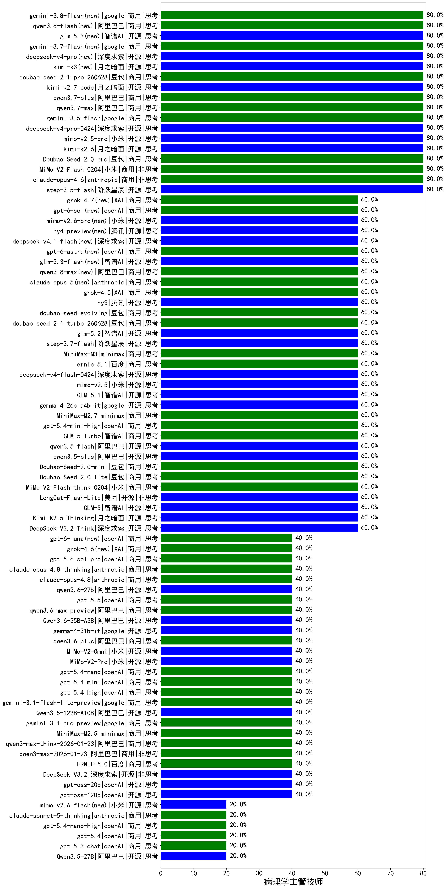

|类别|机构|大模型|【病理学主管技师】准确率|平均耗时|平均消耗token|花费/千次（元）|排名（准确率）|
|---|---|-----|-------------------|-------|-----------|-----------|-----------|
|商用|anthropic|claude-opus-4.6|80.0%|10s|535|79.9|1|
|开源|深度求索|deepseek-v4-pro(new)|80.0%|55s|1728|44.1|2|
|开源|小米|mimo-v2.5-pro|80.0%|12s|955|15.6|3|
|开源|深度求索|deepseek-v4-pro-0424|80.0%|82s|2033|48.0|4|
|商用|google|gemini-3.5-flash|80.0%|10s|1652|100.4|5|
|商用|阿里巴巴|qwen3.7-max|80.0%|26s|1207|41.7|6|
|商用|阿里巴巴|qwen3.7-plus(new)|80.0%|29s|1441|11.1|7|
|商用|豆包|Doubao-Seed-2.0-pro|80.0%|231s|1057|15.5|8|
|商用|小米|MiMo-V2-Flash-0204|80.0%|365s|500|0.9|9|
|开源|月之暗面|kimi-k2.7-code(new)|80.0%|43s|2006|52.8|10|
|开源|阶跃星辰|step-3.5-flash|80.0%|18s|1379|2.8|11|
|商用|豆包|doubao-seed-2-1-pro-260628(new)|80.0%|246s|9157|272.2|12|
|开源|月之暗面|kimi-k3(new)|80.0%|39s|846|73.2|13|
|商用|google|gemini-3-flash-preview|80.0%|95s|1028|20.7|14|
|开源|月之暗面|kimi-k2.6|80.0%|222s|3161|84.0|15|
|商用|google|gemini-3.7-flash(new)|80.0%|33s|963|23.8|16|
|商用|google|gemini-3.8-flash(new)|80.0%|43s|847|41.5|17|
|开源|智谱AI|glm-5.3(new)|80.0%|50s|1715|46.5|18|
|商用|阿里巴巴|qwen3.8-flash(new)|80.0%|43s|656|1.5|19|
|开源|小米|mimo-v2.5|60.0%|12s|1188|13.1|20|
|开源|深度求索|deepseek-v4.1-flash(new)|60.0%|7s|1322|10.0|21|
|开源|阿里巴巴|qwen3.5-plus|60.0%|29s|2184|10.2|22|
|开源|智谱AI|GLM-5.1|60.0%|174s|1533|35.6|23|
|开源|阿里巴巴|qwen3.5-flash|60.0%|332s|2979|5.8|24|
|开源|阶跃星辰|step-3.7-flash(new)|60.0%|25s|1549|12.1|25|
|开源|智谱AI|glm-5.3-flash(new)|60.0%|31s|1098|2.9|26|
|商用|minimax|MiniMax-M3(new)|60.0%|21s|582|6.8|27|
|开源|google|gemma-4-26b-a4b-it|60.0%|83s|490|1.2|28|
|商用|openAI|gpt-6-astra(new)|60.0%|11s|289|77.3|29|
|商用|智谱AI|GLM-5-Turbo|60.0%|25s|1445|30.6|30|
|商用|豆包|Doubao-Seed-2.0-lite|60.0%|154s|805|2.6|31|
|商用|百度|ernie-5.1|60.0%|35s|1207|20.8|32|
|商用|openAI|gpt-5.4-mini-high|60.0%|139s|1672|50.4|33|
|商用|minimax|MiniMax-M2.7|60.0%|49s|1888|15.2|34|
|开源|深度求索|DeepSeek-V3.2-Think|60.0%|149s|1470|4.3|35|
|开源|深度求索|deepseek-v4-flash-0424|60.0%|29s|1008|2.0|36|
|商用|阿里巴巴|qwen3.8-max(new)|60.0%|39s|1696|58.4|37|
|商用|豆包|Doubao-Seed-2.0-mini|60.0%|348s|1672|3.1|38|
|商用|豆包|doubao-seed-2-1-turbo-260628(new)|60.0%|393s|9374|139.3|39|
|开源|智谱AI|glm-5.2(new)|60.0%|44s|1641|44.4|40|
|商用|豆包|doubao-seed-1-8-251215|60.0%|21s|546|3.6|41|
|商用|anthropic|claude-opus-5(new)|60.0%|15s|709|110.5|42|
|商用|阿里巴巴|qwen-plus-2025-12-01|60.0%|32s|1180|2.3|43|
|开源|智谱AI|GLM-4.7|60.0%|46s|1637|22.2|44|
|商用|XAI|grok-4.5(new)|60.0%|139s|3085|122.1|45|
|开源|腾讯|hy3(new)|60.0%|56s|231|0.7|46|
|商用|豆包|doubao-seed-evolving(new)|60.0%|572s|12022|358.1|47|
|商用|小米|MiMo-V2-Flash-think-0204|60.0%|1148s|2475|5.1|48|
|开源|腾讯|hy4-preview(new)|60.0%|91s|5882|104.9|49|
|开源|月之暗面|Kimi-K2.5-Thinking|60.0%|567s|2739|56.4|50|
|商用|腾讯|hunyuan-2.0-thinking-20251109|60.0%|12s|710|2.7|51|
|开源|智谱AI|GLM-5|60.0%|62s|2023|35.5|52|
|商用|腾讯|hunyuan-2.0-instruct-20251111|60.0%|7s|380|0.6|53|
|开源|美团|LongCat-Flash-Lite|60.0%|362s|377|0.0|54|
|开源|阿里巴巴|qwen3.6-27b|40.0%|33s|1540|26.6|55|
|商用|openAI|gpt-5.5|40.0%|11s|613|113.8|56|
|商用|anthropic|claude-opus-4.8(new)|40.0%|12s|470|68.7|57|
|商用|阿里巴巴|qwen3.6-max-preview|40.0%|56s|1578|82.0|58|
|商用|openAI|gpt-5.6-sol-pro(new)|40.0%|15s|3348|260.0|59|
|商用|anthropic|claude-opus-4.8-thinking(new)|40.0%|12s|842|133.8|60|
|商用|XAI|grok-4.6(new)|40.0%|25s|1087|38.1|61|
|开源|openAI|gpt-oss-120b|40.0%|193s|612|1.6|62|
|开源|阿里巴巴|Qwen3.6-35B-A3B|40.0%|113s|1792|18.7|63|
|商用|阿里巴巴|qwen3-max-think-2026-01-23|40.0%|290s|3956|39.0|64|
|开源|深度求索|DeepSeek-V3.2|40.0%|14s|277|0.8|65|
|开源|Mistral|mistral-large-2512|40.0%|10s|387|3.5|66|
|开源|Mistral|Ministral-3-8B-Instruct-2512|40.0%|3s|460|0.5|67|
|商用|阿里巴巴|qwen-plus-think-2025-12-01|40.0%|63s|2583|20.1|68|
|商用|openAI|gpt-5.2-high|40.0%|12s|465|38.9|69|
|商用|openAI|gpt-5.2-medium|40.0%|7s|375|29.8|70|
|开源|小米|MiMo-V2-Flash-think|40.0%|21s|1668|0.0|71|
|商用|minimax|MiniMax-M2.1|40.0%|74s|2688|21.9|72|
|商用|阿里巴巴|qwen3-max-preview-think|40.0%|134s|3590|84.7|73|
|开源|智谱AI|GLM-4.7-Flash|40.0%|209s|1800|0.0|74|
|开源|美团|LongCat-Flash-Thinking-2601|40.0%|185s|3213|0.0|75|
|开源|google|gemma-4-31b-it|40.0%|75s|397|1.0|76|
|商用|阿里巴巴|qwen3-max-2026-01-23|40.0%|12s|463|4.0|77|
|商用|百度|ERNIE-5.0|40.0%|327s|4407|104.7|78|
|商用|minimax|MiniMax-M2.5|40.0%|26s|1056|8.3|79|
|商用|openAI|gpt-5.4-high|40.0%|28s|1555|155.8|80|
|商用|阿里巴巴|qwen3.6-plus|40.0%|22s|1553|17.9|81|
|开源|小米|MiMo-V2-Omni|40.0%|11s|1507|17.5|82|
|开源|小米|MiMo-V2-Pro|40.0%|139s|917|14.8|83|
|商用|openAI|gpt-5.4-nano|40.0%|16s|198|1.1|84|
|商用|google|gemini-3.1-pro-preview|40.0%|39s|2459|204.6|85|
|开源|openAI|gpt-oss-20b|40.0%|8s|1166|1.2|86|
|商用|google|gemini-3.1-flash-lite-preview|40.0%|2s|307|2.6|87|
|开源|阿里巴巴|Qwen3.5-122B-A10B|40.0%|351s|2841|17.8|88|
|商用|openAI|gpt-5.4-mini|40.0%|2s|166|3.0|89|
|商用|openAI|gpt-5.4|20.0%|5s|207|14.2|90|
|开源|小米|MiMo-V2-Flash|20.0%|20s|384|0.0|91|
|商用|openAI|gpt-5.3-chat|20.0%|5s|355|27.5|92|
|商用|openAI|gpt-5.4-nano-high|20.0%|11s|751|5.9|93|
|商用|openAI|gpt-5.2|20.0%|5s|162|8.7|94|
|开源|Mistral|Ministral-3-3B-Instruct-2512|20.0%|3s|503|0.4|95|
|商用|anthropic|claude-sonnet-5-thinking(new)|20.0%|14s|859|54.7|96|
|开源|Mistral|Ministral-3-14B-Instruct-2512|20.0%|9s|557|0.8|97|
|开源|阿里巴巴|qwen3-next-80b-a3b-thinking|20.0%|161s|3914|15.4|98|
|开源|阿里巴巴|Qwen3.5-27B|20.0%|239s|3057|14.4|99|

